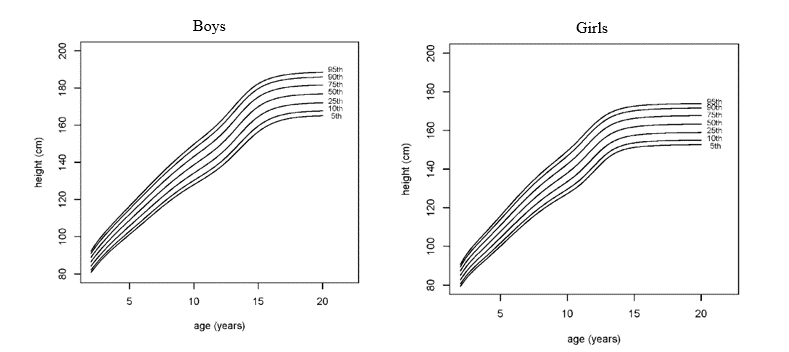

```{r echo=FALSE} 
## to change the R codes into tiny size
knitr::knit_hooks$set(mysize = function(before, options, envir) { 
  if (before) { 
    return(options$size) 
  } else { 
    return("\\tiny") 
  } 
}) 
knitr::opts_chunk$set(mysize = TRUE, size = "\\tiny")
```

```{r setup, include=F, cache=F, message=F, warning=F, results="hide"}
knitr::opts_chunk$set(cache = TRUE, 
                      echo = FALSE, 
                      message = FALSE, 
                      warning = FALSE)
knitr::opts_chunk$set(fig.height = 4,
                      fig.width = 5,
                      out.width = '50%',
                      fig.align='center')
knitr::opts_chunk$set(fig.path = 'figs_L1/',
                      cache.path = 'cache/')

library(tidyverse)
library(ggplot2)
```


# Introduction

\vspace{\baselineskip}

### Questions

- What makes longitudinal data different, so that we need special methods?
- What are clustered data?
- What are benefits of longitudinal models? (Or models for clustered data)
- Why are longitudinal methods not used more?


## Longitudinal designs

- Designed experiments and observational studies can be applied to cross-sectional or longitudinal settings. Here, they are defined for the latter.
- A controlled experiment involves an intervention, while an observational study does not.
- In many cases a controlled experiment will have one or more true treatment groups, along with a 'control' group that either receives some type of placebo, or does not receive any treatment.
- **See the course notes for more detail on designed experiments versus observational studies.**

# Time series and longitudinal data

### Time series methods (generally)...
  
- focus on modeling one process over time (i.e., one observation taken at each time point, across time).
- focus on predicting values of future occurrences.

Examples: stock prices, temperature, birth and mortality rates, health data for individuals (e.g., blood pressure), just to name a few areas.

### Longitudinal methods (generally)...
  
- Involve measurements on multiple subjects.
- Assume that the correlation structure is the same across subjects but that responses are independent between subjects.
  
Often fewer time points for longitudinal data than time series data.          
Although analytic methods for time series and longitudinal data differ, they do have common elements, and the underlying processes that generate the data are often similar.


# Time series data types and examples

### Stationary processes

- A stationary process $\{Y_t\}$ has a constant mean (expected value) and finite 2nd moment for all times $t$, and the correlation between $Y_t$ and $Y_{t+h}$ does not depend on $t$, for all $h$.
- Below, data for stationary processes were simulated for the model, $Y_t = \mu + \epsilon_t$ where $\mu$ is the mean and $\epsilon_t$ are errors that are identically but not necessarily independently distributed.


### Example 1: Stationary process (iid error)

For the simulated data, $\mu=0$ and $\epsilon_t \sim \mathcal {N} (0,\ 0.46)$ for all $t$.

```{r "stationary", fig.align='center', fig.height=3.2}
set.seed(20216643)
mu <- 0
t <- 1:100
beta0 <- 0
beta1 <- -0.05
e0 <- rnorm(100, mean = 0, sd = 0.46)
## use the arima.sim() function -----------------------------
# e1 <- arima.sim(list(order = c(1, 0, 0), ar = .25), n = 100)
# e2 <- arima.sim(list(order = c(1, 0, 0), ar = .50), n = 100)
# e3 <- arima.sim(list(order = c(1, 0, 0), ar = .75), n = 100)
# e4 <- arima.sim(list(order = c(1, 0, 0), ar = .99), n = 100)

## use the definition ----------------------------------------
e1 <- e2 <- e3 <- e4 <- array(rnorm(1, mean = 0, sd = 0.46))
for (i in seq_along(1:99)) {
  e1[i + 1] <- 0.25 * e1[i] + rnorm(1, mean = 0, sd = 0.46)
  e2[i + 1] <- 0.5 * e2[i] + rnorm(1, mean = 0, sd = 0.46)
  e3[i + 1] <- 0.75 * e3[i] + rnorm(1, mean = 0, sd = 0.46)
  e4[i + 1] <- 0.99 * e4[i] + rnorm(1, mean = 0, sd = 0.46)
}
Y1 <- mu + e1
Y2 <- mu + e2
Y3 <- mu + e3
Y4 <- mu + e4
Y0 <- mu + e0
Y5 <- beta0 + beta1 * t + e2

dat <- cbind(Y0, Y1, Y2, Y3, Y4, Y5, t) %>%
  as.data.frame()

ggplot(dat, aes(t, Y0)) +
  geom_line() +
  theme_classic()
```

##  

### Example 2:  Stationary process (correlated error)

- Data below were generated using $\mu=0$ and errors that followed a first-order autoregressive $\big(AR(1)\big)$ process: $\epsilon_t = \phi\epsilon_{t-1} + Z_t$ and Specifically, $Z_t \stackrel {iid} \sim \mathcal {N} (0,\ 0.46)$, for all $t$.
- **Notes on AR(1) processes**:

  1.  Errors $\epsilon_t$ are identically distributed but not independent
  2.  Must have $|\phi| < 1$ for stationary process
  3.  The higher the value of $|\phi|$, the higher degree of correlation between responses from day to day


##  

### Example 2:  Stationary process (correlated error)

```{r "AR1", out.width="90%", fig.align='center', fig.height=3.5}
ar25 <- ggplot(dat, aes(t, Y1)) +
  geom_line() +
  theme_classic() +
  ggtitle(expression(paste(phi, " = 0.25")))

ar50 <- ggplot(dat, aes(t, Y2)) +
  geom_line() +
  theme_classic() +
  ggtitle(expression(paste(phi, " = 0.50")))

ar75 <- ggplot(dat, aes(t, Y3)) +
  geom_line() +
  theme_classic() +
  ggtitle(expression(paste(phi, " = 0.75")))

ar99 <- ggplot(dat, aes(t, Y4)) +
  geom_line() +
  theme_classic() +
  ggtitle(expression(paste(phi, " = 0.99")))

gridExtra::grid.arrange(ar25, ar50, ar75, ar99, nrow = 2)
```

##

### Example 3: Processes with trend and correlated errors

- $AR(1)$ process with linear time trend. 
- $Y_t = \beta_0 + \beta_1t + \epsilon_t$, 
$\beta_0 = 0$, $\beta_1 = -0.05$, $\epsilon_t \sim AR(1)$          
(as in **Example 2**, last page, with $\phi\ =\ 0.25$)

```{r "linear_time_trend", fig.align='center', eval=TRUE, include=TRUE, fig.height=3.4}
ggplot(dat, aes(t, Y5)) +
  geom_line() +
  theme_classic()
```

 
**Random walks - see course notes**


# Longitudinal data types and examples

## 

### Example 4: Observational studies

Longitudinal trajectories of pseudomonas (PA) in EPIC study

-	1734 children enrolled in the early pseudomonas infection control observational study (EPIC) observational study who were pseudomonas negative (PA-) 
-	Median followup time is 7.8 years ($Q1 - Q3:\ 6.3 - 8.3$) 
- One of the questions of interest was finding factors associated with progression of PA; A secondary outcome of interest: time to first pulmonary exacerbation in EPIC trial

```{r "pseudomonas", fig.align='center'}
knitr::include_graphics('figs_L1/L1-f1.png')
```

## 

### Example 5: Prospective randomized trial

STEPPED-CARE randomized trial. 

- A behavioral intervention was tested versus usual care in 286 patients with lung or head and neck cancer.  
- Population: low income patients in the Denver area across 5 hospitals
- Primary outcomes: anxiety, depression and coping skills scores
- Outcomes were measured at baseline, and at 6, 12 and 24 weeks

\vspace{5mm}

```{r fig.height=6, fig.width=6, message=FALSE, warning=FALSE, out.width="50%"}
step <- here::here("data", "step_care.csv") %>%
  read.csv() %>%
  mutate(randomize = case_when(randomize == 1 ~ "Intervention",
                               randomize == 0 ~ "Usual care")) 

plot_anx <- step %>%
  ggplot(aes(x = time, y = anxraw, group = record_id)) +
  geom_line(aes(color = randomize), alpha = 0.2) +
  geom_smooth(aes(group = randomize, color = randomize), method = "lm") +
  # facet_wrap(~randomize) +
  theme_classic() +
  theme(legend.position = "none") +
  ylab("Anxiety Score")

plot_dep <- step %>%
  ggplot(aes(x = time, y = depraw, group = record_id)) +
  geom_line(aes(color = randomize), alpha = 0.2) +
  geom_smooth(aes(group = randomize, color = randomize), method = "lm") +
  # facet_wrap(~randomize) +
  theme_classic() +
  theme(legend.position = "none") +
  ylab("Depression Score")

plot_cop <- step %>%
  ggplot(aes(x = time, y = cops, group = record_id)) +
  geom_line(aes(color = randomize), alpha = 0.2) +
  geom_smooth(aes(group = randomize, color = randomize), method = "lm") +
  # facet_wrap(~randomize) +
  theme_classic() +
  theme(legend.position = "none") +
  ylab("Copping Skill")

plot_fact <- step %>%
  ggplot(aes(x = time, y = factg, group = record_id)) +
  geom_line(aes(color = randomize), alpha = 0.2) +
  geom_smooth(aes(group = randomize, color = randomize), method = "lm") +
  # facet_wrap(~randomize) +
  theme_classic() +
  theme(legend.position = "none") +
  ylab("Quality of Life")

gridExtra::grid.arrange(plot_anx, plot_dep, 
                        plot_cop, plot_fact, 
                        nrow = 2)
```

##

### Example 5: Prospective randomized trial

```{r fig.height=6, fig.width=12, message=FALSE, warning=FALSE, out.width="100%"}
gridExtra::grid.arrange(plot_anx + facet_wrap(~randomize), 
                        plot_dep + facet_wrap(~randomize), 
                        plot_cop + facet_wrap(~randomize), 
                        plot_fact + facet_wrap(~randomize), 
                        nrow = 2)
```

##


### Example 6: Growth curve data 

- Graphs for height as a function of age for boys and girls aged 2 to 20 years
- May be constructed in R using growth data from the [CDC](http://www.cdc.gov/). For more information, please see [growcharts](http://www.cdc.gov/growthcharts/). 
- These data show that girls approach their maximum height much more quickly than boys.  The y-axis scales were made the same for easier comparison between graphs. 
- Each curve is a percentile estimate as a function of age. We could create confidence bands for each percentile curve.  
- If the curves are estimated using a lot of data, the widths of the bands should be narrow.  Doctors look for dramatic changes between visits.
- The curves here may not be representative of all populations (e.g., differences due to race).   

##

### Example 6: Growth curve data 

```{r "growth", echo=FALSE, out.width='100%', fig.align='center'}

```

**See course notes for more data examples**

# Formats of longitudinal data

- "Univariate" (long format) versus "multivariate" (wide) analysis
  
```{r "formats", echo=FALSE, out.width='60%', fig.align='center'}

```

- See course notes for more information about type of variables and notation for variables, e.g. in longitudinal data versus "factorial" data.
- Factorial data refers to replicated data within each factor and treatment combination (think of design of experiments). For example, with two factors and replicates within each treatment combinations, each replicate needs to be denoted with an index so they outcome could be denoted as $Y_{ijk}$, where $i$ corresponds to factor, $j$ to the second factor and $k$ to the replicate
    

# Clustered/longitudinal analyses 

### Example 7, 8, & 9: Cluster data

**Example 7**:  After an exercise challenge performed on 20 subjects, 
resting heart rates are monitored at 5 minute intervals for one hour. 
How are data clustered?                       

**Example 8**:  Families are selected to participate in a survey regarding health insurance.  
Each member of the family will be included in the study.                  

**Example 9**:  arm length and leg length growth are measured for subjects once a year for 10 years,
and then modeled with a linear mixed model.  

# Assumptions of longitudinal models

## 
- Assumption 1:  Responses between subjects are independent.

  - If there are clear violations to the assumption, and data are available, then a random term could be added to deal with this non-independence.
  - For example, if there is clustering, e.g. pairs of siblings in a sample, a random term identifying family could be added to the model.  (Lack of fit and lack of independence are related!)


- Assumption 2:  There is a common covariance structure between all subjects, and the covariance parameters have the same value between subjects.

  - This assumption is usually not tested.  However, to properly estimate covariance parameters, several subjects are needed.
  - In some cases, homogeneous groups within the study may be identified. With sufficient group sample sizes, group-specific covariance parameters can be put in the model and estimated.


# Analyses of longitudinal data with two time points
## What we've already done!

-	Experiments with pre-post measurements have 2 measurements on each subject over time. When there are only 2 measurements, the analysis simplifies when the difference is considered. Simple methods can then be used (e.g. paired t-test). 
- Longitudinal models can still be beneficial here! But we'll discuss that later.  For now, we consider simplified models.
-	Let's take a closer look at the underlying models when we use a difference score or take the baseline-as-covariate approach.

### Change-score model
We model the difference using models for univariate outcomes
$$
Y_{i1} = Score_{pre}; \ Y_{i2} = Score_{post} 
$$
\vspace{-5mm}
$$
\Delta_i = Y_{i1} - Y_{i2} = \beta_0 + \beta_1 x_i + \epsilon_i
$$

### Baseline-as-covariate model

$$
Y_{i2} = \beta_0 +\beta_1Y_{i1} + \beta_2 x_i + \epsilon_i
$$

We allow the slope of the baseline value to be estimated (based on fit).

##

### Example for discussion: cholesterol data  

Any other type of simple clustering, with 2 responses per cluster can be analyzed similarly. 
(E.g., pairing by married couple, pairing by year of measurement.)

    
## Longitudinal designs and power - an initial glimpse

- Consider an experiment designed to compare two treatments.  Two common approaches:

  - A1:  Use independent samples (randomly assign some subjects one treatment, and some the other). For A1, we often use a 2-independent sample t-test
  - A2:  Have all subjects take one treatment and then have them all take the other (e.g., use a crossover design to eliminate confounding effects related to time). For A2, a paired t-test.  

- A study/experiment involving changes within subjects (e.g., analyzed with a paired t-test) is often more powerful than a study using independent samples.

## 

- The general formula for the variance for the difference in means suggests why this may be expected (when correlations between responses within subjects are positive):  

$$
Var[\bar Y_1 - \bar Y_2] = Var[\bar Y_1] + Var[\bar Y_2] - 2Cov[\bar Y_1,\ \bar Y_2]
$$

-	Often there are many factors not of interest that distinguish the two independent samples. For paired data, the difference in responses is due more to the treatment alone and not to other factors, since we're using the same subjects.  
-	The same principle generalizing to multiple times and longitudinal data in general (e.g., air pollution study); subject serve as their own controls.
-	But paired/longitudinal designs may not always be better. In some cases a short cross-sectional study/experiment involving many subjects may be more feasible and cost-effective.

# Summary

##  Summary

-	Why do we need special methods?
-	Discuss time series vs. longitudinal 
- Formats of longitudinal data 
- Clustered/longitudinal data
-	Assumptions of longitudinal models
-	Analyses of longitudinal data with two time points


