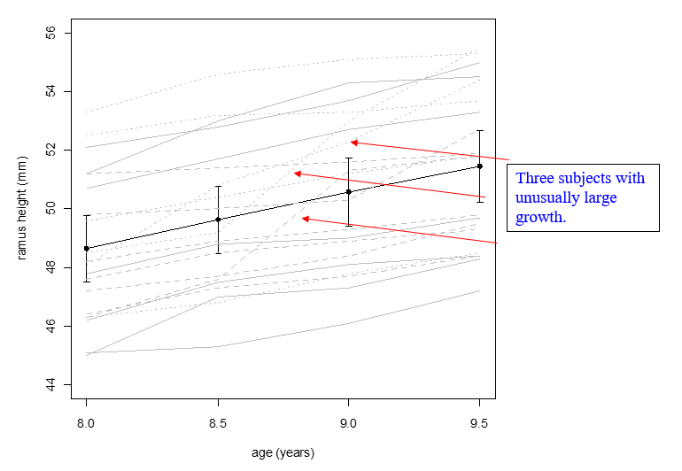

```{r echo=FALSE} 
## to change the R codes into tiny size
knitr::knit_hooks$set(mysize = function(before, options, envir) { 
  if (before) { 
    return(options$size) 
  } else { 
    return("\\tiny") 
  } 
}) 
knitr::opts_chunk$set(mysize = TRUE, size = "\\tiny")
```

```{r setup, include=FALSE, cache=F, message=F, warning=F, results="hide"}
knitr::opts_chunk$set(cache = TRUE, 
                      echo = FALSE, 
                      message = FALSE, 
                      warning = FALSE)
knitr::opts_chunk$set(fig.height = 4,
                      fig.width = 5,
                      out.width = '60%')
knitr::opts_chunk$set(fig.path = 'figs_L2/',
                      cache.path = 'cache/',
                      fig.align='center')
library(tidyverse)
library(here)
```

## Learning objectives: 

1. Become familiar with multiple ways of representing longitudinal and cluster data.  

2. Understand the basic ideas of principal component analysis 

# Introduction
 
## Introduction 

- Line graph 
  - Visual staple for longitudinal data. 
  - Generalization of a scatterplot in which points are connected either within subjects or the 'correlated unit'.   
  - Intuitive and indicates nested responses (e.g., repeated measures within subjects). 

- Scatterplot 
  - Can use different symbols for subjects/objects on which repeated measures are taken (avoids criss-cross and tangle of lines in a line graph). 
  - Can use scatterplot for time 'x' versus time 'y'. 

- Panels 
  - Can be used for multiple line graphs or scatterplots, e.g., if a longitudinal study has multiple groups with many subjects. (Also see the growth curve graphs for boys and girls, presented in the Introduction Chapter.) 

# Line Graphs 

## Graphs for repeated measures data with one sample 

*Data*:  The Ramus data come from a prospective study that has existed for over 40 years and was used by dentists to establish a growth curve for the ramus (part of the lower jaw bone) for young boys.  Four measurements were made on 20 boys, at ages 8 (h1), 8.5 (h2), 9 (h3) and 9.5 (h4) in mm. 


```{r class.source="bg-danger", class.output="bg-warning"}
ramus_w <- here::here("data", "ramus.dat") %>%
  ## use View() for preview
  ## the dataset is in wide form
  read.table(header = T, 
             row.names = 1,
             sep = ",",
             skip = 0) 

head(ramus_w, 3) %>% knitr::kable("simple", caption = "The first 3 samples")
tail(ramus_w, 3) %>% knitr::kable("simple", caption = "The last 3 samples")
```


##

```{r class.source="bg-danger", class.output="bg-warning"}
## map() == for loop
ramus_mean <- map(ramus_w[2:5], mean) 
ramus_sd <- map(ramus_w[2:5], sd) 
ramus_se <- map(ramus_w[2:5], ~ sd(.x)/sqrt(length(.x))) 
## present the results nicely
ramus_mean %>% 
  as.data.frame() %>% 
  round(4) %>%
  knitr::kable("simple", caption = "Mean")
ramus_sd %>% 
  as.data.frame() %>% 
  round(4) %>%
  knitr::kable("simple", caption = "Standard deviation")
ramus_se %>%
  as.data.frame() %>%
  round(4) %>%
  knitr::kable("simple", caption = "Standard error")

```

## 

In the following graph, subject lines are in grey and the group mean function is in black.  Error bars indicate +/- 2 standard errors from the mean.  The grey lines comprise what is sometimes referred to as a spaghetti plot. 

```{r echo=TRUE}
`age (years)` <- c(8, 8.5, 9, 9.5)
## read the dataset
ramus_w <- here::here("data", "ramus.dat") %>%
  read.table(header = T, row.names = 1,
             sep = ",",  skip = 0) %>%
  rename("8" = 2, "8.5" = 3, "9" = 4, "9.5" = 5) 
## wide to long form pivot_longer()
ramus_l <- ramus_w %>%
  pivot_longer(cols = c("8", "8.5", "9", "9.5"), 
               names_to = "time", 
               values_to = "ramus height (mm)") %>%
  mutate(`age (years)` = as.numeric(time),
         boy = as.factor(boy))
## ggplot2::geom_line()
plot1 <- ggplot() +
  geom_line(data = ramus_l, 
            ## must set "group"
            aes(group = boy,
                x = `age (years)`,
                y = `ramus height (mm)`,
                color = boy), 
            ## transparency
            alpha = 0.5) 
```

##

```{r echo=TRUE}
plot1 +  geom_smooth(data = ramus_l, 
                     aes(x = `age (years)`,
                         y = `ramus height (mm)`),
                     method = "lm", se = TRUE, 
                     level = 0.95, color = "black") +
  theme_classic() +
  theme(legend.position = "none")
```

##

```{r echo=TRUE}
ramus_s <- 
  cbind(ramus_mean, ramus_sd, 
        ramus_se, `age (years)`) %>%
  as.data.frame() %>%
  mutate_all(as.numeric) %>%
  round(4) 

plot1 + 
  geom_line(data = ramus_s, 
            aes(x = `age (years)`, 
                y = ramus_mean)) +
  geom_errorbar(data = ramus_s,
                aes(x = `age (years)`, y = ramus_mean,
                    ymin = ramus_mean - 2 * ramus_se,
                    ymax = ramus_mean + 2 * ramus_se),
                width = 0.05,  
                position = position_dodge(0.05)) +
  theme_classic() +
  theme(legend.position = "none") 

```


# Scatterplots
## Graphs for repeated measures data with multiple samples 
- Multiple samples present a whole new set of issues when constructing graphs.  
- Consider a simple generic data set with 2 groups (e.g., men, women), where individuals are monitored over time. 
- The curves are obtained from PROC MIXED, a procedure that we'll learn more about later.  For now, it is enough to understand that it yields predicted values based on the function in the MODEL statement. 
```{r "spaghetti sas0", echo=FALSE, out.width='60%'}

```

## SAS code used to obtain the preceding graph
```{r "spaghetti sas1", echo=FALSE, out.width='100%'}

```

##

 - Graphing in SAS has become somewhat easier via the SGPLOT, which mimics some of the features that R graphing has.  
  -Below is a spaghetti plot of the same data.  Note the minimal amount of coding required to get the plot.  
  - The 'reg' statement would allow for plotting of group means, and the 'degree' option can be added to get polynomial curves.  
  - See the SAS Help Documentation for more detail.

```{r "ramus sas2", echo=FALSE, out.width="100%"}

```

## Graphs for large amounts of data

-	With large amounts of longitudinal data, a question arises as to the best way to present the data for visual appeal and to best allow for interpretations.  

-	Diggle, et al., (Analysis of Longitudinal Data; 1994, 1996) discuss approaches to create graphs for a large data set from the Multicenter AIDS Cohort Study (MACS). 

-	Some of Diggle et al.'s graphing concepts are used here, for data involving subjects with idiopathic pulmonary fibrosis (IPF) analyzed at NJH.

-	The outcome '% predicted diffusing capacity of the lung' was measured on 321 IPF subjects, both before and after diagnosis.  This measure tends to decrease as subjects progress in their illness (see Strand et al., 2014).  

# Typical spaghetti plot for the data.

```{r "spaghetti", echo=FALSE, out.width='60%'}

```


## Alternative local polynomial regression 

An alternative to the spaghetti plot is to use symbols for subject-day values rather than connecting them, and then overlaying the mean function.  Here, local polynomial regression was used to get the fitted function, using order 1 and a span parameter value of 0.5.  

```{r "local regression", echo=FALSE, out.width='60%'}

```

## Scatterplot with selective subject trajectory

Scatterplot of IPF data with line graph of 9 randomly selected subjects.  

```{r "selected", echo=FALSE, out.width='75%'}

```

## Systematically selected subjects

Scatterplot of IPF data with line graph of systematically selected subjects.

The selection of subjects for Figure 2 was as follows: 

(i). residuals were calculated for each data point based on nonparametric regression fit in Figure 1;

(ii). for each subject, the mean residual was determined;

(iii). line segments were included for subjects with certain percentiles for the mean residual variable.
```{r "sytematic", echo=FALSE, out.width='65%'}

```

# Graphs that display between- or within-subject variability

-	Mean estimates at individual time points are often graphed including 'error bars.' 
- Consider the data from clinical trial  reported in Katial et al. (2010).  
- Subjects allergic to aspirin were given an aspirin desensitization test over 1 day period.  
- Several measures were taken immediately before (BL) and after (post-BL) the desensitization, one being exhaled nitric oxide (eNO).  Some subjects also had measures at 6 months.
-	The following graph displays estimates at individual time points, with confidence intervals (CI), based on a linear mixed model (LMM) fit.  
- **Are the means at BL and Post-BL time points significantly different?** Tests for differences give a $p=0.025$ for the difference b/w the BL and post-BL, and $p=0.40$ b/w the Bl and 6 months.  
```{r "eno1", echo=FALSE, out.width='32%'}

```


## 

-	The previous graph does not demonstrate variability of within-subject changes over time that may be quite different than the SDs of the individual time points.  

-	This graph shows the variability of the difference estimates.  Graphed are relative change estimates, which result since analysis of eNO was on the natural log scale; also plotted in the graph are 95% CI's for these relative estimates.  
```{r "eno2", echo=FALSE, out.width='40%'}

```

\tiny
Note in the first position of the graph we have the Day 2 estimate relative to BL, and the CI does not contain 0, which is consistent with $p=0.025$ (since we constructed a 95% CI).

(In this graph the difference estimates are not joined with a line since the x-axis is not time, but rather it is the comparison of pairs of time points (one relative to another).  (A reference line at $y=0$ is included.)

# Lasagna plots

While we're on the topic of Italian food, a 'lasagna plot' is an alternative to the spaghetti plot (See Lasagna plots: a saucy alternative to spaghetti plots, Bruce Swihart et al., 2010, Epidemiology 21: 621-625.)
```{r "lasagna", echo=FALSE, out.width='85%'}

```


# Pace charts

The last "0.2" miles of the 26.2 mile race was adjusted per mile distance, and shows that although the runner 'hit the wall' in the last 3 to 5 miles, he was able to finish strong.  The finish time was 3 hours and 6 minutes.

```{r "pace", echo=FALSE, out.width='60%'}

```

##

```{r "project", echo=FALSE, out.width='60%'}

```

# Graphs for unequally spaced data with common time points

-	A longitudinal experiment was conducted by Sorensen et al. (2003, JACI) where measurements were taken at unequally spaced times.
-	This experiment involved complement split products, which are biological markers measured in the body that may be related to symptoms of chronic fatigue syndrome.
-	This research aimed at determining which complements correlated with symptoms induced with exercise and allergen challenges.  One such complement was "C4a".
-	Estimates of geometric mean C4a levels before and after exercise challenge for chronic fatigue syndrome (CFS) and Control populations, are presented in the following graphs, with 95% confidence intervals.  Data were analyzed on the log scale and then inverted back for presentation, resulting in a longer upper bars than lower.

## CFS data, time points presented as equally-spaced categories


```{r "cfs equal", echo=FALSE, out.width='60%'}

```

##

CFS data, time as metric variable.  This is a time-metric sensitive graph with the same data.  Clearly the concentration of data on the left side makes it difficult to see what is going on.

```{r "cfs unequal", echo=FALSE, out.width='60%'}

```

##

This is the same basic display, but suppressing CI's for the 2nd and 3rd time points.  Which of the 3 graphs is best?

```{r "cfs last", echo=FALSE, out.width='60%'}

```
**See arrow plots in notes**

<!-- ## 3D line graph -->

<!-- ```{r "3d", echo=FALSE, out.width='100%'} -->
<!--  -->
<!-- ``` -->


# Principal components analysis (PCA)

## Fundamentals of PCA

- Principal components analysis is a descriptive tool for longitudinal data
- PCA becomes particularly useful for very large data sets with multiple variables as a data reduction technique or to find important patterns.
-	PCA is used in genetic data analyses, pattern recognition data, growth curve analysis, and even with meteorological data to identify important climate change patterns.
-	PCA is related to factor analysis (FA).  In FA, the primary goal is to determine latent 'factors' in the data.  While PCA tends to be more of a descriptive technique, FA uses factor rotations of create a reduced set of factors that typically have even stronger patterns than $PC$'s; the remaining unexplained variation is attributed to error.

## Eigendecomposition

-	Let $\pmb Y = (Y_1,\ Y_2,\ ...,\ Y_r)^{\top} \sim \mathcal {Normal}_r(\pmb \mu, \pmb \Sigma)$ 

$$
\sum_{i=1}^rVar[Y_i] = trace(\pmb \Sigma)
= trace(\Lambda) = \sum^r_{i=1} Var[PC_i]
$$  

- where $\pmb \Sigma_{r \times r} = \pmb {P}_{r \times r} \pmb {\Lambda}_{r \times r} \pmb P^{\top}_{r \times r}$, $\pmb P = (\pmb e_1,\ ...,\ \pmb e_r)$; $\pmb \Lambda$ is the diagonal matrix of eigenvalues, $\pmb e_i$s are eigenvectors. **(see the eigen-decomposition section in the Matrix notes)** 
- Note the number of eigen vectors (and values) is the same as the number of variables ($r$).
-	The quantity $\frac {\lambda_i} {\sum \lambda_j}$ indicates the proportion of variability in the data accounted for by $PC_i$.
- In principal components analysis:
  -	Eigenvalues indicate magnitude of variances of the principle components ($PC$'s)
  -	Eigenvectors indicate direction of the $PC$'s.


## Example: Aspirin/eNO data
- Subjects with aspirin allergies; outcome is eNO pre and post
- Aspirin/eNO data, pre and post-aspirin challenge variables 
  -	Only 2 variables, hence only 2 principle components
  -	Somewhat unusual to perform a PCA on only 2 variables
  -	Done here primarily for pedagogical purposes, although even a PCA for descriptive analysis purposes that uses only 2 variables can be helpful!

- $PC_1 = \pmb e_1^{\top} \begin{pmatrix} Y_1\\ Y_2 \end{pmatrix}$, $PC_2 = \pmb e_2^{\top} \begin{pmatrix} Y_1\\ Y_2 \end{pmatrix}$, where $\pmb e_1$ and $\pmb e_2$ are the eigenvectors associated with $\lambda_1$ and $\lambda_2$, respectively, where \textcolor{magenta}{$\lambda_1 \leq \lambda_2$}, and $Y_1$ and $Y_2$ are the original variables.

$$
\begin{cases}
PC_1 = 0.51 Y_1 + 0.86 Y_2 \\
PC_2 = -0.86 Y_1 + 0.51 Y_2
\end{cases}
$$

##

- Scatterplot of pre and post challenge eNO values.
- A confidence ellipse has been superimposed.  Note that the long side of the ellipse extends in the direction of $PC1$, while 90 degrees to that is $PC2$.
-	$PC1$ is a weighted average eNO value (with a higher weight given to the post measurement, since it contained more variability); well call $PC1$ the 'average' component.
-	$PC2$ differentiates pre $(Y1)$ and post $(Y2)$ eNO values; subjects with relatively low values did not react as strongly to the aspirin challenge, while subjects with higher values had post $(Y2)$ measurements that were much higher than pre measurements.  For this reason, we can call $PC2$ the 'reactivity' component.
```{r "eno pca2", echo=FALSE, out.width='40%'}

```

##

This scatterplot is really the same as the previous one (with the confidence ellipse); it is just tilted and stretched. 

- It allows us to see some patterns that we wouldn't otherwise see so easily.  In particular, the subject to the far left could be considered an outlier on the reactivity component ($PC2$). 
- If we go back to the original values, we see that their pre eNO value was 80.5, and post value was 79.1, which is unusual because after the aspirin challenge, we would expect most subjects to increase in eNO, particularly those with higher starting values.  

<!-- \tiny is to set the front as small size; and use \normalsize to revert -->

\tiny
(Some other subjects also had drops in eNO, but they were ones that had smaller pre eNO values – the lower middle scores on the plot.

```{r  echo=FALSE, out.width='50%'}

```

##

- The data shows that in fact it was unusual.  Those on the far right were more common.  Another point that stands out is the high point on $PC1$ – the subject had a very 'average' eNO value and did in fact increase from pre to post.  
- Note that there are several different ways that $PC$'s can be standardized.  For example, in SAS, $PC$'s are mean corrected.  In the previous plot, no standardization was done.    


## The Ramus data

The Ramus data - Ramus bone in the jaw for boys.  Each boy was measured at 8, 8.5, 9, and 9.5 years. The following SAS code can be used to carry out a standard PCA.

```{r prcomp, echo=TRUE}
## remove the boy column, and get cov matrix
ramus_cov <- cov(ramus_w[, -1])
## turn cov into cor
ramus_cor <- cov2cor(ramus_cov)
knitr::kable(ramus_cor)
## do pca using stats::prcomp() ---------------------------------
pca_fit <- stats::prcomp(ramus_cor, scale = F, center = F)
vars_pca <- (pca_fit$sdev)^2
dirs_pca <- pca_fit$rotation
## check the pca result yourself
# str(pca_fit)
# knitr::kable(vars_pca)
knitr::kable(dirs_pca)
```

## SAS code for Ramus data

```{r  echo=FALSE, out.width='86%'}

```
```{r  echo=FALSE, out.width='50%'}

```

##

Original line graph of data, with markers to 3 subjects with unusually large growth.  These subjects are the same as those 3 on the right side of the previous graph.

```{r  echo=FALSE, out.width='95%'}

```

##

Plot of $PC2$ versus $PC3$.  This graph further breaks down the kids with unusual large growth into those with a quadratic trend (1 subject) and those without stronger quadratic trend (2 on the left).  Also see the previous graph.


```{r  echo=FALSE, out.width='80%'}

```

## R codes for PC's plots

```{r "prcomp plot", echo=TRUE, fig.height=5, fig.width=10, out.width="80%"}
## the projection of original data in the direction of PC's
PC1 <- -dirs_pca[, 1] %*% t(ramus_w[, -1])
PC2 <- dirs_pca[, 2] %*% t(ramus_w[, -1])
PC3 <- dirs_pca[, 3] %*% t(ramus_w[, -1])
## set up the layout of plots
op <- par(mfrow = c(1, 2))
plot(PC1, PC2)
plot(PC2, PC3)
par(op)
```

##

```{r fig.height=6, fig.width=5}
library(pheatmap)
library(RColorBrewer)
library(viridisLite)
## lasagna plot is a type of heatmap
pheatmap::pheatmap(
  mat = as.matrix(ramus_w[, -1]), 
  color = colorRampPalette(brewer.pal(n = 7, name ="YlOrRd"))(100),
  border_color = "grey60",
  cluster_rows = F,  
  cluster_cols = F,
  show_colnames = T,
  show_rownames = T,
  main  = "Lasagna plot for Ramus data")
```

## 

We can also identify subjects with stronger values of $PC3$ and $PC4$ on the original line graph.  (Other subjects are removed in order to see patterns more clearly.                

This PCA allowed us to see quickly subjects with more unusual trends.  It also showed us that the variability in the data is captured through orthogonal polynomial trends, with decreasing variability as the order increases (from 'intercept' to cubic); nearly 99% of the between-subject variability could be captured by the 'intercept' and 'linear' components.

```{r  echo=FALSE, out.width='60%'}

```

# Summary

##  Summary

-	Line graphs/ spaghetti plots
-	Scatterplots 
- Graphs that show between and within-subject variability 
- Lasagna plot, pace chart, graphs for unequally spaced data
-	PCA


