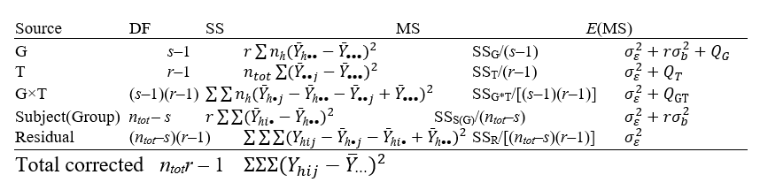
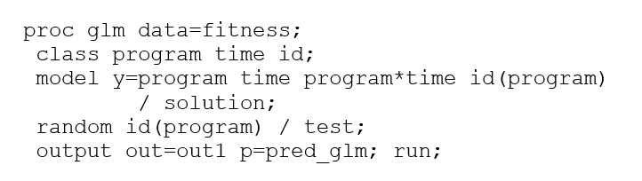
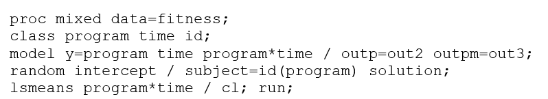
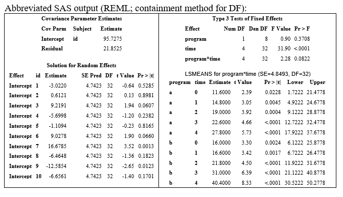

```{r setup, include=FALSE, cache=F, message=F, warning=F, results="hide"}
knitr::opts_chunk$set(cache = TRUE, echo = FALSE, message = FALSE, warning = FALSE)
knitr::opts_chunk$set(fig.height = 4, fig.width = 5, out.width = '30%', fig.align='center')
knitr::opts_chunk$set(fig.path = 'figs_L4/', cache.path = 'cache/')
```

# Background 

## Background 

-	One of the simplest ways to account for correlated data in a linear mixed model is to add a random intercept term.  For example, adding a random intercept term for subjects will induce correlation between measures within subjects, even when repeated measures are not accounted for in the error covariance matrix.

-	The covariance structure (compound symmetric) is simplistic and often not realistic for longitudinal data (covariance between any pair of responses over time is the same regardless of the pair of time points being considered), but is far better than not accounting for correlation at all.  When the random intercept term is for, say, schools, then the covariance structure might be more realistic.


## 

-	For the random-intercept-for subjects model we assume the random intercepts are drawn from a normal distribution with mean 0 and variance $\sigma _b^2$ (i.e., between-subject variance).

-	When the error covariance matrix has the form $\sigma_\epsilon^2I$, the model variance for a response at any time point is the sum of residual variance (or within-subject variance after accouting for fixed effects) and the between-subject variance.

-	The correlation between any 2 time points is the intraclass correlation coefficient $\sigma _b^2 / (\sigma _b^2 + \sigma _\epsilon ^2)$.  The analysis, or at least much of it, can be carried out using what is referred to Repeated Measures ANVOA (RM ANOVA), which has been around much longer than mixed models have, at least in practice.  The model for the RM ANOVA can be considered as a special case of the LMM.

## Fitness data

-	10 subjects were randomized to one of two fitness programs, one lower intensity and the other higher.  Subjects were evaluated using an overall composite fitness score, which ranges from 0 to 75.  Although it is an integer score, given the many possible levels, using a linear model has been shown to be adequate for the data.  Subjects were evaluated at baseline (Week 0), and then at 4 successive weeks after starting the program (e.g., Week 1 as at the end of the first week), making for 5 times points per subject.

-	The fitness longitudinal data are shown below.  Data suggests that the lower intensity program has bigger gains in early weeks, while the higher intensity program has stronger gains in later weeks.  Data will be fit with a model to determine whether apparent differences are statistically significant.

## Fitness data figure

\alert {need some figures}

## Understanding variation in the data

-	Analysis of variance (ANOVA) tables are intuitive, as they partition total (corrected) sums of squares into sources, providing a sense of relative amounts of variation in the data.

-	Repeated measures ANOVA (RM ANOVA) uses the standard ANOVA approach, but makes adjustments to tests to account for the repeated measures taken within subjects.

-	These days, linear mixed models can be used to achieve the same analysis, so there is no need to perform an RM ANOVA via PROC GLM.  The RM ANOVA just helps give us an intuitive understanding for the sources of variation.

-	In general, inference in LMMs are not based on ANOVA tables, but in some cases like this one, inference is the same.


##

-	In order to consider variation and the RM ANOVA approach, consider the following model.

    $Y_{hij} = \mu \ + \gamma _{h(Group)} + \tau _{j(Time)} + (\gamma \tau )_{hj (Group \times Time)}\ + b_{i:h(Subject:Group)} + \epsilon _{hij(error)}$;                 
    where $b_{i(h)} \stackrel {iid} \sim  \mathcal N(0,\ \sigma _b^2)$ independent of  $\epsilon _{hij} \stackrel {iid} \sim \mathcal N(0,\  \sigma _\epsilon ^2)$.

-	Sum to $0$ restrictions can be placed on $G$, $T$ and $G \times T$ effects.  Although the subject term is random, for RM ANOVA, subjects within groups is treated as a fixed-effect term, at least initially (i.e., within PROC GLM, and ID(PROGRAM) is added as a term in the MODEL statement).  This allows us to incorporate all sources of variation in the table.


# Repeated measures ANOVA

## Repeated measures ANOVA

The ANOVA table, including expected mean squares.  Note:  $Q_T$ is a function of time effects; the greater the value, the more the difference between $\tau_j$ parameters.  Similar for $G$, $G \times T$.  In the table above, $n_h$ = number of subjects in group $h$, $n_{tot}=total$ sample size.

```{r "table", echo=FALSE, out.width='100%'}

```


## Tests (based on sum-to-0 restrictions)

- $Group \times Time$			

  $H_0:  \forall\ (\gamma \tau )_{hj} = 0 (or\ Q_{GT}=0)$	                 
  Use $F = MS_{GT}/MS_{R}$		

- Group
  
  $H_0:  \forall\ \gamma_h = 0 (or\ Q_G=0)$                     
  Use $F = MS_G/MS_{S(G)}$

- Subject (i.e., Subject(Group))		
  $H_0: \sigma_b^2 = 0$                       
  Use $F = MS_{S(G)}/MS_R$		

- Time
  $H_0:  \forall\  \tau_j = 0 (or\ Q_T=0)$               
  Use $F = MS_T/MS_R$

**Estimating the ICC may be more informative than running a test for subject variance.**


## ANOVA table

The observed ANOVA table for our model is as follows.  
Included here is another row for Model, which is the sum of all other sources expect Residual.

\alert {need dataset}

## 

-	If you do not identify the repeated measures within subjects, the Program effect is much more significant than it should be (crossed out).

-	Essentially, the Program effect is a between-subject effect, so it makes sense that the denominator MS for the corresponding $F$ statistic is based on the Subject(Program) source of variability; this $F$ statistic is much smaller.  The other model sources use the standard residual source ($MS_{Residual}$) in the denominator of $F$.

-	Subject(Program) allows us to estimate subject variability not due to Program effects; using Subject instead of Subject(Program) would not allow us to tease out Program variability from Subject variability.


##

-	In general, the correct form of $F$ can be guided by examining the expected mean squares.

-	Under the null hypothesis of no effect for the source in question, the expected MS should be the same in the numerator and denominator.  For example, for the $Group \times Time$ test, the $E[MS]$ is $\sigma _\epsilon^2+Q_{GT}$.  Under the null, $Q_{GT}=0$, reducing the quantity to $\sigma _\epsilon^2$.  Thus, the standard $MS_{Residual}$ is the correct one.

-	On the other hand, for group, $E[MS]= \sigma _\epsilon^2+r\sigma _b^2+Q_G$.  Under the null, $Q_G=0$, reducing the quantity to $\sigma _\epsilon^2+r\sigma _b^2$, which is $E[MS_{Subject(group)}]$, showing that $MS_{Subject(group)}$ is the correct denominator term.


## 

To carry out the RM ANOVA using PROC GLM, the basic code is shown below.

```{r "sas code", echo=FALSE, out.width='100%'}

```

-	The total variability in the data, 8140.72, is the sum of squared distances from the overall mean to the data points.  This is also often called 'Corrected Total Sum of Squares', where the correction is for the mean.

-	The first partition of the data sums of squares is into portions attributed to Model and Error, 7441.44 and 699.28, respectively, demonstrating that the model can account for a large portion of variation in the data.  Dividing these quantities by their respective degrees of freedom (17 and 32) yield Mean Square quantities of 437.7 and 21.85, respectively.


##

-	Method of moments can be used to obtain estimates of variance components in terms of Mean Square quantities.  In particular, $E[MS_{Subject(Group)}] = \sigma_\epsilon^2+r\sigma_b^2$ and $E[MS_{Residual}] = \sigma_\epsilon^2$

- So we set the left side to MS quantities, put hats on variance terms on the right, and then solve for these estimated variance terms, to yield: $\hat \sigma_\epsilon^2 = MS_{Residual}$ and $\hat \sigma_b^2 = (MS_{Subject(Group)} - MS_{Residual})/r$

- For our data, these estimates are  $\hat \sigma_\epsilon^2=21.8525$ and $\hat \sigma_b^2=(500.49 – 21.8525)/5 = 95.7525$.

  - These variances show that between-subject variability is about 5 times larger than the within-subject variability that does not include variation due to the fixed effects.  

- Two noticeable features in the data are the intercept variations in the 'noodles' and the increase in noodles over time; these are the two greatest sources of variation in the mean-corrected SS:  $2788/8140 = 34%$ for Time and $4004/8140 = 49%$ for subjects within programs, a total of $83%$ of variation in the data.


# The LMM approach

## The LMM approach

- To fit the same model using an LMM, we treat subject as a true random effect (subject intercept here).

- Similarities between RM ANOVA and LMM approaches:

  - Using REML, the estimated variances are exactly the same as using method of moments with RM ANOVA.
  
  - The estimates of fixed effects for Program, Time and $Program \times Time$ effects are exactly the same.

##     

- Differences between approaches 

  -	Subjects(Program) is treated as a fixed effect with the RM ANOVA approach, and random for the LMM approach.  This leads to differences in subject-specific estimates.

  - Specifically, since empirical Bayes methods are used to estimate random effects for subjects, the predicted values for subjects that incorporate random effect estimates will be shrunk back to the overall mean to some degree, relative to the GLM estimates that treat subject effect as fixed effects.

  -	This is demonstrated in the following graph; the LMM estimates are in solid blue and the GLM estimates are in dashed red.  The differences in this case are not great, but clearly the LMM estimates are compressed to the middle relative to the GLM estimates.  The more reliable subject data are (more values, less variability), the less the shrinkage.  This probably explains the small amount of shrinkage here.


## figures

\alert {lmm blup figure}


##      

- For any other differences between RM ANOVA and LMM, I would recommend using the latter, since subjects are modeled using random effects, i.e., they are considered as having been sampled from a normal population, and inference properly accounts for this.

-	If we are interested in inference just for the sample of subjects used, it makes sense to treat them as fixed effects, but usually we are more interested in the general population they were sampled from.

-	Differences in approaches is reflected in the lower standard errors of estimates in the RM ANOVA approach relative to the LMM approach.  With RM ANOVA, Subjects-within-Programs is modeled as a fixed effect; hence inference is conditioned on the particular subjects at hand; for the LMM approach, inference for fixed effects is based on the marginal model (averaging over subjects in the population), naturally (and appropriately) leading to larger SE's.


##     

-	Basic SAS code to fit the model above is shown below.  The OUTP will provide BLUP estimates for each value in the data set ($\pmb {\hat Y=X \hat \beta + Zb}$), while OUTPM provides $\pmb {\hat Y= X \hat \beta}$.

-	The LSMEANS statement will provide estimates for each $Program \times$ time combination.  Adding the 'diff' option to the right of the slash will provide comparisons between all pairs of differences in these combinations. There are also options to control for multiple testing using the Adjust option.  For more detail, see the SAS Help Documentation.

-	The 'solution' option in the RANDOM statement provides estimates and $t$-tests for random effect estimates (the same solution option could be added in the MODEL statement, but the LSMEANS options gives us what we need in this case).


## 

```{r "sas code2", echo=FALSE, out.width='100%'}

```

```{r "sas table", echo=FALSE, out.width='100%'}

```


## 

-	One methodological difference in fitting LMM's is that in order to conduct inference, we develop statistical quantities that have approximate t or F distributions, and then estimate the denominator degrees of freedom to conduct 'correct' inference.

-	There are 6 or 7 different methods that can be used, and in SAS, the default methods used will depend on how the model is specified.  This will be discussed more later, but for our purposes now, an important thing to realize is that SAS and R have different default methods, which is why results may appear slightly different.

-	For the SAS code above, the default denominator degrees of freedom (DDFM) method used is the 'Containment', since there is a RANDOM statement.  In order to change the method, you can add the DDFM option to the right of the slash in the MODEL statement.


## 

- Basic R code using the **lme4::lmer()** function from the **lme4** package.  Note that there are 3 basic DDFM methods available, two approximate (Satterthwaite, Kenward-Roger), and asymptotic.  Asymptotic is not recommended for smaller data sets, as it is likely to lead to inflated Type I error rates and CI's that are too narrow.

\alert {need dataset}

```{r "fitness", eval=FALSE, include=FALSE}
# library(lme4)
# library(emmeans)
# library(lmerTest) # Allows for satterthwaite df
# library(pbkrtest) # Allows for Kenward-Roger df

runny <- lmer(data = fitness_dat, y ~ (time * program) + (1 | id))
summary(runny)
emmeans(runny, ~ time * program, lmer.df = "satterthwaite")
aov <- anova(runny)
aov

```


##

Note that the results above match the RM ANOVA approach for the balanced fitness data.  The estimated marginal means (**emmeans()**) are the same as the LSMEANS from SAS's approach.  The only difference between SAS and R in the analysis is in the CI's and p-values, which is due to different DDFM methods used (Satterthwaite here, Containment using SAS).

Summary of DDF's for different DDFM methods for Fitness data, with the Random intercept model

\alert {need dataset for table and figures}


# Summary

## Summary