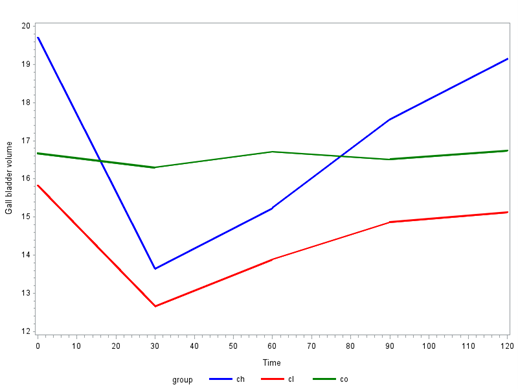

```{r setup, include=FALSE, cache=F, message=F, warning=F, results="hide"}
## setup directory
# setwd()
knitr::opts_chunk$set(cache = TRUE, echo = FALSE, message = FALSE, warning = FALSE)
knitr::opts_chunk$set(fig.height = 4, fig.width = 5, out.width = '50%', fig.align='center')
knitr::opts_chunk$set(fig.path = 'figs_L5/', cache.path = 'cache/')
```


# Overview

## Topics

- Foundational material (see other document)

- Statistical models, different formulations

  - Means versus effects models
  - Full rank versus less-than-full-rank models

- g-inverses and estimability

- Key theorems and identities

- Writing custom tests for fixed effects in the LMM

-	Class versus continuous predictors (e.g., time).

## Means versus effects models

Consider an experiment where subjects in 2 groups are observed over 3 times.  Write the associated effects and means models. 

\vspace{\baselineskip}
\vspace{\baselineskip}

If different subjects were observed at each $Group \times Time$ combination, we would have factorial data that would normally be analyzed with 2-way ANOVA.  The statistical models would look similar, but in that case I usually write the model for $Y_{ijk}$, where $i$ indexes group, $j$ indexes time, and $k$ replicate (right side adjusted accordingly).


## Full-rank versus less-than-full-rank models: 

In 6612 you were introduced to full-rank and less-than-full-rank (LTFR) models.  The LTFR model includes a column for each level of each categorical variable.                

**Full rank approach**:  Say we have a continuous variable such as time, and 3 treatment $Groups\ (A,\ B,\ Control)$; $Group \times Time$ will also be included in the model; $X$ has 6 columns.  Let $x_1 = Time$, $x_2=1$ for treatment $A$, 0 otherwise; $x_3=1$ for treatment $B$, 0 otherwise ($Control$ will be the reference group – i.e., we have imposed a set-to-0 restriction for the $Control$ group).  Let $i$ denote the unique data-wide index for subject, and $j$ the index for $Time$.  Since times of measurement may not be the same for subjects, I keep the $i$ index on the time variable as well as $j$.  The model can then be expressed as:

$$
Y_{ij} = \beta_0 + \beta_1 x_{1ij} + \beta_2 x_{2i} + 
\beta_3 x_{3i} + \beta_4 x_{1ij} \cdot x_{2i} + \beta_5 x_{1ij} \cdot x_{3i} + ε_{ij}
$$

Note that we can use like notation for all predictors, but we will have to 'manually construct' the dummy variables for treatment group.  We have a model with full rank $X$, so don't need to worry about generalized inverses.

## 

**Less-than-full-rank approach**:  There are 8 columns in $X$; let's define the treatment effects as $\kappa_h$ for $Group\ 1 (A),\ 2 (B)\ and\ 3 (Control)$, and let $\gamma_h$ denote the $Group \times Time$ interaction for $h=1,\ 2\ ,\ 3$.  Since there is only one interaction term, we don't need to add another index on the effect other than one for Group. The model is:

$$
Y_{hij} = \beta_0 + \beta_1 x_{1ij} + \kappa_h + \gamma_h x_{1ij} + \epsilon_{ij}
$$

for $Group\ h$, $Subject\ i$ and $Time\ j$.  The statistical model has mixed notation, and the associated matrix has less-than-full rank (i.e., dependency in columns).  

##

In computing estimates, the issue with the LTFR models is that if we include a column in $\pmb X$ for each of $c$ levels of a categorical variable, $\pmb X$ will not have full rank, nor will $\pmb {X^{\top}X}$, and hence a regular inverse cannot be used when calculating the estimator for $\pmb {\hat \beta}$.             

Two basic approaches can be used to handle this issue.               

  - Force a constraint on the model up front (set-to-0 or sum-to-0), so that X has full rank and regular inverses can be used.  I.e. create a full-rank model for the situation.                      

  - Introduce a new type of inverse that will handle the singularity issue.                            

  - In some cases these approaches are essentially the same.  (E.g., SAS's g-inverse approach is essentially like setting the highest levels of factors to 0.)                                    

**For more information, see the course notes, or refer to your BIOS6612 material.**

## Estimability of $\pmb \beta$

- For LTFR models, $\hat \beta$ is not unique and depends on the g-inverse used.  Theory of estimability tells us which linear combination of parameters are estimable in the LTFR model.

- Some might find using LTFR models a little confusing, however doing so eliminates the need to manually create indicator variables and helps streamline modeling and programming code to get estimates related to all levels of categorical variables.

- When you use the CLASS statement in PROC MIXED or PROC GLM, you are fitting a LTFR model.

- In R, using 'factor' in the lme function is like using CLASS in PROC MIXED, except this approach is equivalent to setting the 1st level of a factor as the reference, rather than the last.

- To determine whether $\pmb {L\beta}$ is estimable, see if $\pmb {L=LH}$ for the $\pmb L$ in question.  If the equation holds, then $\pmb {L\hat \beta}$ has a unique distribution (despite which g-inverse is used for $\pmb {X^{\top}X}$) and $\pmb {L\hat \beta}$ is estimable.

- When including the 'e' option in the MODEL statement, SAS produces the form of estimable functions for generic $\pmb L$.

## Linear form

Consider an $n \times 1$ random vector $\pmb Y \sim \mathcal N(\mu,\ \Sigma)$ where $\Sigma$ has full rank.  For an $m\times n$ matrix $\pmb A$, the linear form:  

$$
\pmb {AY} \sim \mathcal N (\pmb {A\mu},\ \pmb{A\Sigma A^{\top}})
$$

if $r(\pmb A)=m$, where $m \leq n$.  Note that this is an $m$-variate distribution since $\pmb {AY}$ is an $m \times 1$ vector.

Example:  distribution of $\pmb {\hat \beta}$.


## Quadratic form

For an $n \times n$ matrix $\pmb A$ and $\pmb Y$ as before,

$$
\pmb {Y^{\top} AY } \sim \chi_\nu^2 (\lambda)
$$

where $\lambda = \frac 1 2 \pmb {\mu^{\top} A \mu}$ is the noncentrality parameter and $\nu = r(\pmb A)$ are degrees of freedom if and only if any of the following conditions hold:  

1. $\pmb {A \Sigma}$ is idempotent [i.e., $\pmb {(A \Sigma)^2 = A \Sigma}$],                                        
2. $\pmb \Sigma A$ is idempotent [i.e., $\pmb {(\Sigma A)^2 = \Sigma A}$],                                    
3. $\pmb \Sigma$ is a generalized inverse of $\pmb A$.                                    

The distribution shown above is a non-central $\chi^2$ distribution.  When $\mu = 0$, we have $\lambda = 0$, which is the central $\chi^2$ distribution that we're familiar with.

Example:  Distribution of $\hat {\sigma}^2$

## Custom tests and estimates in the LMM

Researchers will (or should) have some idea about specific hypotheses they would like to test or estimates then would like to obtain.  The inferential methods we've already learned associated with GLM's and LMM's will help us to create custom tests and estimates.  Here, we focus on the LMM although the methods are similar in the GLM case.  Below is a quick review of the methods, followed by some examples.


##

- Likelihood ratio tests (LRT), $F$-tests for multiple equations

  - LRTs or $F$-tests can be performed for $H_0: \pmb {c\beta} = \pmb h$ where $\pmb c$ is a matrix and $\pmb h$ is a vector of numbers, but usually $\pmb 0$.
	- In SAS PROC MIXED, obtain $F$-tests using the CONTRAST statement.
	- In R, equivalent LRT tests can be obtained by using the **anova.lme()** function that follows full and reduced lme fits.
	- For class variables with more than 2 levels, associated main effect or interaction tests require $F$-tests.
  - Tests are more versatile than $t$-tests since the latter can only handle 1 equation at a time.

- Estimate of $\pmb {L\beta}$ and associated Wald tests
	
	- $\pmb L$ is a row vector (e.g., one row in $\pmb c$).
	- The estimate of $\pmb {L\beta}$ is $\pmb {L \hat \beta}$.
	- The test of $H_0:\  \pmb{L\beta} = \pmb 0$ is carried out using the $t$-statistic $\pmb {L\hat \beta}/se(\pmb {L\hat \beta})$.
	- The estimate and test are obtained using the ESTIMATE statement in PROC MIXED.  In R, you can obtain these by using the **multcomp::glht()** function in the **multcomp** package.

- The above inferential methods can be carried out on either means or effects models.  See the text for examples of main-effect and interaction tests written for means models.  Here, we focus on writing coefficients for the effects models and less on computation.  More computational details are in the text.


## Writing contrasts for a two-way effects model

Consider the model $Y_{hij} = \mu + \alpha_h + \tau_j + \gamma_{hj} + ε_{hij}$, where $h$ denotes $Group$, $i$ denotes $Subject$, and $j$ denotes $Time$.  We can impose a specific covariance structure for the errors (e.g., AR(1)) to account for repeated measures.  If there are $2 Groups$ and $3 Times$, then there are 12 parameters: $\pmb \beta^{\top}=(\mu\ \alpha_1\ \alpha_2\ \tau_1\ \tau_2\ \tau_3\ \gamma_{11}\ \gamma_{12}\ \gamma_{13}\ \gamma_{21}\ \gamma_{22}\ \gamma_{23})$

For estimates and tests involving $\pmb {L\beta}$, $\pmb L$ will be a $1 \times 12$ vector.  When we write ESTIMATE or CONTRAST statements in SAS, the coefficients in $\pmb L$ are broken down by factors.  For example, say we want to estimate the mean for $Group\ 1$ at the $3rd\ Time$.  For this, $\pmb L=(1\ 1\ 0\ 0\ 0\ 1\ 0\ 0\ 1\ 0\ 0\ 0)$.  

In SAS we would write:

```{r "sas code1", echo=FALSE, out.width='100%'}

```

##

If certain factors do not come into play, then we do not need to include them in the ESTIMATE or CONTRAST statement.  For example, say we want to compare means for between groups at the first time point.  Then $\pmb L=(0\ 1\ -1\ 0\ 0\ 0\ 1\ 0\ 0\ -1\ 0\ 0)$.  In SAS, the estimate statement is:

```{r "sas code2", echo=FALSE, out.width='100%'}

```

But since we have 0's for two of the factors, we can just write:

```{r "sas code3", echo=FALSE, out.width='100%'}

```

##

Note:  in order to figure out how to write L above, you might find it easier to consider each group first, and then take the difference: $(Int\ |\ Group\ |\ Time\ |\ Group \times Time\ )$

Control group at 24 hours:  	$\pmb L=(1\ |\ 1\  0\ |\  1\  0\  0\ |\ 1\  0\  0\  0\  0\  0)$                     
Myostatin group at 24 hours:	$\pmb L=(1\ |\ 0\  1\ |\  1\  0\  0\ |\ 0\  0\  0\  1\  0\  0)$                    
Difference:			              $\pmb L=(0\ |\ 1\ -1\ |\  0\  0\  0\ |\ 1\  0\  0\ -1\  0\  0)$                       

For practice:  write out the null hypothesis for the main effect tests and interaction test based on the 2-way model.

## Examples with real data

Ramus data:  The size of the ramus bone in the jaw was measured for 20 boys at 4 ages (per boy).  Write the model that includes a class variable for age and a random intercept for boy.


## Write polynomial contrasts for age.  

Some questions:

1. With 4 ages, we can go up to which degree of polynomial?
  
2. What are the coefficients for the polynomial contrasts?
  
3. What is an alternative way to write the model that will yield the same $-2ln\mathcal L$ value (considering ML estimation)?  Why is this?
  
4. Compare the $F$-test that use polynomial contrasts as rows for $c$ versus the $F$-test that compares $Time 1$ versus each successive time point. Why are they equivalent?  (Full rank reparameterization theorem.)  (It is also the same as the overall test for age.)


## R code for Ramus data

```{r "ramus r code", eval=FALSE, include=FALSE}
library(nlme)
library(multcomp)
ramus <- read.table("C:/strand_folders/.../ramus_uni.csv",
                    header = T, sep = ",", skip = 0)

# Means model, age as class variable
age_factor <- factor(ramus$age)
results <- lme(height ~ factor(age) - 1, random = ~ 1 | boy, data = ramus, method = "ML")
results

# tests for polynomial trends
Cpoly <- t(matrix(c(-3, -1, 1, 3, 1, -1, -1, 1, -1, 3, -3, 1), 4, 3))
colnames(Cpoly) <- names(fixef(results))
rownames(Cpoly) <- c("lin", "quad", "cubic")
mycontrast <- glht(results, Cpoly)
summary(mycontrast)

# Effects model, polynomial contrasts
contrasts(age_factor) <- t(Cpoly)
results3 <- lme(height ~ age_factor, random = ~ 1 | boy, data = ramus, method = "ML")
summary(results3)
results3$contrasts
anova.lme(results3, type = "marginal", adjustSigma = F, Terms = 2)

# deviations tests
age2 <- ramus$age * ramus$age
age3 <- ramus$age * ramus$age * ramus$age
ModelFit.full <- lme(height ~ age + age2 + age3, random = ~ 1 | boy, data = ramus, method = "ML")
ModelFit.reduced <- lme(height ~ age, random = ~ 1 | boy, data = ramus, method = "ML")
out <- anova.lme(ModelFit.full, ModelFit.reduced)
out

# > results
# Random effects:
#  Formula: ~1 | boy
#         (Intercept) Residual
# StdDev:    2.405221 0.816027
# Linear mixed-effects model fit by maximum likelihood
#   Data: ramus 
#   Log-likelihood: -133.0161
# > #tests for polynomial trends
#          Simultaneous Tests for General Linear Hypotheses
# Linear Hypotheses:
#            Estimate Std. Error z value Pr(>|z|)    
# lin == 0     9.3300     0.8160  11.433   <2e-16
# quad == 0   -0.0900     0.3649  -0.247    0.993    
# cubic == 0  -0.0400     0.8160  -0.049    1.000    
# 
# > #polynomial contrasts
# Fixed effects: height ~ age_factor 
#                    Value Std.Error DF  t-value p-value
# (Intercept)      50.0750 0.5596786 57 89.47099  0.0000
# age_factorlinear  0.4665 0.0418613 57 11.14394  0.0000
# age_factorquad   -0.0225 0.0936047 57 -0.24037  0.8109
# age_factorcubic  -0.0020 0.0418613 57 -0.04778  0.9621
# 
# >anova.lme(results3, type="marginal", adjustSigma=F, Terms=2)
# F-test for: age_factor 
#   numDF denDF  F-value p-value
# 1     3    57 43.59563  <.0001
# > #deviations tests
#                  Model df      AIC   logLik  Test  L.Ratio p-val
# ModelFit.full        1  6 278.0322 -133.0161                          
# ModelFit.reduced     2  4 274.0954 -133.0477 1 vs 2 0.063 0.9689

```


## SAS code for Ramus data

```{r "sas code4", echo=FALSE}
knitr::include_graphics('figs_L5/f4.png')
```


## SAS code for Ramus data

```{r "sas code4.2", echo=FALSE}

```


## Tests for interaction in the Dog data

In Sterczer, Voros, and Karsai (1996), the effect of cholagogues on changes in gallbladder volume (GBV) in dogs was studied by two-dimensional ultrasonography. Three different kinds of cholagogues and tap water (administered orally) as control were used in the experiment. Six healthy dogs were treated with each substance. GBV was determined immediately before the administration of the test substance and at 10-minute intervals for 120 minutes thereafter.  CH=cholagogue 1 (blue), CL=cholagogue 2 (red); CO=control (green).

```{r "dog", echo=FALSE}

```


## 
1. Write a model that includes group and time as class variables, plus group $\times$ time interaction.

\vspace{\baselineskip}

2. Write a test to compare is if trends over time differ between treatment (cholagogue) groups.


\vspace{\baselineskip}

3. Write a test to compare changes from beginning to end among the 3 groups.

\vspace{\baselineskip}

4. Write a test to compare the quadratic trend of the average of treatment groups compared with the control.
\vspace{\baselineskip}

## Beta Carotene data (From Rosner, 2006.)  

A clinical trial was planned comparing the incidence of cancer in a group taking beta-carotene in capsule form compared with a group taking beta-carotene placebo capsules.  One issue in planning such a study is which preparation to use for the beta-carotene capsules.  Four preparations were considered:  (1) Solatene (30mg capsules), (2) Roche (60mg capsules), (3) BASF (30mg capsules), (4) BASF (60mg capsules).  To test efficacy of the four agents in raising plasma-carotene levels, a small bioavailability study was conducted.  After two consecutive-day fasting blood samples, 23 volunteers were randomized to one of the four preparations mentioned above, taking 1 pill every other day for 12 weeks.  The primary endpoint was level of plasma carotene attained after moderately prolonged steady ingestion.  For this purpose, blood samples were drawn at 6, 8, 10 and 12 weeks.  In the plot below, the 2nd baseline measure was used at Time 0.  So in total, there are measurements at 0, 6, 8, 10 and 12 weeks.  

## 

```{r "beta carotene", echo=FALSE}
knitr::include_graphics('figs_L5/f6.png')
```


1.	Look at means by time first.  What are some potential models?

\vspace{\baselineskip}

2.	Write out two models, one where time is a class variable, and one where it is continuous.

\vspace{\baselineskip}

3.	Perform a test of interest for the model with time as a class variable.

\vspace{\baselineskip}

4.	Perform a test of interest for the model with time as a continuous variable.

\vspace{\baselineskip}


## Time versus class versus continuous

- How do the estimates change if Time is treated as a continuous variable relative to Time as class?

-	If modeling Time as continuous, are higher order terms necessary?

-	What should you think about when deciding between Time as class versus Time as continuous?

-	In SAS PROC GLM and PROC MIXED, time can be modeled as a continuous variable by simply leaving the Time variable out of the CLASS statement (or by not using the factor argument in R).

-	For an indicator variable (e.g., $0=Male$ and $1=Female$), do you need to define it as a class variable?  What is the difference when you do or don't?

-	When modeling time as a class variable, the linearity assumption can be checked informally by inspecting graphs to see if the patterns look linear, or add higher order terms and see if they are significant.  Can perform 'lack of fit' test for linearity.


## 

###	Modeling time as a class versus continuous variable is an important issue that we will discuss throughout the course. 
 
  -	Time as a class variable…
    -	offers the most flexibility 
    -	imposes no parametric constraints imposed across levels of time
    -	uses more degrees of freedom in the model (e.g., with 4 times there are 3 $d.f.$, 1 $d.f.$ if you have a simple linear term for time as continuous).
    -	recommended when there are relatively few times (say, five or less), for which tests for polynomial trends can still be conducted (see course notes for details).  

  -	Time as continuous is recommended when…
    -	there are many times of observation, possibly unequally spaced
    -	there are different times of measurement for subjects
    -	interpolating estimates and predicted values may be of interest

###	Equivalence of model using using time as class and model using time as continuous with $(t–1)$th degree polynomials (if time has $t$ levels)
  -	Same log likelihood
  -	Same $F$-test for Time


