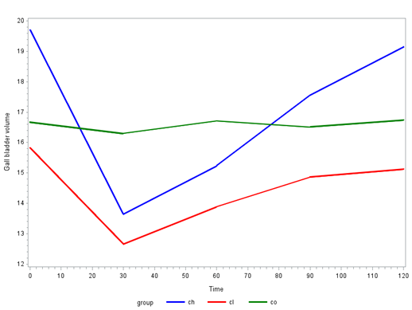
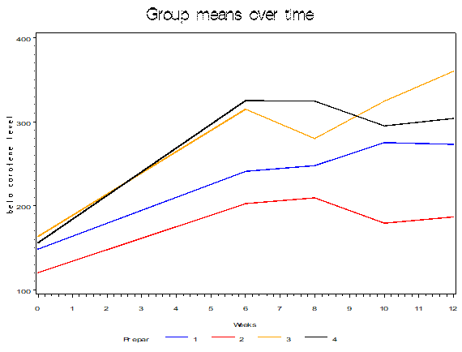

\newcommand{\textcm}{\textcolor{magenta}}

```{r setup, include=FALSE, cache=F, message=F, warning=F, results="hide"}
## setup directory
# setwd()
##install.packages("nlme")
##install.packages("multcomp")

knitr::opts_chunk$set(cache = TRUE, echo = FALSE, message = FALSE, warning = FALSE)
knitr::opts_chunk$set(fig.height = 4, fig.width = 5, out.width = '50%', fig.align='center')
knitr::opts_chunk$set(fig.path = 'figs_L5/', cache.path = 'cache/')
```


##
```{r "ramus r code3", eval=T, echo=TRUE, include=TRUE}
# Effects model, polynomial contrasts
contrasts(age_factor) <- t(Cpoly)
results3 <- lme(height ~ age_factor, 
                random = ~ 1 | boy, 
                data = ramus, method = "ML")
summary(results3)
##results3$contrasts
##anova.lme(results3, type = "marginal", 
##          adjustSigma = F, Terms = 2)


```


## Tests for interaction in the Dog data

In Sterczer, Voros, and Karsai (1996), the effect of cholagogues on changes in gallbladder volume (GBV) in dogs was studied by two-dimensional ultrasonography. Three different kinds of cholagogues and tap water (administered orally) as control were used in the experiment. Six healthy dogs were treated with each substance. GBV was determined immediately before the administration of the test substance and at 10-minute intervals for 120 minutes thereafter.  CH=cholagogue 1 (blue), CL=cholagogue 2 (red); CO=control (green).

```{r "dog", echo=FALSE}

```


## 
1. Write a model that includes group and time as class variables, plus group $\times$ time interaction.

\vspace{\baselineskip}

2. Write a test to compare is if trends over time differ between treatment (cholagogue) groups.


\vspace{\baselineskip}

3. Write a test to compare changes from beginning to end among the 3 groups.

\vspace{\baselineskip}

4. Write a test to compare the quadratic trend of the average of treatment groups compared with the control.
\vspace{\baselineskip}

## Beta Carotene data (From Rosner, 2006.)  

- A clinical trial was planned comparing the incidence of cancer in a group taking beta-carotene in capsule form compared with a group taking beta-carotene placebo capsules.  
- One issue in planning such a study is which preparation to use for the beta-carotene capsules.  Four preparations were considered:  (1) Solatene (30mg capsules), (2) Roche (60mg capsules), (3) BASF (30mg capsules), (4) BASF (60mg capsules).  
- To test efficacy of the four agents in raising plasma-carotene levels, a small bioavailability study was conducted.  
- After two consecutive-day fasting blood samples, 23 volunteers were randomized to one of the four preparations mentioned above, taking 1 pill every other day for 12 weeks.  
- The primary endpoint was level of plasma carotene attained after moderately prolonged steady ingestion.  For this purpose, blood samples were drawn at 6, 8, 10 and 12 weeks.  

In the plot below, the 2nd baseline measure was used at Time 0.  So in total, there are measurements at 0, 6, 8, 10 and 12 weeks.  

## 

```{r "beta carotene", echo=FALSE}

```


1.	Look at means by time first.  What are some potential models?

\vspace{\baselineskip}

2.	Write out two models, one where time is a class variable, and one where it is continuous.

\vspace{\baselineskip}

3.	Perform a test of interest for the model with time as a class variable.

\vspace{\baselineskip}

4.	Perform a test of interest for the model with time as a continuous variable.

\vspace{\baselineskip}


