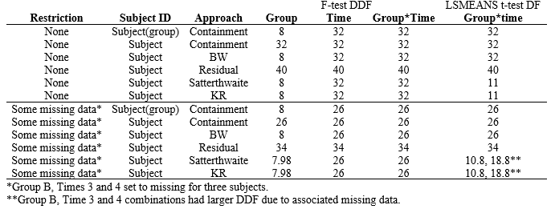
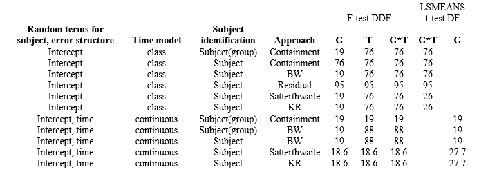
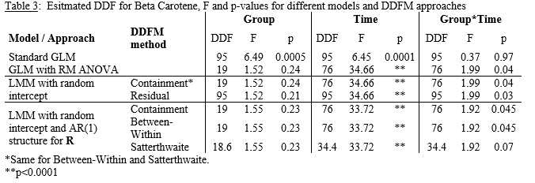

```{r setup, include=FALSE, cache=F, message=F, warning=F, results="hide"}
## setup directory
# setwd()
knitr::opts_chunk$set(cache = TRUE, echo = FALSE, message = FALSE, warning = FALSE)
knitr::opts_chunk$set(fig.height = 4, fig.width = 5, out.width = '50%', fig.align='center')
knitr::opts_chunk$set(fig.path = 'figs_L6/', cache.path = 'cache/')
```

# Degrees of freedom

## Topics

-  Estimating (D)DF for inference in linear mixed models.


## Estimating (D)DF for inference involving $\pmb \beta$

**See the course notes for more detail.**

# Background

## Background

- Inference for fixed effects in a GLM involves creation of an ANOVA table that breaks down total sums of squares into sources, and then uses this information along with DF to construct $t$ or $F$-tests of interest.

- The GLM can be extended to longitudinal data by making adjustments to the ANOVA table and tests, i.e., repeated measures ANOVA.  A multivariate GLM can also be employed, along with MANOVA, to analyze longitudinal data with a more flexible covariance structure.

- Inference for fixed effects in the LMM generally does not involve an ANOVA-type approach that breaks variation down into sources (although in special cases, the approaches are equivalent, discussed more shortly).  Rather, test statistics are built that are functions of model parameters that are typically estimated using ML or REML.

- Distributions of these test statistics have approximate  $t$ or $F$-distributions (under the null hypothesis), with accuracy that can be calibrated by selection of the denominator degrees of freedom (DDF).  [For $t$-tests, the quantity is just DF, for $F$-tests, it is DDF; but we just use DDF for simplicity.]

##

- For simpler data and models, DDF selection is clear and distributions 'exact.'  (E.g., RM ANOVA and the LMM with a random intercept for subjects.)

- For more complex data and models (the usual case), the DDF need to be estimated to allow for accurate inference, including the calculation of $p$-values and confidence intervals.  There is no clear cut or agreed upon method to estimate the DDF, although many of the proposed methods often yield similar results.

- The reason why $t$ and $F$-distributions are used (rather than standard normal and $\chi^2$- distributions) in inference for LMMs is due to the use of unknown covariance parameters in the test statistics.

- This is a generalization of inference for a mean based on a random sample, using a $t$-test.

- Along the same lines, inference for $\pmb \beta$ in the LMM should take into account the fact that covariance parameters in the developed test statistics are estimated rather than known values.  Again, this is a straightforward process for balanced data and simpler models, but not so clear beyond that.  There have been several methods proposed to estimate DDF for test statistics in the LMM.

# DDFM

## Small-sample vs. asymptotic approaches

When covariance parameters are known, inference for $\pmb \beta$ in the LMM can utilize standard normal and $\chi^2$- distributions.  Even when these parameters are unknown, inference based on standard normal and $\chi^2$- distributions are fairly accurate for large sample sizes (see Fitzmaurice et al. (2011)).  Although there is no one single widely accepted DDF method (DDFM), they generally produce similar results and are all likely to be much more accurate than the asymptotic approach.


### A description of DDFM approaches

In SAS, there are five denominator degrees of freedom methods (DDFM) that can be specified in the MODEL statement for PROC MIXED, which are Containment, Between-within, Residual, Satterthwaite, and Kenward-Roger.  In R, recent packages and functions allow for application of some of these methods.  Below is a list and some detail for 6 common DDF methods; for more detail, see SAS Help Documentation.  Some examples follow the list of definitions. 


## Containment

- Keyword CONTAIN.

- The default method in SAS when there is a RANDOM statement in PROC MIXED (regardless of whether there is a REPEATED statement).

- Not used in common R packages and functions.

- If a predictor is named somewhere in the RANDOM statement, DDF is set to $rank[\pmb X \pmb Z]$ associated with this named predictor.  Otherwise, DDF is set to $n–rank[\pmb X \pmb Z]$.

##	Between-within

- Takes the residual DF and separates it into 'between-subject' and 'within-subject' components.

- The default method in SAS when there is a REPEATED statement but no RANDOM statement.  Keyword:  BETWITHIN.

- Not used in common R packages and functions.


##	Residual

- This is comparable to using the DF for the MSE in standard GLM, but is usually not recommended since it tends to overestimate the optimal DF.  Keyword:  RES.

- DDF= $n–rank[\pmb X]$.

##	Satterthwaite

- Performs a general Satterthwaite approximation to the DDF.
  
- More conservative than Containment and Between-Within methods, although for many data sets it will be the same or similar.  Keyword:  SATTERTH or SAT.

- Method available in R (e.g., **emmeans()** function). 


##	Kenward-Roger

- Also an 'approximate' method.  It is an adjustment to the Satterthwaite approach that does even more to account for uncertainty in unknown covariance parameters; offers a correction to DF as well as the standard error in test statistics.

- From data I have analyzed, DDF appears to be the same as for Satterthwaite, but adjusts the SE, as mentioned above.

- SAS suggests this method when there is a REPEATED statement with TYPE=UN, but no RANDOM statement).  Keyword:  KENWARDROGER or KR. 

- Method available in R (e.g., **emmeans()** function).


## Asymptotic

- Uses 'Infinite' DDF, i.e., uses the standard normal in place of the $t$-distribution and the $\chi^2$- distribution in place of the $F$-distribution.

- Correct approach if the covariance parameters are known.

- Not recommended if you have software that allows for inference based on $t$ and $F$-distribution methodology, although for larger sample sizes there will not be big differences.

## DDF in SAS

- You can select your own denominator degrees of freedom using DDF=<value> in SAS.  Thus, if you feel you have a method that gives you an even better approximation to the null distribution through specification of the denominator DF, you can specify it.  

- See Verbeke and Molenberghs, *Linear Mixed Models in Practice, Springer, 1997*, Appendix A, and the SAS Help Documentation for more detail.


##	Summary

1. Residual and Asymptotic approaches are usually not recommend since they will likely yield $p$-values too small and CI's too narrow (i.e., approaches are too liberal).  

2. Containment and Between-Within methods are SAS defaults.

3. R has the approximate approaches (Satterthwaite and Kenward-Roger) but often sets Asymptotic as the default.  

4. From my experience, The Containment, Between-Within, Satterthwaite and Kenward-Roger are often similar in most cases, if not the same, with Satterthwaite and KR slightly more conservative.

5. But there are a few caveats to this, which are mentioned with the examples below.  Generally, any of these four methods should be reasonable, and multiple approaches could be taken to verify that end results do not differ much between the approaches.

# Examples

## Fitness data

- 10 $Subjects$ (identified using the ID variable) were randomized to one of two fitness $Groups$ (5 per $Group$), observed over 5 $Times$ and evaluated for fitness levels.

- Data were modeled using $Group$, $Time$ and $Group \times Time$, using $Group$ and $Time$ as class variables.  Thus, the degrees of freedom are 1 for $Intercept$, 1 for $Group$, 4 for $Time$, and 4 for $Group \times Time$.

- Recall that with RM ANOVA (refer to section here), there are 32 DDF for $Time$ and $Group \times Time$, and 8 DDF for $Group$.

- The denominator MS for $Time$ and $Group \times Time$ is the MSE, while it is $MS_{Subject(Group)}$ for $Group$.

-	For the model that uses a random intercept for $Subject$, there are 10 columns in the complete-data$\pmb Z$ matrix, but 2 of these columns are redundant in the $[\pmb{X Z}]$ (8 d.f. related to $Group$ within $\pmb Z$), so $rank[\pmb {XZ}]=18$, and $n–rank[\pmb {XZ}]=32$.  If the random statement is written as

		RANDOM intercept / subject=ID;

##

There is no predictor in the statement.  Thus, $Group$, $Time$ and $Group \times Time$ $F$-tests will all use 32 DDF for the Containment method (the default).  

- Now if we use the following statement instead:

		RANDOM intercept / subject=ID(group);

The $Group$ variable will be recognized when using the Containment method, which has 8 d.f. (see above).  Thus, the DDF for $Group$ will be 8 and 32 for the others.  This is one of the important caveats alluded to previously.  Since the other methods (BW, Satterthwaite and KR) all have 8 d.f. for $Group$ (as would the RM ANOVA) without using ID($Group$), it seems important to use ID($Group$) as the $Subject$  if the default Containment is used.

- One difference between methods is that inference for $Group \times Time$ combinations (e.g., Leas$t$-squares means estimates) is that the Satterthwaite and KR approaches have 11 DF for $Group \times Time$ estimates (via 'Least squares means' analysis) compared with Containment and BW approaches (32 DF).  The table below shows composite results, including incomplete data, to show impact of missing data on results.


## 

### Table 1:  Estimated (D)DF for Fitness data, model with random intercept for $Subjects$, $Time$ as class; unrestricted data is balanced.

```{r "table fitness", out.width='100%', fig.align='center'}

```


## Beta Carotene data

- Each $Subject$  is given one of four vitamin supplements and beta plasma levels are observed over 5 $Times$, for 23 $Subjects$.  There are 6 $Subjects$ in each $Group$ except one that has 5.  There are $23 \times 5=115$ total observations.  Although data are not balanced, they are complete, and results are similar to the Fitness data (see table).

- For the basic GLM that does not account for repeated measures, there are 20 model DF (1 for $Intercept$, 3 for $Group$, 4 for $Time$, 12 for $Group \times Time$; both $Group$ and $Time$ are modeled as class variables here).  Thus, there are 95 residual DF.

##

Table 2 shows DDF values for different methods.  The results show that if you are going to use the Containment method, you should use $Subject(Group)$ as the 'subject' in the RANDOM statement in order to get the proper 19 DF.  Recall that if the effect of interest is not in the RANDOM statement, the DF for the Containment approach defaults to $n–rank[\pmb {XZ}]$.  This is fine for $Time$ and $Group \times Time$, but $Group$ should have 19 DF.  If a random slope for $Time$ is included for $Subjects$, the Containment method becomes similar to Satterthwaite and KR, while BW is more liberal for $Time$ and $Group \times Time$.  For $t$-tests, the DF is the same as for $F$-tests for all methods except for Satterthwaite and KR when the model has random terms for intercept and time.

### Table 2:  Esitmated (D)DF for Beta Carotene data (complete data, unbalanced between groups).  For LSMEANS, not all combinations were examined.

```{r "table betac", out.width='80%', fig.align='center'}

```

## 

Table 3 illustrates differences in quantities used for $F$-tests.  Note that in all cases, the Numerator DF for $Group$, $Time$, and $Group \times Time$ are 3, 4, and 12.  The standard GLM is clearly not the correct approach, but used to show what happens when the longitudinal data are not taken into account and it is assumed that responses all came from separate $Subjects$.  


For all reasonable approaches (all but the Standard GLM), results are pretty similar, except for the $Group \times Time$ $p$-value using the Satterthwaite method when both a random intercept and AR(1) structure for the error covariance structure are in the model, in which case a lower DDF elevates the $p$-value above 0.05.  Even though the Residual method is generally not recommended, it does not yield results too different from others, even though the total sample size is just over 100.

### Table 3:  Esitmated DDF for Beta Carotene, $F$ and $p$-values for different models and DDFM approaches Group	Time	$Group \times Time$

```{r "table betac df", out.width='80%', fig.align='center'}

```


