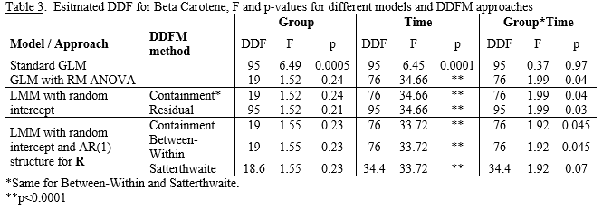

\newcommand{\textcm}{\textcolor{magenta}}

```{r setup, include=FALSE, cache=F, message=F, warning=F, results="hide"}
## setup directory
# setwd()
knitr::opts_chunk$set(cache = TRUE, echo = FALSE, message = FALSE, warning = FALSE)
knitr::opts_chunk$set(fig.height = 4, fig.width = 5, out.width = '50%', fig.align='center')
knitr::opts_chunk$set(fig.path = 'figs_L6/', cache.path = 'cache/')
```


## Beta Carotene data

- Each $Subject$  is given one of four vitamin supplements and beta plasma levels are observed over 5 $Times$, for 23 $Subjects$.  There are 6 $Subjects$ in each $Group$ except one that has 5.  

- There are $23 \times 5=115$ total observations.  Although data are not balanced, they are complete, and results are similar to the Fitness data (see table).

- For the basic GLM that does not account for repeated measures, there are 20 model DF (1 for $Intercept$, 3 for $Group$, 4 for $Time$, 12 for $Group \times Time$; both $Group$ and $Time$ are modeled as class variables here).  Thus, there are 95 residual DF.

##

Table 2 shows DDF values for different methods.  The results show that if you are going to use the Containment method, you should use $Subject(Group)$ as the 'subject' in the RANDOM statement in order to get the proper 19 DF.  Recall that if the effect of interest is not in the RANDOM statement, the DF for the Containment approach defaults to $n–rank[\pmb {XZ}]$.  This is fine for $Time$ and $Group \times Time$, but $Group$ should have 19 DF.  If a random slope for $Time$ is included for $Subjects$, the Containment method becomes similar to Satterthwaite and KR, while BW is more liberal for $Time$ and $Group \times Time$.  For $t$-tests, the DF is the same as for $F$-tests for all methods except for Satterthwaite and KR when the model has random terms for intercept and time.

### Table 2:  Esitmated (D)DF for Beta Carotene data (complete data, unbalanced between groups).  For LSMEANS, not all combinations were examined.

```{r "table betac", out.width='80%', fig.align='center'}
knitr::include_graphics('figs_L6/t2.png')
```

## 

Table 3 illustrates differences in quantities used for $F$-tests.  Note that in all cases, the Numerator DF for $Group$, $Time$, and $Group \times Time$ are 3, 4, and 12.  The standard GLM is clearly not the correct approach, but used to show what happens when the longitudinal data are not taken into account and it is assumed that responses all came from separate $Subjects$.  


For all reasonable approaches (all but the Standard GLM), results are pretty similar, except for the $Group \times Time$ $p$-value using the Satterthwaite method when both a random intercept and AR(1) structure for the error covariance structure are in the model, in which case a lower DDF elevates the $p$-value above 0.05.  Even though the Residual method is generally not recommended, it does not yield results too different from others, even though the total sample size is just over 100.

### Table 3:  Esitmated DDF for Beta Carotene, $F$ and $p$-values for different models and DDFM approaches Group	Time	$Group \times Time$

```{r "table betac df", out.width='80%', fig.align='center'}

```

# Summary


