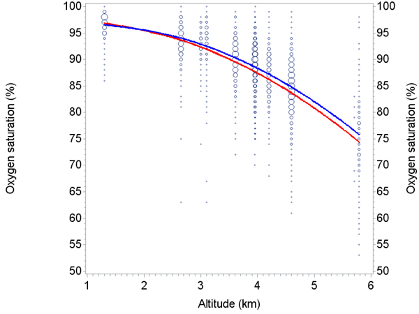
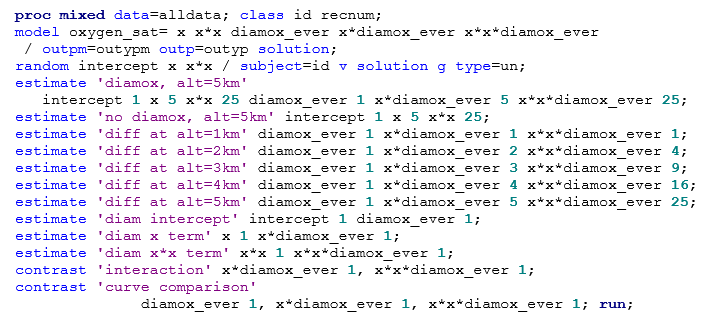
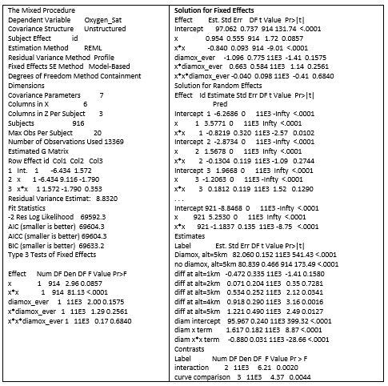
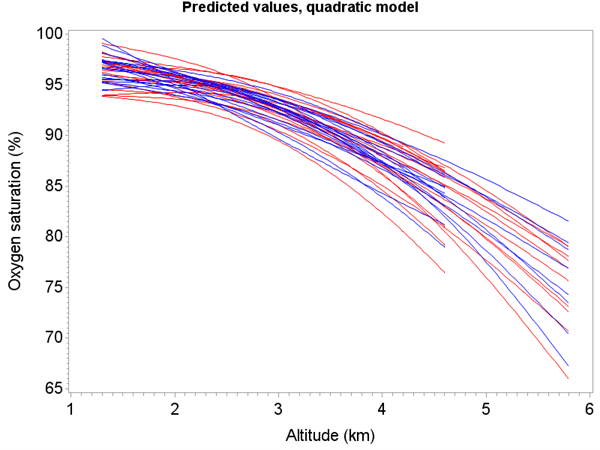
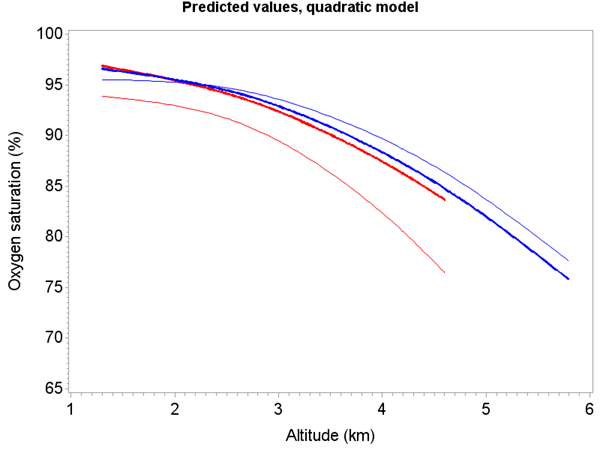

```{r setup, include=FALSE, cache=F, message=F, warning=F, results="hide"}
## setup directory
# setwd()
knitr::opts_chunk$set(cache = TRUE, echo = FALSE, message = FALSE, warning = FALSE)
knitr::opts_chunk$set(fig.height = 4, fig.width = 5, out.width = '50%', fig.align='center')
knitr::opts_chunk$set(fig.path = 'figs_L7/', cache.path = 'cache/')
```

# Random effect

## Topics for today:

- Inference for random effects in an LMM

- Modeling random effects in an LMM, with data

- Tests for variance components (brief)


\vspace{\baselineskip}

**Associated reading:**

1. Sections 3.3 and 4.1 of 'LMM:  inference' course notes)

2. Verbeke (with a focus on Ch. 7)

3. Hedeker (Chapters 4-7)


# Estimation

## Estimation and tests for random effects ($\pmb b$) 

- Although we can use ML or REML to estimate variance components, we may be interested in subject-specific random effect estimates.  

  - In particular, they may allow us to determine if there are subjects with unusual trends relative to the rest of the group.

  - These subject-specific estimates cannot be derived from the marginal model.

  - A common approach is to use empirical Bayes (EB) estimators.  EB estimators have an intuitive appeal since estimates are obtained essentially by taking a weighted average of personal and group-level data.  

##

### Example 1:  batting averages of Major League Baseball players.  

  - At the beginning of the season, averages tend to vary more wildly (between 0.000 and 1.000).

  - As more games are played, the averages tend to settle into range between 0.200 and 0.350.

  - An EB estimate for a particular player near the beginning of the season may use a higher weight for the 'all-player' average and a lower average for that particular player to estimate that player's true average; later in the season the average may be weighted more heavily towards that player's particular average.

##

### Example 2:  prevalence of a disease or illness for individual counties in a state.

  - Ideally, the best estimate of prevalence in a county would involve just the county data.

  - However, if collected data is sparse, then it might help to also base the estimate on state data as well.

  - The higher the variability in county data, the more the estimate is based on the state data, while the lower the variability in the county data, the more it is based on county data.


## Empirical Bayes (EB) estimators for random effects

In the Bayesian literature, the marginal distribution of $\pmb b$ is called the prior distribution of the parameters $\pmb b$ since it does not depend on the data $\pmb Y$.  Once observed values of $\pmb Y$ are obtained ($\pmb y$), the posterior distribution of b, which is $f(\pmb b|\pmb y)$, can be calculated.  Considering $\pmb b_i$ and $\pmb Y_i$ as the random effects and outcome data for individual $i$, the posterior distribution is:

$$
f(b_i|\pmb {Y_i = y_i}) = \frac {f(\pmb y_i |b_i)f(b_i))} {\int f(\pmb y_i|b_i) f(b_i) db_i}
$$


In the expression above, the dependence of the density function on certain components of $\pmb \theta$ is suppressed for notational convenience.  The mean of this posterior distribution is a Bayes estimator of $\pmb b_i$:

$$
\pmb {\hat b_i} (\pmb \theta) = E(b_i |\pmb Y_i = \pmb y_i)
=\int \pmb b_i f(\pmb b_i | \pmb y_i)d \pmb b_i 
= \pmb {G Z_i^{\top} V_i^{-1} (\alpha)} (\pmb {y}_i - \pmb {X}_i \pmb \beta) \ \ \ \ (6)
$$

##

The EB estimator is then computed by replacing unknown parameters $\pmb \alpha$ and $\pmb \beta$ with their ML or REML estimates (and hence the word 'empirical').  

We'll let $\pmb b_i (\pmb {\hat \theta})= \pmb {\hat b_i}$ denote the Empirical Bayes estimator.  For more detail, see **section 7.2 in Verbeke**. 
In terms of final notation, $\pmb b$ and $\pmb Y$ represent the vector of random effects and data, respectively, for the complete data, where data for subjects are stacked, while $\pmb b_i$ and $\pmb Y_i$ are the data for individual $i$.


## The EB estimators and shrinkage

Predicted values based on EB estimators for $\pmb b_i$ are a weighted average of subject-specific data and group-averaged data, giving it an intuitive appeal:

$$
\pmb {\hat Y_i}	= \pmb {X_i  \hat \beta} + \pmb {Z_i b_i}	= \pmb X_i \pmb {\hat \beta} + \pmb {Z_i GZ_i^{\top}V_i}^{-1} (\pmb {Y_i-X_i \beta})	
$$

\vspace{-5mm}

$$
= (\pmb I_{r_i}- \pmb {Z_i GZ_i^{\top} V_i^{-1}}) \pmb {X_i  \beta} + \pmb {Z_i GZ_i^{\top}V_i^{-1} Y_i} = \pmb {R_i V_i^{-1} X_i  \hat \beta} + (\pmb I_{r_i} - \pmb {R_i V_i}^{-1}) \pmb Y_i
$$

$(\pmb I_{r_i} - \pmb {R_i V_i}^{-1})$ is a weighted average of the estimated population average profile and the observed data.

This demonstrates that $\pmb {\hat Y_i}$ are shrunk towards the mean (relative to $\pmb Y_i$).  

##

When residual variability (modeled through $\pmb R_i$) is large in relation to between-subject variability (accounted for in $\pmb V_i^{-1}$), the population-averaged profile ($\pmb {X_i  \beta}$) will have more weight, which makes sense since there is less certainty about individual data.  (You can think of $\pmb R_i$ as the “numerator” and $\pmb V_i$ as the “denominator” in the quantity $\pmb {R_i V_i}^{-1}$.)

Alternatively, when residual (within-subject) variability tends to be smaller and between-subject variability greater, then $\pmb Y_i$ will have more weight.

The EB estimators themselves exhibit the shrinkage property:  $Var[\pmb {Lb}_i] \leq Var[\pmb {L\hat b}_i]$ for any $1 \times q$ real-valued vector $\pmb L$.  Remember also that $E[\pmb b_i] = 0$.  Thus the EB estimators are shrunk towards 0.  For more detail, see **Verbeke**.

## Inference associated with EB estimators

The quantity $Var[\pmb {\hat b}_i (\pmb \theta)]$ can be derived easily by substituting the MLE in for $\pmb \beta$ and noting that it is a linear form of $\pmb y_i$.  (Laird and Ware, 1982, consider the Bayes estimator as in (6), but with  $\pmb \beta$ replaced with its MLE; they then derive theoretical results when covariance parameters are known or unknown.)  The result is:

$$
Var[\pmb {\hat b}_i (\pmb \theta)] = \pmb {G_i Z^{\top}_i\Big(V_i^{-1}-V_i^{-1} X_i (\sum X_i^{\top}V_i^{-1} X_i)^{-1} X_i^{\top}V_i^{-1}\Big)Z_i G_i}
$$

- $Var[\pmb {\hat b}_i (\pmb \theta)]$ is not the same as  $Var[\pmb b_i |\pmb Y_i= \pmb y_i]$; it is $Var \Big[ E[\pmb b_i (\pmb \theta)|\pmb y_i]\Big]$. 

- For inference, $Var[\pmb {\hat b}_i (\pmb \theta) - \pmb b_i]$ is used rather than $Var[\pmb {\hat b}_i (\pmb \theta)]$ because the former take into account the variability in $\pmb b_i$.  This quantity is:
$Var[ \pmb {\hat b}_i (\pmb \theta)- \pmb b_i] = \pmb G_i - Var[ \pmb {\hat b}_i (\pmb \theta)] = \pmb G_i - \pmb {G_i Z_i^{\top}\Big({V_i^{-1}-V_i^{-1} X_i (\sum X_i^{\top}V_i^{-1} X_i)^{-1} X_i^{\top}V_i^{-1}}\Big)Z_i G_i}$


In order to estimate $Var[ \pmb {\hat b}_i (\pmb \theta)- \pmb b_i]$ we typically just 'plug in' numerical values for unknown $\pmb \theta$, not accounting for the added variability due to use of estimated values.  In light of this, the selection of DF can help control the accuracy of inferential results for random effects, similar to that described previously for inference of fixed effects.  

##

$t$-tests can be constructed for random effects using relevant approximate $t$ quantities.

- For example, if $\pmb b_i$ contains just a random intercept (i.e., $\pmb b_i= b_{0i}$) then we can use $t = \frac {(\hat b_{0i} - b_{0i}) - E[\hat b_{0i} - b_{0i}]} {\widehat {SE} (\hat b_{0i} - b_{0i})}$, which reduces to $t=\frac {{\hat b}_{0i}} {\widehat {SE} (\hat b_{0i} - b_{0i})}$ under the null, for the test of $H_0: b_{0i}=0$.  

- For models with multiple random effect terms, we can carry out $t$-tests separately for each component of $\pmb b_i$ (and subject).  As before, the DF ($\nu$) is ideally chosen to get the correct distribution of the test statistic under $H_0$; available methods to do this are as previously described. 
	
- Theory also exists for tests $H_0:  \pmb {Lb} = 0$ versus $H_1:  \pmb {Lb} \neq 0$.  However, in practice, I have not yet found the need to use this.

- A $100 \times (1 – \alpha) \%$ confidence interval for an element $b_{hi}$ of $b_i$, is $\hat b_{hi} \pm t_{\nu,\ \frac \alpha 2} \times \widehat {SE} (\hat b_{hi} - b_{hi})$.

##

In SAS, when you request a solution for the random effects, the 'Estimate' will be numerical versions of (6), while 'Std Err Pred' is the square root of (diagonal elements of) $Var[ \pmb {\hat b}_i (\pmb \theta) - \pmb b_i]$.  The calculated variance of the random effect estimates (using the 'population' version) will be the same as $\widehat {Var} [\pmb {\hat b}_i (\pmb \theta)]$ (here, the hat on 'Var' indicates that estimated values of $\pmb \theta$ are 'plugged into' the calculation) and will be somewhat less than $\sigma_b^2$, reflecting the shrinking of the estimates back to the estimated population mean.

## Computation of estimates and associated variances for random effects

**see course notes**


## Empirical Bayes estimators for LMMs with random intercepts

We have discussed Empirical Bayes estimators of random effects in mixed models.  They have an intuitive appeal because they can be expressed as weighted averages of subject-specific information and population-average information.

- The greater the variability of the subject data, the higher the weight is placed on the population average; 

- The more consistent the subject data is, the higher the weight is placed on the subject portion.

- In previous notes, the weighted average was expressed for predicted values ($\hat Y_i$) from an LMM.  
	
- It was briefly mentioned that the random effects estimates themselves ($\pmb {\hat b}_i$) are shrunk towards the population mean (relative to $\pmb b_i$), such that $Var[ \pmb {\hat b}_i ] \leq Var[\pmb b_i]$.
	
- The amount of shrinkage depends on residual variance relative to subject variance.  To study this further, we'll consider LMMs with random intercept terms.

##

It was mentioned that the random effects estimates ($\pmb {\hat b}_i$) are shrunk towards the population mean (relative to $\pmb b_i$), such that $Var[\pmb L \pmb {\hat b}_i] \leq Var[\pmb {Lb}_i ]$ for a $1 \times q$ real-valued vector $\pmb L$.

- A special case of this is $Var[{\hat b}_{hi}] \leq Var[b_{hi}]$, for $h = 1,\ ...\ ,\ q$. This is easy to prove, since $Var[ \pmb {\hat b}_i - \pmb b_i] + Var[\pmb {\hat b}_i] = \pmb G_i$ , and the diagonal elements must be nonnegative.
	
- The only time equality holds, such that $Var[\pmb {\hat b}_{hi}] = Var[b_{hi}]$, is when $Var[\pmb {\hat b}_{hi} - \pmb b_{hi}]=0$. The amount of shrinkage in estimators depends on residual variance relative to subject variance.  To study this further, we'll consider LMMs with random intercept terms.

##

If the only random term in the model is an intercept term (for subjects) and $\pmb R_i=\sigma^2 \pmb I$, (6) will reduce, since $\pmb G$ only has one element (the variance of the random intercepts, call it $\sigma_b^2$), and $\pmb Z_i^{\top}$ is a row vector of 1's, call it $\pmb J_{(1\times r)}$.  For this case:  

$$
\pmb V_i^{-1}=(\sigma_b^2 \pmb J_{(r_i\times r_i )}-\sigma_\epsilon^2 \pmb I_{(r_i\times r_i )} )^{-1}=
\frac 1 {\sigma _\epsilon^2} {\Big(\pmb I_{(r_i\times r_i )} - \frac {(\sigma_b^2)}{ (\sigma_\epsilon^2+r_i \sigma_b^2 )} \pmb J_{(r_i\times r_i )} \Big)}  
$$

Ultimately, the Bayes estimator reduces to:

$$ 
{\hat b}_i (\pmb \theta) = \lambda \Big(\bar Y_i - \frac {\sum_j \pmb X_{ij}^r \pmb \beta} {r_i}\Big) \ \ \ \ (7)
$$

- where ${\bar Y_i}$ is the mean response for subject $i$, $\pmb X_{ij}^r$ is the $j$th row of $\pmb X_i$, and $\lambda=\frac {r_i \sigma_b^2}  {\sigma_\epsilon^2+r_i \sigma_b^2}$.

Note that $\lambda$ is between 0 and 1; it is the weight used in the averaging of subject-specific and population average statistics.  (Note also that $u$ \alert {there is no u, and I have no idea} is unbolded since it involves just one estimator.) Greater between-subject variability relative to within-subject variability will yield larger values of $\lambda$ (just like the ICC), but so will increasing the number of repeated measures.  

##

For practice, show that (7) holds, starting with (6).  (You can use the given result for $\pmb V_i^{-1}$.)  When there is only a random intercept term and fixed intercept in the model [ $Y_{ij} = \beta_0 + b_i + \epsilon_{ij} $; $b_i \stackrel {iid} \sim \mathcal N(0,\ \sigma_b^2)$, independently of $\epsilon_{ij} \stackrel {iid} \sim \mathcal N (0,\ \sigma_{\epsilon}^2)$; call it the 'simple random intercept model'], (7) becomes $\pmb {\hat b}_i (\pmb \theta)=\lambda[\bar Y_i- \beta_0]\ \ \ \ \ (8)$


We can consider $\lambda$ as the shrinkage factor.  What is being shrunk is the difference between the estimate of the random intercept for subject $i$ and the population mean.  If we add the population mean,  $\beta_0$, we get the estimate for subject $i$ in context of the population:

$$
\lambda(\bar Y_i- \beta_0)+ \beta_0 = \lambda\bar Y_i+(1-\lambda) \beta_0\ \ \ \ \ (9)
$$
  which is a weighted average of $\pmb {\bar Y}_i$ and  $\beta_0$.

In practice we typically replace unknown parameters $\lambda$ (which involves $\sigma_b^2$ and $\sigma_\epsilon^2$) and  $\beta_0$ in (8) and (9) with their estimators, yielding EB estimators.

For the simple random intercept model, the variance of the Bayes estimator is

$$
Var[{\hat b}_i (\pmb \theta)]= \frac {n-1} n  \lambda \sigma_b^2\ \ \ \ \ (10)
$$


## Verify for practice.

As noted earlier, the variance quantity normally used in inference to account for randomness in $\pmb b_i$ is:

$$
Var[{\hat b}_i (\pmb \theta)-b_i]=\sigma_b^2 - Var[{\hat b}_i (\pmb \theta)] 
=\sigma_b^2 - \frac {n-1} n \lambda \sigma_b^2  = \frac {\big(1-\lambda (n-1)\big)} n	\sigma_b^2 \ \ \ \ (11)
$$

Since the variance of EB estimators is more difficult to tackle, we usually work with the variance quantities of the Bayes estimators, in (10) and (11).  But in practice we do then typically plug in values of unknown variances in the quantity, which I will denote as $\widehat Var[{\hat b}_i (\pmb \theta)]$ and $\widehat Var[{\hat b}_i (\pmb \theta)-b_i]$.           

For the random intercept model we know that $Var[{\hat b}_i (\pmb \theta)-b_i] + Var[{\hat b}_i (\pmb \theta)]=\sigma_b^2$ (more generally, that $Var[ \pmb {\hat b}_i (\pmb \theta)-b_i]+Var[ \pmb {\hat b}_i (\pmb \theta)]=\pmb G_i$).  For fixed variances, we know that $\lambda \rightarrow 1$ as the number of repeated measures, $r_i$ is increased (and also n), in which case $Var[{\hat b}_i (\pmb \theta)] \rightarrow \sigma_b^2$, and hence $Var[{\hat b}_i (\pmb \theta)-b_i]\rightarrow0$.


# The Mt. Kilimanjaro data  

## The Mt. Kilimanjar

- Oxygen saturation, or SAO2, can be measured as the percentage of hemoglobin molecules which are oxgenated (oxyhemoglobin) in arterial blood.

- The normal range is $> 95\%$, however at higher altitudes this percentage tends to go down.

-	This measure was taken on hundreds of subjects that climbed Mt. Kilimanjaro (the tallest mountain on the continent of Africa).

-	The following graph shows SAO2 versus altitude, along with a quadratic fit using a linear mixed model.

-	The bubble plot was used because many values occurred on the same $(x,\ y)$ location; bubbles indicate how many subjects occurred at each point, the bigger the bubble, the more subjects at that location.

## 

-	Although these are repeated measures data, lines connect points are suppressed due to the large amount of data.

-	Superimposed on the bubble plot are two curves, one showing subjects that were taking a medication to help prevent symptoms of high-altitude sickness (blue), and those that were not (not).

-	Those taking the medication are able to maintain slightly higher oxygen levels (which may also help reduce symptoms of high altitude sickness), with greater differences at higher altitudes.

-	These differences are statistically significant after about 3km, but it may be somewhat subjective as to whether the small differences as worth taking the medication.

##

```{r "mtk", echo=FALSE, out.width="60%"}

```

The bubble plot was generated by using the 'bubble' statement in PROC GPLOT.  I then overlayed the fitted curves from the fitted linear mixed model in a subsequent 'plot2' statement.

##

Below is the SAS code used to fit the mixed model:

```{r "mtk sas", echo=FALSE, out.width="60%"}

```

## Abbreviated output:

```{r "mtk res", echo=FALSE, out.width="60%"}

```

## Some interesting things to point out from the output:  

The variance of the intercept was estimated to be 0.  However, no penalty was added for this in the AIC; essentially, that parameter is removed from the model.  You can tell this is the case because the difference between $-2 log\ (Restriced\ Likelihood)$ and the AIC is 12, so 6 parameters are accounted for (5 in $\pmb G$ matrix, plus residual variance).

Notice also that subject estimates of intercept and some linear terms have predicted standard errors of 0; our interpretation should be that these standard errors could not be estimated, rather than that they were true 0's.

Estimates included demonstrate that although differences between medication users and non-users appeared to be minor, visually, they were statistically significant, with greater significance at higher elevations.

The contrasts indicate that there were differences between curves that could not be accounted for by intercept differences alone (see 'interaction' test, $p=0.0020$), and that the curves were not the same (including both 'interaction' and y-intercept differences, $p=0.0044$).


##

```{r "mtk3", echo=FALSE, out.width="60%"}

```

The graph above shows predicted values for subjects, from the mixed model, using only 20 per group (no medication – red / medication – blue) are plotted.  Differences for subjects are due to the use of the intercept, linear and quadratic random effect terms.  Notice that the predicted curves tend to fan out at higher altitudes, just like the raw data.
 

##

```{r "mtk4", echo=FALSE, out.width="60%"}

```

This graph shows population-averaged estimates (thick red and blue) and two subject curves (thin red and blue:  see subject ID's 1 (red) and 2 (blue) on previous SAS output.

Recall that random effect estimates are deviations from fixed effect estimates.  Notice how the red subject curve has much greater curvature than the thick red curve, compared with the thin and thick blue lines.  This is echoed in the tests on the previous output, where the $t$-tests indicate that subject 1 has significant difference in quadratic effect compared with its population counterpart ($p=0.0102$), while the blue does not ($0.2744$).

Both subject curves have lower intercepts and higher coefficients for the first order term, although we are unable to conduct tests to see if they are significantly different than population counterparts, since SEs could not be determined.  Accounting for serial correlation in the data improves the fit even more.  This will be discussed more in the following sections.


# Tests for variance components

## Tests for variance components

We can use 'COVTEST' as an option in the PROC MIXED statement for tests involving covariance parameters, using Wald $Z$ tests.

We can also test for a 'significant additions' of random terms to a model (e.g., when including the random slope to an LMM with a random intercept) using likelihood ratio test methods.  Here we compare changes in $–2ln(\mathcal L)$ between models, which has an asymptotic $\chi^2$ distribution with DF = difference in the number of covariance parameters between the 2 models.  

For both approaches, tests are more valid when certain regularity conditions hold.  See **Verbeke, pages 64-66** for more detail.

# Summary

## Summary
