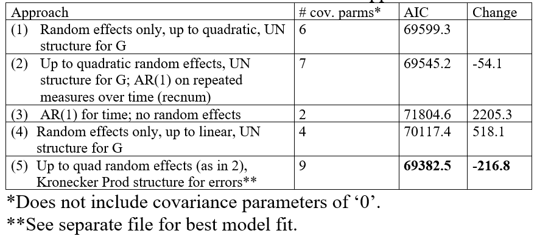
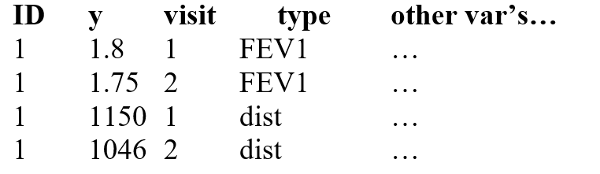
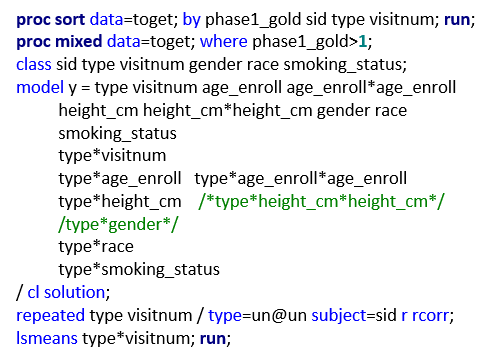
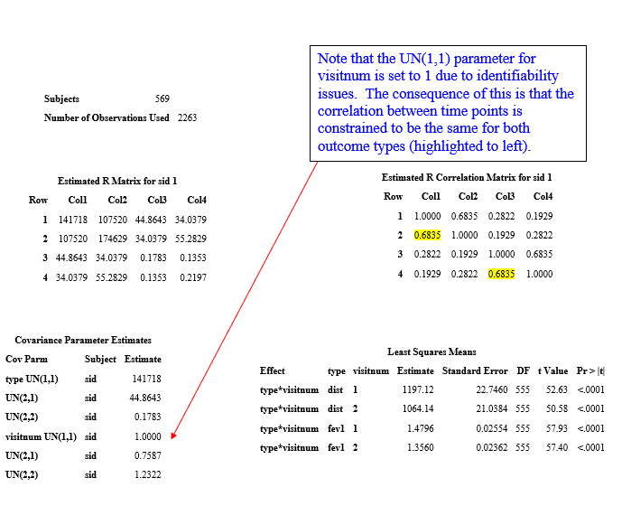
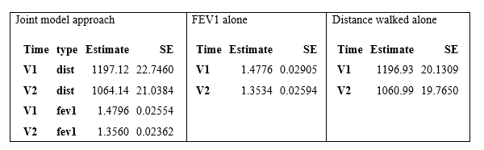

```{r setup, include=FALSE, cache=F, message=F, warning=F, results="hide"}
## setup directory
# setwd()
knitr::opts_chunk$set(cache = TRUE, echo = FALSE, message = FALSE, warning = FALSE)
knitr::opts_chunk$set(fig.height = 4, fig.width = 5, out.width = '50%', fig.align='center')
knitr::opts_chunk$set(fig.path = 'figs_L8/', cache.path = 'cache/')
```

# Covariance Structure

## Topics for today (Advanced covariance structures):

- Recap from last lecture:  Mt. K data and fit with random effects; some unusual results:  non-positive definite G; partial random effect results; model still usable?

-	Quick review of $\pmb R$ structures, up to Kronecker Product

-	Modeling $\pmb G$ and $\pmb R$ simultaneously

-	Another look at Mt. K data, several modeling approaches.

-	Fitting a joint normal outcome using a mixed model!

\vspace{\baselineskip}

**Reading:  Relevant sections from the LMM course notes.**

## Recap of $R_i$ structures for, say, 4 measures

- Simple

\vspace{\baselineskip}
\vspace{\baselineskip}

-	CS

\vspace{\baselineskip}
\vspace{\baselineskip}

- UN

\vspace{\baselineskip}
\vspace{\baselineskip}

-	AR(1)

\vspace{\baselineskip}
\vspace{\baselineskip}

-	Spatial power

\vspace{\baselineskip}
\vspace{\baselineskip}

Many others, but the above are ones I most commonly use.	For 'CS', I usually just a random intercept, in which case you don't need to additionally specify CS for the $\pmb R$ structure.

# Kronecker Product

## Kronecker Product

Modeling doubly repeated measures via the error covariance (R) matrix using the Direct Product (Kronecker) structure

-	For some data sets, we may need to account for repeated measures over two dimensions.

-	For example, say that strength measurements are taken on each leg for subjects over 3 time points.  There are 2 'repeated measures' in space (i.e., body part) as well as 3 repeated measures over time.  

-	The covariance matrix to account for all repeated measures would then have size $6 \times 6$.

-	Instead of dealing with this big messy matrix, it is easier to define it in pieces and then take the Kronecker product.

## 

### **Example 1**:  

For the scenario described above, say that repeated measures over space can be modeled with the UN structure and repeated measures over time can be modeled with the AR(1) structure:

Structure for space: 
$$
R_{i1} = 
\begin{pmatrix}
\sigma_1^2\ \sigma_{12}\\
\sigma_{12}\ \sigma_2^2 	
\end{pmatrix}
$$


Structure for time:  

$$
R_{i2} = \sigma_\epsilon^2
\begin{pmatrix} 
1 \ \ \phi \ \ \phi^2 \\
\phi \ \ 1 \ \ \phi \\
\phi^2 \ \ \phi \ \ 1
\end{pmatrix}
$$

##

The combined (Kronecker product structure):

### **Example 1**

$$
R_i = R_{i1}\otimes R_{i2} =
\begin{pmatrix}
\sigma_1^2 \ \ \sigma_{12}\\ 
\sigma_{12}\ \ \sigma_2^2 
\end{pmatrix}
\otimes \sigma_\epsilon^2 
\begin{pmatrix}
1 \ \ \phi \ \ \phi^2 \\
\phi \ \ 1 \ \ \phi \\
\phi^2 \ \ \phi \ \ 1
\end{pmatrix}
=\begin{pmatrix}
\sigma_1^2 R_{i2} \ \ \sigma_{12}  R_{i2} \\ 
\sigma_{12}  R_{i2} \ \ \sigma_2^2 R_{i2} 
\end{pmatrix}
$$

$$ 
= \begin{pmatrix}
\sigma_1^2
\begin{pmatrix}
 1 \ \ \phi \ \ \phi^2 \\ 
 \phi \ \ 1 \ \ \phi \\ 
 \phi^2 \ \ \phi \ \ 1
\end{pmatrix}
\ \ \ \
\sigma_{12} 
\begin{pmatrix}
 1 \ \ \phi \ \ \phi^2 \\ 
 \phi \ \ 1 \ \ \phi \\ 
 \phi^2 \ \ \phi \ \ 1
\end{pmatrix}\\
\sigma_{12}
\begin{pmatrix}
 1 \ \ \phi \ \ \phi^2 \\ 
 \phi \ \ 1 \ \ \phi \\ 
 \phi^2 \ \ \phi \ \ 1
\end{pmatrix}
\ \ \ \
\sigma_2^2 
\begin{pmatrix}
 1 \ \ \phi \ \ \phi^2 \\ 
 \phi \ \ 1 \ \ \phi \\ 
 \phi^2 \ \ \phi \ \ 1
\end{pmatrix}
\end{pmatrix}
$$

$$
= \begin{pmatrix}
\sigma_1^2 \ \ \ \ \sigma_1^2 \phi \ \ \ \ \sigma_1^2 \phi^2  \ \ \ \ \sigma_{12}\ \ \ \ \sigma_{12}\phi \ \ \ \ \sigma_{12}\phi^2 \\ 
\sigma_1^2 \phi \ \ \ \ \sigma_1^2 \ \ \ \ \sigma_1^2 \phi \ \ \ \ \sigma_{12}\phi \ \ \ \ \sigma_{12}\ \ \ \ \sigma_{12}\phi \\ 
\sigma_1^2 \phi^2 \ \ \ \ \sigma_1^2 \phi \ \ \ \ \sigma_1^2 \ \ \ \ \sigma_{12}\phi^2 \ \ \ \ \ \sigma_{12}\phi \ \ \ \ \sigma_{12}\\ 
\sigma_{12}\ \ \ \ \sigma_{12}\phi \ \ \ \ \sigma_{12}\phi^2 \ \ \ \ \sigma_2^2 \ \ \ \ \sigma_2^2 \phi \ \ \ \ \sigma_2^2 \phi^2 \\ 
\sigma_{12}\phi \ \ \ \ \sigma_{12}\ \ \ \ \sigma_{12}\phi \ \ \ \ \sigma_2^2 \phi \ \ \ \ \sigma_2^2 \ \ \ \ \sigma_2^2 \phi \\ 
\sigma_{12}\phi^2 \ \ \ \ \sigma_{12}\phi \ \ \ \ \sigma_{12}\ \ \ \ \sigma_2^2 \phi^2 \ \ \ \ \sigma_2^2 \phi \ \ \ \ \sigma_2^2
\end{pmatrix} 
$$

##

Note:  the $\sigma_\epsilon^2$ on the AR(1) structure is not included because it becomes redundant once we take the direct product, i.e., it is absorbed into parameters in the other matrix.  Available Kronecker structures in SAS include:  $UN @ AR(1)$, $UN @ CS$ and $UN @ UN$.  (The symbol '$@$' is used to denote '$\otimes$' since the latter is not on the keyboard!)


### **Example 2**

Measuring cortisol 3 times a day, for 7 successive days.

\vspace{\baselineskip}
\vspace{\baselineskip}
\vspace{\baselineskip}
\vspace{\baselineskip}
\vspace{\baselineskip}
\vspace{\baselineskip}
\vspace{\baselineskip}
\vspace{\baselineskip}
\vspace{\baselineskip}
\vspace{\baselineskip}


## Some things to remember about covariance matrices in mixed models:

- $Cov[\pmb Y]$ or $Var[\pmb Y] = \pmb V = \pmb {ZGZ}^{\top} + \pmb R$ 

- If no random effects, then $Cov[\pmb Y] = Cov[\pmb \epsilon]$, i.e., $\pmb V= \pmb R$.

-	Since the $Cov[\pmb Y]$ is of primary interest, this formula suggests there are different ways to account for correlated data, through $\pmb R$ (the covariance matrix of the errors), through $\pmb G$ (The covariance matrix of random effects) or both.

## Putting it together:  

Specifying $\pmb G$ and $\pmb R$ in the same model

-	So far we've discussed how you can either specify $\pmb G$ or $\pmb R$ in fitting a mixed model.  However, you can actually do both, which may be advantageous for some data.

-	Recall the Mt. Kilimanjaro data.  By including up to quadratic random effects, we can actually develop an altitude-sensitive covariance structure that allows the correlation to decrease as altitude between measurements increases.  (Altitude and time are closely related.)

-	We can also directly model the repeated measures through $\pmb R$.  (Although repeated measures are not likely to be exactly equally spaced, we do not have exact times of measurement, so the AR(1) will have to do.) or, we can do both!

# Mt. K data

## 

Quick aside:  what do Mt. K data look like?  ($x = altitude, km$)

```{r "mtk", echo=FALSE, out.width="100%"}
knitr::include_graphics('figs_L8/f1.png')
```


## Modeling approaches for Mt. K data:

- Approach 1:  random + simple $\pmb R$ (i.e., $R=\sigma^2 \pmb I$).

  - We did this already (see last slide set).
  - AIC=69599.3
	- Correlation parameter estimate is $\sim$ 0.08 (estimated correlation between two errors 0.5 day apart, not responses).

-	Approach 2:  random + AR(1) structure for R.  

  - AIC=69545.2 (54 point drop).  Both $\pmb G$ and $\pmb R$ contribute to the covariance structure: $\pmb V=Var[\pmb Y]=\pmb {ZGZ}^{\top} + \pmb R$.

```{r "mtk sas", echo=FALSE, out.width="70%"}
knitr::include_graphics('figs_L8/f2.png')
```


## Some other possibilities:

-	Approach 3:  Remove RANDOM statement so that $\pmb V= \pmb R$.

	- The estimated correlation parameter (which now does represent the correlation between responses 0.5 day apart) in the structure increases to $\sim$ 0.44.  

	- This is because the random effects no longer contribute to the covariance between 2 responses, I.e., to get roughly the same covariance between 2 responses, the contribution from $\pmb R$ needs to increase since there is no longer a contribution from $\pmb {ZGZ}^{\top}$.
	
	- AIC increases A LOT.

- Approach 4:  Up to linear random effects, simple R.

  - AIC also high

- Approach 5:  Quadratic random effects plus Kronecker Product structure for errors.  

  - Really complicated model!  But AIC good.  
  
  - Model makes intuitive sense.

## AIC values for different covariance structure approaches.  

```{r "mtk aic", echo=FALSE, out.width="70%"}

```

In comparing AIC, make sure same number of records used! For these fits, $n=13,368$ used (1 missing value due to loss of info in am_pm and day variables)

##

For applications in which the random effects are defined on time rather some other variable (such as altitude, above), including a non-simple structure for time via $\pmb R$ may still improve the model fit.

- For example, an outcome for which there is substantial between-subject heterogeneity (not accounted for in the predictors), but with repeated measures over time might require a random intercept plus an AR(1) structure for $\pmb R$.

- Generally, it is recommended to first narrow the list of possible covariance structures, followed by a comparison of goodness-of-fit values for these possibilities.


# Fitting joint normal outcomes using mixed models

## Fitting joint normal outcomes using mixed models

-	Let's say we have 2 outcomes with different units, and measurements over time for each of these. Can we use mixed models in this case?  Sure, but proceed with caution!

- For simplicity, consider the COPDGene data, which has 2 measurements taken on subjects with COPD (GOLD groups 2 through 4) that are about 5 years apart.  The 2 outcomes to be considered are FEV1 (a pulmonary function measure) and distance walked (an exercise ability measure).  

- The original data set has FEV1 and distance walked in separate columns.  In order to fit the model, we need to create a new, composite variable, call it y, and then create a variable, call it type, to identify when y is FEV1 and when y is distance walked (dist for short)  

```{r "fev", echo=FALSE, out.width="50%"}

```

##

-	FEV1 is measured in liters, and is usally around 1 to 3, while distance walked is in feet, for a 6-minte time frame and is usually over 1000.

The SAS code to fit the model:

```{r "fev sas", echo=FALSE, out.width="100%"}

```

##

- Ideally the list of covariates (i.e., terms other than type or visitnum) should include variables that are important to either FEV1 or distance walked.  Also, I started with a model that included all possible interactions between type and other covariates; I later dropped $type \times height^2$ and $type \times gender$ due to very weak significance.  The $visitnum \times type$ term is important to keep in the model, regardless of significance.

- It is important to remember that if we drop a particular $type \times covariate$ interaction, then we're assuming the relationship between that covariate and FEV1 can share the same slope as for the covariate and distance walked.  When the units between the outcome types differ, this may be a tall order, and is why I start with a model that includes all possible interactions.


## Selected output:

```{r "fev res", echo=FALSE, out.width="100%"}

```


##

-	If we fit FEV1 and distance walked in separate model, the correlation between time points for FEV1 is 0.82 and for dist is 0.55; this explains the 'pooled' correlation of 0.68 when modeling the outcomes jointly.

-	Least-squares means estimates and SE's are similar when running individually as when running jointly.  The joint model has slightly higher SE's for distance walked and slightly lower SE's for FEV1 due to model constraints.


```{r "fev2", echo=FALSE, out.width="100%"}

```

# Some notes

## Notes

-	The major advantage of running models with FEV1 and distance walked together is to better understand correlation between them, while simultaneously conducting inference for effects of interest, which is how the outcomes change over time.

-	If the two outcomes being measured actually have the same units, then it may simplify the model, with respect to both the necessary predictors (including interaction terms) and the suitable covariance structure.

-	For outcomes that are measured in different units, an alternative to modeling them in raw units is to standardize the outcomes in some fashion, which might simplify the necessary predictors and interaction terms.  For example, FEV1 is sometimes put into 'percent of predicted' terms based on age, height gender and race (in some cases using squared terms for continuous variables).  If a similar approach is used for distance walked, then the list of predictors reduces to type and visit (and their interaction).

-	We could try the UN structure for the complete list of repeated measures.  This would introduce 10 covariance parameters; a very flexible matrix but harder to fit and possibly introduces more parameters than necessary.  In the case of the data above, it did not converge.

# Summary

## Summary
