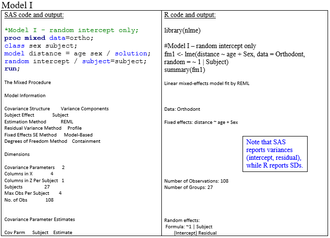
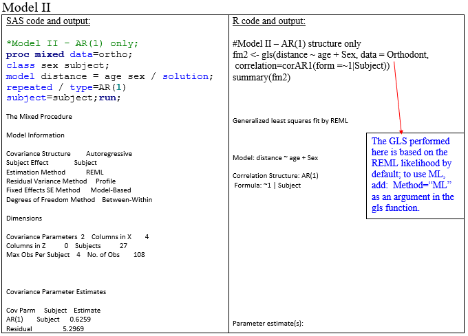
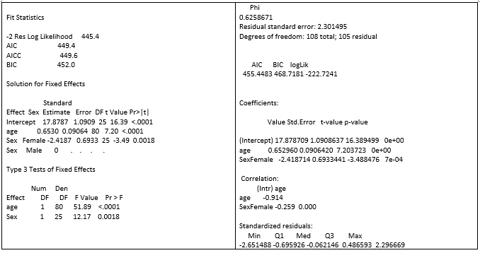
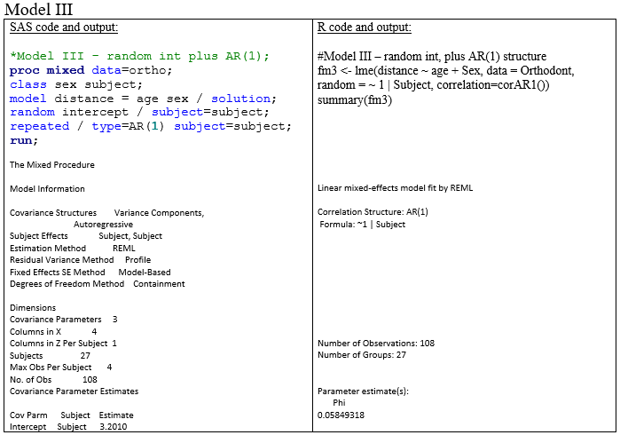
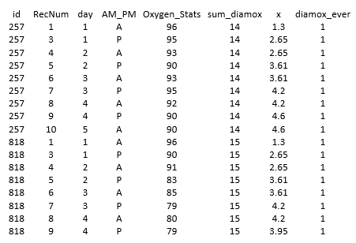

\newcommand{\textcm}{\textcolor{magenta}}

```{r setup, include=FALSE, cache=F, message=F, warning=F, results="hide"}
## setup directory
# setwd()
knitr::opts_chunk$set(cache = TRUE, echo = FALSE, message = FALSE, warning = FALSE)
knitr::opts_chunk$set(fig.height = 4, fig.width = 5, out.width = '70%', fig.align='center')
knitr::opts_chunk$set(fig.path = 'figs_L09/')
library(nlme)
```

# Software 

## Topics for this lecture:

- LMM specifying both G and R 

- 

- Computation methods for LMMs

- Convergence issues, warnings and unusual estimates in SAS, PROC MIXED 

- PA vs SS models discuss just before moving to GLMM

\vspace{\baselineskip}

- **Associated reading: LMM: software and computational issues chapter**

- Section 5.4 (Model Fitting Procedures) of Verbeke

## A Comparison of SAS versus R for fitting LMMs

There are two common packages with functions that fixed mixed models in \textcm{R:  lme4 and nlme}.  

  - The \textcm{lme4 package has a function called lmer} (stands for linear mixed-effect regression model).  This function will handle many different types of \textcm{random effects ($\pmb G$)} but does not allow for modeling of non-simple error covariance structures.  However, you can fit generalized linear mixed models using the glmer function. 
  - The \textcm{nlme package has the lme function} that allows for modeling of \textcm{both $\pmb G$ and $\pmb R$} matrices, although it cannot handle some more complex models very easily.

In this section we first look at a crossed random effect model using the lmer function from lme4, and then consider different covariance modeling approaches using the lme function.

## Rater and subject data and the lmer function

Consider data on 4 judges (or raters) each rated 6 subjects.  We may consider a model that uses subject and rater as crossed random effects.  In notes this has been referred to as 'Approach 1'.

$Y_{ij}=\mu +b_{iS}+b_{jR}+\epsilon_{ij}$, where $i$ denotes subject and $j$ denotes judge;

$b_{iS} \sim \mathcal N(0,\  \sigma_S^2),\ b_{jR} \sim \mathcal N(0,\  \sigma_R^2),\ \epsilon_{ij} \sim \mathcal N(0,\  \sigma_\epsilon^2)$, all independent.

##

Below is the SAS approach on the left, with the equivalent \textcm{R approach} on the right.

```{r echo=FALSE, , out.width="110%"}
knitr::include_graphics('figs_L9/f1.png')
```

#### Dental data examples employ the \textcm{lme} function within the nlme package.

Data set:  sample data from R, *Orthodont* (included with package nlme).  

  - Four variables:  DISTANCE, AGE, SUBJECT, SEX.  
  - There are 4 measures on 27 subjects, at ages 8, 10, 12 and 14.  
  - The primary outcome is DISTANCE.  The data is in 'data.frame' form.
```{r echo=FALSE, , out.width="90%"}
head(Orthodont,3)
```

Estimation method used here: REML.

### Computational methods:  
- SAS generally uses Newton-Raphson Ridge regression. 
- R states uses \textcm{Newton-Raphson and EM Algorithms} (Lindstrom and Bates (1988, JASA))


## Degrees of freedom:  

The method for selecting denominator degrees of freedom \textcm{in SAS depends on whether a RANDOM or REPEATED} (or both) are included.

- For the given data and code, if there is a RANDOM statement, the 'containment' method is used (whether or not a REPEATED statement is used).

- If there is a REPEATED but no RANDOM statement, then the 'between-within' method is used.

- The DDFM option in the MODEL statement can be used to specify the DDF method, there are about 5 to choose from.


## There is no mention in R about DDF

- For the fixed effects other than intercept, the DDF appears to be like that of the 'between-within' method for the LME function.

- The intercept DDF is different than that of any method in SAS.

- For the *gls* function (*nlme* package), R appears to use the 'residual' method for DDF (since you get the same p-values in SAS when you specify DDFM=residual for Model II, and the Residual DDF is mentioned at the end of the R output).


## 

Three models fit:  

- random intercept only

- AR(1) structure only

- random intercept plus AR(1).

For models using \textcm{random terms}, the \textcm{lme} function can be used; for those without random terms but a specified \textcm{R matrix} (such as AR(1)), the *gls* function (generalized least squares) will fit the model. 

## Model I

```{r echo=FALSE}

knitr::include_graphics('figs_L9/f3.png')
```

## Model II

```{r echo=FALSE}


```

## Model III

```{r echo=FALSE}

knitr::include_graphics('figs_L9/f7.png')
```

# More detail regarding computational methods for LMM

## Starting values for alpha parameters

- For a numerical technique such as Newton-Raphson Ridge regression (which SAS uses in PROC MIXED), you need \textcm{starting values for the $\pmb \alpha$  parameters}.

- You can either specify these starting values using the PARMS statement in PROC MIXED, or use the \textcm{default}, which is to use the MIVQUE0 estimator values.  MIVQUE0 is actually a method that can be specified as an estimation method in the PROC MIXED statement (PROC MIXED METHOD=MIVQUE0;).  This is typically not done.

- \textcm{MIVQUE0} performs minimum variance quadratic unbiased estimation of the covariance parameters, which is a form of method of moments estimation, and it does not require an iterative method.  However, simulations have shown that REML and ML are more accurate.

- Nevertheless, since MIVQUE0 is based on algebraic forms and does not rely on numerical analysis, it may be useful for extremely large data sets.

## Algorithms to perform ML, REML estimation

- In fitting an LMM, \textcm{a ridge-stabilized Newton-Raphson algorithm is commonly used} (e.g., in SAS) to maximize the likelihood with respect to the \textcm{$\pmb \alpha$}  parameters.  (Estimates of $\pmb \beta$ can then be found in closed form.)

- There are other computational methods that can be used to fit an LMM, including the \textcm{expectation maximization (EM) algorithm, or Fisher's Scoring method}.  

- The EM algorithm may be useful in fitting more complex LMMs such as **heterogeneity models** that allow for random terms that have non-normal distributions.  
  - The non-normal distributions can be constructed using a mixture of normals (see Verbeke, 2000).

## 

The NR algorithm may not yield convergence for such models due to their complexity.  The EM algorithm, which is particularly useful for ML estimation when \textcm{missing data} are involved.  The \textcm{"E step"} is the expectation step; the \textcm{"M step"} is the maximization step.  The basic steps of the EM algorithm are as follows.

1. Obtain starting values of the parameters, call it $\theta^{(1)}$.

2. *The E step*:  Let $y^0$ denote the observed data and let $\theta^{(t)}$ denote the current value of the parameter vector theta (t=1 the first time through).  Determine \textcm{$E[L(\theta |y)\ |\ y^0,\ \theta ^{(t)}]$}

3. *The M step*:  Determine $\pmb \theta^{(t)}$ that \textcm{maximizes $E[L(\theta |y)\ |\ y^0,\ \theta ^{(t)}]$}.

4. Repeat steps (ii) and (iii) until convergence.

##

- The \textcm{EM algorithm typically has a slow rate of convergence}.  Also, it is more likely to converge at a local maximum instead of global, making precision of estimates more uncertain.

- It is for these reasons that the Newton-Raphson or Fisher Scoring algorithms are preferred.  

- On the other hand, direct likelihood maximization techniques may have convergence problems for more complex models.  In such cases, the EM can be considered.

- While the \textcm{NR algorithm} uses the Hessian or observed information matrix (the matrix of second-order derivatives of the log-likelihood function), \textcm{Fisher's Scoring method} uses the expected information matrix, or expected Hessian matrix.

- It is possible to start the numerical optimization using Fisher's Scoring method for a certain number of iterations, and then switch over to the NR method.

##

- In *PROC MIXED*, including *SCORING<=number>* will tell SAS to use \textcm{Fisher's Scoring Method up to the specified number}, after which the NR algorithm will be used.  For more detail, see Verbeke (2000) and the SAS Help Documentation.

- Some other facts about \textcm{Fisher's Scoring Method}

  - Yields equivalent results as 'Iteratively Reweighted Least Squares'.  

  - Often used to maximize Generalized linear model (GzLM) likelihoods, although the default in *PROC GENMOD* is once again the NR algorithm (see SAS Help Documentation).

For more use of NR, EM or Fisher's Scoring method to achieve numerical ML or REML estimates, see Verbeke (2000).


# Convergence issues, warnings and unusual estimates in SAS, PROC MIXED

## Convergence issues, warnings and unusual estimates

- Sometimes when fitting a linear mixed model with data you will have \textcm{convergence issues}.  That is, the iterative numerical method used to maximize the likelihood or restricted likelihood fails to meet convergence criteria so that estimates cannot be obtained.

- In other cases, you may get estimates or a partial set of estimates but you will get a warning that a problem occurred, such as a 'non-positive definite' matrix.

- Here, we focus on PROC MIXED, although many of the same issues will face other software that you use to fit LMMs.


## Fail-to-converge issues

- SAS Help Documentation indicates that some reasons for non-convergence of the Newton-Raphson algorithm include \textcm{flat or ridged likelihood surfaces, model misspecification or a violation of the normality assumption}.

- From my experience, most of the non-convergence issues may be alleviated once the model is \textcm{simplified}, and thus some issues may be attributed to model specification.

- If you do have \textcm{extremely non-normal data}, then you really should deal with that up front by either transforming the data so that it is more normally distributed (if possible), using a model suitable for the distribution, or identifying \textcm{outliers} that may be causing problems and run analyses without them.  (However, I am not encouraging you to just drop the data altogether). 

##

- Ideally, if the \textcm{outlying} points are real, then you want to perform analyses with and without the points; but if the model cannot handle the points, then some type of adjust may need to be made in order to perform analyses 'with them'.  Or, at the very least, report the values that you were not able to fit. 

- SAS states that "It is also possible for *PROC MIXED* to converge to a point that is \textcm{not the global optimum} of the likelihood, although this usually occurs only with the spatial covariance structures."

- SAS lists several \textcm{steps that can be taken in order to try to get the model to converge} if at first you do not succeed.  
  - Many of these steps include specifying options in the optimization routine.  
  - For more details, see 'Convergence Problems' within the 'Computational Issues' page in the *MIXED* documentation. 

## Unusual estimates for covariance parameters

- We know that variances should be non-negative, and that correlations should be between -1 and +1.  The optimization routines that carry out likelihood maximization in PROC MIXED employ these \textcm{constraints}.

- It is not that uncommon to see a \textcm{variance estimate of 0}.  In terms of numerical quantities, the actual estimate would be 0 or even negative, but since there is a constraint that the variance must be nonnegative, the estimate is 0.
  - In practical terms, I take this to mean that based on the specified model, there is \textcm{no detectable variance} for the associated random effect.  
  - Note, however, that it is possible that the variance for the same random effect is positive (but not necessarily significant) if other parts of the model are changed.  That's why it is important to interpret effects in relation to the model as a whole.

##

- By default, \textcm{covariance parameters are constrained} in PROC MIXED optimization.  Variances are not allowed to be negative, and correlations cannot have an absolute value that exceeds 1.

- When you do obtain a covariance parameter estimate that is on the \textcm{boundary}, it suggests that the estimate using unconstrained optimization would be out-of-bounds.

  - For example, using the fitting an AR(1) structure for subjects as well as including a random intercept for the Ramus data yields an estimate of 0 for the variance associated with the random intercept.  
  - If you then include the *NOBOUND* option in the *PROC MIXED* statement (no slash between them), the variance estimate is a \textcm{small negative number}.

- However, note that doing an \textcm{unconstrained optimization} and then setting the violating estimate to 0 will yield different estimates for other parameters in the model, relative to the constrained optimization.

## Non-positive definite matrices

- A matrix $\pmb M$ is \textcm{positive definite} is for any $1 \times n$ real-valued vector $\pmb z$, $\pmb {zMz}^{\top} > 0$, and $\pmb M$ is symmetric.  
  - By definition, covariance matrices are required to be positive definite.  
  - However, when fitting models, sometimes this requirement is not attained, which will either yield a warning, error or 'note' message.

- A message that $\pmb G$ is not positive definite often occurs when a \textcm{variance parameter is estimated to be 0}. 
    - If the associated random effect term is removed from the model or the model is simplified in some way, then the message is likely to go away.  
    - Although having a non-positive definite fitted $\pmb G$ is not desirable, we should keep in mind that our ultimate goal is to have a realistic fitted $\pmb V$ matrix.

##

Recent runs with **SAS** on some of my data have only given me a 'note' that \textcm{$\pmb G$ was not positive definite}, and essentially removed this parameter from the model as it was not penalized for in the AIC.  

  - In addition, the fitted $\pmb V$ matrices did seem reasonable.  
  - Thus, if direct interpretation or inference related to this parameter are not needed and the covariance structure is essentially done to account to properly handle the correlated data, then using the model with a \textcm{'0' variance in $\pmb G$ may be of practical use}.  
  - Still, I would probably search for a decent \textcm{comparable model} for which all covariance parameters met model assumptions.

- You may see a warning or error when the \textcm{Hessian matrix} (matrix of 2nd order derivatives of the log likelihood function), $\pmb R$ matrix or $\pmb V$ matrix \textcm{is non-positive-definite}.  

  - This might occur if there are problems with the data, such as accidentally having multiple records for a subject for the same time of measurement.  

##

Direct quote from SAS Help Documentation: "An \textcm{infinite likelihood} during the iteration process means that the Newton-Raphson algorithm has stepped into a region where either the $\pmb R$ or $\pmb V$ matrix is \textcm{nonpositive definite}.  

  - This is usually \textcm{no cause for concern as long as iterations continue}.  
  - If *PROC MIXED* stops because of an infinite likelihood, recheck your model to make sure that no observations from the same subject are producing identical rows in $\pmb R$ or $\pmb V$ and that you have enough data to estimate the particular covariance structure you have selected. 
  - Any time that the \textcm{final estimated likelihood is infinite}, subsequent results should be interpreted with caution."

SAS also states that non-positive definite Hessian matrices can occur with surface saddlepoints or linear dependencies among the parameters. 


- From SAS documentation: "For some data sets the final estimate of a parameter might equal one of its boundary constraints. This is usually not a cause for concern, but it might lead you to consider a different model. For instance, a variance component estimate can equal zero; in this case, you might want to drop the corresponding random effect from the model."


## Specifying $\pmb G$ and $\pmb R$ in the same model:   
## Putting it together:  

Specifying $\pmb G$ and $\pmb R$ in the same model

-	So far we've discussed how one can either specify $\pmb G$ or $\pmb R$ in fitting a mixed model.  However, you can actually do both, which may be advantageous for some data.

-	Recall the \textcm{Mt. Kilimanjaro data}.  By including up to quadratic random effects, we can actually develop an altitude-sensitive covariance structure that allows the correlation to decrease as altitude between measurements increases.  (Altitude and time are closely related.)

-	We can also directly model the repeated measures through $\pmb R$.  
  - Although repeated measures are not likely to be exactly equally spaced, we do not have exact times of measurement, so the AR(1) will have to do.
  - Can model both $\pmb G$ or $\pmb R$!

# Mt. K data

## 

Quick aside:  what do Mt. K data look like?  ($x =$ *altitude, km*)

```{r "mtk", echo=FALSE, out.width="80%"}

```


## Modeling approaches for Mt. K data:

- \textcm{Approach 1}:  random + simple $\pmb R$ (i.e., $R=\sigma^2 \pmb I$).

  - We did this already (see last slide set).
  - AIC=69599.3
  - Correlation parameter estimate is $\sim$ 0.08 (estimated correlation between two errors 0.5 day apart, not responses).
  
-	\textcm{Approach 2}:  random + AR(1) structure for R.

```{r "mtk sas", echo=FALSE, out.width="70%"}
knitr::include_graphics('figs_L8/f2.png')
```
  - AIC=69545.2 (54 point drop).  Both $\pmb G$ and $\pmb R$ contribute to the covariance structure: $\pmb V=Var[\pmb Y]=\pmb {ZGZ}^{\top} + \pmb R$.


## Some other possibilities:

-	\textcm{Approach 3}:  Remove RANDOM statement so that $\pmb V= \pmb R$.

	- The estimated correlation parameter (which now does represent the correlation between responses 0.5 day apart) in the structure increases to $\sim$ 0.44.  

	- This is because the random effects no longer contribute to the covariance between 2 responses, I.e., to get roughly the same covariance between 2 responses, the contribution from $\pmb R$ needs to increase since there is no longer a contribution from $\pmb {ZGZ}^{\top}$.
	
	- AIC increases A LOT.

- \textcm{Approach 4}:  Up to linear random effects, simple R.

  - AIC also high

- \textcm{Approach 5}:  Quadratic random effects plus Kronecker Product structure for errors.  

  - Really complicated model!  But AIC good.  
  
  - Model makes intuitive sense.

## AIC values for different covariance structure approaches.  

```{r "mtk aic", echo=FALSE, out.width="100%"}
knitr::include_graphics('figs_L8/L8-tab-aic.png')
```

In comparing AIC, make sure same number of records used! For these fits, $n=13,368$ used (1 missing value due to loss of info in am_pm and day variables)

##

For applications in which the random effects are defined on time rather some other variable (such as altitude, above), including a \textcm{non-simple structure for time via $\pmb R$} may still improve the model fit.

- For example, an outcome for which there is substantial between-subject heterogeneity (not accounted for in the predictors), but with repeated measures over time might require a random intercept plus an AR(1) structure for $\pmb R$.

- Generally, it is recommended to \textcm{first narrow the list of possible covariance structures}, followed by a comparison of goodness-of-fit values for these possibilities.

## Summary


