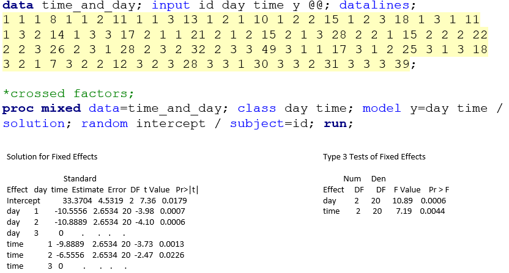
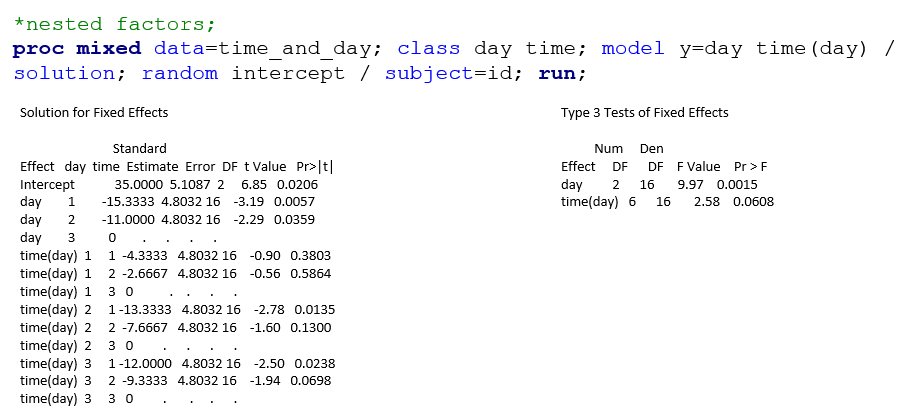
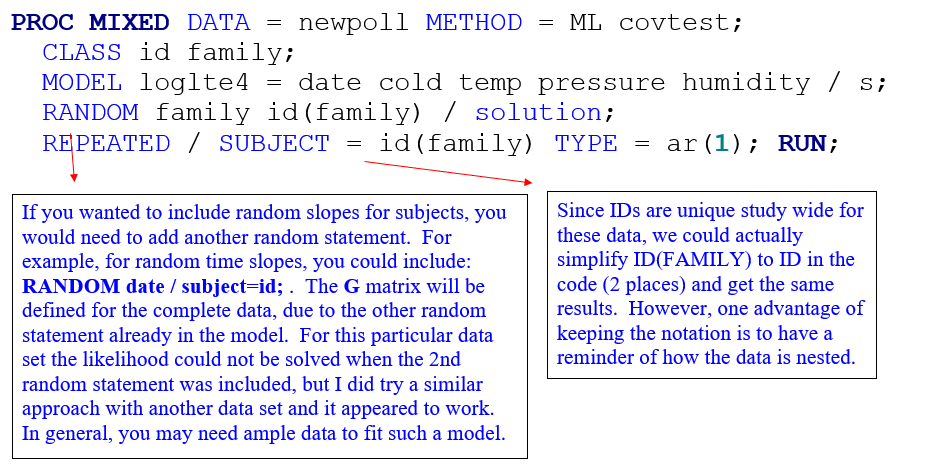
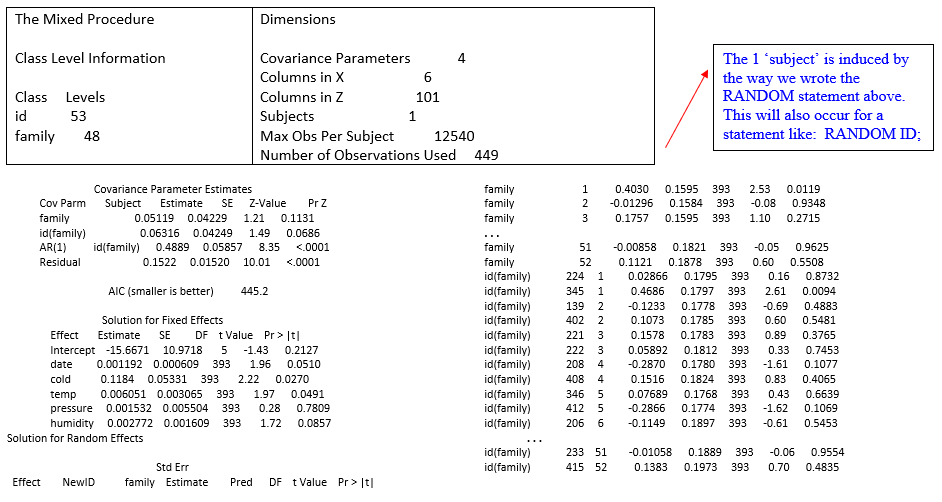
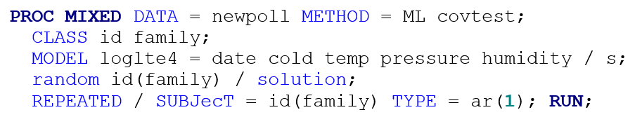
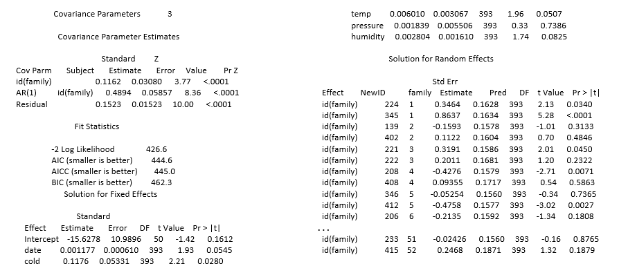

```{r setup, include=FALSE, cache=F, message=F, warning=F, results="hide"}
## setup directory
# setwd()
knitr::opts_chunk$set(cache = TRUE, echo = FALSE, message = FALSE, warning = FALSE)
knitr::opts_chunk$set(fig.height = 4, fig.width = 5, out.width = '50%', fig.align='center')
knitr::opts_chunk$set(fig.path = 'figs_L10/', cache.path = 'cache/')
```

# Nesting and Cross

## Topics for this lecture

- Nesting and crossing

\vspace{\baselineskip}

- **Associated reading:  Course notes** 

  - 'Nesting and crossing' section in LMM chapter

  - Hedeker, Ch. 13 (for hierarchical models)

# Nested versus crossed factors

## Definitions

- The term **nesting** can be applied to many things, including design structures, treatment structures, factors, data or models.  

- Factors A and B are **crossed** if every level of A appears with every level of B.  Such is the case for a 2-factor factorial treatment structure in a completely randomized design.  Example:  Myostatin experiment.

-	Factors are **nested** when the levels of one factor occur with only one level of another factor.  For example, consider a experiment designed to determine the effect of school and instructor on standardized test scores of kids in elementary schools, where each school has a unique set of teachers.

- Factors may be crossed even when units are nested.

- For example, if you have Day (1, 2, 3, ...) and Time of Day (morning, noon, evening), then units for Time of Day appear to be nested within Day.

-	However, if 'morning', 'noon' and 'evening' have consistent meanings across days, then Day and Time of Day can be considered crossed factors.


## Examples:

### Crossed (e.g., Myostatin data)		

|         | Time1 | Time2 | Time3 |
|:-------:|:-----:|:-----:|:-----:|
| Group A |   X   |   X   |   X   |
| Group B |   X   |   X   |   X   |

### Nested (e.g., standardized test data)

|          | Teacher1 | Teacher2 | Teacher3 | Teacher4 | Teacher5 | 
|:--------:|:--------:|:--------:|:--------:|:--------:|:--------:|
| School A |    X     |    X     |          |          |          | 
| School B |          |          |    X     |    X     |          |  
| School C |          |          |          |          |    X     | 

# Nesting

## Notation for nesting:

-	On factors:  for B nested within A, you may see **B (A)** 
(e.g., SAS uses this).

- On indices: if $i$ and $j$ are indices for factors A and B, respectively, and B is nested within A, then an effect in the model may be denoted as $\beta_{(j(i))}$. 

- In SAS, when you specify B(A), you are telling SAS that B is nested within A.  Due to this, levels of B are unique within A; you have to consider the levels of B separate for each level of A, just like an interaction.  The code below shows equivalency of B(A) and $B \times A$.


## Nesting and interaction

- The data set below involves measurements taken within days (e.g., morning, noon, evening), for 3 different days.  We would consider factors A and B crossed if the levels 'morning', 'noon' and 'evening' mean the same thing across days, and we would consider B nested within A if the levels of B could not be considered the same – e.g., if times of measurement varied across days.  The data and partial output follows.

```{r "sas1", echo=FALSE, out.width="100%"}

```

##

-	Estimates for specific $time \times day$ combinations can be determined from the factor 'marginal' estimates (plus the intercept).  'Marginal'=main effect in this case.

```{r "sas2", echo=FALSE, out.width="100%"}

```

- Using $time \times day$ in place of time(day) will yield the same SAS output.  In this case, each $time \times day$ combination has a unique estimate such that 'marginal' factor estimates cannot be used to obtain them. 

## 

-	Determining whether factors are crossed or nested should not be based on model fit; rather, it should be based on the design of the experiment or study.  But in some cases, there may be a fine line between whether factors are nested or crossed. 
 
-	In the example above, we said that factors are crossed if the levels of time meant the same thing across days.  The question is, how close in actual time do the measurements need to be to be considered 'the same'?

	For the crossed design, you could also include $time \times day$ in the model.  The test for $time \times day$ will not be the same as for time(day) (or $time \times day$) in the nested models above.  But, the LSMEANS estimates for $time \times day$ combinations will be the same between the 'full' and nested models.


## Nested subjects

-	Before, we saw the use of the nested notation for subjects within groups.  This relates to a parallel experiment in which subjects are randomly assigned to groups, and remain in those groups throughout the experiment.  This differs from a crossover experiment.  (These will be discussed more in the next section.)

-	For a parallel study/experiment, the use of ID(GROUP) is important in SAS PROC MIXED if the same IDs are used in different groups.  When using PROC GLM for repeated measures ANOVA, the use of this nested variable is important whether or not the IDs are repeated.


## Nested versus crossed random effects

-	Nesting and crossing apply to random effects as well as fixed effects.  Consider the standardized test data.  If the given teachers and schools form a (random) sample from this population, then we can model school as one random effect term, and teacher within school [or teacher(school)] as another.  The random statement in the PROC MIXED code would be:

		RANDOM school teacher(school);

-	For the psychological scoring data, the first approach was to model subject and rater as random effects.  Since each rater scored each subject, then the random effects were crossed:

		RANDOM subject rater;

#	Hierarchical Linear Models

##	Two-level models

-	A mixed model with subjects that are observed over time can be considered a hierarchical model, where the level 1 model consists of the responses over time for subjects ($Y_{ij}$), and the level 2 model consists of subject-specific random effect terms.  Specifically, considering the random intercept model, we have

	Level 1:  $Y_{ij}=b_{0i}+b_{1i} t_{ij}+\epsilon_{ij}$		
	
	Level 2:  $b_{0i}=\beta_0+u_{0i};\ b_{1i}=\beta_1$
	
- If we desire to have random slopes (for time) in the 2-level model as well as random intercepts, then we have

	Level 1:  $Y_{ij}=b_{0i}+b_{1i} t_{ij}+\epsilon_{ij}$		

	Level 2:  $b_{0i}=\beta_0+u_{0i}; \ b_{1i}=\beta_1+u_{1i}$

##
	
- Other types of 2-level models may not involve repeated measures.  

- E.g. health care costs for individuals with different health insurance providers at one time.

	- The level 1 model would involve the subjects ($Y_{ij}$, $i$ denotes provider, $j$ denotes subject).

	- The level 2 model would involve the providers.

	- Here, subjects are nested within health-care providers, and this could be modeled using a random intercept term for provider; subject variability will be accounted for with the residual error term.  The model could be expressed as:

	Level 1: $Y_{ij}=b_{0i}+\epsilon_{ij}$ (costs for individuals)
	
	Level 2:  $b_{0i}=\beta_0+u_{0i}$ (random insurance provider effects)

##
	
- For the standardized test data, if there is one response per teacher, the level 1 model would involve subjects within schools, and the level 2 model would involve the schools.  

- *Applying level terminology to the units*.  For the standardized test data, the level 1 units involve teachers and level 2 units involve schools.  For the 3-level HLM with insurance data, the level 1 units involve the repeated measures over time, the level 2 units would be subjects, and level 3 units would be the providers.

- *Distinguishing 'nesting' concepts for factors and data*.  Although we may say that repeated measures are 'nested' within subjects, it is possible that the factor associated with the repeated measures (e.g., time) is crossed with subjects, if there are specific measurement times that every subject is observed at.  Thus, we need to distinguish nesting/crossing of data versus nesting/crossing of factors.


## Three-level models

### Examples

For the insurance provider data, suppose that we have repeated cost measures for subjects over time.  A 3-level hierarchical model could be developed for these data, where health care costs are denoted as $Y_{ijk}$, where i=provider, $j$=subject, $k$=time.

- The level 1 model involves repeated measures within subjects, the level 2 model involves the subjects themselves, and the level 3 model involves the health care providers.

- This model may include two random intercept terms, one for provider, and one for subject within provider.

- The lowest level (i.e., level 1) of a hierarchical model involves the smallest unit of measurement while the highest level involves the largest unit of measurement.
	
##	
	
###	Example 1: Subjects that are obtained from different sites are monitored over time (perhaps after being assigned to a treatment group).  

-	This is often called a multi-site experiment or study, which is done because it is too difficult for one site alone to get all of the subjects for the experiment.

-	For example, the sites may be medical and research centers across the U.S.

-	Here, leve1 1 involves the measures on subjects over time.  Level 2 involves the subjects that are nested within sites, and level 3 involves the sites.  (Of course, measures on subjects are nested within subjects!)

###	Example 2  Children are recruited from schools for a health study. 
 
-	Children are obtained by selecting them from classrooms within schools within the study area.

-	The level 1 units involve the children's measurements; the level 2 units are classrooms and the level 3 units are the schools.

-	Note that children are nested within classrooms and classrooms are nested within schools.

-	We could extend this to 4-level data if repeated measures were taken on the children, where the repeated measures within subjects would become the level 1 data.

# Case study

## Case study:  Kunsberg study

An EPA-funded study at NJH has involved kids from the Kunsberg School (at NJH) that have moderate to severe asthma.  One of the primary goals has been to determine how the health of children is associated with air pollution on a day-to-day basis.  A number of variables have been collected on subjects (demographic, behavioral, and biological) as well as the environment (air pollution, meteorology) for this ongoing study.

One of the difficulties with the data is that siblings are often involved in the study.  For the 2001-02 school year, there were 48 subjects from 40 families; in 2002-03, there were 57 children from 52 families.  In both years, there were never more than 2 kids involved from the same family.

##

One of the key assumptions in our modeling is the 'independent subjects' assumption.  In medical research, this assumption is often ignored.  People often fret more about the normality assumption and ignore the independence assumption, the latter of which can be much more problematic.

One of the reasons why the independence assumption is violated in medical research is because random sampling is usually unfeasible.  Participants are often self selected.  We can account for the possible dependency between siblings by including appropriate random terms.  We can fit the model with and without the random terms to determine the impact of the dependency.

##

This can be considered 3-level data, where

-	families are the level 3 unit

-	children within families are the level 2 unit

-	repeated measures within kids are the level 1 unit.


For this analysis, LTE4 (a specific biomarker in the body that has been shown to be associated with inflammation) was fit on the natural log scale as a function of date (linear time trend), cold (1=yes, 0=no – a time varying variable), temperature, pressure and humidity.  The goal is to better understand how LTE4 relates to different variables over time.  [Side note:  it has already been shown that LTE4 is related to air pollution.  See Rabinovitch, Strand, Gelfand, 2006 AJRCCM article.]


## The model

We could write $Y_{ij}$ on the left since an observation is uniquely identified by subject and date.  Here I include it for sake of completeness.

$Y_{hij}=\beta_0+\beta_1 date_j+\beta_2 cold_{ij}+\beta_3 temp_j+\beta_4 pressure_j+\beta_5 humidity_j+b_h+b_{(i(h))}+\epsilon_{ij}$

$b_h \sim \mathcal N(0,\ \sigma_F^2)$

$b_{i(h)} \sim \mathcal N(0,\ \sigma_S^2)$

$\epsilon_{ij} \sim \mathcal N(0,\ \sigma_\epsilon^2)$

$h$ for family, $i$ for subject, $j$ for time.  

$\pmb \epsilon_i \sim \mathcal N(0,\ R_i)$, where $R_i$ has the AR(1) form.

## SAS code:

```{r "sas3", echo=FALSE, out.width="100%"}

```

## Abbreviated output:

```{r "sas4", echo=FALSE, out.width="100%"}

```

## Model without family

```{r "sas5", echo=FALSE, out.width="100%"}


```

## Synopsis

-	The estimated variance for families and subjects within families have roughly the same order of magnitude.  By looking at the 2nd output, we can see that the ID(FAMILY) variance then absorbs all of the variance that was formerly attributed to the random family effect.

-	There is not a dramatic difference in fixed effect estimates for the 2 approaches.  The AICs are comparable, but a bit better without the family effect.  It is likely that the level of dependency due to siblings is not that great since there are few siblings involved.

-	Even though removal of the random term for family (and hence not accounting for the sibling effect) did not change estimates drastically, I would generally warn against ignoring dependent data!  It would be prudent to at least check for it,

##

-	If relevant, it is also possible to examine nested effects for random slopes.

	- For example, we previously discussed the relationship between personal exposure to ambient PM2.5 and actual ambient PM2.5.

	- Subjects have different slopes, based somewhat on the type of housing they live in.  Thus, it may be expected that subjects that live in the same house (i.e., those within the same family) will tend to have the same slopes.  

- In this case, we may try fitting two random slopes for ambient PM2.5 to account for this dependency, one for SUBJECT=FAMILY and the other for SUBJECT=ID(FAMILY).

-	For further details on hierarchical models fit to multi-level data (with an emphasis on the use of SAS PROC MIXED), see **Littell et al., SAS System for Mixed Models**.
