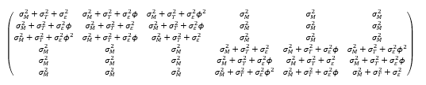

```{r setup, include=FALSE, cache=F, message=F, warning=F, results="hide"}
## setup directory
# setwd()
knitr::opts_chunk$set(cache = TRUE, echo = FALSE, message = FALSE, warning = FALSE)
knitr::opts_chunk$set(fig.height = 4, fig.width = 5, out.width = '50%', fig.align='center')
knitr::opts_chunk$set(fig.path = 'figs_L11/', cache.path = 'cache/')
```

# Nesting and Cross

## Topics for this lecture:

- Nesting and crossing (2nd day)

\vspace{\baselineskip}

- **Associated reading:  Course notes**

  - 'Nesting and crossing' section in LMM chapter
  
  - Hedeker, Ch. 13 (for hierarchical models).

# Case study

## Mouse and tumor data

- Consider an experiment performed at the university involving trials on mice (Dr. Kian Behbakht, PI).

	- Each mouse in the experiment was assigned to receive a treatment (A, B, Control), and then two tumors were planted within each mouse.

	- Tumor volume measurements (unspecified units) were then taken five times on each tumor.

	- For these data, 
	1. the mouse is the level-3 data; 
	2. tumors within mice are level-2 data, 
	3.the repeated measures are level-1 data.

##

- Treatment A and B tend to actually maintain the tumor size, while those in the Control tend to have tumors that shrink over time.  However whether these differences are significant remains to be seen, and is the purpose for fitting a linear mixed model.

-	The units follow a 3-level nested pattern, however information was not provided on whether tumors were systematically placed within mice (e.g. 'Tumor 1' on left and 'Tumor 2' on right), or just randomly placed.

-	The units can be considered nested, with 3 levels.  However, it is not clear whether the tumor and mouse should be considered nested or crossed factors.

##

Let's consider 2 possible modeling approaches for repeated measures:

- **Approach 1**:  consider tumor as nested within mouse; include nested random effects plus an error covariance structure for repeated measures over time.

	* Recall that including a random effect at one level will induce correlation between units on the next lower level.  (E.g., including a random intercept for subjects induces correlation on the repeated measures within subjects.)  

	* By including random effects for mouse and tumor, we have modeled correlation between tumors and between times.

- **Approach 2**:  Assume tumors were placed systematically within mice, so that tumor and time can be considered as crossed factors, and use the Kronecker Product structure.

##

- Even if tumors and time were not actually crossed, Approach 2 yields a reasonable approximate covariance structure for Yi.  In particular, this modeling approach results in a structure that makes intuitive sense since it allows for a decay in correlation between tumor measurements within a mouse, as time between measurements is increased.  Approach 1 does not allow for this.

- Final analyses were performed on log transformed tumor volumes for two reasons:  

  - (i) log volumes were more normally distributed

  - (ii) results were not as sensitive to model specifications, e.g., 'Approach 1' (A1) versus 'Approach 2' (A2).

- The structures for these modeling approaches are shown below, followed by actual fits with the data.  To simplify notation, I considered 3 repeated measures within mice rather than 5.  For actual fits, what complicates matters is that only Treatment B had all 3 mice with 2 tumors measured; the other groups only had 1 of 3 mice with 2 tumors measured (the remaining mice just had 1).

## SAS code

Here is the SAS code to carry out model fits for the approaches, followed by more detail for each one.

```{r "sas1", echo=FALSE, out.width="70%"}

```

# Approach 1

## Approach 1:  

Consider tumors as nested within mice, and repeated measures as nested within tumors (3-level data).

The model can be expressed as $Y_{hij}=\pmb x_{hij} {\pmb \beta}+b_h+b_{i(h)}+\epsilon_{hij}$, where $b_h\sim \mathcal N(0,\sigma_M^2)$, $b_{i(h)}\sim \mathcal N(0,\sigma_T^2)$ and $\epsilon_{hij}$ follows an AR(1) process (within tumor), other; $h$, $i$ and $j$ index mouse, tumor and measure, respectively.

For practice, write out the design matrix for the random effects for largest unit, mouse:  $\pmb Z_h$, and for the full data: $\pmb Z$. 

The resulting $\pmb V_h$ matrix would be:

```{r "matrix", echo=FALSE, out.width="100%"}

```

<!-- $$ -->
<!-- \begin{pmatrix} -->
<!-- \sigma_M^2+\sigma_T^2+\sigma_\epsilon^2 & \sigma_M^2+\sigma_T^2+\sigma_\epsilon^2 \phi & \sigma_M^2+\sigma_T^2+\sigma_\epsilon^2 \phi^2 & \sigma_M^2 & \sigma_M^2 & \sigma_M^2  \\  \sigma_M^2+\sigma_T^2+\sigma_\epsilon^2 \phi & \sigma_M^2+\sigma_T^2+\sigma_\epsilon^2 & \sigma_M^2+\sigma_T^2+\sigma_\epsilon^2 \phi & \sigma_M^2 & \sigma_M^2 & \sigma_M^2  \\  \sigma_M^2+\sigma_T^2+\sigma_\epsilon^2 \phi^2 & \sigma_M^2+\sigma_T^2+\sigma_\epsilon^2 \phi & \sigma_M^2+\sigma_T^2+\sigma_\epsilon^2 & \sigma_M^2 & \sigma_M^2 & \sigma_M^2  \\  \sigma_M^2 & \sigma_M^2 & \sigma_M^2 & \sigma_M^2+\sigma_T^2+\sigma_\epsilon^2 & \sigma_M^2+\sigma_T^2+\sigma_\epsilon^2 \phi & \sigma_M^2+\sigma_T^2+\sigma_\epsilon^2 \phi^2  \\  \sigma_M^2 & \sigma_M^2 & \sigma_M^2 & \sigma_M^2+\sigma_T^2+\sigma_\epsilon^2 \phi & \sigma_M^2+\sigma_T^2+\sigma_\epsilon^2 & \sigma_M^2+\sigma_T^2+\sigma_\epsilon^2 \phi  \\  \sigma_M^2 & \sigma_M^2 & \sigma_M^2 & \sigma_M^2+\sigma_T^2+\sigma_\epsilon^2 \phi^2 & \sigma_M^2+\sigma_T^2+\sigma_\epsilon^2 \phi & \sigma_M^2+\sigma_T^2+\sigma_\epsilon^2 -->
<!-- \end{pmatrix} -->
<!-- $$ -->

One of the problems that I have with this structure is that the covariance for measurements between tumors at different times stays the same as the times are more spread out.

## Results

Model fit:  AIC=188.5.  This model estimates that there is no covariance between tumors within mice.

```{r "sas2", echo=FALSE, out.width="100%"}

```

# Approach 2

## Approach 2:

Kronecker Product structure, using the UN structure for tumors within mice, and repeated measures over time using the AR(1) structure.

The model is $Y_{hij}=x_{hij} {\pmb \beta}+\epsilon_{hij}$, where $h$ indexes mouse, $i$ indexes tumor and $j$ indexes time, $x_{hij}$ is a row vector containing the predictors.  We will consider covariance structures relative to 'mouse' (with index $h$), since that is the largest experimental unit.  Thus, we need to derive R_h, the covariance matrix for vector $\epsilon_h$. 

Structure for 2 tumors:$R_{h1}=\begin{pmatrix} \sigma_1^2 & \sigma_{12}  \\  \sigma_{12} & \sigma_2^2 \end{pmatrix}$	 3 times:  $R_{h2}=\sigma_\epsilon^2 \begin{pmatrix} 1 & \phi & \phi^2  \\  \phi&1 & \phi  \\  \phi^2 & \phi&1 \end{pmatrix}$

##

The combined (Kronecker product structure):

$$
\pmb R_h = R_{h1} \otimes R_{h2} =
\begin{pmatrix}
\sigma_1^2 & \sigma_1^2 \phi & \sigma_1^2 \phi^2 & \sigma_{12}  & \sigma_{12}  \phi & \sigma_{12}  \phi^2  \\
\sigma_1^2 \phi & \sigma_1^2 & \sigma_1^2 \phi & \sigma_{12}  \phi & \sigma_{12}  & \sigma_{12}  \phi  \\ 
\sigma_1^2 \phi^2 & \sigma_1^2 \phi & \sigma_1^2 & \sigma_{12}  \phi^2 & \sigma_{12}  \phi & \sigma_{12}   \\  
\sigma_{12}  & \sigma_{12}  \phi & \sigma_{12}  \phi^2 & \sigma_2^2 & \sigma_2^2 \phi & \sigma_2^2 \phi^2  \\  
\sigma_{12}  \phi & \sigma_{12}  & \sigma_{12}  \phi & \sigma_2^2 \phi & \sigma_2^2 & \sigma_2^2 \phi  \\ 
\sigma_{12}  \phi^2 & \sigma_{12}  \phi & \sigma_{12}  & \sigma_2^2 \phi^2 & \sigma_2^2 \phi & \sigma_2^2 
\end{pmatrix} = \pmb V_h
$$


The $\sigma_\epsilon^2$ on the AR(1) structure is not included because it becomes redundant once we take the direct product, i.e., it is absorbed into parameters in the other matrix.

## Results

Model fit:  AIC=188.1.  Here, we get a covariance between tumors within mice that decays as the time between measurements is increased.


```{r "sas3", echo=FALSE, out.width="100%"}

```

## Comparison

Although the model fits have similar AIC values, Approach 2 yields a slightly better model fit; approaches have the same number of covariance parameters (there is no 'simpler' model).

Below is full SAS code and some of the tests of interest for Approach 2.  The PI for the project had specifically asked for a comparison of groups at the last time (time 18).

```{r "sas4", echo=FALSE, out.width="70%"}
knitr::include_graphics('figs_L11/f4.png')
```


## Abbreviated output:

```{r "sas5", echo=FALSE, out.width="100%"}

```

##

```{r "sas6", echo=FALSE, out.width="50%"}

```

There is a general cubic pattern (flattish, drop, flattish), but since this pattern exists more or less for each group (after accounting for linear trends), we do not see a cubic-by-cubic interaction. 

There is a clear linear trend as well as linear-by-linear interaction. 

Finally, control differs significantly from each of the other groups, particularly at later times.  Mean log volume for control was significantly different than Treatments A and B at 18 days.

# Discussion

## Discussion

If the design is really a nested one and tumors are not crossed but the Kronecker Product structure is still used as an approximate model, it may make more sense to use CS $\otimes$ AR(1).  (If tumors '1' and '2' are arbitrarily assigned across mice, we probably wouldn't want to use separate variances for them, such as is done with the UN structure.)  However, right now SAS does not have a canned structure for that.  Thus, we are probably spending an extra DF for no real reason.  Nevertheless, we only have 4 covariance parameters, and it's the same number used for Approach 1.  Hopefully later versions will have that capability.

In general I would recommend that you stick with the model that is consistent with the design UNLESS there is good reason to change.

For this study, we were not completely sure of the design.  If this were going into a publication, I would definitely discuss more with the PI.  However, Approach 2 yields a reasonable and intuitive structure even if the tumors were not systematically placed within mice (particularly if a CS $\otimes$ AR(1) structure could easily be programmed).

# Crossover designs for repeated measures data

## Crossover designs for repeated measures data

In some cases a researcher may want to have each subject try multiple treatments in an experiment, rather than just one.  In the simplest case, there are 2 treatments, which can be assigned to each subject in a 2 period, 2 treatment (2 $\times$ 2) crossover design.

For the 2 $\times$ 2 design, subjects are usually randomly assigned an order of treatments, AB or BA, in equal amount.  This helps to eliminate confounders associated with time.

If there are 3 treatments, then one may set up a 3 period, 3 treatment crossover design.  

Crossover designs are often used in clinical trials when the cost of tracking subjects longitudinally for extended time does not impose major difficulties.

## Carry-over

**Carry-over effects**:  One limitation of crossover designs is that receiving one treatment first may have an influence on subjects' responses in the subsequent period in which they receive the other treatment.

- If this carry-over effect differs between treatment sequences, then estimates of effect of interest may be biased.

- The difficulty with the 2 $\times$ 2 design is that carry-over effect estimates are aliased with other effects (i.e., they are completely confounded with each other).  Specifically, the sequence, carry-over and period*treatment effects are aliased. 
 
- If sequence and period*treatment effects are assumed to not exist, then we can test for carry-over effects by including the sequence term in the model.  But the validity of the test relies on that assumption…

- In more complex models, it is easier to estimate carryover effects by examining interactions.  Including a term in the model for treatment used in the previous period may help in estimating (differential) carryover effects.

##

- For any crossover design, including a washout period of suitable length between treatment periods may help to eliminate carryover effects that a treatment might have.  Most researchers do include some washout period in their crossover experiment, however one of the issues that arises is planning in advance how long this should be since it is often uncertain how long it will take to 'wash out' the treatment.

- If some carryover effects are expected for a given study or experiment, then the researcher may also consider using alternative designs.  Here, we focus on crossover experiments with repeated measures within periods.  

- For more examples and details about modeling data from crossover designs, see  **Littell et al, SAS System for Mixed Models**, and **Jones and Kenward, Design and Analysis of Cross-Over Trials** (in particular, see Chapter 5).

##

Consider a crossover experiment that was performed and reported in **Connolly et al. (2006)**, entitled *Efficacy of a tart cherry juice blend in preventing the symptoms of muscle damage (British Journal of Sports Medicine, 40: 679-683)*.

- In the experiment, subjects were randomized to receive cherry juice twice a day or placebo drink for 8 consecutive days.

- At day 4, subjects performed 'eccentric elbow flexion contractions'.

- Measures of strength and pain after the challenge (relative to baseline) were then taken on subjects on the last 4 days of the period, after the challenge.  

- Subjects then repeated the experiment with the treatment they did not have in Period 1, using the opposite arm.  Mean strength was greater and pain was less when subjects had the cherry drink, relative to placebo.  Strength loss relative to BL was 22% for placebo but only 4% for cherry juice.  

- This is considered a 2-period, 2-treatment crossover design, with repeated measures.  

##

In the spirit of this experiment, consider a hypothetical data set involving muscle soreness measurements on 4 successive days after an exercise challenge.  This soreness score ranges from 0 to 10 but is typically in a range of 1 to 4.  These scores are adjusted for baseline soreness before the experiment (e.g., if a subject has a soreness score of 2 coming into the study and a score of 6 one day after the challenge, then their soreness score on that day would be 4).  This was designed like the reported experiment (2 $\times$ 2 crossover, 4 repeated measures within each period).

##

Below is a description of the predictors in the model and what they can be used to test:

- **Period:**  1 or 2; test accounts for differences between first and second time periods.
- **Treatment:** placebo vs. cherry drink; test is for main effect of treatment (comparing treatment means). 
- **Time:**  the 4 days that measures were taken following the exercise challenge; test is for main effect of time (comparing means for 4 days following the exercise challenge); time modeled as a class variable.
- **Period $\times$ time:**  Will test for differences between time patterns between the two periods.  Can be thought of as the general time variable.
- **Treatment $\times$ time:**  Will test whether changes over time (with a period) differ between the placebo and cherry drink.  If treatment $\times$ time is significant, then comparisons can be made between treatments for individual days (with multiple comparison adjustments, if desired). 
- **Sequence:**  Compares AB versus BA treatments.  Since there are only 2 treatments, this sequence effect is aliased with carry-over effects.  We can use this term to test for carry-over effects assuming that there are no true treatment $\times$ period or (other) sequence effects. 

## Here is the SAS code for the analysis.

```{r "sas7", echo=FALSE, out.width="100%"}
knitr::include_graphics('figs_L11/f7.png')
```

## Abbreviated output:

```{r "sas8", echo=FALSE, out.width="70%"}

```
\alert {Interpretations of the results?}

## Graph of sample means and SD error bars.


```{r "sas9", echo=FALSE, out.width="100%"}

```

**Another example:**  sleep study I conducted, where kids had 'short' and 'long' sleep weeks. 

Similar crossover design with washout.


