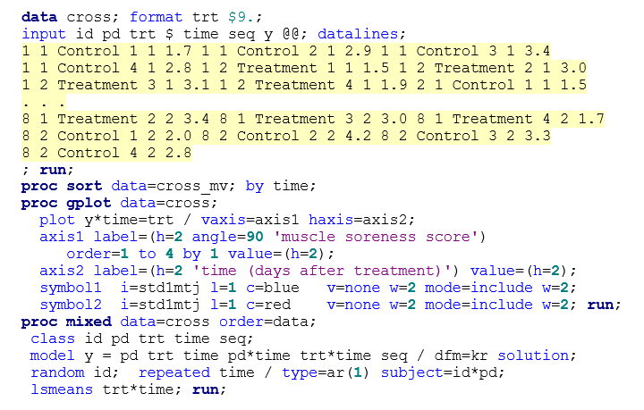

\newcommand{\textcm}{\textcolor{magenta}}

```{r setup, include=FALSE, cache=F, message=F, warning=F, results="hide"}
## setup directory
# setwd()
knitr::opts_chunk$set(cache = TRUE, echo = FALSE, message = FALSE, warning = FALSE)
knitr::opts_chunk$set(fig.height = 4, fig.width = 5, out.width = '50%', fig.align='center')
knitr::opts_chunk$set(fig.path = 'figs_L11/', cache.path = 'cache/')
```


## Associated reading

\vspace{\baselineskip}

  - 'Crossover designs for repeated measures data' section (5.4) in **Course notes**


# Introduction and definitions

## Crossover designs for repeated measures data

- In some cases a researcher may want to have \textcm{each subject try multiple treatments} in an experiment, rather than just one.  
  - In the simplest case, there are 2 treatments, which can be assigned to each subject in a 2 period, 2 treatment \textcm{(2 $\times$ 2) crossover design}.

- For the 2 $\times$ 2 design, \textcm{subjects are usually randomly assigned an order of treatments}, AB or BA, in equal amount.  
  - This helps to eliminate confounders associated with time.

- If there are 3 treatments, then one may set up a 3 period, 3 treatment crossover design.  

- Crossover designs are often used in clinical trials when the cost of tracking subjects longitudinally for extended time does not impose major difficulties.

# Carry-over effects

**Carry-over effects**:  One limitation of crossover designs is that receiving \textcm{one treatment first may} have an \textcm{influence} on subjects' responses in the \textcm{subsequent period} in which they receive the other treatment.

- If this carry-over effect differs between treatment sequences, then estimates of effect of interest may be biased.

- The difficulty with the 2 $\times$ 2 design is that carry-over effect estimates are aliased with other effects (i.e., they are completely confounded with each other).  
  - Specifically, the sequence, \textcm{carry-over and period*treatment effects are aliased}. 
 
- If sequence and period*treatment effects are assumed to not exist, then we can test for carry-over effects by including the sequence term in the model.  But the validity of the test relies on that assumption…

- In more \textcm{complex models}, it may be easier to estimate carryover effects by examining interactions.  Including a term in the model for treatment used in the previous period may help in estimating (differential) carryover effects.

##

- For any crossover design, including a \textcm{washout period} of suitable length between treatment periods may help to eliminate carryover effects that a treatment might have.  
  - Most researchers do include some washout period in their crossover experiment, however one of the issues that arises is planning in advance \textcm{how long this should be} since it is often uncertain how long it will take to 'wash out' the treatment.

- If some carryover effects are expected for a given study or experiment, then the researcher may also consider using \textcm{alternative designs}.  Here, we focus on crossover experiments with repeated measures within periods.  

- For more examples and details about modeling data from crossover designs, see  **Littell et al, SAS System for Mixed Models**, and **Jones and Kenward, Design and Analysis of Cross-Over Trials** (in particular, see Chapter 5).

# Examples

## Example: Cherry juice to improve muscle damage
Consider a crossover experiment that was performed and reported in **Connolly et al. (2006)**, entitled *Efficacy of a tart cherry juice blend in preventing the symptoms of muscle damage (British Journal of Sports Medicine, 40: 679-683)*.

- In the experiment, subjects were \textcm{randomized to receive cherry juice twice a day or placebo drink} for 8 consecutive days.

- At day 4, subjects performed 'eccentric elbow flexion contractions'.

- Measures of \textcm{strength and pain after the challenge} (relative to baseline) were then taken on subjects on the last 4 days of the period, after the challenge.  

- Subjects then repeated the experiment with the treatment they did not have in Period 1 (\textcm{crossover}), using the opposite arm.  

- \textcm{Mean strength was greater} and pain was less when subjects had the \textcm{cherry drink}, relative to placebo.  

  - Strength loss relative to BL was 22% for placebo but only 4% for cherry juice.  

- This is considered a 2-period, 2-treatment crossover design, with repeated measures.  

##
## Hypothetical example

- In the spirit of this experiment, consider a \textcm{hypothetical data set involving muscle soreness} measurements on 4 successive days after an exercise challenge.  

- This soreness score ranges from 0 to 10 but is typically in a range of 1 to 4.  

- These scores are adjusted for baseline soreness before the experiment (e.g., if a subject has a soreness score of 2 coming into the study and a score of 6 one day after the challenge, then their soreness score on that day would be 4).  

- This was designed like the reported experiment (\textcm{2 $\times$ 2 crossover, 4 repeated measures} within each period).

##

Below is a description of the predictors in the model and what they can be used to test:

- **Period:**  1 or 2; test accounts for differences between first and second \textcm{time periods}.

- **Treatment:** placebo vs. cherry drink; test is for main effect of treatment (\textcm{comparing treatment means}). 

- **Time:**  the 4 days that measures were taken following the exercise challenge; test is for \textcm{main effect of time} (comparing means for 4 days following the exercise challenge); time modeled as a categorical (class) variable.

- **Period $\times$ time:**  Will test for \textcm{differences between time patterns between the two periods}.  Can be thought of as the general time variable.

- **Treatment $\times$ time:**  Will test whether changes over time (with a period) differ between the placebo and cherry drink.  
  - If treatment $\times$ time is significant, then comparisons can be made between treatments for individual days (with multiple comparison adjustments, if desired). 


## Here is the SAS code for the analysis.
- **Sequence:**  Compares AB versus BA treatments.  Since there are only 2 treatments, this sequence effect is aliased with carry-over effects.  
  - We can use this term to test for \textcm{carry-over effects} assuming that there are no true treatment $\times$ period or (other) sequence effects. 

```{r "sas7", echo=FALSE, out.width="100%"}

```

## Abbreviated output:

```{r "sas8", echo=FALSE, out.width="70%"}
knitr::include_graphics('figs_L11/f8.png')
```
\textcm{How do we interpret the results?}

## Graph of sample means and SD error bars.


```{r "sas9", echo=FALSE, out.width="100%"}
knitr::include_graphics('figs_L11/f9.png')
```

**See course notes for other examples:**  sleep study, similar crossover design with washout.

# Summary
## Summary


