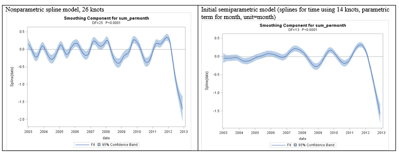

\newcommand{\textcm}{\textcolor{magenta}}
```{r setup, include=FALSE, cache=F, message=F, warning=F, results="hide"}
## setup directory
# setwd()
knitr::opts_chunk$set(cache = TRUE, echo = FALSE, message = FALSE, warning = FALSE)
knitr::opts_chunk$set(fig.height = 4, fig.width = 5, out.width = '50%', fig.align='center')
knitr::opts_chunk$set(fig.path = 'figs_L11/', cache.path = 'cache/')
```

# Nonparametric regression

## Associated readings:

\vspace{\baselineskip}

** Sections 1 and 2 of the 'Nonparametric and flexible longitudinal regression' notes.**

- LOESS - page 350 of course notes


## Parametric, semiparametric and nonparametric regression: introduction and terminology

- In modeling a mean function over time (or more generally for predictor $x$), a researcher may need more flexibility than what standard polynomials or transformations can offer.  In this chapter we consider methods to accomplish such flexible fits.

- \textcm{Three classes of regression} are parametric, semiparametric and nonparametric. These are discussed in some detail in this chapter (see course notes).  

- Here, we focus on \textcm{piecewise polynomial regression} (parametric) and \textcm{spline modeling} (usually semiparametric or nonparametric).

**See the course notes** for more detail on nonparametric and semiparametric regression methods.

# Piecewise polynomial regression

## Piecewise polynomial regression and splines

- \textcm{Piecewise polynomial regression} offers a researcher a more flexible way to model the mean function over time (or more generally over some predictor, x), where the \textcm{pieces are usually joined together} so that the function is continuous but **not necessary differentiable**.

- \textcm{Spline models} further \textcm{require} **differentiability** so that the entire function is smooth.  
  - Cubic terms are commonly used in spline models since they yield a flexible and smooth fit.  
  - Quadratic splines can also be used but are less common.

- Although smoothness is intuitive in many cases, in certain cases it may be reasonable to allow the function to be continuous but not differentiable at one or more points, such as for a \textcm{threshold model} or when a treatment is applied during an experiment, resulting in a \textcm{sharp change} in the mean function.  

## Piecewise linear regression

- Consider a health outcome that is modeled as a function of exposure to an environmental risk factor.  

- There may be a \textcm{negligible} or slight dose-response relationship until the level of the risk factor \textcm{reaches a certain point}.  

- Beyond that point, there may be a strong dose-response relationship between this risk factor and the health outcome.  

- Such a model (sometimes called a \textcm{threshold model}) can be fit by joining polynomial functions together into one function.  

- The simplest such function joins two simple linear functions together; the \textcm{knot} is where the two linear pieces join together.

##

As an introductory example, consider the \textcm{threshold model} described above.  Let's assume there is some level of an environmental exposure variable that has the following relationship with a health outcome.

```{r "f1", echo=FALSE, out.width="70%"}

```

Say that exposure/health data are collected across subjects and the data is \textcm{'cross-sectional'} in nature.

##

In a GLM regression model, if \textcm{we know where the knot occurs} (say $k$), we can use the following regression function to fit the linear spline.

$$Y=\beta_0+\beta_1 x+\beta_2 max(x-k,\ 0)+\epsilon$$

Note that the extra linear piece only \textcm{'kicks in'} for $x\geq  k$.

\textcm{For $x<k$}: $$Y=\beta_0+\textcm{\beta_1} x+\epsilon$$

\textcm{For $x\geq k$}: 
$$
Y=\beta_0+\beta_1 x+\beta_2 (x-k)+\epsilon =
(\beta_0-\beta_2 k)+(\beta_1+\beta_2)x+\epsilon	= \beta_0'+(\textcm{\beta_1+\beta_2}) x+\epsilon
$$  

Thus, the \textcm{slope} of $x$ is $\beta_1$ for $x<k$, and $\beta_1+\beta_2$ for $x\geq k$.  

Often our data will be longitudinal or clustered in nature, but we can fit splines in a linear mixed model in the same way.

##

- Illustration:  Here is a simplified example of a real data set at NJH.  

- Subjects that work in Beryllium metal plants have an increased risk of developing Beryllium sensitization (BeS), which can progress into Chronic Beryllium disease (CBD).  

- We are interested in modeling changes in \textcm{health over time}, and specifically we want to see if there is a pronounced change when they progress from BeS to CBD.  

- The health outcome measure here is \textcm{y = AADO2R} (Alveolar-arterial O2 tension difference at rest); \textcm{a higher value indicates worse health}.

### Description of variables:
- *time* can be thought of with units of years
- *CBDX* is the time when subjects progressed from BeS to CBD
- *prog_group* = 0/1/2 for those that progress before/during/after the observation period
- *stage* = stage of illness, 0 for BeS, 1 for CBD
- *Y=AADO2R*, as described above

##

Here is one approach to modeling the data using linear splines:

$$Y_{ij}=\beta_0+\beta_1 x_{ij}+\beta_2 max(x_{ij}-cbdx_i,\ 0)+ pg_h + b_{0i} + \epsilon_{ij}$$

- $\epsilon_{ij}\sim \mathcal N(0,\  \sigma_\epsilon^2)$, 
- $b_{i0}\sim \mathcal N(0,\  \sigma_{b_0}^2)$, 
- $h=1,\ 2,\ 3 (progression\ group)$; 
- $i=1,\ ... ,\ n$; 
- $j=1,\ ... ,\ r_i$.  

Here, $r_i=r=4$ for all $i$; $j=0,\ 1,\ 2,\ 3,\ 4$.

Above, $x$ denotes *TIME*, $pg$ is used for *PROG_GROUP*. 

- Note:  since \textcm{$cbdx_i$ depends on $i$}, subjects can have knots at different times.  In the code below, *time_star* denotes the 'max' term.

## SAS code

```{r "sas", echo=FALSE, out.width="90%"}

```

## Output
```{r "sas2", echo=FALSE, out.width="70%"}

```

```{r "sas4", echo=FALSE, out.width="60%"}

```

##

- The test for time_star indicates that the \textcm{progression from BeS to CBD is associated with} significant changes to the health-time relationship (p=0.0062).  With more data, we can try adding a few more parameters to the model to see if they help describe other patterns in the data.

```{r "cbd", echo=FALSE, out.width="50%"}

```

- In the graph, BeS subjects are forced to have the same linear trend and those with CBD are forced to have the same linear trend, but \textcm{subjects can progress from one stage to the next at different times}.  

  - \textcm{Subject 5} progressed before the observation period, so they have the CBD trend; 
  - \textcm{Subjects 3 and 4} have the BeS trend since they progress after the observation period; 
  - \textcm{Subjects 1 and 2} progress during the observation period, one at time 1 and the other at time 3.
 
## Piecewise quadratic and cubic regression

Quadratic and cubic piecewise polynomial functions can also be fit to data. **See course notes** for more examples.


# Cubic spline model

## Cubic spline models

- \textcm{Cubic splines} have a natural appeal due to their flexible fit, and although they are considered in the class of semiparametric or nonparametric regression modeling, the model can still often be expressed easily in parametric form.  

- So far we have considered piecewise polynomial functions that may have a hard change point (i.e., continuous but not differentiable), but now we consider piecewise polynomial functions that are \textcm{smooth}.  

- To \textcm{obtain smoothness}, lower-order terms are not included at the change points.  Specifically, a piecewise polynomial cubic spline model has the form

$f(x) = \beta_0 + \beta_1 x + \beta_2 x^2 + \beta_3 x^3+\sum_{k=1}^p \beta_{k+3} s_k^3$

where $s_k = max(0,\ x-c_k)$ and $c_k$ is the location of knot $k$ with respect to the x-axis, $k=1,\ ...,\ p$.

- Unlike the previous examples, we \textcm{only include the cubic terms $(s_k^3)$, but not the lower-order terms} $(s_k, s_k^2)$, which forces differentiability across the entire function.

## Example 2:  Mouse growth data.

- In some cases, we may want to include \textcm{multiple knots} in the spline model, and it may not be so clear where the knots should be.  

  - This is true particularly when we are more concerned about getting a \textcm{flexible fit for the data}.  
  
- To illustrate, consider the \textcm{mouse growth data} graphed below. These data were obtained from [Rob Weiss's  (Dept. of Biostatistics, UCLA) web site]( http://rem.ph.ucla.edu/rob/rm/examples/mice.html).  

- In the graph to the lower left, the \textcm{weights of mice} are measured over their first days of life; to the right are the \textcm{predicted values} based on the mixed model fit of the model described below.

```{r "ucla", echo=FALSE, out.width="70%"}

```

##

- You may notice with the data that the quickest growth occurs around days 3 to 8, while the growth is not so steep shortly after birth, and then after day 10 or so.  
  - This suggests some type of cubic function may work for these data.  
  
- Also, we may try modeling a \textcm{random slope} for time across subjects in order to account for the expanding \textcm{variability between} mice over time.  

Using \textcm{knots at days 3, 8 and 13} (where change points seem to be occurring), here is a possible model for the data:

$$Y_{ij}=\beta_0+\beta_1 x_{ij}+\beta_2 x_{ij}^2+\beta_3 x_{ij}^3+\beta_4 s_{ij1}^3+\beta_5 s_{ij2}^3+\beta_6 s_{ij3}^3+b_{1i} x_{ij}+\epsilon_{ij}$$

- $i$ indexes subject, $j$ indexes observation, $i=1,\ ... ,\ n;\  j = 1,\ ... ,\ r_i$
-	$Y{ij} = j$th weight observation for mouse $i$
-	$x_{ij}$ = day that $j$th observation was taken on mouse $i$
-	$s_{ijk} = max(X_{ij} - v_k,\ 0)$ where $k$ denotes knot, knots were fixed at $v_1=3.3$, $v_2=8.3$, $v_3=13.3$ days. $\epsilon_{ij}\sim \mathcal N(0,\  \sigma_\epsilon^2);\ b_{i1}\sim \mathcal N(0,\  \sigma_{b_1}^2)$

##

- In this case, the lower order spline terms were not included in the model.

- Note that we included a random term for time, but \textcm{no random intercept}.  This worked since all experimental units had the same value, 0, at the start time.  

  - But generally, I would caution against such an approach unless it makes sense.  
  - Generally, I would warn against excluding the random intercept simply based on p-value, just as I would warn against dropping the fixed intercept term based on p-value.

# Case study

\alert EJC here!!!

## Case study:  Alamosa asthma and pollution study

The study took place in the San Luis Valley; hospital admission counts (for a medical facility in Alamosa) was compared with daily PM10 data (i.e., coarse particulate matter in the air) between 2003 and 2013.

Here, we consider larger number of knots to be able to get a 'nonparametric' fit to the data. I use nonparametric in quotes since really the spline data can still technically be expressed parametrically.  However, most consider it a class of nonparametric regression.

When such spline variables are combined in models with predictors that are used in the standard way, then we typically call this a semi-parametric regression model.  In the models discussed below, we use splines for time (so treat it 'nonparametrically'), and use standard variables for the pollutant, meteorological variables, month and day of week, and thus have a semi-parametric model.

## San Luis hospital admission counts and PM10.

```{r "pm10", echo=FALSE, out.width="70%"}

```

Circles show monthly hospital counts, and a LOESS (kernel-type) nonparametric regression was used to get the fitted function.  This was used for descriptive purposes only.  LOESS regression is discussed in more detail in the next section of notes.

##

Models below are only initial models that examine hospital counts as a function of time (left) and time and month (right).  Here, canned procedures were used to obtain fits.

```{r "pm10_2", echo=FALSE, out.width="70%"}

```
 
##

The final model needs to include a flexible fit for time, account for serial correlation, and allow for testing for effects of interest (primarily the pollutant variable).

Once we define the variables associated with the splines, we actually have a parametric representation of the spline data and can include the variables in a standard parametric longitudinal model, like an LMM or GzLM with GEE.  Since we have count data, we will use the latter to do all of this.

Note that with these data, there is only one 'subject', the hospital at which we're measuring the daily admission counts.  We will be able to fit the model as we have ample longitudinal data, although inference is limited to the population that uses this facility.

With a piecewise smooth cubic spline function, we include the (initial) intercept, linear, quadratic and cubic terms, and then k knots, where each knot has a related cubic 'spline' variable  that kicks for x greater than the knot.  By including only the cubic terms associated with the knots, we keep the function smooth.  (Also see the mouse data described previously.)

##

The initial analyses suggested placing knots at roughly yearly intervals if we consider the more smoothed function.  This would relate to 2-year cycles, which may be sufficient since the model will already have 'month' included, which should take care of trends within a year (e.g., a yearly cycle).

With about 10 years of data, we can place 9 equally spaced knots in the interior.  This means there are 13 degrees of freedom including the initial intercept, linear, quadratic and cubic terms, and the spline terms associated with the 9 knots.

A 'b-spline' approach is essentially a transformation of the X matrix (for the spline variables) so that rows add up to 1.  In this case, x variables act more like weights, and variables will have 0's for some elements, indicating that certain spline parameters are not used in predicting values if they are far away from point of interest.  (See the SAS Appendix for a comparison of piecewise splines (or 'psplines') that we're familiar with, and basis-splines (or 'bsplines').

One advantage of b-splines is that the covariance between spline terms can be reduced, compared with p-splines.  Another spline approach is to use natural b splines, which force the 2nd derivative of the function to be 0 at the beginning and ending knots.

##

For practical purposes, I do not see much difference in models that use the pspline, bspline and nbspline approaches.  While estimates and SE's of the spline terms may differ (including the intercept), those for the other terms in the model are either exactly the same or close to the same (they are exactly the same for pspline and bpline approaches, and close to the same for the natural bspline approach).

### Spline matrices can be obtained with software and code as follows:
	
-	SAS:  PROC TRANSREG

	- PSPLINE for piecewise spline

	- BSPLINE for basis spline

- R:  SPLINE package

	- bs for basis splines

	- ns for natural splines

##

There are many different types of spline approaches, only some of which are discussed here.  Also, be careful with the terminology, it is not always consistent.

The SAS code demonstrates the program for total hospital count , using 3-day moving average for the pollutant, total hospital count.  One run for each of bspline and pspline approaches is shown.


```{r "sas17", echo=FALSE, out.width="50%"}

```
# Bspline and Pspline

## BSPLINE approach

```{r echo=FALSE, out.width="70%"}

```

##

```{r echo=FALSE, out.width="70%"}

```

##

```{r echo=FALSE, out.width="50%"}

```

The graph above shows predicted counts based on the GzLM/GEE model fit. The fit represents month and day of week at reference values (December and Saturday, respectively). Otherwise, other covariates in the model besides those involving date (i.e., the spline terms) were set to their mean values. Predicted values are exactly the same, whether the PSPLINE or BSPLINE approaches are used.

The pollutant effect is not significant, but is going in the expected direction (positive).  Some other models yielded p<0.05 for the pollutant variable, e.g., model with a binary pollutant variable based on a particular cut point.

## 

Pspline correlation between spline parameter estimates (intercept not included)

```{r "pspline", echo=FALSE, out.width="40%"}

```

Bspline correlation between spline parameter estimates (intercept not included)

```{r "bspline", echo=FALSE, out.width="40%"}

```

Nbspline correlation between spline parameter estimates (intercept not included)

```{r "nbspline", echo=FALSE, out.width="40%"}

```

## Comparing piecewise polynomial and b-splines:  bases and properties

Note:  this section is taken from SAS Help Documentation, with some minor editing.  An algorithm for generating the B-spline basis is given in **de Boor (1978, pp. 134-135)**. B-splines are both a computationally accurate and efficient way of constructing a basis for piecewise polynomials; however, they are not the most natural method of describing splines.   Consider an initial scaling vector $\pmb x=(1\ 2\ 3\ 4\ 5\ 6\ 7\ 8\ 9))^{\top}$ and a degree-three spline with interior knots at 3.5 and 6.5.  The natural piecewise polynomial spline basis (X matrix for associated variables) is the left matrix, and the B-spline basis for the transformation is the right matrix. 

##

### Comparison

```{r "comparison", echo=FALSE, out.width="100%"}

```

The two matrices span the same column space.  The numbers in the B-spline basis do not have a simple interpretation like the numbers in the natural piecewise polynomial basis. The B-spline basis has a diagonally banded structure and the band shifts one column to the right after every knot. The number of entries in each row that can potentially be nonzero is one greater than the degree. The elements within a row always sum to one. The B-spline basis is accurate because of the smallness of the numbers and the lack of extreme collinearity inherent in the piecewise polynomials.

# Summary

## Summary


