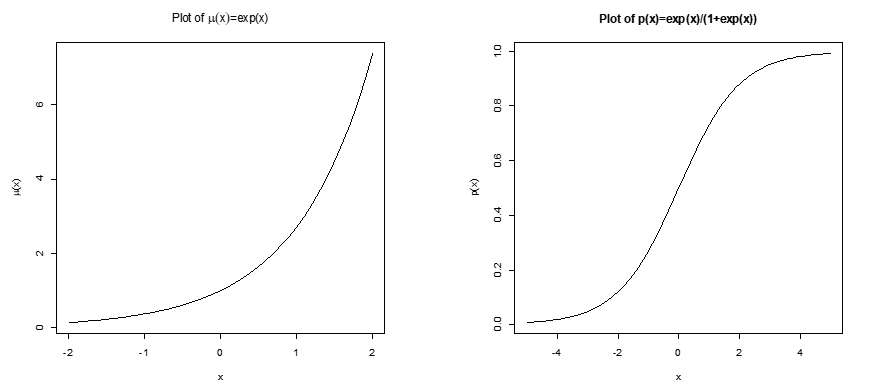

```{r setup, include=FALSE, cache=F, message=F, warning=F, results="hide"}
## setup directory
# setw\mathcal D()
knitr::opts_chunk$set(cache = TRUE, echo = FALSE, message = FALSE, warning = FALSE)
knitr::opts_chunk$set(fig.height = 4, fig.width = 5, out.width = '50%', fig.align='center')
knitr::opts_chunk$set(fig.path = 'figs_L11/', cache.path = 'cache/')
```

 

# 1. Introduction: Modeling independent or correlated

## 1.0 Introduction

This set of notes discusses models that can be used for **outcome variables that are not normally distributed**.  Methods for modeling non-normal correlated data are also discussed in BIOS7712.  We have learned how to use linear mixed models to fit clustered data with continuous and approximately normally distributed outcome variables.  The models are versatile in handling random effects as well as repeated measures over time.  For other types of outcome variables that involve clustered data, such as counts or binary outcomes, we can use generalized estimating equations (GEE) or employ generalized linear mixed models (GzLMM) as discussed in this chapter.

Sometimes we can still employ normal theory models even when the outcome variable is non-continuous or non-normal.  For example, a count outcome with a wide range of observed values not too close to zero **may be well approximated by the normal curve**.  In other cases we might be able to apply a **transformation** to a non-normal outcome so that it is approximately normal.  In particular, outcome variables with right-skewed distributions are very common (e.g., cell counts), especially when there is a lower bound (typically zero).  A natural **log transformation** might make the distribution approximately normal.  But **how then are effects from the model interpreted?**  This will be examined in more detail in the section on interpreting effects from loglinear and logistic models.


#	2. Determining when and when not to use normal theory methods		

## 2.0 Determining when and when not to use normal theory methods

For a given outcome variable, a normal-theory model (e.g., GLM, LMM) may work adequately even if the observed data are not perfectly normal.  Typically, the model fit will be fairly robust to violations of the normal assumption as long as the distribution is not too skewed or does not have a high percentage of data on one or more individual values, or when sample sizes are large enough that the central limit theorem comes into play.  

## 2.1 Consider the following examples of response variables and how you might model them

1.	$Y$ = FEV1:  slightly right skewed; true lower bound of 0 although $P(Y=0)=0$ or negligible for a non-error blow.

2.	$Y$ = forced exhaled nitric oxide (FeNO):  moderately right-skewed; lower bound of 0 but $P(Y=0)=0$ or negligible.

3.	$Y$ = expenditures for health clinics; can be considered continuous; right skewed but with $P(Y=0)>0$ and possible that $P(Y=0)\gg 0$ (e.g., 20% or more).

4.	$Y$ = whether child had an asthma exacerbation in a given week (y/n).

5.	$Y$ = percentage of patients that adhere to doctor's directions, based on large n.

6.	$Y$ = number of times albuterol was used in a day by a child to treat asthma.  Counts of use typically range from 0 to 6, but most commonly are 0, 1 or 2.

#	3. Generalized linear models (GzLM), an introduction		

## 3.0 Generalized linear models (GzLM), an introduction	

When a normal-theory model is clearly not suitable for the outcome even after transforming, one possibility, **if the outcome variable can be modeled by a distribution from the exponential family (EF)**, is to use **general-ized linear models (GzLM)**.  Generalized Linear Models is **one of the most important classes of statistical models** and **one of several huge innovations in statistics in the 1970's and 80's**, well represented by the landmark paper by **Nelder and Wedderburn in 1972**.  [Survival analysis (Cox, 1972) and linear mixed models (Laird and Ware, 1982) also made big leaps in their development during this time.]  GzLMs generalize linear models for use with non-normal outcomes.  As with most regression methods, in GzLMs we consider both the mean and variance of $Y$ conditional on $\pmb X$, although this is usually not explicitly written.

## 3.1	**Notation**

Since notation is very complicated with GzLMs, a summary is given below to highlight some of the key elements.

$Y_i$:		Random variable outcomes, $i=1,\ ...\ ,\ n$             
$y_i$:		Observed outcomes                           
$\pmb x_i^r$:		Covariate vector for subject $i$, the $i$th row of $\pmb X$                
$x_{ij}$:		Covariate value for subject $i$ and covariable $j$                
$\pmb \beta$:		Regression parameter vector for GzLM                   
\alert {$\mu_i =E[Y_i]$: mean outcome for subject $i$}                                       
$\eta_i =\pmb x_i^r \pmb \beta$: linear predictor for subject $i$ for GzLM                    
$g$:		Link function for GzLM, $\eta_i=g(\mu_i)$ or equivalently $\mu_i=g^{-1}(\eta_i)$.           
$\theta$:		Canonical parameter in EF, defines canonical link $\theta(\mu)$ for $\mathcal {EF}$             
$\phi$:	Scale parameter; either a fixed parameter in the density, or a parameter artificially added in Quasilikelihood              
$f_Y (y;\ \theta,\ \phi)$:	Density in $\mathcal {EF}$ form               
$\mathcal L(\pmb \theta,\ \phi;\ \pmb y)$:	Likelihood                 
$\mathcal D(\pmb \theta,\ \phi;\ \pmb y)$:	Deviance                    

Here, the acronym GzLM is used for generalized linear models, while GLM is used for general linear models.  But note that some authors refer to generalized linear models as 'GLM' and general linear models are often just referred to as 'linear models', or 'LM'.  In R software, the *glm()* function will fit a generalized linear model, while lm fits a general linear model.

## 3.2 Motivation and examples

There are many types of outcomes that one may be interested in modeling that are not normally distributed, or even continuous.  For example: **number of visits to ER each day**; number of asthma inhaler uses each day; disease exacerbation: yes/no.

What about using the following GLM to model such data?  
$Y_i=\pmb x_i^r \pmb \beta+\epsilon_i=\sum_{j=1}^p x_{ij} \beta_j  +\epsilon_i$

But note that such a model **will not generate integer (e.g. count) data, nor binary (0/1) data**.

**Historical (early) 'solutions'** to dealing with inadequacies of GLMs in modeling non-normal data included use of variance stabilizing transformations and empirical transformations of the response variable.  But these clearly have their limitations.

## 3.3 	Link functions

The modern solution to the modeling issues discussed above is GzLMs, proposed by **Nelder & Wedderburn (1972)**.  The key idea is **to consider the distribution of the response variable rather than including an additive error term**.  For example, for the normal, we can **rewrite**	

$Y_i=\pmb x_i^r \pmb \beta+\epsilon_i,\   \epsilon_i\sim \mathcal N(0,\ \sigma^2)$ **as** $Y_i\sim \mathcal N(\pmb x_i^r \pmb \beta,\ \sigma^2)$.

For the $\mathcal {Poisson}$, there is one parameter so we could consider $Y_i \sim \mathcal {Pois} (\pmb x_i^r \pmb \beta)$.

Now we have a model where **response values are integer valued**.  But one obvious problem with this is that **$\pmb x_i^r \pmb \beta$ isn't necessary positive**.  One way to avoid this problem is to consider $Y_i \sim \mathcal {Pois} \big(e^{\pmb x_i^r \pmb \beta} \big)$ or equivalently, 

$$Y_i \sim \mathcal {Pois} (\mu_i)\ with\ \ ln(\mu_i)=\pmb x_i^r \pmb \beta	\ \ \ \ \ \ \ [1]$$

Thus, instead of setting $E[Y_i]=\mu_i=\pmb x_i^r \pmb \beta$, we find a function of $\pmb x_i^r \pmb \beta$ so that the parameter space of the response mean is maintained in the model.  

##
 
**Let $g$ denote the link function between the linear predictor, $\pmb x_i^r \pmb \beta$, and the mean, $\mu_i$**, so that 

$$g(\mu_i)=\pmb x_i^r \pmb \beta. \ \ \ \ \ \ \ [2]$$

For the $\mathcal {Poisson}$, the link function expressed in [1] is $g(\mu) = ln(\mu)$.  This link is intuitive because it keeps the $\mathcal {Poisson}$ mean positive in the model.  It can also be shown that the canonical link or natural link (discussed more ahead) for the $\mathcal {Poisson}$ distribution is in fact the natural log link.  Count outcomes can often be modeled using a $\mathcal {Poisson}$ distribution, although it is often necessary to add a dispersion parameter into the model (also discussed later).  Regression of a $\mathcal {Poisson}$ variable on one or more predictors is often referred to as $Poisson regression$.  Another form of [2] is $\mu_i=g^{-1} (\pmb x_i^r \pmb \beta)$.  For the $\mathcal {Poisson}$, we have	$\mu_i=g^{-1} (\pmb x_i^r \pmb \beta)=e^{\pmb x_i^r \pmb \beta}$.

A **plot** of this function with one covariate and $\beta_0=0$ and $\beta_1=1$ is presented in *Figure 1*, left panel.

##

For the **binomial**, consider $\hat p_i= \frac {Y_i} {n_i},\ where\ Y_i \sim \mathcal {Bin} (n_i,\ p_i )$.  Of course $p$ must be bound between 0 and 1 and intuitively would be a continuous function of $\pmb x_i^r$.  In order to maintain these characteristics, one possibility is to set

$$p_i=\frac {e^{\pmb x_i^r \pmb \beta}} {1+e^{\pmb x_i^r \pmb \beta} }.	\ \ \ \ \ \ [3]$$

Function [3] is plotted for one continuous covariate in the right panel of *Figure 1*, with $\beta0 = 0$ and $\beta1=1$; this demonstrates the signature 'slanted S' shape.  However, for certain applications, this may not be apparent since the range of $x$ values may only cover a portion of the 'S'.

## Figure 1: plot of mean functions for log (left panel) and logit (right panel) links.

```{r "poisson", echo=FALSE, out.width="40%"}

```

 	 
Note that for the$\mathcal {Binomial}$ proportion $\hat p_i$, $E[\hat p_i] = \frac {n_i p_i } {n_i} = p_i$, so [3] expresses $g^{-1}$.  Rearranging [3] in terms of the linear predictor yields $g(\mu_i )=ln \big[\frac {\mu_i} {1–\mu_i} \big]=logit(\mu_i)$, which is the canonical link function for a$\mathcal {Binomial}$ proportion.  When $n_i=1$ for all $i$, we have binary responses $[Y_i \sim \mathcal {Bernoulli}(p_i),\ i = 1,\ ...,\ n]$.  Modeling of a binary outcome as a function of one or more predictors (at least one usually continuous) is called **logistic regression**.  In our model, we estimate $\pmb \beta$, which will then provide estimates of the probability that $Y$ will be 0 or 1, through [3].

##

Note that for normal outcomes, the GzLM with normal distribution and identity link is $Y_i\sim \mathcal N(\pmb x_i^r \pmb \beta,\ \sigma^2)$, which is equivalent to the usual GLM.

To summarize, in a GLM, the mean part of the model is $\pmb X\beta$, or $\mu$.  But as illustrated above, for outcomes that are not normally distributed, it is not always best to set these quantities equal.  To distinguish the terms we'll call $\pmb X\beta$ the linear predictor, sometimes denoted as $\eta$.  For subject $i$, the linear predictor is the scalar $\eta_i=\pmb x_i^r \pmb \beta$, where $x_i^r$ is the $i$th row of $\pmb X$.  

## 3.4	**Components of the GzLM**

**In general, a GzLM looks like $Y_i \sim \mathcal {EF}(g^{-1} (\pmb x_i^r \pmb \beta),\ \phi)$** where $\phi$ is a vector of other parameters, e.g. $\sigma^2$ for normal distributions, and **'EF' refers to a distribution from the class of exponential family distributions, parameterized so that the first argument is the mean**.  There are **three main components** to a GzLM:

1. **Random component**:  $Y_i\sim \mathcal {EF}$              
**$\mathcal {EF}$** = "Exponential family distribution"                
E.g., $\mathcal {Poisson ,\ Binomial,\ Normal,\ Gamma}$               

2. **Systematic component**:  $\pmb x_i^r \pmb \beta$                          
Sometimes called **'Linear Predictor'**, sometimes denoted as $\eta_i=\pmb x_i^r \pmb \beta$              
E.g., includes covariates, groups, treatments, interactions, etc.               

3. **Link function**:  $g$                                     
Links systematic and random components, ie covariates and mean                           
$E(Y_i)=\mu_i=g^{-1} (\eta_i)=g^{-1} (\pmb x_i^r \pmb \beta)$, or equivalently $g(\mu_i)=\eta_i$.             
Also keeps mean of random distribution in right space.                      
E.g. $log$ for $\mathcal {Poisson}$, $logit$ for $\mathcal {Binomial}$

## 3.5 Exponential family distributions

An **exponential family distribution** has density of the form

$$
f_Y (y;\ \theta,\ \phi)=exp\Big(\frac {y\theta-b(\theta)} {a(\phi)} +c(y,\phi)\Big)
$$

Note that $b(\theta)$ occurs alone, with no $y$'s, and $c(y,\ \phi)$ occurs alone, with no $\theta$'s; $\theta$ may be a vector parameter, though in common cases it is a scalar.  Here we consider it as a scalar and leave it unbolded.

The link function $g$ for which $g(\mu)=\theta$ is called the canonical link.  This is typically the link function used to relate the mean of $Y$ to the covariates in the GzLM.  In other words, when the canonical link is used in the GzLM, $\theta_i=\eta_i=\pmb x_i^r \pmb \beta$ (considering subject $i$).

##

There may be other **nuisance parameters**.  One particular case is a **scale parameter $\phi$**.  In some common situations (e.g. $\mathcal {Poisson}$), $a(\phi)=1$.  The scale parameter $\phi$ is considered fixed throughout most of the analyses.  A scale parameter can also be added in cases where $a(\phi)=1$ (e.g. $\mathcal {Poisson}$).  This does not give a true probability distribution, but it can be useful in practice and is called **Quasilikelihood estimation**, which will be discussed ahead.

Some **general results** are available for exponential families.  For example, $E[Y_i]=\mu=b' (\theta)$ and $Var[Y_i]=b''(\theta)a(\phi)$.

For practice:  determine the exponential form and related quantities for the Normal case.  (The $\mathcal {Poisson}$ and$\mathcal {Binomial}$ cases will be given as homework.)

# 3.6 Estimation

## 3.6.1 Likelihood and score equations

The **likelihood** for data $y_1,\ ...,\ y_n$ based on iid responses from a member of the exponential family is  

$$
\mathcal L(\theta,\ \phi;\ y) = \prod_{i=1}^n f_Y (y_i;\ \theta_i,\ \phi) =\prod_{i=1}^n exp  \Big( \frac {y_i \theta_i-b(\theta_i)} {a(\phi)}+c(y_i,\ \phi)\Big) 
$$


For **maximum likelihood estimation**, we take the derivative of logL with respect to $\pmb \beta$ (embedded in theta in the equations above), set it to 0, and **solve for $\pmb \beta$, the MLE**.


First, let's consider the contribution to the likelihood from subject $i$: 

$$
\mathcal l_i= ln(\mathcal L_i)= ln[f(y_i;\ \theta_i,\ \phi)] = \frac {y_i \theta_i-b(\theta_i )} {a(\phi)} + c(y_i,\ \phi)
$$

Using the chain rule, 

$$
\frac {\partial \mathcal l_i} {\partial\beta_j} = \frac {\partial \mathcal l_i} {\partial\theta_i } \frac {\partial\theta_i} {\partial\mu_i } \frac {\partial\mu_i} {\partial\eta_i } \frac {\partial\eta_i} {\partial\beta_j }
$$

##

Using this, we can arrive at 

$$
\frac {\partial \mathcal l_i} {\partial\beta_j }=\frac {(y_i-\mu_i)x_{ij}} {Var[Y_i]} \frac {\partial\mu_i} {\partial\eta_i}
$$

Hence, the score equations are

$$
\frac {\partial \mathcal L} {\partial\beta_j} = \sum_{i=1}^n \frac {(y_i-\mu_i)x_{ij}} { Var[Y_i]} \frac {\partial\mu_i} {\partial\eta_i} =0 ,\ 	j=1,\ ...,\ p .
$$


Note that the $\mathcal {Beta}$ parameters are contained in $\mu_i$.  $Var[Y_i]$ above can be expressed as a function of the mean which has a specific form for a given distribution for $Y$ (e.g., $Var[Y_i]=\mu$ for the $\mathcal {Poisson}$).  **Solving these equations for $\pmb \beta$ with data at hand can be accomplished using iterative algorithms**, which are described below.

## 3.6.2 Newton Raphson and Fisher Scoring algorithms

For distributions other than the normal, $\mu_i$ is not a linear function of $\pmb \beta$, so there is no closed form solution for these estimates like there is in the General Linear Model.  Thus, finding numerical maximum likelihood estimates requires using a numerical optimization search algorithm, such as a Newton-Raphson method or Fisher's Scoring Algorithm.  There is a difference between these algorithms in that Fisher's Scoring Algorithm uses the **expected information matrix** [expected value of the **Hessian matrix**, with elements $E \Big[\frac {\partial \mathcal L^2} {\partial\beta_j \partial\beta_k}\Big]$, while the NR method uses the Hessian matrix itself, called the **observed information matrix**.  In SAS, you can determine which approach to use.  In fact, it is possible to start the iterations using the expected information matrix, and then switch over the observed information matrix by including the SCORING option and specifying at which iteration the change should be made.  When the canonical link is used, the methods are equivalent (see Nelder and Wedderburn, 1972).  For more detail on the algorithms, see Agresti (2002).


##	3.6.3 **Iteratively reweighted least squares**

The Fisher Scoring Algorithm applied to the estimating equations above can be re-expressed as the iteratively reweighted least squares (IRWLS) algorithm.  Below is a rough summary of this algorithm.

A. **First calculate the LS estimate  $\pmb {\hat \beta} ^{(0)} = \pmb {\hat \beta}_{LS}$**.  This is inefficient because variances are unequal and the mean is nonlinear in parameters, but it provides a good starting value for the algorithm.

B. **Calculate the variances $V_i^{(k)}$ of the observations  $Y_i$**.  Note that in general these **variances depend on the means**.

C. **Construct the n×n diagonal weight matrix** with elements $W_{ii}^{(k)}= \frac 1 {V_i^{(k)}} \Bigg(\frac {\partial\mu_i^{(k)}} {\partial\eta_i^{(k)}} \Bigg)^2$.  The derivative term is needed because of the curvature in the link function (recall that $E[Y_i] =\mu_i=g^{-1} (\eta_i)=g^{-1} (\pmb x_i^r \pmb \beta))$.

D. **Calculate the Weighted Least Squares (WLS) estimate $\pmb {\hat \beta}^{(k)} = (\pmb X^{\top} \pmb {WX} )^{-1} \pmb X^{\top} \pmb {Wy}$**.  The weights account for the unequal variances and the nonlinearity of \mu_i with respect to \beta (see C).

E. **Repeat steps B-D** using the **updated estimate of $\pmb \beta^{(k)}$ ($k$ denotes iteration number).  The iteration is needed because there is no closed form solution.

F.**Continue to iterate to convergence**.  It can be shown that under quite general conditions, including GzLMs, this algorithm **converges to the ML estimate**.

##

Note how the **theory of GzLM's and exponential families was used to derive this general algorithm**, as opposed to using a general numerical algorithm (e.g. Newton Raphson) to find the $\pmb {\hat \beta}$ that minimizes the logL function.  The latter is possible but much less efficient, which makes a big difference when there are many predictors (i.e., elements in $\pmb \beta$).

## 3.6.4	**MCMC estimation**

There is another approach to estimation of GzLMs based on Bayesian estimation and Markov Chain Monte Carlo (MCMC) simulation methods.  This is implemented in the free software [WinBugs](http://www.mrc-bsu.cam.ac.uk/bugs/).  There will be one lecture day devoted to this topic during this course.

# 3.7 Goodness of fit

## 3.7.0 Assessing model fit – goodness of fit statistics and residuals

There are two general approaches to checking the fit of GzLMs:  Residuals, and goodness of fit statistics.  They are related in that the two main definitions of residuals are each related to the two main definitions of goodness of fit statistics.

## 3.7.1 Goodness of fit statistics

### 3.7.1.1 Deviance

The deviance is the most important goodness of fit statistic.  It compares the log-likelihood at the MLE with the log-likelihood of the best possible model, which has one parameter for each data point.

Recall the likelihood for a GzLM is

$$
\mathcal L(\theta,\ \phi;\ y)=\prod_{i=1}^n f_Y (y_i;\ \theta_i,\ \phi) =\prod_{i=1}^n exp \Bigg(\frac {y_i \theta_i-b(\theta_i)} {a(\phi)} + c(y_i,\ \phi)\Bigg) 
$$

where $\theta_i$ is the natural (or canonical) parameter defined as $\theta_i=g(\mu_i)$ with $E[Y_i]=\mu_i$.  The log-likelihood is $ln \mathcal L(\theta,\ \phi;\ y)=\sum_{i=1}^n \frac {y_i \theta_i-b(\theta_i)} {a(\phi)}+c(y_i,\phi)$ and the $(-2)$ difference between evaluating this at the best possible model ('full model') where for each $i$, $\mu_i=y_i$ and $\theta_i=\tilde \theta_i$, and at the MLE $\pmb \theta$, is defined as the Deviance:

$$
\mathcal D(\pmb \theta,\ \phi;\ \pmb y)=-2[ln \mathcal L(\pmb {\hat \theta},\ \phi;\ \pmb y) - ln \mathcal L(\pmb {\tilde \theta},\ \phi;\ \pmb y)] = -2\sum_{i=1}^n \frac {[y_i ({ \hat \theta} _i- \tilde \theta_i)-(b(\hat \theta_i)-b(\tilde \theta _i))]} {a(\phi)}.
$$

##

### 3.7.1.1 Deviance

$$
\mathcal D(\pmb \theta,\ \phi;\ \pmb y)=-2[ln \mathcal L(\pmb {\hat \theta},\ \phi;\ \pmb y) - ln \mathcal L(\pmb {\tilde \theta},\ \phi;\ \pmb y)] = -2\sum_{i=1}^n \frac {[y_i ({ \hat \theta} _i- \tilde \theta_i)-(b(\hat \theta_i)-b(\tilde \theta _i))]} {a(\phi)}.
$$

This looks like a likelihood ratio statistic since the difference in log-likelihoods is like the log of the likelihood ratio, and in fact is really just another name for a particular $(-2ln)$ likelihood ratio.  So the usual Chi-square asymptotic results hold:

$\mathcal D(\pmb \theta,\ \phi;\ \pmb y) \sim \chi_{(n-p)}^2$

Usually the deviance is used for comparing models, similar to F-tests or likelihood ratio tests in GLMs, see next section.

##

### 3.7.1.2	Pearson Chi-square

The Pearson Chi-square statistic is defined, and has asymptotic distribution

$$
\chi^2 \equiv \sum_{i=1}^n \frac {(y_i- \hat \mu_i )^2} {Var[\hat \mu_i]} \sim \chi_{(n-p)}^2
$$


where $Var[\hat \mu_i]=Var[Y_i]$ is a function of $\mu_i$, evaluated at $\hat \mu_i$.  (Remember that the variance may depend on the mean.)

Several books caution that the asymptotic properties of deviance and Pearson Chi-square statistics may not be good even for moderate sample sizes.

## 3.7.2	Residuals

Residuals for non-normal GzLMs are more challenging than for normal GLMs because the concept of residuals is harder to define and the properties of various proposed residuals are not always great.

Residuals in normal GLMs can be thought of as estimates of the additive errors:

- Model:		$Y_i=\pmb x_i^r \pmb \beta+\epsilon_i=\sum_{j=1}^p x_{ij} \beta_j  +\epsilon_i$       

- Residuals:	$r_i=y_i-\pmb x_i^r \pmb {\hat \beta}$  

What is the corresponding quantity for models defined with $\mathcal {EF}$ distributions, as below?

- $Y_i\sim \mathcal {EF}(g^{-1} (\pmb x_i^r \pmb \beta),\ \phi)$

##

Each of the two main goodness of fit statistics, Pearson (or chi-squared) and Deviance, is a sum over all observations.  The contributions to the sum are defined as the residuals of each type.

- Pearson (or Chi-square) residuals:	 $r^P _i\equiv \sqrt\frac {y_i-\mu_i} {V[\mu_i]}$

- Deviance residuals:			 $r^D _i\equiv \sqrt {d_i}\big(sign(y_i-\mu_i)\big)$

where $d_i$ is the $i$-th contribution to the deviance.There are standardized versions of each of these, so that each residual has (asymptotic) variance 1. Residuals are analyzed as in usual GLMs, graphically.  They can be obtained in GENMOD using the OUTPUT statement.

# 3.8 **Inference**
 
## 3.8.0	**Inference**

The two general tools for constructing significance tests and confidence intervals, likelihood ratios and Wald methods, continue to be useful for GzLMs.  In addition, the usual AIC and BIC criteria are available for comparing non-nested models.  All of these results rely on some degree of asymptotic argument.  All of these can be computed in SAS using PROC GENMOD or in R using glm.

## 3.8.1 Likelihood ratios

Likelihood ratio tests are useful for nested models, and are constructed and interpreted as usual, with the $-2 log \mathcal L$ difference being asymptotically distributed as a $\chi^2$ with degrees of freedom equal to the difference in number of parameters in the two models.  Note that this is equivalent to the difference in deviances between the models since the saturated model term in the deviance cancels out in the subtraction.

Confidence intervals for individual parameters can be based on likelihood ratios, using profile likelihood methods.

## 3.8.2 Wald statistic

Wald tests and CIs are based on the form

$Z=\frac {\hat \beta_j-\beta_j}{\widehat SE(\hat \beta_j)}$ for tests and $\beta_j-\beta_j \pm z_{(1-\alpha/2)} \widehat SE(\beta_j)$ for CIs.

These rely on the ability of the theory to correctly estimate the standard errors, and on the asymptotic normality of the sampling distributions of the estimators.

The standard errors for ML estimates are obtained from $Cov[\pmb {\hat \beta}]$ which in ML theory is obtained from the *negative inverse of the information matrix*.  In GzLMs this is obtained from $(\pmb {X^{\top}WX})^{-1}$ in the final step of the IRWLS algorithm (there is sometimes a scale parameter involved too).

## 3.8.3 AIC and BIC

The general penalized likelihood model comparison statistics $AIC=-2 ln \mathcal L(\pmb \theta,\ \phi;\ \pmb y)+2p$, $BIC=-2 ln \mathcal L(\pmb \theta,\ \phi;\ \pmb y)+ln(n)p$ are useful for comparing non-nested GzLMs.  BIC selects models with fewer parameters than AIC.  A difference of about 2 in AIC is often considered an improvement between two models.  I don't know what the corresponding value is for BIC.

There are two cases where caution is needed:

- I don't know if these have been extended to models including scale parameters estimated by quasilikelihood (see below).

- For longitudinal data it is not clear what value of n should be used in BIC.  It should be something between the number of observations and the number of subjects (see Jones RH, 2011, Bayesian information criterion for longitudinal and clustered data, Statistics in Medicine online.)

# 3.9	Over- and under-dispersion and quasilikelihood

## 3.9.1	Introduction

The $\mathcal {Poisson}$ distribution is the standard first choice for count data in the sample space $(0,\ 1,\ 2,\ ...)$, and the$\mathcal {Binomial}$ for counts in $(0,\ 1,\ ...,\ n)$.  These situations differ from the Normal, where there is a separate parameter $\sigma^2$ that controls the variance independently of the mean.  

Recall the theoretical relationships

- Poisson:	$Var[Y]=\mu$

- Binomial:	$Var[Y]= n\mu(1-\mu)$.

These are just theoretical equivalences and there is no guarantee that the data will share these properties.  i.e., real data may show more or less variation than these equations describe.

Over-dispersion means $Var[Y]$ is greater than the theoretical value, and under-dispersion means it is smaller.  Over-dispersion is much more common and is often thought to be due to factors that affect the mean that are not included in the model.  In this section we discuss two approaches to modeling over- and under-dispersion:  creating an appropriate distribution for use with likelihood estimation, and Quasilikelihood estimation.

## 3.9.2 Accounting for overdispersion using random variables

For the $\mathcal {Poisson}$ and$\mathcal {Binomial}$ distributions, over-dispersion can be included by assuming the mean of $Y$ is a random variable.  This adds variability to the resulting data distribution.  Note that this same technique cannot be used to model under-dispersion.  Another approach is to add an error distribution to the linear predictor.  Some examples of each are discussed below.

##

### 3.9.2.1 $\mathcal {Gamma}$ and $\mathcal {Beta}$ distributions for the mean

For the $\mathcal {Poisson}$, one natural choice for the mixing or compounding distribution of the mean is the $\mathcal {Gamma}$ distribution.  If the mean of a $\mathcal {Poisson}$ distribution is assumed to have a $\mathcal {Gamma}$ distribution, the resulting data distribution can be shown theoretically to be Negative $\mathcal {Binomial}$, with mean $E[Y]=\mu$ and variance $Var[Y]=\mu+k\mu^2$.  This is in fact an exponential family distribution itself with the density containing the dispersion parameter $k$, and so can be estimated by maximum likelihood as usual, e.g., in PROC GENMOD or PROC NLMIXED.

For the $\mathcal {Binomial}$, the corresponding compounding distribution is the $\mathcal {Beta}$ distribution, with sample space $(0,\ 1)$.  The resulting compound distribution is the $\mathcal {Beta-Binomial}$ distribution. Again, maximum likelihood can be used.  I don't think this is available in SAS, but I'm sure it is somewhere in R.

The probability density $f(y)$ can be calculated from the densities $f(y|\mu)$ and $f(\mu)$ by $\int f(y|\mu)f(\mu)d\mu$.

In both cases, the densities (Negative$\mathcal {Binomial}$ and $\mathcal {Beta-Binomial}$) can be calculated in closed form, the advantage of using the $\mathcal {Gamma}$ or $\mathcal {Beta}$ distribution for the mean.

##

### 3.9.2.2 Additive (normal) errors for the linked mean

Another approach is to assume the link function of the mean has a normal distribution.  For example, a $\mathcal {Poisson}$ regression model allowing for over-dispersion based on a normal distribution is

$Y_i \sim \mathcal {Pois} (e^{\pmb x_i^r \pmb \beta+\epsilon_i})\ with\ \epsilon_i\sim \mathcal N(0,\ \sigma^2)$.

A similar method can be used to create a$\mathcal {Binomial}$ distribution with over-dispersion.

Again the probability density $f(y)$ can be calculated from the densities $f(y|\mu)$ and $f(\mu)$ by **integration**, but in this case the calculations cannot be done in closed form and the integrals must be approximated numerically.  These models can be estimated in SAS PROC NLMIXED or in R with the function **glmmML::glmmML()** from the library of the same name, with option *method = 'ghq'*, both of which use Gaussian quadrature to approximate the integrals.

Note that even though the probability distributions cannot be calculated in closed form, the mean and variance can be, using the theory results for moments of compound distributions.

## 3.9.3	Quasilikelihood estimation (QLE)

The Normal distribution has a scale parameter $a(\phi)=\sigma^2$ which allows the mean and variance to change independently.  That is not true of the $\mathcal {Poisson}$ and$\mathcal {Binomial}$ distributions, where $a(\phi)=1$; these distribution models may be too restrictive for real data.  For example, the mean and variance are equivalent for the $\mathcal {Poisson}$ distribution, which is often used for count data.  But often for real count data, the variance is either greater than the mean (over-dispersed data) or less than the mean (under-dispersed data).  We can overcome this limitation by incorporating a scale parameter into the model, allowing greater flexibility in the mean-variance relationship.  Thus, we modify the likelihood by adding a scale parameter, but consequently it does not directly relate to a random variable with a specific probability distribution.  Hence, we refer to it as a quasi-likelihood equation.  Generally, quasi-likelihood estimation is a method that depends only on the moments of the distributions, not on the full probability distributions.
 
For the $\mathcal {Poisson}$ and$\mathcal {Binomial}$ distributions, the standard form of quasilikelihood assumes the following:

- Poisson:	$Var[Y]=\phi\mu$

- Binomial:	$Var[Y]=\phi\mu(1-\mu)$

##

In fact, note that in the score functions, we really only need the form of the mean and the mean/variance relationship in order to carry out the estimation.  For QLE we simply generalize the form of the variance to allow for responses that may not be modeled well with those from the exponential family.  Thus, QLE reduces to MLE when $\phi=1$.  Newton-Raphson or IRWLS methods can still be used for QLE estimation, accounting for the new form of $Var[Y_i]$.

The scale parameter essentially drops out of the score equations for the $\mathcal {Poisson}$ and$\mathcal {Binomial}$ distributions and it has no impact on $\pmb \beta$ parameter estimates.  Consequently, parameter estimates of $\pmb \beta$ from QLE using $\phi \neq 1$ and MLE are equivalent.  (When $\phi=1$, QLE reduces to MLE.)  Since $\phi$ cannot be estimated via the score equations, it is usually estimated using the Deviance divided by degrees of freedom (DSCALE in GENMOD), or the Pearson Chi-square statistic divided by degrees of freedom (PSCALE in GENMOD).  

##

Although the $\mathcal {Beta}$ estimates themselves are not impacted whether we do not include the scale parameter (and perform MLE) or include it (and perform QLE), the standard errors will be multiplied by a factor of $\sqrt \phi$, reflecting the fact that the Variance is modified by a factor of $\phi$ in the score equations.  Greater variation in the data leads to less precision in the $\mathcal {Beta}$ estimates.  Most asymptotic results for estimation and inference apply approximately to quasilikelihood estimates.  Quasilikelihood forms part of the algorithm for estimating GEE's, one approach for correlated non-normal data, as discussed later.

In SAS, we can carry out quasi-likelihood estimation by including the DSCALE or PSCALE options in PROC GENMOD, depending on whether you want $\phi$ estimated by Deviance or Pearson statistics, respectively.

# Reference

## Some useful references for generalized linear models:  

- Agresti A. (2002) Categorical data analysis, 2nd ed., Wiley: New York, NY.  [Includes a detailed Chapter on GzLMs.]

- Baker RJ, Nelder JA (1978) GLIM manual, Release 3.  Oxford: Numerical Algorithms Group and Royal Statistical Society.  [The original commercial software for GzLM.]

- Dobson AJ. (2002) An Introduction to Generalized Linear Models, 2nd Ed. Chapman & Hall/CRC: New York, NY.  [A good introductory book on GzLMs.]

- Gill J. (2000) Generalized Linear Models: A Unified Approach.  Sage University Papers on Quantitative Applications in the Social Sciences, 07-134.  Thousand Oaks, CA: Sage.
[A good concise summary of GzLM, including theory.]

- McCullagh P, Nelder JA. (1989) Generalized Linear Models, 2nd Ed. Chapman & Hall/CRC: New York, NY.  [Classic text for GzLMs.]

- Nelder JA, Wedderburn RWM.  (1972) Generalized Linear Models, J.R. Statist. Soc. A, 135(3): 370-384.  [The original paper on GzLMs.]

## Some useful references for generalized linear models:  

- SAS Help Documentation:  SAS/STAT, The GENMOD Procedure, Details, Generalized Linear Models Theory, v. 9.1 and 9.2, Cary, NC.

- Wedderburn RWM (1974) Quasi-likelihood functions, generalized linear models, and the Gauss-Newton Method, Biometrika, 61(3): 439-447.  [The quasilikelihood extension for GzLMs.]

If you have an interest in GzLMs I would recommend that you review the literature above.  The original article proposing GzLMs was Nelder and Wedderburn.  McCullagh and Nelder was the first major comprehensive text for GzLMs.  Dobson is another text that is more recent.  Agresti's text focuses on categorical data analysis in general but has one entire chapter devoted to GzLMs.  I have found this particular text quite useful in that it presents GzLMs and estimation of GzLMs quite clearly, but also has a fair amount of technical detail in places as well as applications to demonstrate the methods. 


