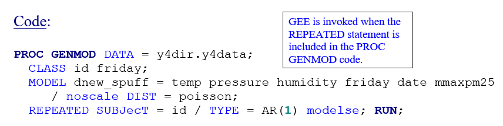
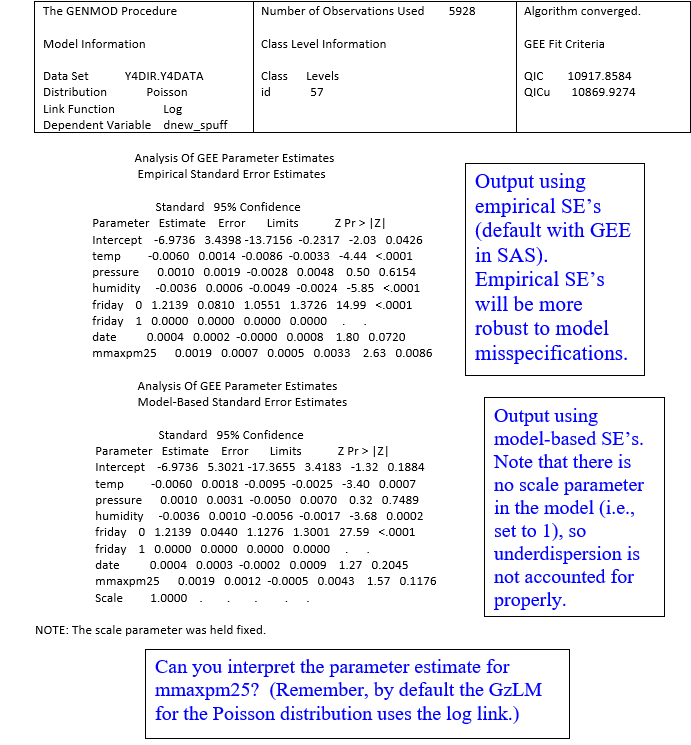
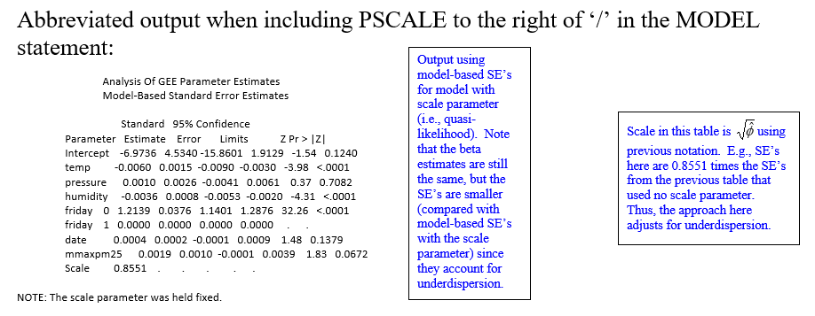
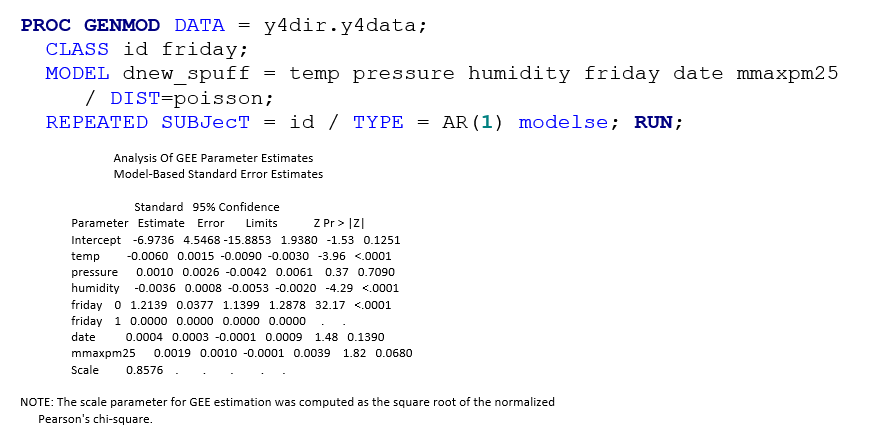

\newcommand{\textcm}{\textcolor{magenta}}
```{r setup, include=FALSE, cache=F, message=F, warning=F, results="hide"}
## setup directory
# setwd()
knitr::opts_chunk$set(cache = TRUE, echo = FALSE, message = FALSE, warning = FALSE)
knitr::opts_chunk$set(fig.height = 4, fig.width = 5, out.width = '50%', fig.align='center')
knitr::opts_chunk$set(fig.path = 'figs_L14/', cache.path = 'cache/')
```

# GEE

## Topics for today

-	When to use non-normal methods

-	Interpreting effects in loglinear and logistic models

-	Augmenting GzLMs to account for correlated responses

\vspace{\baselineskip}

- Related reading:

	- Sections 1 through 4 in the Non-normal notes [Section 3 was covered in more detail by Gary Grunwald]
	
	- Section 7 'Interpreting effects for loglinear and logistic models' in the 'Interpreting parameters in longitudinal models' chapter.

 
## Introduction

	- Topic:  models for outcome variables that are not normally distributed.

	- Methods for modeling non-normal correlated data are also discussed in BIOS7712.  

	- We have learned how to use linear mixed models to fit clustered data with continuous and approximately normally distributed outcome variables.  The models are versatile in handling random effects as well as repeated measures over time.  

	- For other types of outcome variables that involve clustered data, such as counts or binary outcomes, we can use generalized estimating equations (GEE) or employ generalized linear mixed models (GzLMM) as discussed in this chapter.

# GzLMM

## Determining when and when not to use normal theory methods

- A normal-theory model (e.g., GLM, LMM) may work adequately for a given outcome even if it is not perfectly normal.  Typically, the model fit will be fairly robust to violations of the normal assumption as long as the distribution is not too skewed or does not have a high percentage of data on one or more individual values, or when sample sizes are large enough that the central limit theorem comes into play.
  
-	Sometimes we can still employ normal theory models even when the outcome variable is non-continuous or non-normal.  

  -	Count outcome with a wide range of observed values not too close to 0.  

	- Variables that are 'normalized' after transformation, e.g., natural log transformation for right-skewed variables.  [But this impacts interpretation of model effects.]
 
## Consider the following examples of response variables and how you might model them.

1.	$Y$ = FEV1:  slightly right skewed; true lower bound of 0 although $P(Y=0)=0$ or negligible for a non-error blow.

2.	$Y$ = forced exhaled nitric oxide (FeNO):  moderately right-skewed; lower bound of 0 but $P(Y=0)=0$ or negligible.

3.	$Y$ = expenditures for health clinics; can be considered continuous; right skewed but with $P(Y=0)>0$ and possible that $P(Y=0)\gg 0$ (e.g., 20% or more).

4.	$Y$ = whether child had an asthma exacerbation in a given week (y/n).

5.	$Y$ = percentage of patients that adhere to doctor's directions, based on large n.

6.	$Y$ = number of times albuterol was used in a day by a child to treat asthma.  Counts of use typically range from 0 to 6, but most commonly are 0, 1 or 2.


## Generalized linear models (GzLM)

Poisson distribution:  the canonical link or natural link is the natural log link. Count outcomes can often be modeled using a Poisson distribution, although it is often necessary to add a dispersion parameter into the model.                 


Regression of a Poisson variable on one or more predictors is often referred to as Poisson regression.  For the Poisson, using the natural log link leads to $\mu_i=g^{-1} (\pmb x_i^r \pmb \beta)=exp(\pmb x_i^r \pmb \beta)$. Here is a plot of this function with one covariate and  $\beta_0=0$ and  $\beta_1=1$.


```{r "poisson", echo=FALSE, out.width="50%"}

```

##
	 
For the binomial, consider $\hat p_i=Y_i/n_i$, where $Y_i \sim \mathcal {Bin}(n_i,\ p_i)$.  Of course $p$ must be bound between 0 and 1 and intuitively would be a continuous function of  $\pmb x_i^r$.  In order to maintain these characteristics, one possibility is to set $p_i=\frac {e^{\pmb x_i^r \pmb \beta}} {1+e^{\pmb x_i^r \pmb \beta} }.$

This corresponds to the logit link. (Can you show?)  The function above is plotted to the right, for one continuous covariate, for  $\beta_0 = 0$ and  $\beta_1=1$; this demonstrates the signature 'slanted S' shape.  However, for certain applications, this may not be apparent since the range of $x$ values may only cover a portion of the 'S'.

```{r "binomial", echo=FALSE, out.width="50%"}

```


## Interpreting effects for loglinear and logistic models

There are two common situations where loglinear models are used:  

(i) when the outcome variable is log transformed to be approximately normal
(ii) when a log link is used for a count variable (e.g., Poisson regression). 

For such models, we can easily derive multiplicative effects.
Let's first consider case (i); for simplicity, consider the simple model $ln(Y_{ij})= \beta_0+ \beta_1  x_{ij} + \epsilon_{ij}$, for subject $i$ and time $j$.  

Then, $Y_{ij} = e^{\beta_0+ \beta_1 x_{ij} + \epsilon_{ij}}$, which implies that
$E(Y_{ij}  |X_{ij} =x_{ij} )= E[e^{\beta_0+ \beta_1 x_{ij} + \epsilon_{ij}}]			=E[e^{\beta_0+ \epsilon_{ij} } e^{\beta_1 x_{ij}}]			=e^{\beta_1 x_{ij} } E[e^{\beta_0+ \epsilon_{ij}}] =e^{ \beta_1 x_{ij} } c$

and $E[Y_{ij}| X_{ij}]  = x_{ij} +1]=e^{\beta_1 (x_{ij} +1)} c$, where $c$ is a constant.  From these, $E[Y|x+1]/E[Y|x]=e^{\beta_1 }$.  In words, the multiplicative increase in the mean of $Y$ for a 1-unit increase in $x$ is $e^{\beta_1 }$.  Or the relative increase in the mean of $Y$ for a 1-unit increase in $x$ is $100(e^{\beta_1 }-1)\%$.  

##

Case (ii) (log link in generalized linear models) differs from (i) in that the natural log is taken on $E[Y]$ and not $Y$ itself.  Consider (1), with one simple linear predictor: $ln(\mu_i)= \beta_0+ \beta_1 x_i$

Exponentiating both sides yields $\mu_i=e^{\beta_0+ \beta_1 x_i }$

Thus,  $\beta_1$ also has a multiplicative effect interpretation, as before.  The log is the natural link for Poisson outcomes and consequently beta parameters associated with predictors in Poisson regression have relative increase interpretations when the natural link is used.

##

Some things differ between cases (i) (logged outcome for a normal theory model) and (ii) (log link for a count outcome) above.  

-	In (i) we model the mean of the logged $Y$ values, so inverting back to original units will yield the geometric mean (usually closer to the median than the arithmetic mean for right skewed distributions). In (ii), we model the log of the mean (where 'mean' is the arithmetic mean).

-	For (i), if we assume that normal theory model assumptions are met after log transformation (including constant variance), then equal variances on that scale will imply that variances on the original scale will increase as the mean of $Y$ increases.  This is why the log transformation is sometimes used to 'stabilize' variance.  In (ii), we assume constant variance on the regular scale [i.e., for $Y$, not $log(Y)$]


##

For logit link models, odds ratios are derived readily.  To illustrate this using the simple linear logit model: $log[(\pi (x)/(1-\pi (x))]= \beta_0+ \beta_1 x$,	where $\pi (x)=P(Y=1|X=x)$.  

Exponentiating both sides yields $\pi (x)/(1-\pi (x))=e^{\beta_0+ \beta_1 x}.	\ \ \ \ \ (4)$

But note that $\pi (x+1)/(1-\pi (x+1))=e^{beta_0+ \beta_1 (x+1)} \ \ \ \ \ \ (5)$

Thus, if we divide (5) by (4), we yield an odds ratio (a ratio of ratios):  $\frac {\pi (x+1)/(1-\pi (x+1))} {\pi (x)/(1-\pi (x))} = e^{\beta_1}$.

In words, for a 1-unit increase in $x$, the odds of an event (associated with $Y=1$) increases $e^{\beta_1}$ times.


# Augmenting GzLMs to account for correlated responses 

## Generalized estimating equations (GEE)

One option in modeling correlated non-normal outcome data is to use generalized estimating equations (GEE) that can be applied to GzLMs for longitudinal data.  To begin, initial estimates are obtained assuming data are independent, using the usual GzLM methodology.  GEE are then applied iteratively to obtain estimates of interest accounting for the correlated data.  

GEE does not work with a true likelihood and thus does not actually fit a true covariance matrix.  Rather, it uses what is called a working covariance matrix.  But the forms of the working structures that can be used are ones we are familiar with (e.g., AR(1), exchangeable - i.e., CS).  

##
 
The specific steps for GEE are as follows.  This is just a sketch; for more detail see the SAS Help Documentation or other references listed at the end of this subsection.  

1. Use standard GzLM theory to obtain initial estimates of  $\pmb \beta$.
2. Compute working correlations based on standardized residuals, the current estimate of $\pmb \beta $ and the assumed covariance structure.
3. Compute an estimate of $\pmb V_i = Var[\pmb Y_i]$.
4. Update the estimate of  $\pmb \beta$ using the new estimate of $\pmb V_i$.
5. Repeat steps 2-4 until convergence.

GEE is considered a general type of quasi-likelihood estimation (QLE) since it is an estimation method that is not built on maximum likelihood principles and only requires the form of the mean, the variance as a function of the mean, correlation parameters (via the 'working' correlation matrix), and scale parameter (see Liang and Zeger, 1986).


##
 
After the GEE process is complete, model-based and empirical forms of 
$Var[\pmb {\hat \beta}]$ can be obtained in order to conduct tests involving  $\pmb \beta$.  The forms of these variances (e.g., **see Hedeker, p. 137-38**) are analogous to the model-based and empirical forms of variances of beta estimates in mixed models.  

The default in SAS is to use the empirical estimates (sometimes also called robust, or sandwich estimators).  These estimators have the advantage that they are robust to miss-specifications of the (working) covariance structure.  

However, for smaller sample sizes the use of residuals often leads to an underestimated standard error; the smaller the sample size, the worse the underestimation.  (Yu Zhang, examined this issue for count outcomes and successfully defended his Master's Thesis on this topic.)

##

In order to obtain the model-based variance estimators, include MODELSE as an option in the REPEATED statement.  If this is done, there are various ways to adjust the variance estimates by scale parameter estimates, some of which are listed below (in SAS).

- Adjust the variance estimates by a scale parameter by including $\phi$ as a scalar in $Var[\pmb Y_i]$ within the GEE estimation process.  This can be achieved by not including a SCALE or NOSCALE option in the MODEL statement.  A standardized Pearson statistic is used to estimate $\phi$.

- Fix the scale parameter at 1 in the GEE estimation process but then adjust variance estimates by a factor of  $\sqrt \phi$, using a Pearson or deviance statistic to estimate $\phi$.  In the MODEL statement, include the PSCALE option to use the Pearson statistic or the DSCALE option to use the deviance statistic.

- Do not adjust variance estimates by a scale parameter.  This can be achieved by including the NOSCALE option in the MODEL statement.

##

Note that for GzLM fits, the inclusion of the scale parameter in the GEE process [a scalar in the equation of $Var[Y_i]$] will affect $Var[\pmb {\hat \beta}]$, but not  $\pmb {\hat \beta}$ itself, as is the case for standard GzLMs.

For GzLMs, the theory is developed for independent responses from subjects (i.e., cross-sectional data).   GEE is then an extension for clustered data (e.g., longitudinal data).  Thus, the notation of GzLMs can be modified to account for this.  Specifically, we can use $\eta _{ij} =\pmb x_{ij} ^r \pmb  \beta$  to denote linear predictor for subject $i$ at time $j$; $\pmb x_{ij} ^r$ is a row vector with elements $x_{vij}$, where $v$ denotes the covariable (formerly denoted by $j$; $j$ is now used to index time).  The response for subject $i$ at time $j$ is then denoted as $Y_ij$.  Other quantities can be generalized similarly (e.g., **see Hedeker, 2006**).  

# References

## References:

Liang K-YL, Zeger S.  (1986) Longitudinal Data Analysis Using Generalized Linear Models, Biometrika 73(1): 13-22.  [Original article on GEE.]

Hedeker D., Gibbons RD.  (2006) Longitudinal Data Analysis, Wiley, NJ, Chapter 8:  Generalized Estimating Equations (GEE) Models. 

SAS Help Documentation:  SAS/STAT, The GENMOD Procedure, Details, Generalized Estimating Equations, v. 9.1 and 9.2, Cary, NC.

# Application

## Application of GEE with a count outcome

Count outcome variables can often be fit with a Poisson distribution, perhaps with the addition of a scale parameter, if necessary, if there is over- or under-dispersion.  The following count outcome example is from my work, illustrating a significant association between daily doser medication use and air pollution.  The data are fit using GzLM/GEE.  These data tend to be underdispersed relative to the Poisson distribution (i.e., the variance tends to be less than the mean).

Code:

```{r "sas code", echo=FALSE, out.width="60%"}

```

##
 
Condensed output:

```{r "sas output", echo=FALSE, out.width="80%"}

```

##
 
If you include the PSCALE or DSCALE options in the MODEL statement, the model-based SE's will be a bit closer to the SE's using empirical methods:

Abbreviated output when including PSCALE to the right of '/' in the MODEL statement:

```{r "sas output2", echo=FALSE, out.width="80%"}

```


The 'Scale' estimate is $\sqrt \phi$, and the SE's here are equivalent to those from the model-based SE's when NOSCALE is used, times $\sqrt \phi$.  In this case the SE's are still larger than when using the empirical approach, despite the scale adjustment.  When including DSCALE, the square root of $\phi$ is 0.8956, so that the adjustment to the original model-based SE's are even less.  

##

The following is the partial output obtained when not including any SCALE or NOSCALE option in the MODEL statement.  Here, the phi parameter is involved in the GEE estimation, but note that the results are not too different than the previous one in which the variance estimates were only adjusted after the GEE estimation.

```{r "sas output3", echo=FALSE, out.width="80%"}

```

# Summary

## Summary