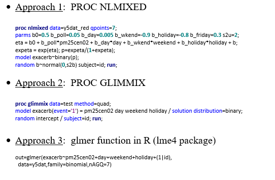
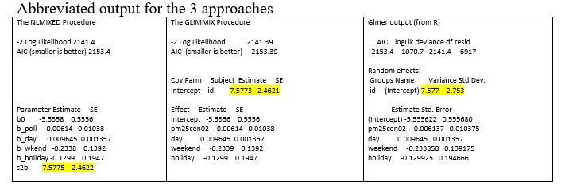
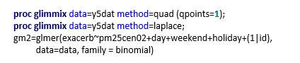
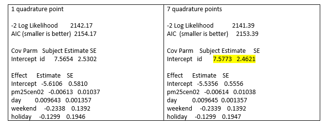
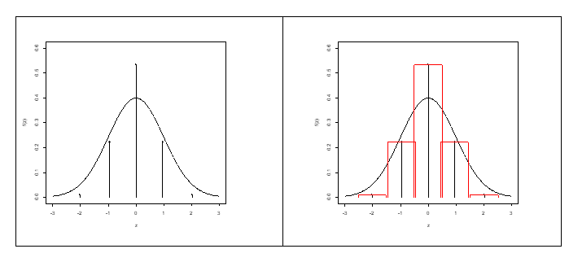

```{r setup, include=FALSE, cache=F, message=F, warning=F, results="hide"}
## setup directory
# setwd()
knitr::opts_chunk$set(cache = TRUE, echo = FALSE, message = FALSE, warning = FALSE)
knitr::opts_chunk$set(fig.height = 4, fig.width = 5, out.width = '70%', fig.align='center')
knitr::opts_chunk$set(fig.path = 'figs_L15/')
```

# Gaussian Quadrature

## Topics for today

- Generalized linear mixed models (GzLMM)

- Approximating the likelihood function associated with the GzLMM

\vspace{\baselineskip}

- **Related reading:  Sections 5 in Non-normal notes.**

## Generalized linear mixed models (GzLMM)

GzLMMs combine generalized linear model and linear mixed model theory.  There are greater complexities in fitting GzLMMs, due to nonlinearity involved with the model.

When extending GzLM theory to longitudinal data, we consider the mean link function in terms of both subject ($i$) and time ($j$):  $g(\mu_{ij} )=\pmb {X_{ij}^r \beta}$, where $\pmb X_{ij}^r$ denotes the $j$th row of $\pmb X_i$ (if considering the subject-specific model) or the ($ij$)th row of $\pmb X$ (if considering the full data model).  

We could extend the model to other types of clustered data but for now we'll just focus on longitudinal data.

##

Adding the 'mixed' component, $\pmb {Z_{ij}^r b_i}$, to the mean link function for a longitudinal GzLM yields a GzLMM: $g(\mu_{ij} )  =\pmb {X_{ij}^r \beta}+\pmb {Z_{ij}^r b_i}$

where $g$ is a link as previously discussed (e.g., log link for counts, logit link for binary outcomes), $\mu_{ij}=E[Y_{ij} |b_i,\ x_{ij}]$, $\pmb b_i \sim \mathcal N (\pmb 0,\ \pmb G_i)$, and $\pmb Z_{ij}^r$ is  the $j$th row of $\pmb Z_i$, the covariate matrix for subject $i$, associated with random effects $\pmb b_i$.

The left side of a GzLMM looks like a GzLM and the right side looks much like an LMM.  The mean is often simplified to $\mu_{ij}=E[Y_{ij} |b_i]$ in the literature (or my notes), where conditioning on $x_{ij}$ (and parameters) is implied.

Interpretation of effects associated with GzLMMs are different than those based on GzLM/GEEs, which will be discussed more later.

For a GzLMM, the linear predictor is generalized from the standard GzLM by the addition of random effects:  $\eta _{ij}=\pmb {X_{ij}^r \beta}+\pmb {Z_{ij}^r b_i}$.

##

We can express the model in 'complete data' form as $g(\pmb \mu)= \pmb {X\beta} + \pmb {Zb}$, where $\pmb \mu =E[\pmb Y|\pmb b,\ \pmb x]$ (an $r_{tot} \times 1$ vector) and quantities on the right-hand side of the equation are defined as in the early part of the LMM notes.   An expression of the model above that will be useful for estimation discussed later is $\pmb \mu = g^{-1} (\pmb {X\beta} + \pmb {Zb})$.

Fitting of the GzLMMs does not involve GEE.  Two common approaches used include approximating the true likelihood function or using pseudo-likelihood estimation; we'll talk about the former today.

## Fitting the GzLMM by approximating the likelihood function

Let $h(\pmb b_i)$ and $f(y_i)$ denote the pdf's of the random effects and responses for subject $i$, respectively. Also, let $l(y_i | \pmb b_i)$ denote the conditional pdf of of the responses given the random effects that is a member of the exponential family (e.g., Poisson, binomial, geometric, gamma).  Then, we can express the density of the responses as $f(\pmb y_i) = \int l(\pmb y_i |\pmb b_i)h(\pmb b_i)d\pmb b_i$ 	for subjects $i=1,\ ...,\ n$. This will be useful in setting up a likelihood equation for estimation of parameters.

When subjects are assumed to be independent (the standard case), then the likelihood function is $L=\prod _{i=1}^nf(\pmb y_i)$.  For computation we can use $ln(L)=\sum _{i=1}^nln[f(\pmb y_i)]$.

## 

For normal outcomes, the likelihood could be expressed in closed form because the integral in the likelihood function involves only normal distributions, but numerical techniques were required to optimize the function.  For non-normal outcomes, the function cannot even be written in closed form.  

However, we can approximate the log-likelihood function using a numerical integration technique such as Gaussian quadrature.  In this case our original likelihood, $L=\prod _{i=1}^n\int l(\pmb y_i |\pmb b_i)h(\pmb b_i)d\pmb b_i$ is approximated as $L\approx \prod _{i=1}^n\sum _{k=1}^Kl(\pmb y_i |\pmb b_i=\pmb v_k)w_k$ where $K$ is the number of quadrature points, vk are evaluation points (or abscissae, or nodes) and wk are weights.  The weights and evaluation points are chosen to optimize the approximation.  [See Fitzmaurice et al. for more detail.]

An optimization technique such as the Dual Quasi-Newton method can then be be used to maximize the approximate function in order to determine maximum likelihood parameter estimates.

As with standard LMM's, the random effects can then be estimated as the mean of the random effects distribution, given the data and parameter estimates.

## Software to fit GzLMMs using Gaussian quadrature

SAS has two procedures available to approximate a GzLMM using adaptive Gaussian quadrature, after which a dual Quasi-Newton method is used to optimize the function:

-	PROC NLMIXED

-	PROC GLIMMIX:  specify *method=quad* to perform adaptive Gaussian quadrature or *method=laplace* to use Laplace's method (the latter is equivalent to *method=quad* with 1 quadrature point).

In R, the **glmer()** function in the **lme4** package can be used to approximate a GzLMM using Gaussian quadrature.

SAS uses *adaptive* quadrature by default, meaning the number of quadrature points is selected based on the data, model and specified tolerance limits.  But with both SAS and R, the number of quadrature points can also be specified.

##

SAS and R use Gauss-Hermite quadrature (a specific type of Gaussian quadrature) to fit likelihoods for GzLMM's, which accounts for the $exp⁡(-b_i^2$) term in the density of random effects (part of the normal density); this term becomes part of the weights (will illustrate later). 

To demonstrate the different procedures, exacerbation data from the Kunsberg kids / air pollution study was used.  In this case, the 2003-04 study year was used; otherwise data are similar to that presented in the 'Non-normal' notes.  The code and abbreviated output follow, using 7 quadrature points. 

```{r echo=FALSE}

```

# Some notes

## Some notes:

Data below use 6923 observations on 43 subjects.  The outcome is exacerbation (1=yes, 0=no); logit link.

In SAS PROC GLIMMIX the number of quadrature points (7) was selected adaptively based on the data and model at hand, and the default tolerance limit; in R we requested it using the nAGQ argument and with PROC NLMIXED we obtained it using an option.  If no nAGQ option is given, R will use 1 quadrature point (i.e., Laplace method).

From SAS Documentation:  “The quadrature rule in the GLIMMIX procedure is adaptive in the following sense: if you do not specify the number of quadrature points with the QPOINTS= suboption of the METHOD=QUAD option, then the number of quadrature points is determined by evaluating the log likelihood at the starting values at a successively larger number of nodes until a tolerance is met.”  

##

NLMIXED also uses an adaptive approach by default, although you might end up with different number of quadrature points compared with GLIMMIX.  For example, to get 7 quadrature points for the data above in NLMIXED without specifying the QPOINTS option, I need to change QTOL from $10^{-4}$ to $10^{-5}$: proc nlmixed data=y5dat qtol=0.00001;.  I believe the default QTOL is the same in GLIMMIX, but they may have different meanings based on how data are processed by the different sets of code.

R also stats that the quadrature is adaptive, although I am not sure in what sense.  Their documentation states that the number of quadrature points defaults to 1, in which case it does say it is using Laplace approximation; to get more than 1 point, you need to specify it, in which case it says 'Adaptive' quadrature is used, but to get this, the number of points is specified!

## Abbreviated output for the 3 approaches

```{r echo=FALSE}

```

The results are quite similar, except for the higher SE for the subject variance estimate.

In addition, the GLIMMIX code (Approach 2, middle), displays fit statistics for the conditional distribution:


Fit Statistics for Conditional Dist.

-2 log L(exacerb | r. effects): 1995.76
Pearson Chi-Square: 4398.25
Pearson Chi-Square / DF: 0.64

##

The level of accuracy of estimates is controlled by the number of quadrature points used in the approximation.  You can specify this in the method option.

When the number of quadrature points is 1, Gaussian quadrature is equivalent to Laplace's method.  The following 3 statements can be used to obtain Laplace's method.

```{r echo=FALSE}

```

You need to consider the best number of quadrature points to use.  The more, the better, although as you increase it, the computational burden increases.  If $K$ is the number of quadrature points and $q$ is the number of random effects (for each subjects), then “the GLIMMIX procedure evaluates $K^q$ conditional log likelihoods for each observation to compute one value of the objective function.”  (From SAS Documentation.)

##

One possible approach would be to run GLIMMIX will default settings, and then possibly increase the number of quadrature points incrementally and see what impact it has on accuracy of the fit.  The following shows differences for our data when using 1 versus 7 quadrature points when using PROC GLIMMIX.

```{r echo=FALSE}

```

## Deriving the likelihood for GzLMM's

Let $h(\pmb b_i)$ and $f(\pmb y_i)$ denote the pdf's of the random effects and responses for subject $i$, respectively. Also, let $l(\pmb y_i | \pmb b_i)$ denote the conditional pdf of the responses given the random effects that is a member of the exponential family (e.g., Poisson, binomial, geometric, gamma).  Then, we can express the density of the responses as $f(\pmb y_i)=\int l(\pmb y_i |\pmb b_i)h(\pmb b_i)d \pmb b_i$ for subjects $i=1,\ ...,\ n$. This will be useful in setting up a likelihood equation for estimation of parameters.

When subjects are assumed to be independent (the standard case), then the likelihood function is $L=\prod _{i=1}^n f(\pmb y_i)$.

##

Let's consider the likelihood function for the GzLMM that has a binary outcome and a random intercept for subjects.  Specifically, let's consider the following model

$Y_{ij} |b_i \sim \mathcal {Bernoulli}(p_{ij})$, for $i=1,\ ...,\ n$ and $j=1,\ ...,\ r$ $ln[p_{ij}/(1-p_{ij})]=\beta x_{ij}+b_i$, $b_i \sim \mathcal N (0,\ \sigma ^2)$

Note that $p_{ij}=P(Y_{ij}=1|b_i)=\frac {exp( b_i+\beta x_{ij})} { 1+exp( b_i+\beta x_{ij})}$

(For the following, conditioning on covariates and parameters is suppressed for convenience.)  This is essentially taken from **McCulloch's An Introduction to Generalized Linear Mixed Models**.  I am starting with the 'data wide' model, where subjects are stacked into the $Y$ matrix (next page):

##

$$
L(\beta,\ \sigma ^2;\ \pmb y)=f(\pmb y)=\int l(\pmb y|\pmb b)h(\pmb b)d\pmb b $$

\vspace{-5mm}

$$ =\int_{\pmb b} P(\pmb Y= \pmb y| \pmb b)h(\pmb b)d\pmb b 
$$

\vspace{-5mm}

$$ 
=\int_{\pmb b}  \prod_{i, j} P(Y_{ij}=y_{ij} |b)h(b)db
$$

\vspace{-5mm}

$$ 
=\prod_i \int_{b_i}\prod_j P(Y_{ij}=y_{ij} |b_i)h(b_i)db_i
$$


Note that for $y_{ij}=1$, we have $P(Y_{ij}=y_{ij} |b_i)=P(Y_{ij}=1|b_i)=p_{ij}$ and for $y_{ij}=0$ we have $P(Y_{ij}=y_{ij} |b_i)=P(Y_{ij}=0|b_i)=\frac 1 {1 + exp( b_i+\beta x_{ij})}$, so collectively we can write  $P(Y_{ij}=y_{ij} |b_i)= \frac {exp\big(y_{ij} (b_i+\beta x_{ij}) \big)} {1+exp(b_i+\beta x_{ij})}$.

Hence we can write 

$$
L(\beta,\ \sigma ^2;\ \pmb y) = \prod_i \int_{b_i}\prod_j P(Y_{ij}=y_{ij} |b_i)h(b_i)db_i   =\prod_i \int{b_i}\prod_j \Bigg[ \frac {e^{y_{ij} (b_i+\beta x_{ij})}} {1+e^{b_i+\beta x_{ij}}} \Bigg] h(b_i) db_i 
$$

\vspace{-5mm}

$$
=\prod_i \int_{b_i} \prod_j \Bigg[\frac {e^{y_{ij} (b_i+\beta x_{ij})}} {1+e^{b_i+\beta x_{ij}}}\Bigg] \times \frac {e^{-b_i^2/2\sigma ^2}} {\sqrt{2\pi \sigma ^2 }} db_i  
$$

\vspace{-5mm}

$$
=\prod_i \int_{b_i} \frac {e^{\sum_j y_{ij} (b_i+\beta x_{ij})} } {\prod_j (1+e^{b_i+\beta x_{ij}})} \times \frac {e^{-b_i^2/2\sigma ^2}} {\sqrt{2\pi \sigma ^2 }} db_i
$$

##

We could also express the likelihood in a slightly more succinct form in terms of the $p_{ij}$ (e.g., see Parzen 2011): $L(\beta,\ \sigma ^2;\ \pmb y)=\prod_i \int _{b_i} \Big[ \prod_j p_{ij}^{y_{ij}} (1-p_{ij} )^{(1-y_{ij})} \times \frac {e^{-b_i^2/2\sigma ^2}} {\sqrt{2\pi \sigma ^2 }} \Big] db_i$

Note that in order to maximize the likelihood we input the data ($x$ and $y$ values).  For example, say that one subject has 5 observed $y$ values of $(0,\  1,\ 1,\ 0,\ 1)$, with associated $x$ values of $(1,\ 2,\ 3,\ 4,\ 5)$.  Then on the interior of the likelihood that is within the square brackets on the last equation (for that subject '$i$'), we would have (next page):

##

$$
(1-p_{i1})p_{i2} p_{i3} (1-p_{i4})p_{i5} \frac {e^{-b_i^2/2\sigma ^2}} {\sqrt{2\pi \sigma ^2 }} 
$$

\vspace{-5mm}

$$
 =\frac {e^{3b_i+10} e^{-b_i^2/2\sigma^2}} {\sqrt {2\pi \sigma ^2} \prod_j (1+e^{b_i+\beta_j})} 
 $$

\vspace{-5mm}

$$ =\frac {e^{3b_i+10-b_i^2/2\sigma ^2}}  {\sqrt {2\pi \sigma ^2 } (1+e^{b_i+\beta})(1+e^{b_i+2\beta})(1+e^{b_i+3\beta})(1+e^{b_i+4\beta})(1+e^{b_i+5\beta})}
$$


Note that we integrate over the last quantity with respect to $b_i$, then repeat for all subjects and multiply together.  This gives a flavor of the complexity of the integration.  (Actual optimization uses the log likelihood, in which case it is a matter of summing logged quantities over subjects.)

# Illustration

## Illustration of Gauss-Hermite quadrature

Consider integration of the form $\int_{-\infty }^\infty e^{-x^2} f(x)dx$.  Using Gauss-Hermite quadrature we can approximate this quantity as $\sum _{i=1}^nw_i f(x_i)$, where $w_i$ are weights used in place of $e^{-x^2}$.  

As an illustration, consider $X \sim \mathcal N (\mu,\ \sigma ^2)$ and we wish to evaluate $E[f(X)] = \int_{-\infty }^\infty \frac 1 {\sigma \sqrt {2\pi}} e^{-\frac {(x-\mu)^2} {2\sigma ^2}} f(x) dx$.

Using a change of variables $z=(x-\mu)/(\sqrt {2} \sigma )$ we can perform integration by substitution to express $E[f(X)]=\int_{-\infty }^\infty 1/\sqrt {\pi}  e^{-z^2} f(\sqrt {2} \sigma z+\mu) dz$.


Using this form we can then use the Gauss-Hermite rule to obtain $E[f(X)] \approx \frac 1 {\sqrt {\pi}} \sum _{i=1}^m w_i f(\sqrt {2} \sigma z_i+\mu)$.  

The $m$ (standardized) evaluation points, $z_i$, $i=1,\ ...,\ m$, are the roots of the Hermite polynomial Hn(z), with weights $w_i=\frac {2^{n-1} m!\sqrt {\pi}} {m^2 [H_{m-1} (x_i)]^2}$

In the approximation above, the weight variable takes the place of the $e^{-z^2}$ term.

##

For example, for $m=5$, $H_5 (z)= 32 z^5-160z^3+120z$ and $H_4(z)=16z^4-48z^2+12$, which yields $z_i=(-2.02, -0.96, 0, 0.96, 2.02)$ and $w_i=(0.02, 0.39, 0.95, 0.39, 0.02)$.

Notes:  (i) the 'roots' are the values of $z$ that satisfy $H_5(z)=0$; (ii) more places can be kept for greater accuracy in the actual calculation; (iii) more evaluation points can be used if greater approximation for the numerical integration is required.

By setting the $f(x)$ function to 1 we can use the Gauss-Hermite approximation for the area under the curve itself:  $\int_{-\infty }^\infty \frac 1 {\sigma \sqrt {2}\pi}  e^{- \frac {(x-\mu)^2} {2\sigma ^2 }} dx= \frac 1 {\sqrt {\pi}}  \int_{-\infty }^\infty e^{-z^2}  dz=\frac 1 {\sqrt {\pi}}  \sum _{i=1}^mw_i =1$.  I.e., the weights above sum up to the square root of $\pi$.

##

The lower left graph shows the standard normal pdf, with the evaluation points (x-axis) and weights (y-axis) used in the Gauss-Hermite approximation approach using 5 evaluation points with the example above.  The curve is continuous and the numerical approximation uses discrete points, but you could consider a histogram approximation by making a bar for each discrete point that has width=1, and centered on the points, shown on the right.  The area of the histogram is 1, just like the area under the curve, although individual bars may seem to be too high or low.


```{r echo=FALSE}

```


##

For another example, say $f(X)=X^2,\ \mu=10$ and $\sigma =2$.  Using the Gauss-Hermite approximation we find that $E[X^2]=104$.  We can verify this quickly by employing the fact that $\Big(\frac {(X–10)} 2\Big)^2$  has a chi-square distribution with 1 degree of freedom.

These examples are simpler than Gauss-Hermite quadrature used for approximating likelihoods of GzLMM's, which involve multiple subjects and more complicated functions (e.g., the logistic likelihood previously derived).  However, the principle is the same.

Interpretation

## Interpreting random effects and associated covariance parameters in GzLMM's

For mixed models with non-normal outcomes, how do we interpret the random effects and their covariance parameters?

It's pretty easy for normal models.  For example, if we have a simple random intercept LMM (plus fixed effects), a value of $b_i=1.5$ means that this subject is estimated to be 1.5 units higher than the average value of Y.  But for a logistic regression model, the same $b_i$ value would represent an increase in the log odds of 1.5, which relates to an increase in odds of $e^{1.5}=4.5$.

The same random effect value in a Poisson model with log link would relate to a 4.5 times increase in outcome.

##

We could also put it in terms of probability by noting that  $p_{ij}=P(Y_{ij}=1|b_i)=\frac {exp(b_i+\pmb {X_{ij}^r \beta})} {1+exp( b_i+\pmb {X_{ij}^r \beta})}$ and then compare $p_{ij}$ for $b_i=0$ vs. that of $b_i=1.5$.  Unfortunately, this comparison depends on values of predictors unless there is only a fixed intercept in the model.

To interpret covariance parameters, we also need to consider the link used.  Consider again the logistic regression model with a random intercept:  $ln⁡[ p_{ij}/(1-p_{ij})]=\pmb {X_{ij}^r \beta}+b_i$, where $b_i \sim \mathcal N (0,\sigma_b^2)$.  If $\sigma_b^2=2$, then the standard deviation of the distribution of $ln (p_{ij}/(1-p_{ij} ))$ (given $\pmb  X_{ij}^r$ and $\pmb  \beta$) is 1.4.

We also note that $p_{ij}/(1-p_{ij})=exp(\pmb {X_{ij}^r \beta}+b_i)=exp(\pmb {X_{ij}^r \beta})exp(b_i)$.  As exp(b_i) has a log-Normal distribution with variance $exp(2\sigma_b^2 )-exp(\sigma_b^2)$, it follows that the variance of the odds is $Var[p_{ij}/(1-p_{ij})]=[exp(\pmb {X_{ij}^r \beta})]^2 Var[exp(b_i)] =[exp(\pmb {X_{ij}^r \beta})]^2 [exp(2\sigma_b^2 )-exp(\sigma_b^2 )]$.  But this may be harder to interpret it as the odds has a skewed distribution.

# Precision

## Estimating precision

Variance and covariance estimators associated with parameter estimators in the GzLMM can be derived from the inverse of the negative Hessian matrix.

For more detail on this, as well as a description of covariances that include random effect terms as well as fixed-effect estimators (i.e., $Var[(\pmb {\hat \beta}, \pmb {\hat b})^{\top}]$), see the SAS Help Documentation under PROC GLIMMIX, Details, Aspects Common to Adaptive Quadrature and Laplace Approximation.


# Summary

## Summary


