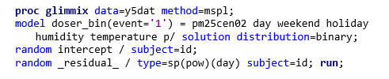

```{r setup, include=FALSE, cache=F, message=F, warning=F, results="hide"}
## setup directory
# setwd()
knitr::opts_chunk$set(cache = TRUE, echo = FALSE, message = FALSE, warning = FALSE)
knitr::opts_chunk$set(fig.height = 4, fig.width = 5, out.width = '70%', fig.align='center')
knitr::opts_chunk$set(fig.path = 'figs_L16/')
```

# Linearization

## Topics for today

- Generalized linear mixed models (GzLMM)

- GzLMM:  the linearization approach

\vspace{\baselineskip}

**Related reading:  Sections 5 in Non-normal notes**


## Overview for fitting a GzLMM using linearization methods

A GzLMM can be fit by 'linearizing' the data and employing LMM's; the transformed 'pseudo-data' P is fit with the linear mixed model $P=\pmb {X\beta}  + \pmb {Zb} + \pmb {\epsilon}$ to obtain $\pmb {\hat \beta}$ and $\pmb {\hat b}$.

Using the fitted model, pseudo data are recomputed, and the process is repeated iteratively until estimates converge.  

This is a doubly-iterated procedure, since we update estimates after each linear mixed model fitting, and within each linear mixed model fitting we use an iterative procedure as well.

##

The benefit of this approach is that we can take advantage of what standard LMM theory has to offer.  For example, we can fit a model that has both random effects and higher level structures for $\pmb R$, or that has multiple-level or complex (e.g. crossed) random effects.  

For GEE, we could specify a working covariance structure for $\pmb R$ but not include random effects; for GzLMM methods that use techniques to approximate the likelihood, we can specify random effects but cannot have non-simple $\pmb R$ matrices, or random effects at multiple levels.  

One drawback to the linearization method is estimator bias that has been reported (see the SAS Help Documentation: **Notes on Bias of Estimators page**).  The situations considered are more extreme cases, though (e.g., binary data, matched pairs designs, i.e., clusters of size 2).  The bias diminishes quickly as sample sizes increase.  


## A bit more history of the methods...

Breslow and Clayton (B&C, 1993, JASA) and Wolfinger and O'connell (W&O, 1993, Journal of Statistical Computation and Simulation) published articles on pseudo-likelihood methods (i.e., linearization methods) for GzLMM's.  (Also see earlier work referenced in W&O.)

Wolfinger and O'connell (W&O) referred to their methods Psuedo-likelihood approaches.  This article is relatively easy to read, and lays out the algorithm in a nice, organized fashion. 

B&C refer to their methods as forms of quasi-likelihood estimation.

To better distinguish the quasi-likelihood methods used for GzLM/GEE's for those here, we'll stick with W&O's 'Pseudo-likelihood' terminology.

The algorithms for the 2 sets of authors are the same when the scale/dispersion parameter $\phi$ in W&O's article is set to 1.  Note that this will be the case by default for binary/binomial and Poisson outcomes.

## The linearization approach uses a Taylor series expansion.

If the expansion is about the current fixed-effect and random-effect estimates, it is a subject-specific (SS) type of expansion (or Penalized Quasi-likelihood [PQL] in B&C).

If the expansion is about around current fixed-effect estimates and where random effects are set to 0, it is a population averaged (PA) type of expansion (or Marginal Quasi-likelihood [MQL] in B&C).

These differences should be kept in mind when interpreting the estimates.  See Fitzmaurice for more detail.

##

For PROC GLMMIX, you can specify one of 4 specific types of  linearization, RSPL, MSPL, RMPL or MMPL using the METHOD= option.

The first letter indicates whether the residual likelihood (R) or maximum likelihood (M) is used, i.e., REML or ML-type estimation while employing the LMM.

The second letter indicates whether the SS or PA type of expansion is used.  The last 2 letters stand for pseudo-likelihood estimation. 
 
Approaches other than linearization can also be used with PROC GLIMMIX, but involve approximating the true likelihood (quadrature and Laplace methods). The default method for PROC GLIMMIX is RSPL.

SAS needs initial values of $\pmb P$ to start the iterative process.  If no specification is made, the GLIMMIX output indicates what was used (e.g., 'Starting from:  GLM estimates' or '...data').  [I believe the 'GLM' they are referring to are what we call GzLM.]  The method used depends on what types of covariance parameters are specified in the model ($\pmb R$-side or $\pmb G$-side).  


## A bit more detail on transforming the data

Consider the GzLMM $\pmb g(\mu)=\pmb {X\beta}  + \pmb {Zb}$ , where $g(.)$ is a differentiable monotone link function, $\pmb b \sim \mathcal N(\pmb 0,\ \pmb G)$; $E(\pmb Y|\ \pmb b) = g^{-1} (\pmb {X\beta}  + \pmb {Zb} )=g^{-1} (\pmb \eta)=\pmb \mu$; $Var[\pmb Y|\ \pmb b]=\pmb A^{1/2} \pmb R\pmb A^{1/2}$ where $\pmb A$ is the variance function of $\pmb \mu$ based on the mean-variance relationship of the particular distribution considered.

For example, for a Poisson distribution, $\pmb A$ is a diagonal matrix with elements of $\pmb \mu$ down the diagonal, since for the Poisson the mean and variance are the same.

A first-order Taylor series expansion of $\pmb \mu$ about current values $\pmb {\tilde \beta}$ and $\pmb {\tilde b}$ is $g^{-1} (\pmb \eta) \approx g^{-1} (\pmb {\tilde \eta} ) + g'(\pmb {\tilde \mu}) X(\pmb {\beta - {\tilde \beta}}) + g'(\pmb {\tilde \mu})Z(\pmb {b - \tilde b})$.

It is possible to add a dispersion parameter to the model.  By default, log and logit link (i.e., for count and binary outcomes) will not have a dispersion parameter in SAS routines.

##

Rearranging this equation allows us to yield the mean of an LMM, given the random effects (on the right):  $g' (\pmb {\tilde \mu })\big(\pmb \mu - g^{-1} (\pmb {\tilde \eta}) \big)+\pmb {X \tilde \beta}  + \pmb {Z \tilde b}  \approx \pmb {X\beta}  + \pmb {Zb}$ .

The left side of the equation about is the expected value of 
$g' (\pmb {\tilde \mu}) \big(\pmb Y - g^{-1} (\pmb {\tilde \eta})\big) + \pmb {X \tilde \beta}  + \pmb {Z \tilde b}$ , conditional on $\pmb b$ (treating the terms with tilde hats as fixed).  

Thus, $\pmb P = g' (\pmb {\tilde \mu})\big(\pmb Y - g^{-1} (\pmb {\tilde \eta})\big) + \pmb {X {\tilde \beta}}  + \pmb {Z {\tilde b}}$  seems like a good candidate for the linearized data, since its expected value (given random effects) is $\pmb {X\beta}  + \pmb {Zb}$ via the approximation.

We can write $P$ more succinctly as $\pmb P=g' (\pmb {\tilde \mu})(\pmb Y- \pmb {\tilde \mu}) + g(\pmb {\tilde \mu})$.

##

$\pmb P$ is assumed to be approximately normal with variances

- $Var[\pmb P│ \pmb b] = g' (\pmb {\tilde \mu}) \pmb {\tilde A}^{1/2} \pmb R\pmb {\tilde A}^{1/2} g'(\pmb {\tilde \mu})$

- $Var[\pmb P]= \pmb {ZGZ}^{\top}+g'(\pmb {\tilde \mu})  \pmb {\tilde A}^{1/2} \pmb R\pmb {\tilde A}^{1/2} g'(\pmb {\tilde \mu})$

where all elements on the right are evaluated at the converged estimates; hence can really consider these as estimated variances, i.e., put '^' on Var.

Recall for a standard LMM that $Var[\pmb Y|\ \pmb b]=\pmb R$.  For a mixed model, adding a weight statement allows us to fit $Var[\pmb P| \pmb b]= \pmb {W^{-1/2} RW^{-1/2}}$, where $\pmb W$ is a diagonal weight matrix with weights $w_{ij}$ down the diagonal.

In our case, we have $Var[\pmb P│\pmb b]=g'(\pmb {\tilde \mu})  \pmb {\tilde A}^{1/2} \pmb R \pmb {\tilde A}^{1/2} g'(\pmb {\tilde \mu})$.  If we let 
$W^(-0.5)=g' (\mu) \pmb A^{0.5}$, it follows that $\pmb {\tilde W} =[g'(\pmb {\tilde \mu}) ]^{-2} \pmb {\tilde A} ^{-1}$ since both $g'(\pmb \mu)$ and $\pmb A$ are diagonal matrices with elements of interest down the diagonal.  Thus we can fit a weighted LMM to get the right variance.

##

For the Poisson, $g'(\pmb \mu)$ has elements $1/\mu_{ij}$ down the diagonal; $\pmb A$ has $\mu_{ij}$ down the diagonal.  Thus $\pmb W=[g' (\pmb \mu)]^{-2} \pmb A^{-1}=\pmb \mu$.  For the binomial, $\pmb W=\pmb \mu(1- \pmb \mu)$.  Can you derive this?

As the LMM for $\pmb P$ has parameters and random effects that are of interest in the GzLMM as well, we can essentially conduct inference for $\pmb \beta$  and $\pmb b$ using standard LMM methods, using converged values in the model for $\pmb P$.

For example, we can derive $Var[\pmb {\hat \beta}] =(\pmb X^{\top} \big[Var[\pmb P]\big]^{-1} \pmb X)^-$.  However, the variability in 'converged values' of $\pmb G$ and $\pmb R$ (i.e., the fact that they are estimated) are not taken into account.  SAS Documentation mentions previous research that incorporated inflation factors, but that for most data sets that are fairly well balanced, they do not make much difference.

More generally, inference for fixed and random effect estimates in the model follow in much the same way as for standard linear mixed models, but for the pseudo data model.  For more detail, see W&O, or Fitzmaurice's longitudinal text; you can also find some detail in the SAS Help Documentation but it is not as complete as the aforementioned references.

## An example of the algorithm for count data (log link)

To demonstrate the algorithm for PL, we would like to see how rescue inhaler count data for children at the Morgridge Academy at NJH relate to different types of fine particulate matter ($PM_{2.5}$) they are exposed to.  Specifically, we include cigarette smoke, ambient $PM_{2.5}$, their interaction, plus covariates of Friday indicator and temperature in the model.  (The Friday indicator helps to account for pretreats in the outcome, since they did not have physical exercise on that day compared to the others.)


## PL algorithm tailored for a Poisson outcome

_Step 1_:  fit a weighted LMM with raw data as the outcome and as weights.  

_Step 2_:  obtain the predicted values $\pmb {\tilde \mu} =\pmb {X \tilde \beta}  + \pmb {Z\tilde b}$  from Step 1 and calculate the pseudo-data as $\pmb P=(\pmb {Y-\tilde \mu})/\pmb {\tilde \mu} + ln(\pmb {\tilde \mu})$, based on the $ln$ link for the Poisson, 

_Step 3_:  Fit an LMM using latest versions of $\pmb P$ (outcome) and $+ \pmb {\tilde \mu}$ (weights).

_Step 4_:  obtain predicted values $\pmb {\tilde \mu} = exp(\pmb {X \tilde \beta}  + \pmb {Z \tilde b})$ from Step 3 and recompute P.  

_Continue Steps 3 and 4 until convergence_

## A few important notes on this algorithm:

Since there are likely to be some $y=0$ counts in the data, some adjustments need to be made since we don't want any records with '0 weight', which would be dropped from analysis).  One approach is to add 1 to all the counts.

In _Step 4_ we exponentiate to get predicted values since the LMM in _Step 3_ essentially involves an outcome on the log scale, while in _Step 1_ it's on the regular scale).

In W&O, they mention that convergence continues until changes in $\pmb G$ and $\pmb R$ are sufficiently small.  Another (indirect) approach is to continue until changes in the Beta estimates are sufficiently small.

It probably won't take to many LMM fits for convergence.  For example, it took 6 or 7 repeated LMM fits for the count data to converge.  (This is the outer shell.  Each LMM fit also involves iterations.)

## SAS Code 

```{r echo=FALSE}

```

## The same code in GLIMMIX form is here.  

```{r echo=FALSE}

```

Note that instead of using the REPEATED statement here (which doesn't exist in PROC GLIMMIX), we add another RANDOM statement with the key word "_residual_".  You can really think of this as a REPEATED statement, since it specifies the $\pmb R$ matrix.  
A few notes on approaches to get convergence:  I used sp(exp) instead of sp(pow) for convergence but they are intrinsically the same structure, just different parameterizations; I had to soften the convergence criteria just a bit using the pconv option.

Here I chose MSPL, mainly for more apples-to-apples comparisons with quadrature later.  Remember the default is RSPL.

## Walking through the output:

```{r echo=FALSE}

```

##

```{r echo=FALSE}

```

The pred_w1 coefficient is the estimate of effect for SHS $PM_{2.5}$ exposure in the absence of ambient $PM_{2.5}$ exposure; pred_w2 is vice versa.  The ratio of the estimates is a measure of toxicity of SHS $PM_{2.5}$ relative to ambient $PM_{2.5}$.

Note that predicted values were obtained from another regression.  SE's here are underestimated since they do not account for the variability of estimates in that first regression.  Asymptotic or bootstrap methods can be used to properly estimate the SE's (see Measurement error chapters).


## Comparing previous results with GEE and GLIMMIX quadrature

The table below shows different modeling approaches and impacts on estimates and SE's (in parentheses) of key predictors of interest.

```{r echo=FALSE}

```

Estimates are variable between modeling approaches, likely due to natural collinearity between main effects and interactions (Pred_w1 and Pred_w2 are positively correlated; the interaction is negatively correlated with each of Pred_w1 and Pred_w2).  As a result, the magnitude of all estimates tend to increase or decrease collectively, from one analysis to the next.  Functions of these estimates of main interest may differ less.

SE's are in strong agreement between the PL approach and model-based GEE approach, with empirical SE's somewhat higher.  The GzLMM quadrature approach overestimates SE's since it does not account for the underdispersion.


## An example with a binary outcome:  exacerbation events for asthmatic children

PL used to model the fairly rare exacerbation events; left:  PL using a random intercept (left), right: RI + AR(1) structure imposed on the errors.  

```{r echo=FALSE}

```

Output on left shows similarity to the previous results based on quadrature.

The model that uses the AR(1) structure (right) does have a substantially lower -2 log likelihood than the one on the left, but there are currently no commonly accepted goodness-of-fit statistics to compare models using PL, even nested ones.

##

Note that SE's are much bigger on the left (except for 'day'); this is probably due to underdispersion not being accounted for without R-side parameters in the model.  Based on this, I would probably go with the model on the right.

In R, the **glmmPQL()** function in the MASS package will do the linearization method and Pseudo-likelihood estimation.  

Up to this point I have experienced glmmPQL to be a bit more finicky than PROC GLIMMIX.  For example, for the exacerbation data set above, a run with a random intercept yields estimates that are fairly close to that of SAS, but outrageously large SE's, indicating some problem with the fit.  However, with the following medication use data (less rare events), the results are fairly close.

##

These data involve medication use (albuterol use, from inhaler).  This is generally used as needed, so is modeled as an outcome, as a function of a pollutant variable averaged over 3 days (the last day aligning with the day where med use was measured); weekend, holiday and Friday are indicator variables to allow differences on those days.  In particular, children were given pretreats on other school days (M-Th) when gym class, but not on Fridays or on weekends or holidays.  Temperature, pressure and humidity are meteorological variables that are typically included as covariates in air pollution models.

Code and abbreviated output follow, for the model that includes a random intercept for subjects, and spatial power structure for error covariances.

##

### R approach

library(MASS)
library(nlme)
gm1 <- glmmPQL(fixed = doser_bin ~ pm25cen02 + day + weekend + holiday, random = ~1 | id, correlation = corCAR1(form = ~day|id), family = binomial, data = dat)

###	SAS approach

```{r echo=FALSE}

```

<!-- proc glimmix data=y5dat method=mspl; -->
<!--  	model doser_bin(event='1') = pm25cen02 day weekend holiday  -->
<!--         humidity temperature p/ solution distribution=binary; -->
<!--  	random intercept / subject=id;  -->
<!--  	random _residual_ / type=sp(pow)(day) subject=id; run; -->

Notes:  the nlme package is necessary for the correlation structure (i.e., that argument in the glmmPQL function), while the MASS package is for the glmmPQL function itself; Newton-Raphson with ridging for optimization in SAS; no direct mention in R. Output (n=43 with 6417 total records used for analysis).  
	
## 

```{r echo=FALSE}

```

The estimates from SAS and R are the same; SE's are close.

Given it is PQL, it is a subject-specific locus expansion.  Since R output states that the '...model fit by Maximum likelihood...', I believe that the default method used in R is equivalent to MSPL in PROC GLIMMIX (rather than RSPL, which is the default method in PROC GLIMMIX).  This needs to be verified, though.

## Summary of some key points in previous analyses and extra notes

For Poisson regression, the residual variance acts as the scale (or dispersion) parameter if you include 'R-side' parameters in the model.

If you compare 'apples-to-apples' PL versus GEE models, you may notice that the residual variance is about equal to the scale parameter, and if the SE's of the beta estimates are adjusted for the scale parameter in the GEE, they should be about the same as those from PL.

The 'Gener. Chi-Square / DF' fit statistic reflects over/underdispersion.  From the Poisson models I've fit, it is equal to the dispersion parameter.

Fitting a negative binomial for the same underdispersed data yields a scale parameter of 0, meaning it is the same distribution as the Poisson, but in this case the statistic becomes 1.  The fact that the scale parameter is 0 is not surprising since the NB is more suited for overdispersed data, but not sure why the fit statistics are different.

# References

## References

Breslow NE and Clayton DG.  (1993).  Approximate inference in generalized linear mixed models.  Journal of the American Statistical Association 88, 9-25.

Wolfinger, R.D. and O'Connell, M.  (1993)  Generalized linear mixed models:  a pseudo-likelihood approach.  Journal of Statistical Computation and Simulation 48, 233-243.

# Summary

## Summary


