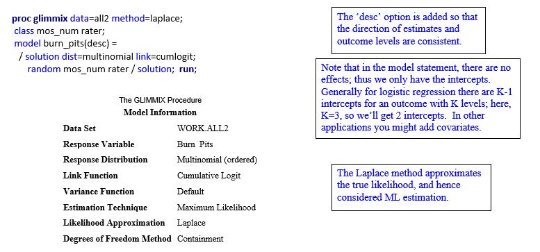
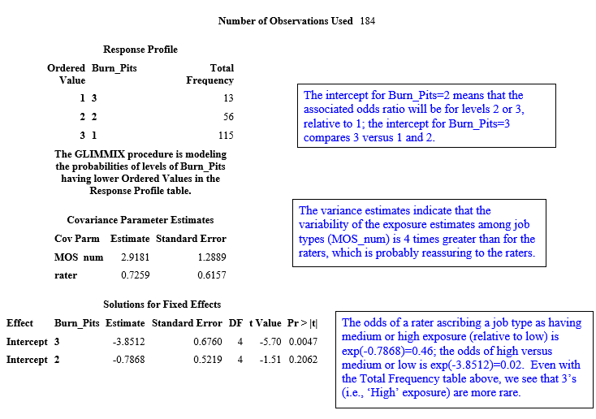
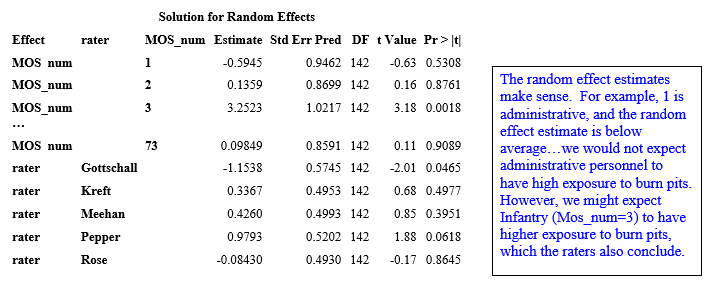

```{r setup, include=FALSE, cache=F, message=F, warning=F, results="hide"}
## setup directory
# setwd()
knitr::opts_chunk$set(cache = TRUE, echo = FALSE, message = FALSE, warning = FALSE)
knitr::opts_chunk$set(fig.height = 4, fig.width = 5, out.width = '50%', fig.align='center')
knitr::opts_chunk$set(fig.path = 'figs_L17/', cache.path = 'cache/')
```

# Ordinal regression

## Topics for these notes:

-	Ordinal logistic regression

Associated reading:  as of now, the course notes do not have more information than what is here.

# Case study

## Case Study

"Since 2001, 3 million soldiers have deployed to Southwest Asia (SWA), with exposure to inhalants that cause respiratory disease. Department of Defense uses standard occupational codes, termed Military Occupational Specialty (MOS), to classify military personnel by job/training. We characterized Marine MOS by estimated exposure to inhalational hazards.  We developed an MOS-exposure matrix containing five major deployment inhalational hazards--sandstorms, burn pits, exhaust fumes, combat dust, occupational VDGF (vapor, dust, gas, fumes)--plus time worked outdoors. A 5 member expert panel of two physician deployment veterans and three occupational pulmonologists independently ranked 38 Marine MOS codes for estimated exposure intensity (3=high, 2=medium, 1=low) to each hazard."  From Pepper et al., 2017.

##

The MOS occupational codes (or MOS_num) are numbered 1 through 38, for convenience, but they relate to specific job types.  For example, 1=personnel and administration, 2=intelligence, 3=infantry, etc.

Our data follows this form, for a given inhalation hazard:

| Rater | MOS1 | MOS2 | MOS3 | MOS4 | MOS5 | ... |
|-------|------|------|------|------|------|-----|
| 1     | 1    | 1    | 3    | 2    | 1    |     |
| 2     | 1    | 1    | 3    | 1    | 1    |     |
| 3     | 1    | 2    | 3    | 2    | 1    |     |
| ...   |      |      |      |      |      |     |

The outcome is ordinal and given that there are only 3 levels (3 is high exposure, 2 is medium, 1 is low), we consider a model that is specialized for this type of outcome.

##

A GzLMM that can be used to fit our data has the form $\lambda_{ijk} = log\Big[\frac {P(Y_{ij} \leq k\ |\ b_i,\ b_j)} {1-P(Y{_ij} \leq k\ |\ b_i,\ b_j)}\Big] = \alpha_k + b_i + b_j$,

where $i$ = MOS_num, $j$= rater, and $k$ is outcome level; $\alpha_k,\ k=1,\ ...,\ K-1$ are strictly increasing intercepts; bi and bj are random intercepts for MOS_num and rater, respectively.

In order to get estimates that are commensurate with increasing levels of the outcome, we can reverse the inequalities to obtain $\lambda_{ijk}^c = log \Big[ \frac {P(Y_{ij} \geq\ k\ |\ b_i,\ b_j)} {1 - P(Y_{ij} \geq k\ |\ b_i,\ b_j)}\Big]=\alpha _k+b_i+b_j$.

This is the model we will fit for the application.  We achieve this model using a 'descending' option, discussed shortly.

## Some questions of interest for our data:

1. How do variances for raters compare with the variances over MOS types?

2. Are there any raters that significantly differ from the group average?

3. After adjusting for crossed random effects of MOS type and rater, what are the cumulative odds of low, medium, high exposure for a given inhalation hazard?

4. What is the probability of a particular job of having a high exposure to a given exposure type?

To answer these questions, we can fit the ordinal logistic regression model shown on the last slide that accounts for multiple measures per MOS type (called MOS_num below), which is the experimental unit here (instead of subjects).

## Descriptive approach to obtaining probabilities and odds ratios

First, to get an understanding of the statistics we're dealing with, let's consider the data more descriptively.


In the data, we have 115 MOS's assigned as 'low exposure' job types (62.5%), 56 as 'medium' (30.4%) and 13 as 'high' (7.1%).


Without considering the correlation, the odds of a medium or high classification for a randomly selected MOS is (0.375)/(1-0.375) = 0.6; the odds of a high classification is 0.071/(1-0.071)=0.076.

When we fit the model, we account for the fact that rater's score every MOS; i.e., the random effects are crossed.  (In a previous data set we talked about raters and subjects being crossed, e.g., 'Dancing with the Stars'.)  This may impact the results.

# Logistic regression

## Back to the ordinal logistic regression

SAS Code for one inhalation exposure source, burn pits:

```{r echo=FALSE, out.width="80%"}

```

##

```{r echo=FALSE, out.width="80%"}

```

##

```{r echo=FALSE, out.width="60%"}

```

We see that Pepper scores job types higher, on average, with respect to Burn pit exposure, compared with the average rater; similarly, Gottschall scores lower.  These both occur with marginal significance.

##

From our ordinal logistic regression model, we note that $P(Y_{ij} \geq k\ |\ b_i,\ b_j)=\frac 1 {1+e^{-\lambda_{ijk}}}$ and $P(Y_{ij} \geq k|b_i=0,\ b_j=0)=\frac 1 {1+e^{-\alpha_k}}$.  From the latter, we can estimate that for an average rater and MOS_num, the probability of 'high' classification is $\frac 1 {1+e^{3.8512}} = 0.02$.  

Job and rater-specific probability estimates can be obtained by using the first formula.  We can also compute for specific MOS_num or raters, holding the other at its mean, since random effects are crossed.  For example, for an average MOS_num the probability of a high classification for Gottschall is $\frac 1 {1+e^{-(-3.8512-1.15)}} = 0.7\%$, while for Pepper it is $\frac 1 {1+e^{-(-3.85+0.98)}} = 5.4\%$.

We can get probabilities for any given level by computing the cumulative probabilities, and then taking differences [e.g., $P(Y=2)=P(Y \geq 2) - P(Y \geq 3).$] 

## Comparing the descriptive and modeled approaches

Going back to the probabilities and odds we determined for the descriptive approach, why do they differ from the modeled approach?
Descriptive:  	$P(M\ or\ H)=37.5\%$		$Odds(M\ or\ H)=0.6$         
				$P(H) = 7.1\%$			$Odds(H)=0.076$                        
Modeled:  		$P(M\ or\ H)=31.3\%$		$Odds(M\ or\ H)=0.46$
				$P(H) = 2\%$				$Odds(H)=0.02$               

Why the difference? It appears that taking the correlation into account affects results; if the random effects are removed, here is what we get from the model (same as descriptive, above):
Modeled:  		$P(M\ or\ H)=37.5\%$		$Odds(M\ or\ H)=0.6$                
				$P(H) = 7.1\%$			$Odds(H)=0.076$              

## Using the mixed-effects ordinal logistic regression for longitudinal data

We can generalize the formula for the mixed-effects ordinal logistic regression model so that it can be used for clustered / longitudinal data and include covariates.  One such model that is useful for repeated measures within subjects (or subjects within clusters) is $\lambda_{ijk}=log\Big[\frac {P(Y_{ij}\leq k\ |\ \pmb b_i)} {1-P(Y_{ij}\leq k|\pmb b_i)} \Big] = \alpha_k + \pmb x_{ij}^r \pmb \beta+ \pmb z_{ij}^r \pmb b_i$

where $i$ denotes subject, with measure $j$ (or subject $j$ in cluster $i$).  Here, we have hierarchical data and so the random effects (as is usually done) are defined for the level 2 data (subjects).

##

The previous model can be used for longitudinal ordinal logistic regression, although we only account for repeated measures via random effects.  (Using pseudo-likelihood methods, you could consider models that account for random effects or serial correlation, or both.)

Now we have what is called a proportional odds model (see McCullagh, 1980) that results from the fact that the relationship between the cumulative logit and the predictors does not depend on k.

For example, say that the previous case study also had measurements over time ($x$=time).  If we added this as a predictor, then the cumulative logits (and hence probabilities) would not change over time.

##

We can generalize the model slightly so that for certain predictors, we do not require the proportional odds assumption.

For example, Hedeker and Mermelstein (1998, 200) suggest the model $\lambda_{ijk}=log \Big[\frac {P(Y_{ij} \leq k\ |\ \pmb b_i)} {1-P(Y_{ij}\leq k\ |\ \pmb b_i)} \Big]= \alpha_k + \pmb x_{ij}^r \pmb \beta + \pmb s_{ij}^r \pmb \gamma_k + \pmb z_{ij}^r \pmb b_i$, where the additional term involving $\gamma_k$ allows the effects for the associated covariates to vary across the cumulative logits.

For more detail, see the above references or Hedeker and Gibbons (2006).  Hedeker does warn about use of this partial proportional odds model, with respect to inference for certain values of the covariates.  For more detail, see Hedeker and Gibbons (2006).

# Summary

## Summary


