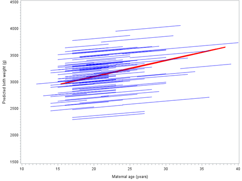
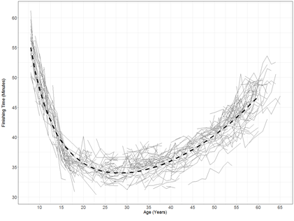
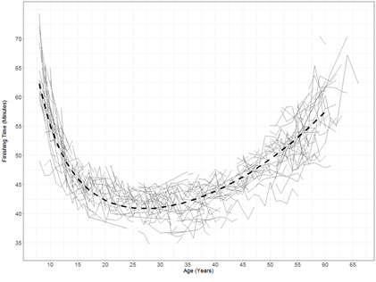
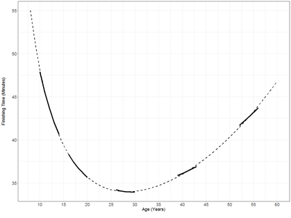
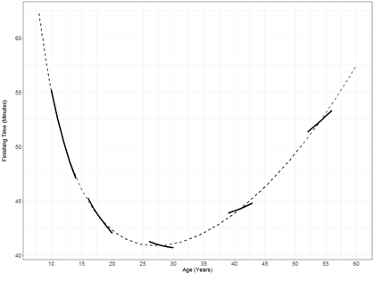
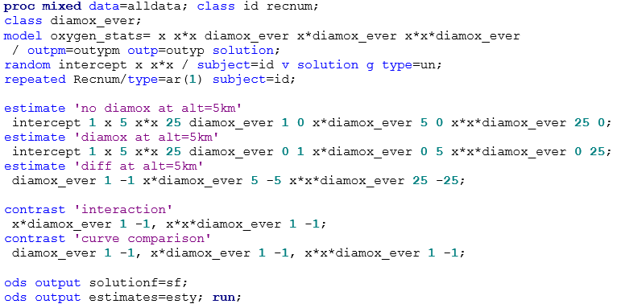
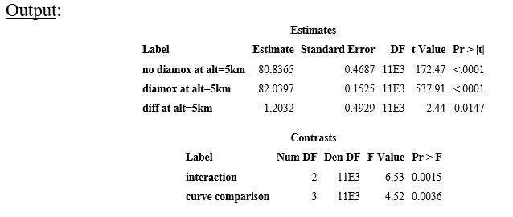
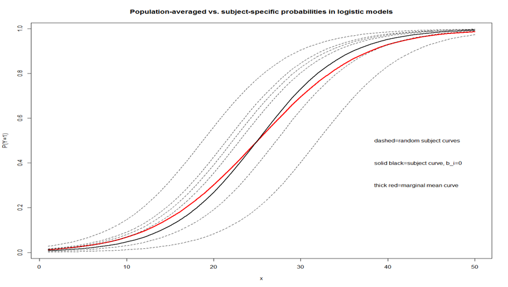

```{r setup, include=FALSE, cache=F, message=F, warning=F, results="hide"}
## setup directory
# setwd()
knitr::opts_chunk$set(cache = TRUE, echo = FALSE, message = FALSE, warning = FALSE)
knitr::opts_chunk$set(fig.height = 4, fig.width = 5, out.width = '70%', fig.align='center')
knitr::opts_chunk$set(fig.path = 'figs_L20/')
```

# Interpretation

## Topics for today

Time-varying age versus baseline age in longitudinal data analyses

Separating within and between-subject effects for time-varying covariates

Measuring the relationship between a time-varying covariate and an outcome for longitudinal data 

Modeling time as a class or continuous variable

Population-averaged versus subject-specific effects

\vspace{\baselineskip}


**Related reading:  Interpreting parameters in longitudinal models course notes**


## Time-varying age versus baseline age in longitudinal data analyses

Most longitudinal experiments and studies involve a relatively short amount of time, anywhere from a few weeks to a few months.  Typically there is a time variable to indicate when measurements were taken.  

If one is interested in also including age of subjects as a covariate into the model, typically baseline age is used - i.e., the fixed age for subjects when they enter the study.  But one question that arises is, should a time-varying age be used, or baseline age?

Many think that baseline age is most appropriate when another time variable is already in the model.  Here, we will examine both approaches mathematically, and the results may surprise you a little bit, although we will also see that you can easily estimate effects of interest from either approach.

##

Consider a study in which subjects' blood pressures are observed over time (3 time points, equally spaced, no missing data).  The model will include fixed effects for time, age (at start of experiment) and gender; and a random intercept for subjects.  The AR(1) structure will be used to model the errors.  In the model, age at start of experiment (i.e., baseline) was used.  How would estimates change if you used continuous age in the model instead?

In order to answer the question, write out the statistical models for both approaches.  Note that $real_{age} = BL_{age} + time$.  Thus, the model using real age (but not including gender) is 

$E[Y]= \beta_0+ \beta_1 real_{age}+ \beta_2 time$          
$E[Y]= \beta_0+ \beta_1 (BL_{age} +time)+ \beta_2 time$      
$E[Y]= \beta_0+ \beta_1 BL_{age}+( \beta_1+ \beta_2)time$       
$E[Y]= \beta_0+ \beta_1 BL_{age}+ \beta_2^{new} time$      

So we have expressed the model with real age in terms of the one that uses baseline age.  Thus, the underlying models are the same.  However, the interpretation of the parameters differs for the 2 approaches, as the above equations suggest.  

## 

Considering the models above, $\beta_1$ is a between-subject age effect, regardless of whether $real_{age}$ or $BL_{age}$ is used; $\beta_2$ is a within-subject time (or age) effect;  $\beta_2^{new}$ is the combination of these.  So in order to get effects of time that does not involve between-subject age effects, we use the model with $real_{age}$.

As an example of when this may be of interest; the Beryllium natural history project involved evaluating the progression of illness that was not due to the aging process (specifically, we removed between-subject age effects from the time variable). Thus, real age was used in the analysis.

In many other cases, $BL_{age}$ is used, although many probably don't really understand the difference between the two approaches.  But often there won't be a great difference unless the study is over a longer period of time.  You can estimate all parameters mentioned above from either model (e.g., by including an appropriate ESTIMATE statement in PROC MIXED).


# Separating within and between-subject effects for time-varying covariates

## Methods and simpler models

Data from many longitudinal experiments or studies are fit in regression-type models (e.g., mixed models), where each time-varying covariate is fit with one term.  For example, in the Kunsberg / air pollution studies that I've been involved with, we fit health outcome models as a function of an air pollution variable (with a fixed-effect coefficient) plus other fixed and random effect terms.  When personal monitors are used, the pollution variable is both subject and time-specific (i.e., subject-varying and time-varying).

If just one term is used for the pollution variable, then we are fitting a parameter that involves pooled effects based on between-subjects differences as well as within-subject changes over time.  To illustrate, consider a linear mixed model with a random intercept for subjects and fixed-effect term(s) for pollutant variable(s).  Here, $Y_{ij}$ is some health outcome measure such as FEV1 and say $x_{ij}$ is the subject-specific (i.e., personal) pollution level for subject $i$ on day $j$: $Y_{ij}= \beta_0+b_{0i}+\beta x_{ij}+\epsilon _{ij}$
For subject $i$, $Y$ changes by an expected amount $\beta (x_{ij}-x_{i'j})$ from day $j$ to $jʹ$.  Similarly, for day $j$, the expected difference between subject $i$ and $iʹ$ is $\beta (x_{ij}-x_{i'j})$.  The within and between-subject effects get pooled as there is only one slope parameter for the pollutant variable.  We can obtain separate estimates for between-subject and within-subject effects.  To do this, note that $x_{ij}=\bar x_i+(x_{ij}-\bar x_i)$.

##

Thus, by fitting terms separately for $\bar x_i$ and $x_{ij}-\bar x_i$, we can determine if slope estimates differ for within and between- subject data.  If there is no difference, then it is not necessary to use the separate terms.  [You could also use $\bar x_i$ and $x_{ij}$ as the BS and WS variables, respectively.  What are the implications?]

To further illustrate, consider a study where birth weight is the outcome for 880 mothers that had 5 children (data from CDC), and the time-varying covariate is the mother's age at each birth (denoted by $x_{ij}$, where $i$ indexes subject, $i=1,\ ...,\ 880$, and $j$ indexes the birth event $j=1,\ ...,\ 5$).

##

Here are the models:

$Y_{ij}= \beta_0+b_{0i}+\beta x_{ij}+\epsilon _{ij} \ \ \ \ (1)$         
$Y_{ij}= \beta_0+b_{0i}+ \beta_B \bar x_i+ \beta_W (x_{ij}-\bar x_i)+\epsilon _{ij} \ \ \ \ (2)$

where $\epsilon _{ij}\sim \mathcal N(0,\ \sigma_\epsilon ^2)$, $b_{i0}\sim \mathcal N(0,\ \sigma_b^2)$ for both models.

Fitting model (1) yields $\hat \beta=17.14$ grams, which indicates that increase in birth weight increases is about 17 grams, on average, per year.  

However, when model (2) is fit, we obtain  $\hat \beta_B=30.35$ grams and $\hat \beta_W=11.83$ grams.  

We would estimate that average birth weight will differ by about 30 grams between two women whose average birth age differs by one year.

For a given woman, we would estimate that the birth weights of her children increase by an average of about 11.8 grams for each year that she ages.

##

The increase estimates here may be largely due to the fact that younger women were studied - the median age at first birth was 17 years!  For more detail, see Neuhaus and Kalbfleisch, **Between and within-cluster covariate effects in the analysis of clustered data**.  Biometrics, 54, 638-645, 1998.  Hedeker also discusses this issue on pages 72-74.

Below are predicted values for subjects (blue) and the between-subject average fit (red) for a random sample of the 878 mothers.

```{r echo=FALSE}

```


## Case study:  More advanced models with Bolder Boulder data

The Bolder Boulder is a 10K race held in Boulder, Colorado on Memorial Day.  The race has been run for several decades, and is one of the largest running races in the United States.  Using this data, we can estimate between and within-subject changes over time.  However, modeling these data requires nonlinear functions, (see **Non-normal and nonlinear notes**).

Here we consider 12 consecutive years of data where subjects may participate in multiple years, and thus longitudinal data.  In our analysis we focused on the most competitive runners in the Citizen's (nonprofessional) race.  For more specifics on subject and record inclusion, see the course notes.

##

The following figure shows a spaghetti plot of a random 20% of runners, for both men and women.

```{r echo=FALSE, out.width="40%"}


```

The function we use to model race time versus age is $f(x)=e^{\alpha _0 } x^{\alpha _1 } e^{\alpha _2x }$, however we can linearize the function by taking natural logs of both sides: $ln⁡[f(x)]=\alpha _0+\alpha _1 ln⁡(x)+\alpha _2 x$.

##

This is important when separating effects into between-subject (BS) and within-subject (WS) components, since the model will already be pretty complex.  Extending N & K's idea of separating time-varying covariates into between and within-subject components, we recognize that $x_{ij}=\bar x_i \Big(\frac {x_{ij}} {x_i} \Big)$.  Thus we can write a longitudinal nonlinear model that allows for both within and between-subject effects, plus random effects for subjects:
$Y_{ij}=e^{\alpha _0 } e^{b_{0i}} \bar x_i^{\alpha _1^B } \Big(\frac {x_{ij}} {\bar x_{i.}} \Big)^{\alpha _1^W+b_{1i}} e^{\alpha _2^B \bar x_i } e^{(\alpha _2^W+b_{2i})(x_{ij}- \bar x_{i.})} e^{\epsilon_{ij}}$

where $Y$ is the natural log race time, $x$ is age, $i$ indexes subject and $j$ time, and  $\pmb b_i=(b_{0i},b_{1i},b_{2i})^{\top} \sim \mathcal N(\pmb 0,\ \pmb \Sigma)$, independently of $\epsilon_{ij} \stackrel {iid} \sim  N(0,\ \sigma_\epsilon ^2)$.

The log version, which is linear with respect to the parameters, is
$lnY_{ij}=\alpha _0+\alpha _1^B  ln(\bar x_i)+\alpha _2^B \bar x_i+b_{0i}  +(\alpha _1^W+b_{1i})ln\Big(\frac {x_{ij}} {\bar x_{i.}}\Big)+(\alpha _2^W+b_{2i})(x_{ij}-\bar x_i)+\epsilon_{ij}$, which is fit easily using standard LMM methods.

## 

In order to get subject predicted values, we note that $E[Y_{ij}│\pmb b_i]= E[e^{\epsilon _{ij} }]e^{E[lnY_{ij}│\pmb b_i]}$.

The between-subject function is defined to be $E[Y_{ij}│\pmb b_i=0] |_{(x_{ij}=x_{i.})}=\alpha _0^B \bar x_i^{\alpha _1^B} e^{\alpha _2^B \bar x_i}$, and the (average) within-subject function is $E[Y_{ij}│b_i=0]=\alpha _{0,\ \bar x_i.}^W x_{ij}^{\alpha_1^W} e^{\alpha_2^W} e^{\alpha _2^W x_{ij}}$

where $\alpha _{0,\ x_{i.}}^W=e^{\alpha _0 } e^{0.5\sigma_\epsilon ^2} \bar x_{i.}^{\alpha _1^B-\alpha _1^W} e^{\bar x_{i.} (\alpha _1^B-\alpha _1^W)}$.  So this function can be constructed for a specific subject that has average race age $x_i$. (for those races satisfying the inclusion criteria).  As before, if the log version of the model is fit, we just need to multiply exponentiated values by $E[e^{\epsilon_{ij}}]=e^{0.5\sigma_\epsilon ^2}$ in order to estimate average values on the original scale.

##

The figures below show the estimated between and within-subject funcitons for men and women (5 WS functions shown).  The results generally indicate that within changes generally occur a bit more slowly than differences between subjects, particularly after the peak age and more so for women.

```{r echo=FALSE, out.width="40%"}


```

##

Using the between and within subject functions, we can better understand how people change in performance over time.  

- Using the BS function to find 'peak age'

- Rates of change in BS function:  ~ 1% per year decline at age 40, ~ 2% per year at age 60. *"A 42-year-old male has an expected 1.0% slower time than a 41-year-old (based on the between-subject curve)"*

- Within-subject changes are a bit more attenuated relative to the between-subject curve.  *"A 41-year-old that participates in the following year is expected to only slow by a rate of 0.3% based on the within-subject function."*

- For women, there is an even greater difference between BS and WS curves, as the graph displays.

# Modeling time as a class or continuous variable

## Modeling time as a class or continuous variable

### Pro's and con's of approaches

For some data, it is pretty clear whether time should be modeled as a class or continuous variable.  For other data, it is not so clear.

If data involves 4 or 5 time points or less, modeling time as a class variable typically yields a better fit.  A wrinkle with this occurs when actual times of measurement do not meet the prescribed dates (e.g., for a '1-year' follow up, subjects might come in early or late).  This has happened in several student projects.  Whether the time as class variable should be abandoned really depends on the data and the degree of 'error' in times of measurement of subjects.  If subjects still come in fairly close to the prescribed dates then the class variable approach may still provide a reasonable approximation.

## Inference when time is modeled as a continuous variable

We thoroughly examined tests involving $group$, $time$ and $group \times time$ terms when time was a class variable.  When time is modeled as a continuous variable, often the focus is more on estimation and features of function being estimated (e.g., slope of a linear function, minimum or maximum of a quadratic function, derivative of a curve, etc.).  In order to get the minimum or maximum of a parabola, you can take the derivative of the fitted function, set it to 0 and solve for $x$.  As an example, see the Non-normal notes and the Bolder Boulder data application.  

When there is a group variable and time is modeled as a continuous variable, you can still easily perform hypothesis tests to compare groups at particular time points (e.g.,  perform t-tests by including ESTIMATE statements in PROC GLM or PROC MIXED to compare genders at fixed ages since there is one degree of freedom for such tests).  Some examples are shown ahead.

##

Say you have two groups that you want to compare more generally.  Here are some possible tests of interest:

- Compare curves

- Compare differences in curves over time minus intercept differences (i.e., interaction)

- Compare highest order trend (e.g., compare quadratic trends if model is specified up through quadratic)

To determine how to write these tests, consider the model for the Mt. Kilimanjaro data: $E[Y_{hij}]= \beta_0+ \beta_1 x_{ij}+ \beta_2 x_i^2+\alpha _h+\gamma _{h1} x_{ij}+\gamma _{h2} x_{ij}^2$,

where $h$ indexes drug group, $i$ indexes subject and $j$ indexes the repeated measure.  (We don't need an 'h' index on $x$ as long as the subject index is unique, study wide.)  There is a similar model for the Bolder Boulder data in the course notes ...

##

Below are the models expressed by Diamox users (never=0, ever=1)

Never users: $E[Y_{1ij}]=( \beta_0+\alpha _1)+( \beta_1+\gamma_{11})x_{ij}+( \beta_2+\gamma _{12})x_{ij}^2$              
Ever users: $E[Y_{2ij}]=( \beta_0+\alpha _2)+( \beta_1+\gamma_{21})x_{ij}+( \beta_2+\gamma _{22})x_{ij}^2$

If the highest levels are set to 0 or if the SAS g-inverse is used, then  
$\alpha _2=0,\gamma _{21} =0,\gamma _{22} =0$ and $\alpha _1,\gamma _{11} ,\gamma _{12}$ represent deviations of the never-user function from the ever users, for intercept, linear and quadratic terms, respectively.  In this case, the ever-user function is $E[Y_{2ij}]= \beta_0+ \beta_1 x_{ij}+ \beta_2 x_{ij}^2$ .

For the LTFR model, the overall test to compare curves can be written as 
$H_0:\ \alpha _1-\alpha _2=0,\ \gamma _{11} -\gamma _{21} =0,\ \gamma _{12} -\gamma _{22} =0$.  

Similarly, the interaction test is $H_0:  \gamma _{11} -\gamma _{21} =0,\ \gamma _{12} -\gamma _{22} =0$.

##

The comma is important to separate rows; if you don't have a comma, then the test (for interaction) becomes:  $H_0:  (\gamma _11-\gamma _21)+(\gamma _12-\gamma _22)=0$.  This test is probably not of interest, since you could have offsetting non-zero values for the linear and quadratic differences.
Next is the Mt. Kilimanjaro data to show how such tests could be conducted using $F$-tests (via CONTRAST statements), plus some simpler comparisons at specific time points using ESTIMATE statements.

See previous slides for various models fit; the model here includes an AR(1) structure for the errors in addition to random effects.  Recall we actually found an improved error covariance structure using the Kronecker Product (using AM/PM and Day as two time components).

##

Recall also that '$x$' is altitude.

```{r echo=FALSE}

```

Review (for a snickers):  In the CONTRAST statements above, what is the difference between including and excluding the ',' between terms?

## Output:

```{r echo=FALSE}

```

You can also create a model using diamox_ever as a binary 'continuous' variable (i.e., do not include in the CLASS statement, but levels must be 0 and 1), and obtain the same results.  In this case only 1 column is added to the $X$ matrix and there is only 1 coefficient for diamox_ever instead of 2 (when writing contrasts and estimate statements).  Can you rewrite the ESTIMATE and CONTRAST statements in this case?

##

The tests for individual coefficients of the $group \times time$ and $group \times time2$ terms are probably less meaningful. These tests are not like the polynomial interaction tests we considered when time was modeled as a class variable.

When there are polynomial functions that differ by groups, tests at one specific time point, or changes between time points may be of interest.

If applicable, so you also evaluate derivatives of functions to express rate of change.  If you have a quadratic function, the derivative function expressing rate of change will be linear.

### Notes on DDF calculations

In our case, the default method to calculate DDF for our custom t and F tests is the 'containment' method.  For these data, the calculated DDF is equal to the number of records used to fit the model (13369), minus the number of random effect terms per subject times the number of subjects (3*916=2748), so the DF is 13369 - 2748 = 10621.  In the output, we just see 11E3 but I used ODS OUTPUT to get the exact number.

If we use the RESIDUAL method, we essentially ignore the repeated measures and treat each record as if it came from a different subject.  This would yield 
DDF=$n-rank(\pmb X)$=13369 - 6=13363.

## Population-averaged versus subject-specific effects


Beta parameters may have subject-specific or population-averaged interpretations, depending on the type of model being fit.  For Normal outcomes, the interpretation is the same (which is why we have not discussed this issue yet).  But for some other types of outcomes, this may not be so.  

Consider a linear mixed model with random intercept and slope for time ($x$), by subject, and fixed effects that also include an intercept and slope for time (for simplicity we won't consider other covariates).

- The (estimated) population mean function is $E[Y_{ij}]= \beta_0+ \beta_1 x_{ij}$.

- The subject-specific function is $E[Y_{ij} |b_i]= \beta_0+ \beta_1 x_{ij}+b_{0i}+b_{1i} x_{ij}$.  In particular, the 'average' subject has no deviation from the population average (
$b_0$ and $b_1$ are 0), and thus the mean is $E[Y_{ij} |b_i=0]= \beta_0+ \beta_1 x_{ij}$.

Since the population average function is equivalent to the subject specific function (for the average subject), we say that fixed effects in this case have both population-averaged and subject-specific interpretations.  For other distributions, these may not be equal.

##

Consider a GzLMM where the outcome has a Poisson distribution, the fixed effects include a simple linear trend for time, and there is a random intercept for subjects: $g(\mu_{ij})  =  \beta_0+ \beta_1 x_{ij}+b_i$.

The conditional mean is  $E[Y_{ij} |b_i=0]=e^{\beta_0+ \beta_1 x_{ij}}$;  The marginal mean is $E[Y_{ij}]=E\big[E[Y_{ij}|b_i]\big]=E[e^{\beta_0+ \beta_1 x_{ij}+b_i}]=e^{\beta_0+0.5 \sigma_b^2} e^{\beta_1 x_{ij}}=e^{ \beta_0'} e^{\beta_1 x_{ij}}$

The only difference between these means is in the intercept; it is greater in the marginal mean by the amount $0.5 \sigma_b^2$ compared with the conditional mean (for subjects with $b_i=0$).  The parameter $\beta_1$ is typically of more interest and has both specific-subject and population-averaged interpretations.  However, results do not necessarily generalize for more complex random effects.

For a binary outcome, $\beta_1$ will have different interpretations, considering the model $g(\mu_{ij})  =  \beta_0+ \beta_1 x_{ij}+b_i$, where $g$ is the logit link. 

##

The graph below shows $E[Y_{ij}]$, red, with subject curves, $E[Y_{ij} |b_i]$, black. [$E[Y_{ij} |b_i=0]$ is solid and the rest are dashed.]  *Clearly the population averaged function (solid red) is not the same as the function for the average subject (solid black)*.  Importantly, the slope of the marginal mean function is flatter (more attenuated) compared with the conditional mean function.

```{r echo=FALSE}

```
 
## Implications

For populations where there is subject heterogeneity (e.g., random intercept differences):

- Using GzLM/GEE will yield beta estimates that have population-averaged (PA) interpretations.

- Using GzLMM's with the appropriate random effect terms will yield beta estimates that have subject-specific (SS) interpretations.

In some cases (normal theory models, some effects in some Poisson models), they are one in the same.

We also learned that estimates based on the pseudo-likelihood approach for GzLMM can be subject-specific or population-averaged, depending on whether random-effect estimates are include in the Taylor series expansion or not (see GzLMM linearization slides). 


# Summary

## Summary

A predictor that varies over subjects and time can be split into 2 components, and separate coefficients given in order to estimate between-subject and within-subject effects; otherwise, the effect being estimated pools the BS and WS effects.

For complex models used with longitudinal data (e.g., mixture models, BS/WS models or other nonlinear models), random effects can be 'added to' parameters to get subject-specific predicted values.

To understand disease progression, you may want to consider including time-varying age in the model, even if a separate time variable is also included.  This way, aging effects are more clearly separated from disease progression effects.

##

Consider binary longitudinal data with subject heterogeneity, where logistic regression is used to model the data.

- Beta parameters of predictors in GEE models will have population-averaged interpretations; the subject heterogeneity gets embedded into the marginal mean that averages over subjects; this 'flattens' the S-curve (beta is attenuated).

- Beta parameters of predictors in GzLMM models have subject-specific interpretations (if the random intercept is included).  Here instead averaging functions over subjects (as the marginal mean does), we determine the (mean) function for the average subject.  (See graph.)

- The PA function does not represent any one subject in the population; the SS function represents every subject (in terms of slope); they are just shifted by random intercept amounts.

- In practice, there may not be much difference between the two approaches, it depends on the application.  The more the subject heterogeneity (higher the variance), the bigger the potential difference.

