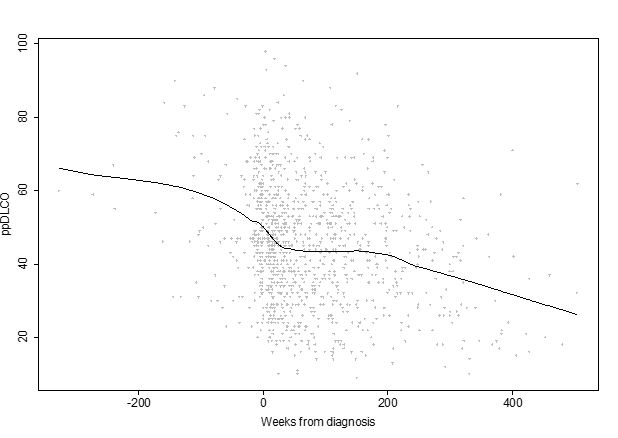
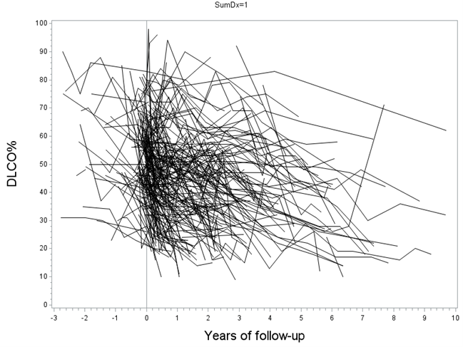
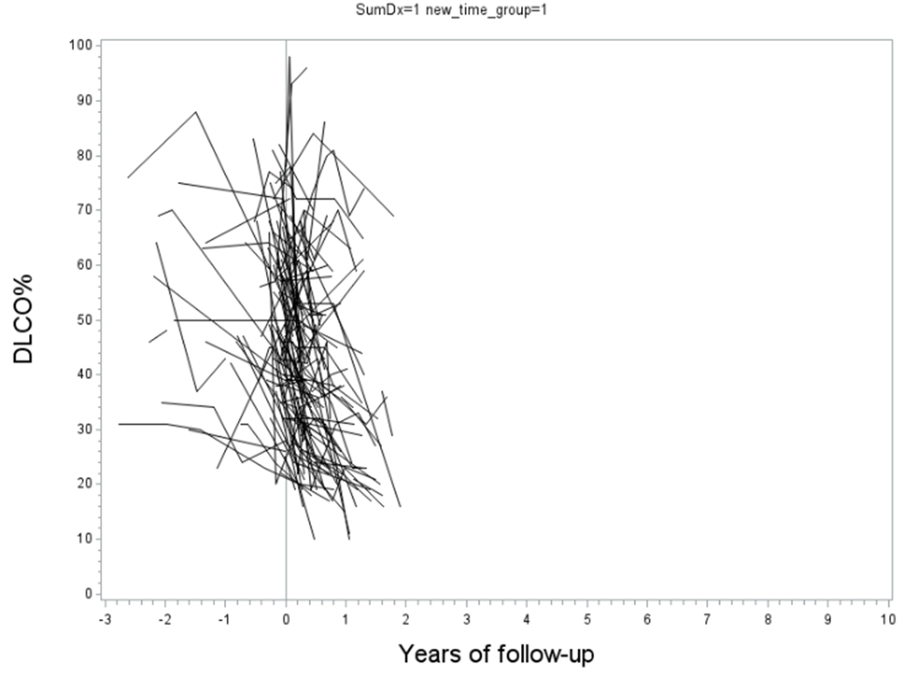
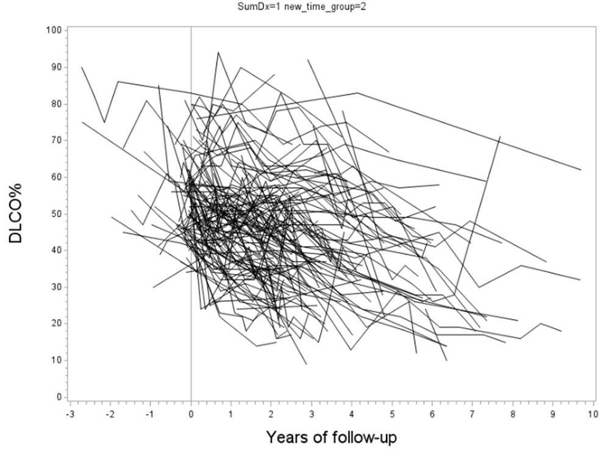
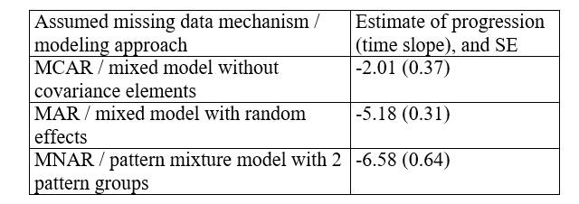
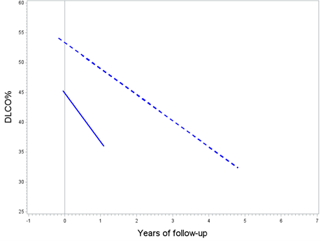
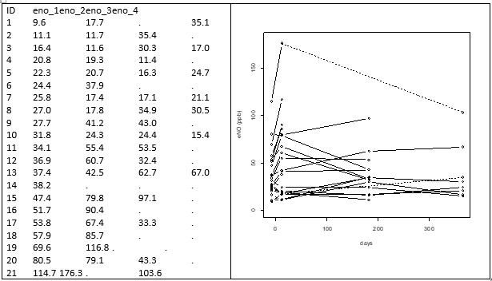
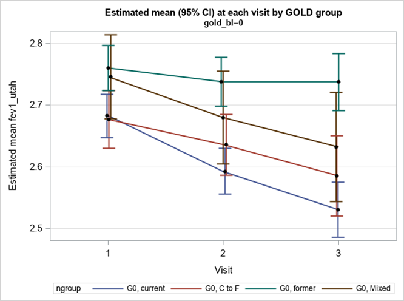
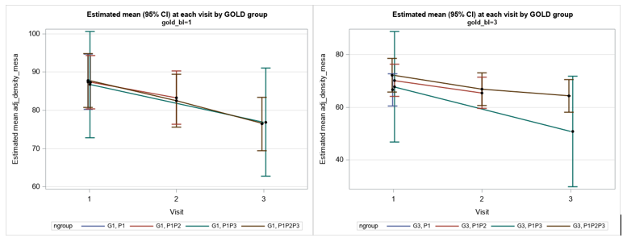

```{r setup, include=FALSE, cache=F, message=F, warning=F, results="hide"}
## setup directory
# setwd()
knitr::opts_chunk$set(cache = TRUE, echo = FALSE, message = FALSE, warning = FALSE)
knitr::opts_chunk$set(fig.height = 4, fig.width = 5, out.width = '70%', fig.align='center')
knitr::opts_chunk$set(fig.path = 'figs_L20/')
```

# Missing data

## Topics for today

- Addressing missing data in longitudinal studies!

\vspace{\baselineskip}

- Related reading:  See the 'Missing data' chapter in the course notes.

## Longitudinal models and missing data

See the course notes (Longitudinal models and missing data) for more detail.  

There is also an informative tutorial article by Hogan et al., 2004, Statistics in Medicine, “Handling drop-out in longitudinal studies.”

# Introduction

## Introduction

There is a wealth of research devoted to missing data, its impact on results, and how to deal with it.

Missing data are particularly a problem for longitudinal studies because often subjects start in the study, but for one reason or another they dropout.

In this chapter, we first discuss how mixed models can naturally account for missing data by taking correlation between responses into account.  We then discuss types of data that make it harder or easier to account for missing data, and define general types of mechanisms for missingness commonly discussed in the literature.

A few case studies are presented at the end.


## Mixed models and estimation in light of missing data

Consider outcome data ($Y$) collected on subjects at 2 time points (Visit 1 and 2).  Three of the subjects have missing data for Visit 2.  The line just connects the averages of available data, by time point.

```{r echo=FALSE}

```

## 

Now consider identifying the repeated measures within subjects (below).  The dashed lines in the left graph show the true progression for the subjects with missing data; I have included the missing values with open circles, although the analyst does not observe them.

```{r echo=FALSE}

```

##

Predicted values (red) are shown below if we include a random intercept for subjects in the model (red line connecting X's is the estimated population average).
 
```{r echo=FALSE}

```


This illustrates that we can get accurate estimates of subject values as well as the population-average fit in the presence of missing data if the model is appropriate for the data. 

## Systematic differences that are informative or not

If the subjects that had missing data for Visit 2 were systematically different than those with complete data, then there is really no way we get good estimates unless the observed or other data informs us about the systematic differences.

### Example 1

```{r echo=FALSE}

```
 
### Example 2
 
```{r echo=FALSE}

```

##

Two possible modeling approaches when change is related to starting point, as in Example 2:

- Model Y2–Y1 as outcome, include Y1 as a predictor.

- Use an LMM; keep both measures as outcomes, add random intercept and slope for time, use UN structure in G.

Unfortunately with only 2 time points, including a random slope for visit will likely lead to a mixed model fit with a non-positive-definite Hessian matrix and consequently some limited and/or questionable output.

The modeling approaches mentioned above become more useful and easier when there are $t>2$ time points.


# Missing data mechanisms

## Missing data mechanisms

Definitions involve missing response ($Y$) data

- Missing completely at random (MCAR)

  - Simple

  - Covariate-dependent

- Missing at random (MAR)

- Missing not at random (MNAR)

# MCAR

## MCAR 

Simple MCAR data

- Probability that the response is missing is unrelated to any of the data, including the missing responses.

- $P(M_{ij}=1|Y_{(i,obs)},Y_{(i,miss)}, X_i)=P(M_{ij}=1)$, where $Y_{(i,obs)}$ and $Y_{(i,miss)}$ denote the observed and missing components of the responses, $X_i$ denotes relevant predictors in the model, and $M_{ij}$ is an indicator for missingness (1=missing, 0=observed), for subject $i$ at time $j$.  

Covariate-dependent MCAR data 

- $P(M_{ij}=1|Y_{(i,obs)},Y_{(i,miss)},X_i)=P(M_{ij}=1|X_i)$

- See Hedeker and Gibbons, 2006; Fitzmaurice et al., 2011.

- A bit more realistic than simple MCAR.

MCAR is the most restrictive assumption and is probably the least likely to hold for real data.  However, one can test whether data are MCAR or not fairly easily.

# MAR 

## MAR 


The next level up is MAR data, which satisfies $P(M_{ij}=1|Y_{(i,obs)},Y_{(i,miss)},X_i)=P(M_{ij}=1|Y_{(i,obs)},X_i)$.  Modeling MAR data can still be done somewhat easily if the model contains the necessary variables for the observed data.

E.g., progression of lung function over time for smokers (S) and nonsmokers (NS):

- Smokers have lower starting values and steeper drops in response over time compared with nonsmokers.  

- Smokers are more likely to dropout (40% for S, 20% for NS).  
Missingness depends on smoking status, but by including the relevant predictors in the model (smoking status, time and their interaction), we can accurately model the data.

- Within smoking status groups, the probability of missingness at a follow-up visit is constant across subjects, and so whether or not a subject's response at a follow-up visit is observed does not depend on its potentially unobserved value.

##

When the values of the missing data are related to the chance that they are missing (specifically, when the probability equation in the last paragraph does not hold), the mechanism is referred to as missing not at random (MNAR; or in some places, termed 'not missing at random' or NMAR).

For a simple example, consider a study where a health outcome is measured over time, where subjects are more likely to dropout once they become sick.  If the health outcome measure decline for these sick subjects but we did not observe their outcomes during this state, then data are likely MNAR.

Unfortunately, there are no easy tests to determine whether data are MAR versus MNAR unless some additional information becomes available (e.g., some of the missing responses are randomly obtained).

## 

There are methods of estimation that do account for MNAR type of data, if there is concern that data may follow that, including pattern mixture models and selection models (e.g., see Diggle et al., 2002), and Kenward (1998) even suggested a selection model for 2-visit data with missing values.  If there is enough uncertainty about MAR versus MNAR data, methods for the two approaches can always both be run in a 'sensitivity fashion' to help determine how much difference it makes.

Review:  are previous Examples 1 and 2 likely to be MAR or MNAR?

# Approaches for missing $X$ data

## Approaches for missing $X$ data

When $Y$ is missing at random (MAR) but covariate data are complete, then it is sufficient to use the standard linear mixed model in order to obtain unbiased estimates, as described above.  However, when $X$ is missing (potentially with some missing $Y$), standard likelihood based methods may not be sufficient.

To address potential bias for missing $X$ data, one might consider other likelihood-based algorithms, such as the EM algorithm, or another modeling approach, such as multiple imputation.  Such approaches may be able to incorporate records that involve missing $X$ data rather than just removing records.  Although most standard procedures simply drop the records from analysis when covariate data are missing, there are ways to account for correlation between responses in such cases, as described above.

## GEE and estimation in light of missing data

When using GEE associated with GzLMs, unlike mixed models that employ more standard likelihood-based estimation methods, MAR-type data cannot necessary be handled by simply including key predictor variables.  For GEE, a stronger assumption of MCAR is necessary in order to use typical estimation methods.  Fitzmaurice, et al. (2011), also discuss how to employ weighting techniques for GEE models when data are MAR. 


## Preparation of data and specification of models in light of missing data

In this section we focus on computational issues for data with missing values when fitting linear mixed models, and how you should specify a data set to get an accurate model fit when using computer software such as SAS or R.

Note that which software you use makes a difference on the approach.  Here we focus on data with serial correlation that can be modeled with an AR(1) or related structure.  Including random effects such as a random intercept are less problematic in light of missing data since each pair of responses have the same model correlation, regardless of time between responses.  On the other hand, the AR(1) is sensitive to the time between measurements, and so missing values need to be carefully considered.

## Linear mixed models in SAS and R

For unequally spaced data that is due to design or missingness, I would generally recommend using a spatial covariance structure (e.g., spatial power in SAS) to properly account for different gaps between measurements.

However, you still potentially need to address the missing data issue, i.e., just because we use a structure that accounts for gaps due to missing data doesn't mean we've addressed potential bias in estimates caused by the missing values.

The course notes go into more detail about how you can use a structure like AR(1) instead of a spatial structure in light of intermittent data.

##

When specifying serial correlation in a model with no random effects, the gls function can be used in R.  Recall that missing values are specified using 'NA'.  Some functions such as **gls()** or **lme()** (from the **nlme** package) cannot process the records with 'NA' without more instruction about how to deal with them.  Specifically, telling the function to omit or exclude the records will allow the model to be fitted.

The discrete AR(1) in R is specified by 'corAR(1)' while the continuous AR(1) is specified by 'corCAR(1)'.  The latter is the same as the spatial power structure in SAS.


## GEEs with SAS and R

In SAS, PROC GENMOD, the AR(1) working structure is available to model repeated measures over time.  If responses are unequally spaced, unfortunately spatial structures are not available to use.

However, for most data it is possible to get around this issue by creating equal time units and then filling in the data set with missing values, as necessary.  This will work even when covariate measures, other than time, are missing too.


For example, say data are collected on weekdays but the response and covariates other than time are not collected on weekends.

In the data set, just include a record for every day in the month, and put missing values in for $Y$ and covariates on the weekend days (other than for 'day', which should be complete), and employ the AR(1) working structure for GEE.

The fitted model will reflect the unequal spacing caused by no collection on weekends.  R has at least a couple of packages to fit GEE models:  the geeglm function within the **geepack** package is one route, and the **gee()** function within the **gee** package is another.  However, within the default settings the correct spacing cannot be specified when there are missing data for either approach.

 
# Case studies

## Case studies

The examples so far in this section have involved 2 repeated measures over time.  Most longitudinal data will have more time points.  Although this will probably complicate the analysis, it should allow the researcher to better understand whether missing data is an issue, and also to account for it in the modeling approach.


### Case study I:  IPF data and the marginal mean

Background.  From **Strand et al., 2014**:  The usual interstitial pneumonia (UIP) pattern of lung injury may occur in the setting of connective tissue disease (CTD), but it is most commonly found in the absence of a known cause, in the clinical context of idiopathic pulmonary fibrosis (IPF). Our objective was to observe and compare longitudinal changes in pulmonary function and survival between patients with biopsy-proven UIP found in the clinical context of either CTD or IPF.

##

Percent of predicted diffusing capacity of the lung for carbon monoxide (ppDLCO) is shown to the right, versus time since diagnosis; higher values relate to better health.  A LOESS fit to the data is also included.  

```{r echo=FALSE}

```

##

What is not implied by the plot is that data are longitudinal, with subjects having varying number of repeated measures.  Here is another look at the data using a spaghetti plot.

```{r echo=FALSE}

```

##

By stratifying on last observation date (<100 or  $\geq$ 100) we can more clearly see the pattern:

```{r echo=FALSE}


```


##

If we simply average the data over available data by time, we end up with a convoluted function that is difficult to interpret (such as LOESS fit on previous slide).

The inverted hump occurs because subjects who drop out early have a large impact on the mean function, and then do not contribute to it after 2 or so years from diagnosis; those remaining to contribute to the function are the more robust subjects who go on for several more years of follow up.

This raises a question of how the mean marginal function should be defined, and whether a marginal function even makes sense.

##

If we do decide to estimate one marginal mean function, below is a comparison of estimates based on models that assume different data mechanisms.  Here, we're estimating progression for all IPF subjects as if all had been observed through the 10 years.

```{r echo=FALSE}

```

SAS code to derive estimates (similar to that shown in Hogan et al., 2014) are given in the course notes.

##

The MNAR approach was derived using 2 assumed patterns, one for subjects who dropout less than 100 weeks, and one for those  $\geq$ 100 weeks.

The estimate of -6.58%/yr is a weighted average of the two slopes of shown in the previous figure, where the weights are proportions of subjects in each of the subgroups.  

Another MNAR approach would be to expand the missing patterns groups to 4 or 5.  (Potential student project?)

One important consideration for the marginal estimates discussed above is over what range the estimates should be considered.  The assumption we're making is that the mean function applies to all subjects, and predicted values are factored in even for those who die due to the illness that causes the decline in the outcome.

##

Should all missing data be treated equally?  If the outcome measures progression of an illness, such as here, then should someone who drops out but is still alive be treated the same as someone who dies due to the illness being examined?  If not, then estimating a marginal mean function may not make sense.

An alternative approach is to have mean functions defined for subgroups based on time of dropout (or possibly other factors), and then not combine them.  To the right are estimated functions for subjects observed <100 weeks (solid), and  $\geq$ 100 weeks (dashed).  (See Strand et al., 2014.) 


```{r echo=FALSE}

```

## 

### Case study II:  eNO and aspirin data

Application:  recall the eNO data first presented in the Graphs chapter.  Below are the data, which now includes the 6mo and 1yr time points (eno_1=pre challenge; eno_2=post challenge; eno_3=6 months after challenge; eno_4=1 year after challenge).  

Note that there is technically only 1 day difference between the pre and post challenge measurements.  However, to allow for visual interpretation, a spread of 10 days was used between eno_1 and eno_2; otherwise data were plotted metrically for time.  In the data, missing values were represented by '.' (For R, they would be represented with 'NA'.)

The data were sorted by eno_1 and demonstrate that those with higher baseline eNO (indicating more inflammation) were more likely to drop out later on, although the subject with the highest starting eNO and biggest reaction to aspirin was a completer.


##

A straight mean of available data shows an increase in eNO after the aspirin challenge, which then drops somewhat at 6 months and 1 year.  This is also apparent in the graph of individual subjects.  Although dropouts tend to occur as time goes on, there are a few cases where subjects missed intermediate time points but actually came back.  These are represented with dashed lines (they both missed the 6mo time point).

Two questions for the reader:  (1) Based on what you see, what type of missing data mechanism would you expect the data to follow?  (2) How would you check for and handle (if applicable) the missing data?


##

```{r echo=FALSE}

```

Supplement – an even broader list of approaches to account for missing data

##

Complete case (not recommended unless shown to be similar to other approaches)

Last observation carried forward (not recommended)

All-available data approach (probably the best 'standard' method)

Inverse probability weighting

Multiple imputation

MAR-type analytical approaches

NMAR-type analytical approaches

# Inverse probability weighting

## Inverse probability weighting (IPW)

Upweights subjects that tend to dropout more.  Create weights from an initial logistic regression (outcome = was response observed, yes or no).

Plug weights into final model to upweight/downweight records, by using the 'weight' statement.

To allow weights to have correct impact, do not model correlation between measures within a subject (use 'VC' structure), but also use empirical SE's to help account for model misspecficiation.

# Multiple imputation

## Multiple imputation

Impute missing data based on available information.  Repeat '$k$'  times so uncertainty in the imputation can be factored into SE's.

Works better when you have 'almost complete' data for subjects at a given time, but perhaps just missing 1 or 2 variables.


### Case study III:  The COPDGene Study

Outcomes for subjects with COPD observed over time; Phase 1: 0 years, Phase 2: 5 years, Phase 3: 10 years (approximately).  But there is some loss to follow up (dropouts, deaths, latecomers).

## MAR-type analysis

Recall:  with MAR-type data, the probability of missingness depends only on predictors and observed responses.

Identify the predictors (and their interactions with time) that are likely to cause the most problems.  Add them to the model.

Smoking status and race are known demographics to have differential dropout.  Add them, plus interactions, to model.  If their inclusion does not change things, can simplify.

##

We know current smokers tend to dropout more.  So add smoking group and smoking group*time to account for differential dropout by smoking status.  Stratifying analyses by GOLD group also reduces potential bias caused by MAR-type data.

```{r echo=FALSE}

```

## NMAR-type analysis

Pattern mixture modeling. Actual progression estimates can be obtained by identifying responses for 'important' missing data patterns, and then using a weighted average of these to obtain a marginal mean estimate.

For COPDGene, there are a limited number of patterns over time (P1, P1P2, P1P3, P1P2P3), which makes it a little easier to examine.  This is a reasonable approach if the patterns only depend on time.

For both GOLD 1 and 3 groups, there do not appear to be big differences between the response pattern groups, suggesting MAR-type approaches may be o.k.  (at least for these groups).

```{r echo=FALSE}

```

##

If patterns do differ enough, a weighted average can be taken over the groups to obtain one overall estimate.  Results can also just be kept separate.

There might be other grouping to consider (other than just time), such as race or smoking status groups.

For NMAR-type data, we are trying to uncover latent groupings suggested by the data.  But it is really hard to check assumptions since we need to see the unobserved responses to check it.

We have also performed IPW and multiple imputation approaches for these data.  If you are interested in seeing these programs, e.g., to see if it may apply to your project data, let me know.  Also, for more detail on these methods and how they relate to missingness assumptions, see **Fitzmaurice et al., 2011, 2nd ed.,  Applied Longitudinal Analysis**.  

Another good reference:  **Hogan et al., 2004; 23:1455-1497**, Handling drop-out in longitudinal studies. Statistics in Medicine.  This is posted on Canvas (see Supplement module).

 - They walk through examples that demonstrate analyses under different missingness assumptions.

- They show that adding random intercepts and slope for time for subjects also takes care of missing data under the MAR assumption.


## General thoughts

Should deaths and dropout for other reasons be distinguished?  What are the implications if we just pool it all together?

Joint longitudinal and survival models can also be used to account for missing data due to death, or for dropout more generally.  This involves constructing a likelihood that includes both facets, e.g., a linear mixed model plus a survival model.
