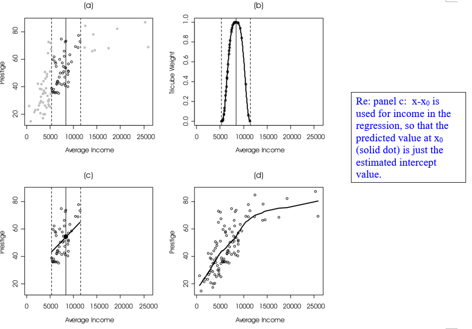
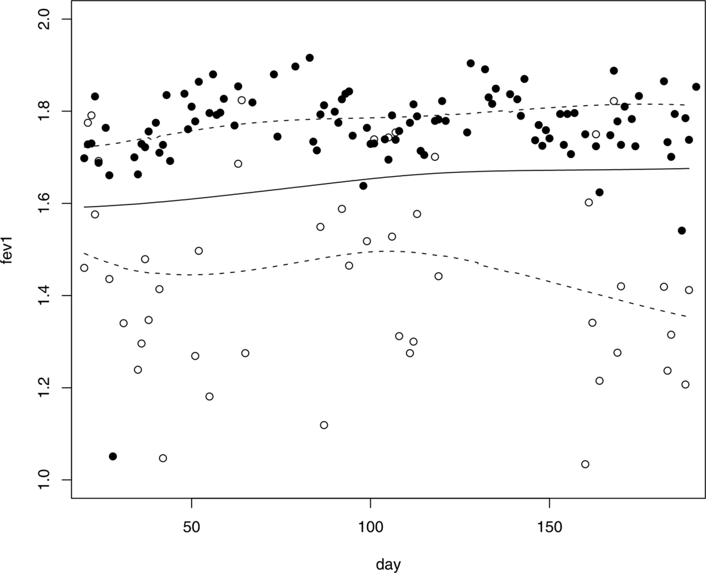
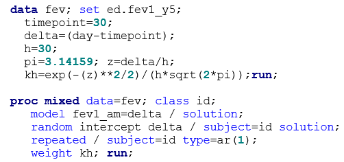
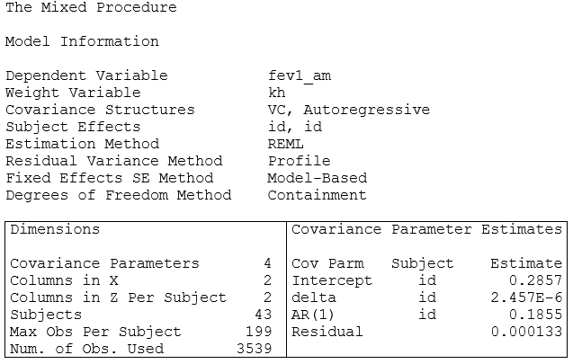
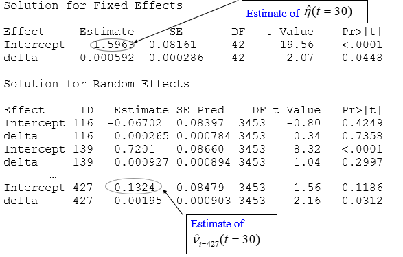
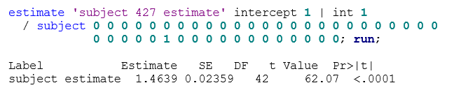

```{r setup, include=FALSE, cache=F, message=F, warning=F, results="hide"}
## setup directory
# setwd()
knitr::opts_chunk$set(cache = TRUE, echo = FALSE, message = FALSE, warning = FALSE)
knitr::opts_chunk$set(fig.height = 4, fig.width = 5, out.width = '50%', fig.align='center')
knitr::opts_chunk$set(fig.path = 'figs_L21/', cache.path = 'cache/')
```

# Nonparametric regression

## Topics for this lecture:

- Nonparametric regression - local polynomial regression

\vspace{\baselineskip}

- Associated reading:  
  
  - Section 3 of the ‘Nonparametric and flexible longitudinal regression' notes.


# Longitudinal nonparametric regression

## Local polynomial regression and other nonparametric regression techniques

Various techniques for longitudinal nonparametric regression have been developed recently.  Many of these techniques have been developed by adding mixed model elements to existing nonparametric regression methods.  One source for the following information is Wu (2006).

Some common nonparametric regression techniques include local polynomial regression (LOESS), spline modeling (e.g., regression, smoothing and penalized splines), and generalized additive models (GAMs). 


##

GAMs are in the class of semi-parametric regression models that allow fitting of both parametric and nonparametric terms.  

Spline modeling involves joining regression segments together into one continuous function.   Basics of spline modeling were presented in previous notes.  In the context of nonparametric regression, spline modeling often involves more knots.

LOESS regression is essentially carried out by performing weighted polynomial regression about a focal point $x_0$, where the weights are determined as a function of $x-x_0$, with smaller values getting higher weight (i.e., the closer $x$ is to $x_0$, the higher the weight).  The local regression at $x_0$ produces an estimated $y$ at the point $x_0$, which is just the intercept value of the fitted function.  This process is then repeated across other focal points to yield a smooth function.  

##

In LOESS regression (or local polynomial regression), the function that defines the weighting structure is called the kernel.
  
For example, we could use a standard normal kernel:  $f(u)=\frac 1 {\sqrt {2\pi}} e^{-u^2 /2}$, where $u=(x-x_0)/h$ and $h$ is called the bandwidth, which helps determine the smoothness of the fitted function (the higher the value, the smoother the fit).  As the equations indicate, higher weight is given to values closer to $x_0$, and then drop for values of $x$ that are further from $x_0$.  

An even simpler approach is to use a uniform kernel, which will give equal weight to values in the local regression about x_0, but will only include a certain percentage of all data values.  

##

Another common approach is to use a hybrid of both of these approaches:  use the tricube function (somewhat similar in shape to the normal), but then only include the nearest fixed percentage of values to $x_0$, i.e., a truncated tricube function (see Figure 1 for shape).  In this case, the tricube function is standardized and the control over the smoothness is determined by the percentage of values used in the local regression, sometimes referred to as the span or smoothing parameter.  

There are a variety of methods that can be used to select optimal bandwidths for a given data set, including $AIC_C$, $AIC_{C1}$ and generalized cross validation (GCV) statistics.  SAS Help describes these under PROC LOESS documentation.  Bandwidth selection is important because not only will it determine the smoothness of the fit, it plays a strong role in the degree of bias and variance in the associated estimators.

##

The degree of the polynomial is usually between 0 and 3, but more commonly 1 (local linear regression) or 2 (local quadratic regression).  You might be wondering:  if you only use the fitted intercept, then why even bother with higher order terms?  The main reason is that it reduces bias in the estimated function.  Specifically, it allows you to use a larger bandwidth (producing a smoother function) without inducing as much bias as you would have for lower order polynomials.  

Figure 1 illustrates how LOESS regression works using Fox's Occupational Prestige data.  Panels (a)-(c) demonstrate the local regression at $x_0=8000$ to produce $\hat y_{x=8000}$; panel (d) is the complete fit by performing multiple local fits across $x$.

##

```{r "sas", echo=FALSE}

```

##

Figure 1 (from Fox, 2000):  Local linear regression of prestige on income for the 1971 Canadian occupational-prestige data: 
 
1.	The broken lines delimit the 50 nearest neighbors of $x_0 = \$8403$ (the 80th ordered $x$ value, at the solid vertical line).
2.	Tricube weights for observations in the neighborhood of $x_0$.
3.	Locally weighted linear regression in the neighborhood of $x_0$; the solid dot is the fitted value above $x_0$.  
4.	The completed locally linear regression, connecting fitted values across the range of $x$.
 
In Figure 1, the kernel/bandwidth method used was the hybrid method, with use of the tricube kernel but then only using the 50 nearest neighbors to $x_0$ in the local regression (span=49%, as n=102).

# Longitudinal nonparametric regression

## Longitudinal nonparametric regression

Nonparametric regression can be augmented to account for longitudinal data.  One basic approach is to incorporate mixed model elements while fitting, and thus account for the correlated nature of longitudinal data.  

Adding mixed model elements to GAM yields Generalized Additive Mixed Models (GAMMs), which allow for modeling of longitudinal data for various types of outcomes (e.g., normal, binomial, Poisson).  

Wood (2006) is one good resource for GAMMs.  Wu (2006) discusses adding mixed model elements into spline modeling and LOESS regression, yielding mixed-effect spline modeling and local polynomial mixed-effects regression, respectively.  Here we will primarily focus on the latter.

## Statistical models for longitudinal nonparametric regression

Before discussing local mixed regression, let's consider the nonparametric functions that we are interested in estimating.  There are two basic types that we will consider here.  One is a nonparametric population mean model, and one is a nonparametric mixed-effects models.  

Consider data ($t_ij$, $y_ij$), $i=1,\ ...,\ N$, $j=1,\ ...,\ n_i$, where $t_ij$ is the $j$th time point observation for subject $i$.  These data can be used to fit either the nonparametric population mean (NPM) model: $Y_i(t)  = \eta (t)+\epsilon _i (t) \ \ \ \ (1)$. Or the nonparametric mixed-effects model (NPME) model: $Y_i(t)= \eta(t)+ v_i(t)+\epsilon _i(t) \ \ \ 	\ (2)$ where time ($t$) is modeled as a continuous variable, $\eta (t)$ is a fixed-effect function for the population mean, $v_i(t)$ represents the departure of the $i$th individual from the population mean function (the random effect function for subject $i$), and $\epsilon_i(t)$ is the error function for subject $i$. The mean function for the population is $\eta (t)$ and the mean function for subject $i$ is $\eta (t) + v_i(t)$.

## 

A common approach to fit (1) is to use mixed-effect spline models; (2) can be fit using local polynomial mixed-effect modeling.  Note that the population mean term, $\eta (t)$, and subject deviation term, $v_i(t)$, are smooth functions that are not constrained by any parametric form.  However, when fitting these terms with nonparametric regression, you can get smoother or less smooth functions by controlling bandwidth parameters.

##	Local polynomial mixed-effect modeling

We can fit (2) by using the same local regression techniques as LOESS, but fitting a weighted mixed model instead of weighted least squares regression model.  This will allow us to get estimates for both $\eta (t)$ and $v_i(t)$, for $i=1,\ ...,\ n$.

For example, $Y$ may represent some type of growth data (e.g., height), $\eta (t)$ is the population height function of time, and $v_i(t)$ is the (true) height function for subject $i$.	When we estimate $\eta (t)$ using nonparametric regression (call it $\hat \eta (t)$), we end up with a growth estimate for each $t$ that cannot be summarized by simple regression coefficients.  

Thus, we usually graph $\hat \eta(t)$ as a function of $t$.  The main strength of NP regression is that we are not forcing the data to be constrained by a particular parametric function, which often over-summarize the growth characteristics over time.  The main drawback is that we do not end up with a set of regression coefficients that summarize the growth curve.

##

Before carrying out the nonparametric mixed-effect modeling, we need to determine the optimal bandwidth to use.  The added complexity here relative to LOESS for independent data, is that the best bandwidth for the population mean function may not be the same as for the subject-specific functions.  

There are a variety of suggested methods to use to select bandwidth.  Simpler approaches include using cross validation statistics and more complex methods include backfitting algorithms (see Wu text for details).  A leave-one-subject out cross validation (SCV) can be used to select the best bandwidth for the population mean fit, while a leave-one-point out cross validation statistic (PCV) can be used for optimal subject specific functions.  The lowest values of these statistics indicate optimal bandwidths for the population mean and subject offsets, respectively.  

Then one can the local fit using the optimal bandwidth as indicated by the SCV statistic to estimate $\eta (t_0)$, use a separate local fit using the optimal bandwidth as indicated by the PCV statistic to estimate $v_i(t_0)$, and combine these to get the subject-specific estimate.  

Now we have doubled the number of PROC MIXED fits necessary to carry out the NP longitudinal regression!  Although this seems like a lot, the newer backfitting algorithm suggested by Wu is even more computer intensive.

# Application

## FEV1 of students with moderate to severe asthma

FEV1 of students with moderate to severe asthma at the Kunsberg School at NJH were monitored over approximately 7 months during the 2003-04 school year.  The optimal bandwidths as indicated by the SCV and PCV statistics were approximately 25 and 30, respectively.  Since the values were fairly close, each local fitting was carried out with the bandwidth of 30 only.

Figure 2:  Illustration of fit of a nonparametric mixed-effects model for FEV1 data obtained from children attending the Kunsberg School at NJH during the 2003-04 school year.  The population mean fit, $\hat \eta (t)$ is the bold line; fits for two of the 43 subjects ($\hat \eta (t)+\hat v_i(t)$) are given with dashed lines with their actual data superimposed (subject with higher FEV1 with closed circles; subject with lower FEV1 with open circles).

##

```{r "sas4", echo=FALSE, out.width="70%"}

```

##

The fit demonstrates how flexible the nonparametric fit is.  The population mean estimate increases steadily during the study period (as expected), but more so in the first half.  

Subject 346 (with higher values) has a trend that is similar to the population mean estimate trend.  However, subject 427 (lower) clearly does not follow this trend; this subject seems to drop down in the second half of the study.  

Variations from the slight growth can occur for certain subjects if they start to struggle with their asthma (e.g., seasonal allergies), or have a period of illness.  The next step would be to construct confidence intervals for $\eta (t)$ and $v_i(t)$.  

We are currently working on methods of inference for local mixed regression.  In order to carry out the local mixed regression, we need to perform a mixed model fit across all days.  The fit for one such day (day=30) is given below, with condensed output.

##

```{r echo=FALSE, out.width="60%"}


```

##

```{r echo=FALSE, out.width="60%"}


```

Based on the mixed model output, the estimated population mean FEV1 estimate at day 30 is 1.5963.  The offset for subject 427 is -0.1324.  Combining these can be done in SAS by adding the following statement to the PROC MIXED code that yields the subsequent output:

The estimate can be matched from above (1.5963 - 0.1324 = 1.4639); the associated SE of the estimate is much smaller (0.02359) than that of the individual components which may not be so intuitive and implies that fixed and random intercept estimates are negatively correlated.  (Requires some further study!)

##

Similar fits can be performed across values of time to yield a smooth mean population function as well as fits for individuals.  The data set for the local fit above specified $x_0$ = 30.  If we stack all such data sets (one for each $x_0$=1 to 199), then we can run one PROC MIXED and use the BY statement to identify the $x_0$.  Generally, using the BY statement is more efficient than performing the fits in a loop.

##

Nonparametric mixed effect modeling is clearly more computationally intensive than performing a standard mixed model fit for a parametric function. 

- For these data, there are 199 separate mixed model fits (one for each day); you can then double that if you are using different bandwidths for population mean and subject specific estimates.  

- This may have been a big deal even up to 5 or 10 years ago, but faster computers have made this much less of an issue. 
 
- Some computational difficulties may arise if the researcher needs to use resampling techniques for methods of inference (e.g., confidence intervals), or simulations, but even then may be able to carry out computations in a reasonable time if the data sets are not too large.

- For more detail about local mixed modeling and this specific FEV1 application, please see Ed Hess's Master's Thesis (from our Biostatistics Department, 2010).

# References

## References 

Fox, John.  Multiple and Generalized Nonparametric Regression. Sage University Paper, 2000.

Hess, Ed.  Non-parametric mixed effect modeling of lung function data.  Master's Thesis, Department of Biostatistics, Colorado School of Public Health, UCD, July, 2010.

Wood, Simon.  Generalized Additive Models:  An Introduction with R. Chapman & Hall, 2006.

Wu H, Zhang J-T.  Nonparametric regression methods for longitudinal data analysis. Wiley, 2006. 


# Summary

## Summary


