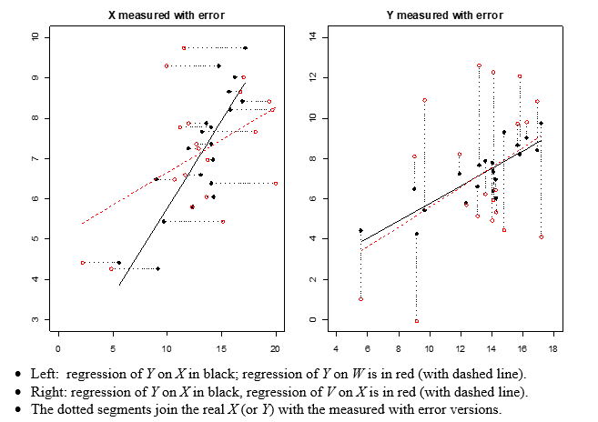
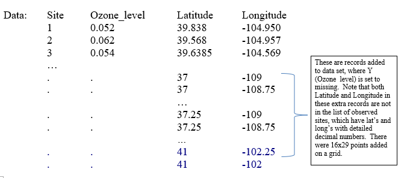
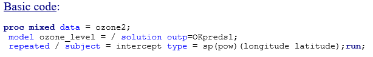
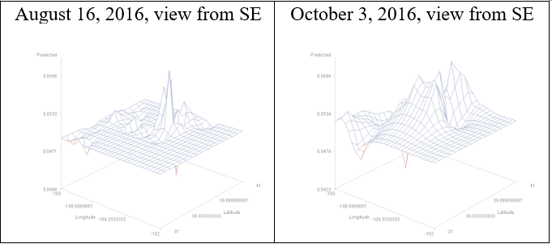
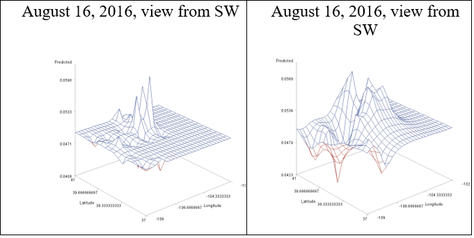
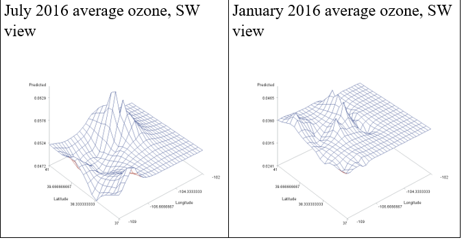
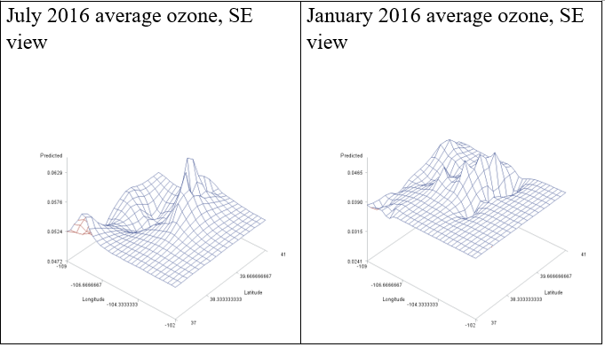
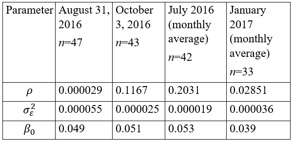
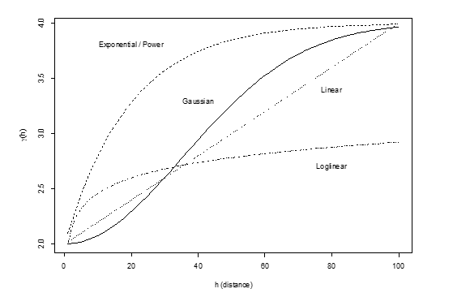
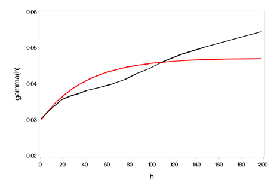

```{r setup, include=FALSE, cache=F, message=F, warning=F, results="hide"}
## setup directory
# setwd()
knitr::opts_chunk$set(cache = TRUE, echo = FALSE, message = FALSE, warning = FALSE)
knitr::opts_chunk$set(fig.height = 4, fig.width = 5, out.width = '70%', fig.align='center')
knitr::opts_chunk$set(fig.path = 'figs_L22/')
```

# Extra topics

## Topics

- Causal inference and marginal structural models

- Measurement error methods

- Basics of spatial methods:  kriging


**The full slide sets are also posted on Canvas (see extra sets)**

##

We will walk through the following questions:

- What is it?

- Why is it important?

- When is it important to use?

- How are methods used/applied?

- How does it apply to longitudinal data?


# Causal inference and marginal structural models

## Causal inference and marginal structural models

### What is it?

Causal inference contains the set of methods that attempt to show how one variable causes change in another one.

### Why is it important?

As we have learned, most statistical methods address association rather than causation.  Causation requires ruling out other variables that can explain the association.  To some degree this can be accomplished by including covariates in regression models.  However, in certain cases, this approach does not work either.


### When is it important to use?

When an outcome (Y) predicts a subsequent value of an explanatory variable (X) that can't be predicted by previous X values.

When there is a time-varying confounder (Z) that affects both X (e.g., treatment or exposure variable) and the outcome, and X (history) affects subsequent values of Z.

##

As an example, consider asthmatic children; let 

X = cigarette smoke exposure          
Z  = asthma symptoms                
Y = inhaler use.               

It is feasible that asthma symptoms not only increases the likelihood of inhaler use, but also affects subsequent exposures (e.g., if a child with more symptoms is less likely to be in smoke filled environment, either based on child's or parent's behavior).

It is also feasible if not likely that the cigarette smoke exposure 'history' (i.e., within the observational study period) affects subsequent asthma symptoms.

##

In this case, standard regression methods are not the best.  If we apply a regression model for inhaler use (Y) as a function of cigarette smoke exposure (X) plus a symptoms covariate (Z), we can estimate the difference of conditional effects such as

$E(Y|X=1,\ symptoms=z)-E(Y|X=0,\ symptoms=z)$


However the causal effect of interest is$E(Y_1-Y_0)=E(Y_1)-E(Y_0)$ where $E(Y_1)$ represents the expected inhaler use for a subject randomly assigned to receive the exposure, and $E(Y_0)$ is the same, but if they had not received exposure.  These are marginal effects and the primary difference between these and the conditional effects above is due to the fact that subjects are not randomized, but rather 'choose' their treatment based on factor such as the symptoms they have.

##

### How are methods used/applied?

Inverse probability of treatment weights are used to reconstruct data as if subjects were randomized to treatment, and eliminates confounding effects of symptoms.


### How does it apply to longitudinal data?

Time-varying weights can be calculated that are compounded over time.  You can fit a usual longitudinal model (e.g., a linear mixed model for a continuous outcome or generalized linear mixed model for a binary or count outcome), adding a weight statement to include the constructed IPTW's.

##

What you end up with is an estimate of causal relationship between X (e.g., smoke exposure) and Y (e.g., inhaler use).
In our application (considering med use as binary rather than a count), we found that recent smoke exposure increases odds of medication use 3 times (Estimate=3.02, 95% CI:  1.63 to 5.58; p=0.0004).  Using the naïve regression approach, using the same health outcome model but excluding the weight statement and including relevant symptoms predictors yielded an OR of 2.52 (95% CI:  1.62 to 3.92).

Notes and summary:  See the **Causal inference slides** for more detail.  If you have any questions about this, just contact me.  In real life, there might be other confounders to consider, and some might not be measured.  This is what makes this analysis particularly messy and complicated.


# Measurement error models

## Measurement error models

### What is it?

The set of methods that tell us how to account for measurement error in regression-type models.  This type of measurement error can be considered as obtaining an observed value that does not represent the 'true' value.

### Example 1:  

X = true caloric intake; however data might be obtained via a questionnaire and it does not represent the actual value.  (Underestimated?)

### Example 2:  

a person has a true exposure to particulate matter on a given day (say, averaged over 24 hours), but the value that we obtain is an estimate of it, measured with error.

##

### Why is it important?

Using predictors with measurement error can attenuate the slope. Measurement error methods can provide a way to correct for this attenuation (regression calibration).

Using measured with error variables, plus instrumental variables, we can estimate associations between a health outcome and the true (unobserved) predictors of interest (regression calibration with instrumental variables).

### When is it important to use?

When predictors are measured with error and you have the key variables (including instruments) of interest.

##

### How are methods used/applied?

Example 1 (RC):  attenuation correction can be applied when you have the residual variance in the model, plus the variance of the error on the mismeasured predictor.

Example 2 (RCIV):  regress the mismeasured predictor on an instrumental variable in order to obtain predicted values of the unobserved variable.  Then substitute these predicted values in for 'X' in the regression model for the health outcome of interest.  (There is also an alternative but equivalent approach.)

### How does it apply to longitudinal data?

Methods are applied in a similar manner.

## Background

Measurement error in variables is common in scientific studies and experiments, although often disregarded.

The problem with measurement error is that associated estimators of interest may be biased depending on which variables have measurement error, and the degree of bias depends on the degree of measurement error.

When measurement error exists, methods such as regression calibration can be used to adjust estimators so that they are unbiased or at least consistent for the parameter of interest.


## Measurement error and regression modeling

To introduce measurement error and its impacts on regression modeling, consider daily caloric intake, where measures W are obtained via calorie counts from a survey that are unbiased for a true caloric intake X.

We assume that subject reports are not biased low or high, i.e., $W=X+U$, where U is random error with mean 0.  (In real life there might be a tendency to underreport!)

Let's say Y is subject's body mass index (BMI), and that the relationship between Y and X can be expressed by the model $Y=\beta_0+\beta_1 X+ \epsilon$.  If we regress Y on $W=X+U$ instead of X, what can we expect the slope of W to be, relative to $\beta_1$?

##

In another setting, let's say that the caloric intake is actually modeled as the outcome, and we use a predictor such as a mood level.  Here say we use V=Y+U instead of Y for caloric intake.

The following graphs simulate what we might see for regression fits for these two settings.

```{r echo=FALSE}

```

## Regression calibration with instrumental variables, application

We are interested in the relationship between exposure to fine particulate matter from cigarette smoke (X1) and from ambient sources (X2) on health outcomes of inhaler use and LTE4 (a biomarker of asthma inflammation).  For each health outcome, we build a model with $X1,\ X2,\ X1 \times X2$, plus covariates.

What observe 'measured with error' versions of X1 and X2 (W1 and W2).  We also have instrumental variables of cotinine (M1, a biomarker of cigarette smoke exposure) and fixed outdoor pollution (M2).

Steps:  regression W1 on M1 and W2 on M2 to obtain estimated values of $E(X1|M1)$ and $E(X2|M2)$.  Substitute these in for X1 and X2 in the health outcome models.

##

Findings:  

- The steepest dose-reponse relationship between a pollutant and Y occurs when the 2nd pollutant is lower due to a significant negative interaction between pollutants.

- We found also SHS to be more toxic than ambient pollution, comparing at equivalent amounts of co-exposures.


## Using predicted values as predictors

With the aforementioned RCIV, predicted values from one model are used in place of unobserved values for a predictor variable in the second model.  

It needs to be kept in mind that predicted values are estimated rather than observed, and so the variability in estimation in the first model should be taken into account to get accurate standard errors.  If predicted values are simply placed in the 2nd model, then the standard errors associated with slope estimates will not automatically account for this; they tend to be underestimated.

For RCIV, we have an alternative algorithm that will make it easier to correct the standard errors, which could be used more generally when predicted values are used as regressors.


# Spatial statistics and kriging

## Spatial statistics and kriging

### What is it?

Estimation of values in a spatial (2 or 3-dimensional context).  It uses information about estimated model and correlation between points to interpolate/extrapolate BLUP estimates for other points (e.g., for points on a grid).

### Why is it important?

Spatial data has exploded with modern technology.  These methods allow us to interpolate estimates to obtain a more complete view of a process using data collected at certain points.  Applications:  real estate, epi applications 

### When is it important to use?

When you have data collected over space, time or both.  Methods that deal with both spatial and temporal correlation are spatio-temporal methods.

##

### How are methods used/applied?

There are different spatial methods, and many new spatio-temporal methods.  What I present here is called 'kriging', which has its origins in estimators obtained from simpler linear mixed models.


### How does it apply to longitudinal data?

It applies when you consider spatio-temporal data and methods.  However, if you are talking about correlated data models, spatial data fall into that category, and in particular we can derive estimates of correlation between 2 points in space as well as between 2 points in time.


## Spatial statistics, an overview

Spatial statistics gives us methods to conduct inference for data collected in space, where dependence between observations in space typically is higher for points closer together and weaker the further they are apart.

Estimation of a field (or surface) is performed based on data collected at a finite number of typically unequally spaced points in 2 dimensions.  The estimation essentially involves interpolation based on these points with a method such as kriging.  

Inference that ignores the spatial correlation in data may yield results very inaccurate results, e.g., conclude a fixed effect is significantly nonzero when in fact it is not.


## Spatial data and kriging

BLUP's for linear mixed models are $\pmb {\hat Y}=\pmb X\pmb {\hat \beta}+\pmb Z\pmb {\hat b}$.  But for missing $Y$ or new observations, they are $\pmb {\hat Y}_m= \pmb X_m \pmb {\hat \beta}+Z_m \pmb {\hat b}+\pmb {\hat R}_{mo} \pmb {\hat V}_o^{-1} (Y_o-X_o \pmb {\hat \beta})$ where the subscript m denotes missing (or new) data, and o denotes observed (see the Longitudinal models and missing data notes).

In SAS, predicted values automatically use the formula above (when Y is set to missing).

For spatial data, we can perform **ordinary kriging** by removing random effects from the associated LMM, which yields $\pmb {\hat Y}_m=X_m \pmb {\hat \beta}+\pmb {\hat R}_{mo} \pmb {\hat R}_o^{-1} (\pmb Y_o - \pmb X_o \pmb {\hat \beta})$

##

Thus by constructing observations for data points on a grid with no Y value, we get the kriging estimates using simple PROC MIXED code, incorporating a spatial covariance structure for the errors.

### Some notes:

Note that $\pmb {\hat R}_{mo}$ contains covariances between missing and observed responses and relies on the assumed covariance structure in the model.  

When the correlation between missing (or new) and observed $Y$ is negligible based on the assumed structure and estimated parameters, then $\pmb {\hat Y}_m$ will default back to $\pmb X_m \pmb {\hat \beta}$.

When the R structures use a spatial-type correlation structure, then kriging estimates are likely to be smoother, particularly when the correlation parameter is higher.

$(Y_o-X_o \pmb {\hat \beta})$ are observed residuals.  An unusually low or high residual may have a noticeable effect on $\pmb {\hat Y}_m$.


## Application:  

EPA Ozone data

Almost 40 years of ozone data were collected at various monitors nationwide.  For the analyses below, specific dates or months were selected for Colorado monitors (i.e., time-invariant analyses).  The purpose is to demonstrate what spatial (kriging) estimates look like for real [Data](https://aqs.epa.gov/aqsweb/airdata/daily_44201_2016.zip).


```{r echo=FALSE}

```

## Basic code:

```{r echo=FALSE}

```

### A few notes:

We are only fitting a fixed intercept in the model.  However, predicted values will have variability since they will all have missing Y; but when correlations between missing and observed points or residuals are small, predicted values will tend to default back to the fixed intercept estimate.

The 'subject=intercept' means that we have 1 “subject”, or process.

The spatial power covariance structure is employed, using Euclidian distances based on specific latitudes and longitudes.  The observed R matrix has nobs rows and columns, with ($i,\ j$)th element equal to $\sigma_\epsilon^2 \rho^(d_{ij})$; $d_{ij}$ is the Euclidian distance between 2 lat/long pairs corresponding to the 2 records being considered.

Dimensions of matrices and vectors in $\pmb {\hat Y}_m=\pmb X_m \pmb {\hat \beta}+\pmb {\hat R}_{mo} \pmb {\hat R}_o^{-1} (\pmb Y_o- \pmb X_o \pmb {\hat \beta})$

In our data, there were $16\times 29=464$ points on a grid and data collected from 47 sites.

$\pmb {\hat Y}_m$ and $\pmb X_m$ are $464\times 1$
$\pmb Y_o$ and $\pmb X_o$ are $47\times 1$
$\pmb {\hat \beta}$ is $1\times 1$
$\pmb {\hat R}_{mo}$ is $464\times 47$
$\pmb {\hat R}_o^{-1}$ is $47\times 47$

## 

For the spatial power structure, the ($i,\ j$)th element of $\pmb {\hat R}_{mo}$ is the correlation between the new point $i$ and observed point $j({\hat \rho}^{d_{ij}})$ based on distance between the points ($d_{ij}$), times the estimated residual variance ($\hat \sigma _\epsilon^2$).

Fits for the ozone data considering several different time points follow.

##

```{r echo=FALSE}

```
 
Higher ozone is apparent near Denver and along front range; some lower values apparent in the west.

The estimated correlation parameter for the analysis on the left was relatively small, resulting in sharper peaks; the one on the right was relatively large, resulting in more gradual changes.

The view is from the southeast, as if you were flying in from Texas.

##

```{r echo=FALSE}

```
 
For a 3D plot, sometimes it helps to have a view from another angle.  This is looking from the Southwest (as if you were flying in from San Diego).  The dip on the western slope is more noticeable here.

## Monitoring locations
 
```{r echo=FALSE}

```

The figures demonstrate higher summer ozone in Denver (also note scales).

```{r echo=FALSE}

```
 
Same graphs, different views

## Estimates of parameters in models

```{r echo=FALSE}

```

A slightly more advanced analysis, universal kriging, uses the same BLUP for as previously described, but adds more predictors to the model than just the fixed intercept.

## Some other article/software references for spatial analyses:

Guillas and Lai (2010), Bivariate splines for spatial functional regression models.  Applications also involve ozone data.

geoRglm:  A Package for Generlised Linear Spatial Models.  It is an R package that employs MCMC.

PROC KRIG2ED in SAS

# Semi-variograms

## Semi-variograms

The semi-variogram is used to determine how the strength of the relationship between responses depends on the space between the points.  It can also be used if time is the dimension of interest (i.e., for longitudinal data rather than spatial data).

The semi-variogram is inversely related to the covariance function; typically the covariance function will decrease as the space between measures increases, while the semi-variogram increases.

An empirical-based version of the semi-variogram uses the data without parametric constraints in order to understand the covariance; a model-based version assumes some parametric structure, and estimates the parameters using the data.

## Example of semi-variograms using model-based forms
 
```{r echo=FALSE}

```

## Application:  

Raw FEV1 for children at the NJH school (2003-04); here the semi-variogram is constructed for time between measures.

```{r echo=FALSE}

```
 
The empirical variogram function (black) shows a fairly linear increase (LOESS used an AICC selected value of 0.36 for the fit).  The red curve is the fitted semi-variogram based on a PROC MIXED fit using the spatial power function.


# Summary

## Summary


