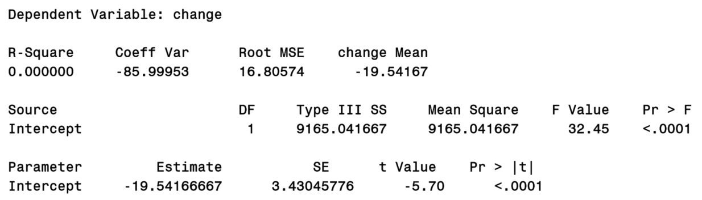
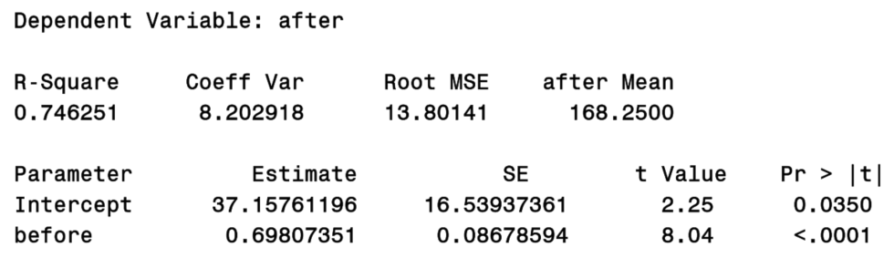
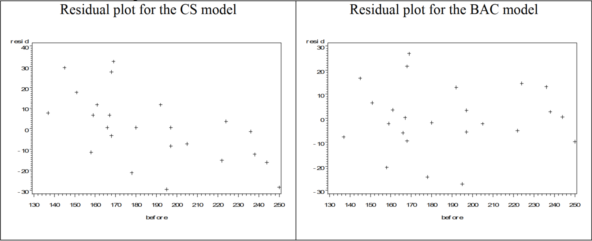
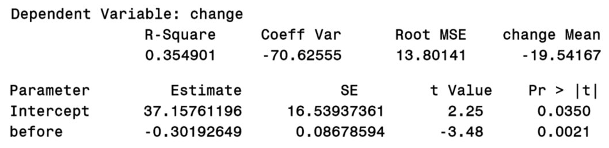
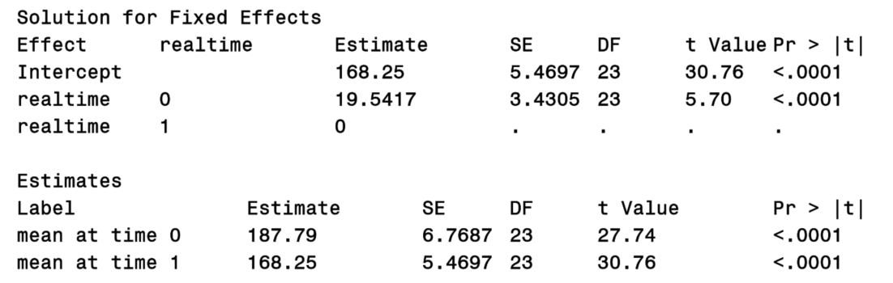
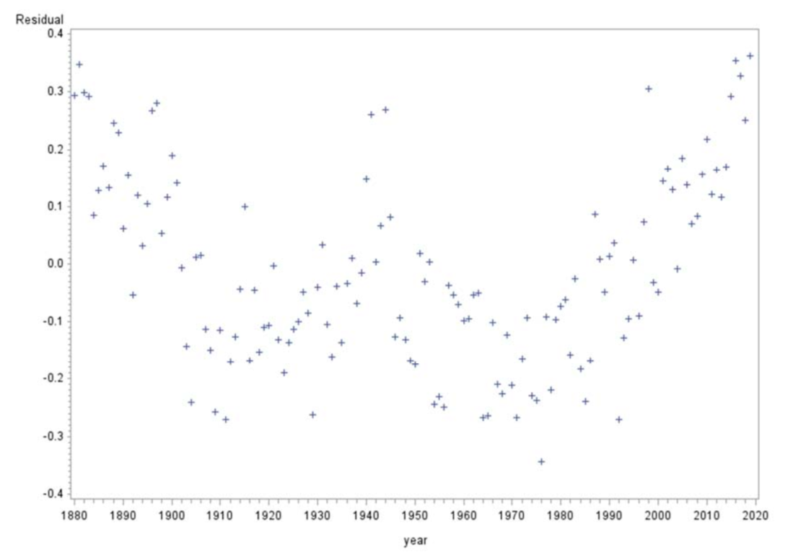
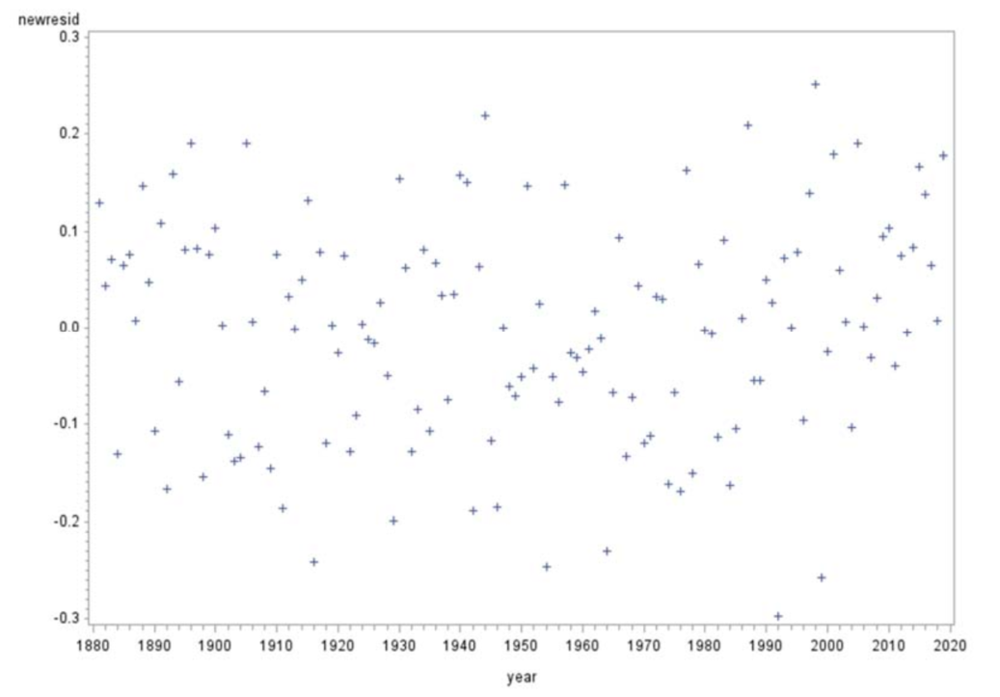

```{r setup, include=FALSE}
knitr::opts_chunk$set(echo = FALSE)
library(emo)
```

# Question 1 Acknowledgment

Please acknowledge that you read the **Homework expectations.pdf** document in the Homework module on Canvas, and agree to it (the easiest HW question you will get, but need to complete for credit `r emo::ji("smile")`).


\newpage

# Question 2 The simplest longitudinal analysis (2 time points)

**Background**: The data **cholesterol.txt** contains cholesterol levels (adapted from Rosner, 2006). The data are a sample of cholesterol levels taken from 24 hospital employees who were on a standard American diet and who agreed to adopt a vegetarian diet for one month. Serum cholesterol measurements (mcg/dl) were made before adopting the vegetarian diet and one month after. (For this exercise, "summarize results" means just give the highlights of the analysis - retype and/or cut and paste necessary info but do not include all SAS output.)

a.  **Change-score model**: Let $Y_{i1}$ and $Y_{i2}$ denote the pre and post cholesterol level for subject $i$, $i=1,\ ...,\ 24$, and let $d_i = Y_{i2}-Y_{i1}$. Perform the linear regression of $d_i$ on the intercept alone (i.e., the model statement in PROC GLM would be "$model\ di =\ ;$"). Summarize results.

```{r out.width="80%", fig.align="center"}

```

\textcolor{blue}{The change score model for pre and post cholesterol levels shows an average decrease in post cholesterol level of $19.54 mcg/dL$ $(95\% CI: -26.6, -12.4;\ p<0.0001)$.}

\textcolor{purple}{The $R^2$ is 0. You might think this means that the model is bad, but remember that the $R^2$ is a measure of model improvement over the model with the simple intercept. Since this model is in fact the simple intercept model, there cannot be any improvement over it. Since we only have an intercept in the model, note that cholesterol change levels are predicted to be the same for all subjects. However, this is not to say that a necessary assumption of the data is that cholesterol changes are the same. Remember that for a paired t-test, we assume that changes scores are normally distributed. Nevertheless, with this simple model we are not able to model change scores as a function of baseline score, which is important, as the following parts will demonstrate.}

b.  In the output, look at the test for the intercept. What simple test yields the same results?

\textcolor{blue}{Paired t-test}

c.  **Baseline-as-covariate model**: Now perform a linear regression for the post cholesterol value, using the baseline variable as a covariate. Summarize results.

```{r out.width="80%", fig.align="center"}

```


\textcolor{blue}{From the baseline-as-covariate model, we see that on average for every unit increase in pre-cholesterol level the post-cholesterol level increases by $0.70 mcg/dL$ $(95\% CI: 0.52, 0.88; p < 0.001)$. The intercept for this model, denotes the average post-cholesterol value when the pre-cholesterol values is 0, which in this situation does not have a real-world interpretation, it is possible to mean-center the pre-cholesterol values so that the intercept has an interpretation as the average post-cholesterol value when the pre- cholesterol value is at the mean.}

\textcolor{purple}{We are performing a simple linear regression of 'after' score on 'before' score. Since the slope is different than 1, there is some evidence that the cholesterol scales 'before' and 'after' are not commensurate. However, the test above compares the slope with 0 and not 1 (we will get back to this issue momentarily). This fitted model demonstrates not only that subjects lowered their cholesterol with this diet (with the range of cholesterol tested), but that those with higher cholesterol dropped more. For example, a subject with a 'before' cholesterol of 200 has an expected 'after' cholesterol of $37.16+200(0.698) = 176.76 mcg/dl$, a drop of over 23 points, while a subject starting at 150 is expected to drop to 141.86 mcg/dl, less than 10 points. Now we have a way of predicting post-diet cholesterol that takes into account pre-diet starting points.}

d.  Compare the change-score (CS) and baseline-as-covariate (BAC) models. What are pro's and con's of each? Also construct residual plots (residual vs. before) to help answer.

```{r out.width="80%", fig.align="center"}

```

\textcolor{blue}{The residual plot for the CS model has an obvious pattern demonstrating lack of fit; the BAC model has no such pattern.}

\textcolor{purple}{One disadvantage of CS model is that it is not able to model the effect of baseline value. While BAC model estimates the value of slope of baseline value, CS model simply assumes the slope to be one. One disadvantage of BAC model compared to CS it that it does not pair data. The estimated slope in BAC model is based on integrated effect of baseline value across all subjects.In addition, BAC model estimates one more parameter than CS, thus has smaller power. The CS model may be more powerful when well-specified (as a special case of BAC), while the BAC model is more flexible and can capture a wider range of relationships between startingand ending cholesterol levels.}

e.  **Hybrid model**: Consider the model of change score ($d_i$) using baseline cholesterol as a covariate.

  (i).  Write the model {in terms of beta coefficients}. Then re-express the model in terms of $Y_{i2}$. Collect terms and determine the slope of the $Y_{i1}$ term. What is the relationship between the Hybrid and BAC models? You can answer this based on both the equation you wrote, plus the models you fit with SAS or R.

$$
\begin{aligned}
d_i = \beta_0 + \beta_1Y_{i1} + \epsilon_i \\
Y_{i2} - Y_{i1} = \beta_0 + \beta_1Y_{i1} + \epsilon_i\\
Y_{i2} = \beta_0 + (1 + \beta_1)Y_{i1} + \epsilon_i\\
Y_{i2} = \beta_0' + \beta_1'Y_{i1} + \epsilon_i
\end{aligned}
$$


\textcolor{blue}{We are essentially fitting the same model, where $1+\beta_1 = \beta_1'$ This same relationship will hold for the estimates. Thus, the estimate of the slope in the hybrid model should be 1 less than the estimate of the slope in the BAC model: $\hat \beta_1 = \hat \beta_1' - 1$ So it should be: $0.698 - 1 = -0.302$. Checking with SAS:}


```{r out.width="80%", fig.align="center"}

```

  (ii). Write the hypotheses for the test reported in the PROC GLM output {for the 'before' variable, near the end}, in terms of .

\textcolor{blue}{The slope in the hybrid model is $\beta_1$, but note that the test of $H_0$: $\beta_1=0$ is equivalent to $H_0$:$\beta_1' -1 = 0$, i.e., $H_0:\ \beta_1' =1$ vs. $H_1:\ \beta_1' \neq 1$. }


\textcolor{purple}{So really, the BAC and hybrid models are the same, but the output differs slightly due to the different parameterization. In particular, the test for the 'before' slope in the BAC model compares with 0, and in the hybrid model compares it to 1 (thinking in terms of the same BAC slope). The comparison with 1 is probably of more interest: This indicates that the before and after scales are not equivalent. (This test does not include location differences.)}

f.  Fit the data using a mixed model, with an UN structure for repeated measures. In this case, don't include baseline as covariate, since it is already an outcome. How do results compare with the Hybrid model? What are pro's and con's of each approach?


\small
\begin{verbatim}
    data chol; set chol; if time="pre" then realtime=0; else realtime=1;
    proc sort data=chol; by id realtime; run;
    proc mixed data=chol;
      class realtime;
      model chol=realtime / solution;
      repeated realtime / subject=id type=un r rcorr;
      estimate 'mean at time 0' intercept 1 realtime 1 0;
      estimate 'mean at time 1' intercept 1 realtime 0 1; run;       
\end{verbatim}
\normalsize

```{r out.width="80%", fig.align="center"}

```

\textcolor{blue} {We can then see that the hybrid model does a better job of teasing out the relationship between pre and post cholesterol levels, namely that the relationship more closely resembles scaling and shifting than simply shifting. The mixed model doesn’t account for this. A mixed model is perhap smore broadly useful in the sense that if we had more time points per subject, a mixed model could account for subject effects and the apparent proportionality relationship whilea standard linear model could not.}


\textcolor{purple}{Notice that the change estimate is EXACTLY the same as that from the CS model. This helps reaffirm that if it is only mean change you are concerned about, we can use the simple difference approach. We know some advantages of the BAC and Hybrid models relative to the CS model, but we can also see some advantages of the longitudinal approach. First, we get estimates of actual cholesterol values at pre and post times, rather than just the change estimate. We also get an estimate of the correlation between pre and post times, as well as variance estimates at each time point. The longitudinal model would also allow us to add time-varying covariates, if they were of interest. Note that an alternative approach to modeling the data longitudinally would be to include a random intercept and slope for each subject, and allow a covariance between them (i.e., UN structure for $\pmb G$). One disadvantage of the longitudinal model is that it is more difficult to characterize the relationship between change values with starting values.}

\newpage

# Question 3 First-order autoregressive process

Consider a first-order autoregressive process, $\epsilon_t = \phi \epsilon_{t-1} + Z_t$, where $Z_t \sim \mathcal N(0,\ \sigma^2)$, where $t$ is an integer for discrete units of time (e.g., days), and $|\phi|<1$.  In order to derive the quantities below, say that this is an 'infinite process' (i.e., $t$ extends backwards in time to infinity). 
First, by iteration we can show that $\epsilon_t=Z_t+\phi Z_{t-1}+...+\phi^k Z_{t-k}+\phi^{k+1} \epsilon_{t-k-1}$.  If we keep going, we get the expression $\epsilon_t=\sum_{j=0}^\infty \phi^j Z_{t-j}$.

[We can show that this equality holds since $\sum_{j=0}^k \phi^j Z_{t-j}$  is mean-square convergent as $k \rightarrow \infty:  E[X_t - \sum_{j=0}^k \phi^j Z_{t-j}] ^2 = \phi^{2k+2}E[X_{t-k-1}^2] \stackrel {k\ \rightarrow\ \infty}{\longrightarrow} 0$ since $E[X_t^2]$ is constant over $t$.]

a. Determine $E[\epsilon_t]$

\textcolor{blue}{$E[\epsilon_t] = E\big[\sum_{j=0}^\infty\phi^jZ_{t-j}] = \sum_{j=0}^\infty\phi^jE\big[Z_{t-j}\big] = 0$}

b. Determine $Cov[\epsilon_t, \epsilon_{t+h}]$

\textcolor{blue}{First consider h to be a nonnegative integer: $$\begin{aligned} 
Cov[\epsilon_t,\ \epsilon_{t+h}] 
&= E[\epsilon_t \epsilon_{t+h}] - \mu_{\epsilon_t} \mu_{\epsilon_{t+h}}
= E[\epsilon_t\epsilon_{t+h}] \\ 
&= E\big[ (\sum_{j=0}^\infty\phi^jZ_{t-j}) (\sum_{k=0}^\infty\phi^kZ_{t+h-k}) \big] 
= \sum_{j=0}^\infty \sum_{k=0}^\infty \phi^j \phi^k E[Z_{t-j}Z_{t+h-k}] \\ 
&= \sum_{t-j = t+h-k}\phi^{j+k}E[Z_{t-j}Z_{t+h-k}] + \sum_{t-j \neq t+h-k}\phi^{j+k}E[Z_{t-j}Z_{t+h-k}] \\ 
&= \sum_{j=0}^\infty\phi^{h+2j}E[Z_{t-j}^2] + \sum_{t-j \neq t+h-k}\phi^{j+k}E[Z_{t-j}]E[Z_{t+h-k}] \\ 
&= \sum_{j=0}^\infty \phi^{h+2j}E[Z_{t-j}^2] + \sum_{t-j \neq t+h-k}\phi^{j+k}\times0 \times 0 \\
&= \sum_{j=0}^\infty \phi^{h+2j} \sigma^2 + 0 
= \sigma^2\phi^h\sum_{j=0}^\infty \phi^{2j}
= \sigma^2\frac {\phi^h}{1-\phi^2}
\end{aligned}$$}


\textcolor{blue}{$Z$ terms have the same index when $t-j=t+h-k$, i.e., when $k=j+h$. So in
line 6, replace $k$ with $j+h$ for terms in the summation and reduce the summation to $k=0$ to $k=\infty$.} 


\textcolor{purple}{Second method: Assuming for $t \leq s$, $\epsilon_t$ is independent from $Z_s$, hence $Cov[\epsilon_t, Z_s] = 0$
$$\begin{aligned} 
Cov[\epsilon_t,\ \epsilon_{t+h}] 
&= Cov[\epsilon_t,\  \sum_{i=1}^{h}\phi^{i-1}Z_{t+i-1} + \phi^h\epsilon_t]\\
&= Cov[\epsilon_t,\  \sum_{i=1}^{h}\phi^{i-1}Z_{t+i-1}] + Cov[\epsilon_t,\  \phi^h\epsilon_t]\\
&= \sum_{i=1}^{h}\phi^{i-1}Cov[\epsilon_t,\  Z_{t+i-1}] + \phi^h Cov[\epsilon_t,\  \epsilon_t]\\
&= 0 + \phi^h Var[\epsilon_t]\\
&= \phi^h \frac {\sigma^2} {(1-\phi^2)}
\end{aligned}$$}


c. Determine $Corr[\epsilon_t, \epsilon_{t+h}]$

\textcolor{blue}{$$Corr[\epsilon)_t,\ \epsilon_{t+h}] = \frac {Cov[\epsilon_t,\ \epsilon_{t+h}]} {\sqrt{Var[\epsilon_t] Var[\epsilon_{t+h}]}} \frac {\frac {\sigma^2\phi^h} {1-\phi^2}} {\sqrt {\frac {\sigma^2} {(1-\phi^2)}} \sqrt {\frac {\sigma^2} {(1-\phi^2)}}} = \phi^h$$ for nonnegative $h$. Considering any integer h, the correlation is $\phi^{|h|}$}

\textcolor{purple} {Be careful about the autocorrelation definition. Because the autocorrelation $\rho_h = \gamma_{t+h} / \gamma_t$ is defined on the assumption of stationary stochastic process, we cannot use this equation until we proof 2d part. }

d. Is $\{\epsilon_t\}$ a stationary process?

\textcolor{blue}{Yes, the mean is constant for all $t$, $Cov(\epsilon_t,\ \epsilon_{t+h})$ does not depend on $t$, for any integer $h$, and variance is finite.}

\newpage

# Question 4 Global temperature

**Background**:  Here, we have time series data.  The primary point of the exercise is to better understand the two main parts of a predictive model, the mean and error.  Use PROC MIXED in SAS to fit the linear time trend with AR(1) error model with the [global average temperature data](https://www.ncdc.noaa.gov/cag/time-series/global).  Temperatures are for 1880-2019, mean-corrected (or 'anomalies') based on 20th Century average, reported in $^{\circ}C$, and for land and ocean combined.  These are newer data than those in the lecture notes.  Below is SAS code that you can use to fit the model.  The **'subject=intercept'** option tells SAS there is one process.

\small
\begin{verbatim}
	proc mixed data=teaching.global_temp_anomalies method=ml;             
 		model temp=year / solution outp=tempout;                 
		repeated / type=AR(1) subject=intercept; run;          
\end{verbatim}
\normalsize

a. Create a Residual plot (residuals versus year) based on the fitted data from the model ($\hat y_t= \hat \beta_0+\hat  \beta_1 t$ are predicted values; $y_t - \hat y_t$ are residuals). What patterns do you notice? What do you think the plot is telling you?

\textcolor{blue}{The plot suggests lack of fit in the mean part of the model; a clear "W" shape. This may be corrected by including a polynomial term in the regression model, piece-wise regression, or changing the variance estimation structure depending on the issue.}

```{r out.width="80%", fig.align="center"}

```

b. In order to get a better idea whether the AR(1) process with linear time trend appears to fit the global temperature data, create a new residual plot using residuals that take into account both the mean and error parts of the model. Specifically, the new residual is $y_t-\tilde y_t$ where $\tilde y_t= \hat y_t + \hat\phi \nu_{t-1}$ and $\nu_t=y_t-\hat y_t$.  [Note:  PROC AUTOREG computes these type of residuals directly, but we'll stick with PROC MIXED since that's what we'll be using later in the course.]  You can create these new residuals in a data step.  Use the estimated correlation parameter from the SAS output.  Based on this plot, what is your opinion about how the model fits the data?  [Notes:  in creating the new residuals, you can obtain the correlation parameter estimate from the PROC MIXED output; to align '$t$' and  '$t-1$' data, you can use the lag function in SAS.]

```{r out.width="80%", fig.align="center"}

```

\textcolor{blue}{Considering mean and error together, the model looks pretty reasonable. The new
residual plot shows a good fit to the data}

c. Based on your fitted model, what is the average increase in temperature per decade?

\textcolor{blue}{The average increase per decade is $10(0.007276)=0.07\ ^oC$.}

d. Try refitting the data using a polynomial trend for time (decide on the degree of the model by looking at the plot).  How does the model fit compare with the one that using a simple linear trend for time?  What happens to the correlation parameter estimate in this new model?  What do you think about this fit compared with the simple linear model?  (In answering this, don't worry about the '0' SE for higher-order terms; just focus on the fit itself.) 

\textcolor{purple}{With either quadratic or cubic model, we get a better fit, although there is still a lack of fit in the mean part of the model (when considering the process that does not take the correlated errors into account). The residual plot for the mean shows lack of fit particularly around 1940 to 1945. The correlation parameter estimate decreases from 0.7395 (linear) to **0.4744 (quadratic)** to **0.4655 (cubic)**. What this suggests is that by increasing the complexity of the mean, less is required in the error part of the model.}

\textcolor{blue}{The p-value for a likelihood ratio test, between full and reduced models, is < 0.001, so the quadratic term model is statistically significantly different from the linear term only model. The AIC fit statistic from the linear model is -201.2, while the AIC for the quadratic model is -225.5, which also indicates a better fit for the quadratic model. Still, it is not a great model and I'd be tempted to keep the simple linear with AR(1) for general interpretation. If we want the fit the mean process more accurately, we need to try harder, which leads us to the next part.}

e. Perform a nonparametric regression fit of the data using PROC LOESS.  Construct a residual plot and histogram.  Do you think this a better/worse/different fit compared with the parametric fits with AR(1) errors?  Explain.

\small
\begin{verbatim}
    proc loess data=teaching.global_temp_anomalies;       
     		ods output scoreresults=scoreout           
                outputstatistics=statout;            
     		model temp = year / smooth= 0.3 residual clm degree=1;          
    score data=tempout / clm; 
    run; 
    symbol1 i=none; symbol2 i=join; symbol3 i=join line=2;
    proc gplot data=tempout; 
    plot depvar*year=1 pred*year=2 lowercl*year=3 uppercl*year=3/ overlay; 
    run;
\end{verbatim}
\normalsize

\textcolor{blue}{The LOESS is a smoothing function (there is no estimate in the "model") and could be very hard to generalize to boarder situations. If we used a different subsets or different setting, it is hard to believe the LOESS provide the same result every time. It is just different from parametric models. In our lectures, we will limit the LOESS for exploratory purposes, while it looks good it can’t be interpreted well and can’t be used to predict future temperatures.}

\textcolor{purple}{I would say that the fit here is decent. It is not a “better” fit than the parameter model overall, just different. But it is better (more nuanced) in terms of describing the mean process. Here, we increase the complexity of the mean part of the model, and so require less on the error part. If you fit a mixed model on the residuals of this LOESS fit, you will find the correlation parameter is around 0.28. But if you drop the smoothing parameter value in the LOESS fit to the 'best’ AICC value, which is around 0.1, the correlation parameter decreases below 0.1. Collectively, what these different model fits show is that for a model that has the basic form Outcome=mean+error, if we have a simple 'mean’, then to get an accurate model, we need a more complex 'error' (e.g., simple linear trend plus AR(1) errors). On the other hand, if we have a more complex mean, then the error structure can be simpler (LOESS fit nearly eliminated the need for an AR(1) structure, especially when using a lower smoothing parameter value).}


